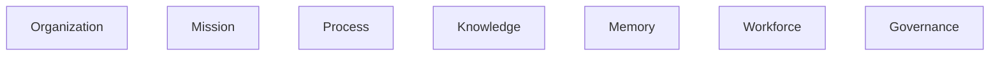
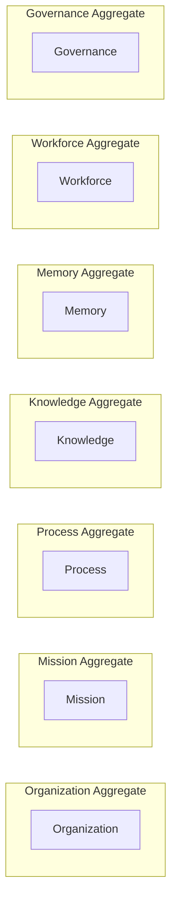
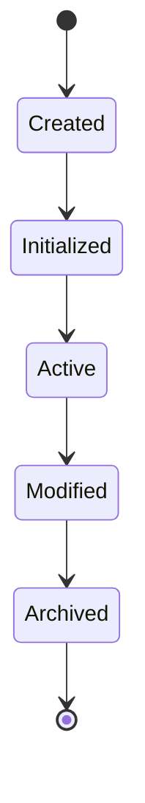
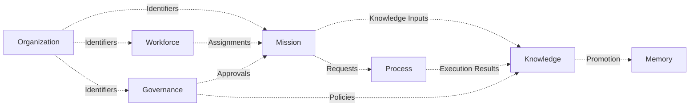
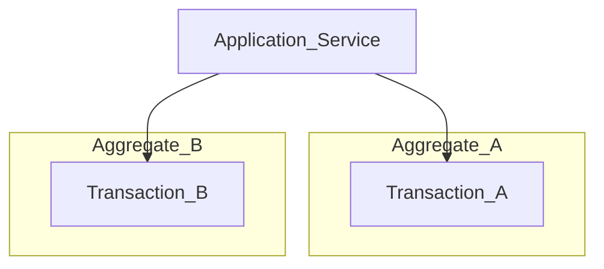
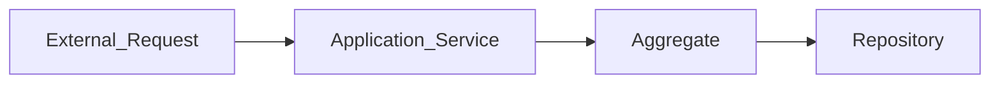
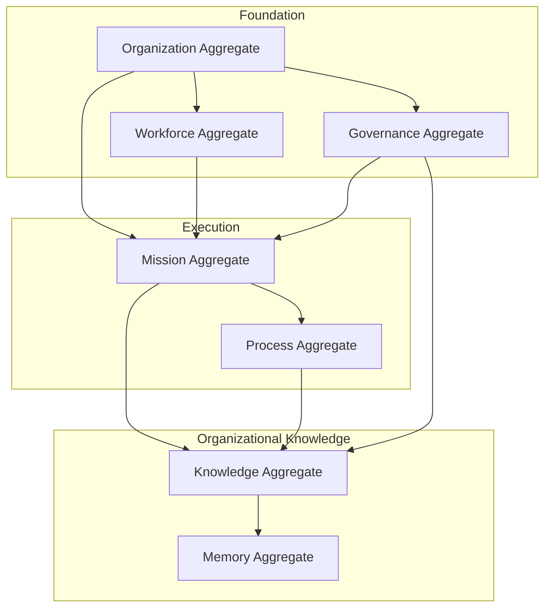

# ForgeOS Architecture — Aggregate Boundaries

**Document ID:** ARCH-DOM-0002

**Title:** Aggregate Boundaries

**Status:** Approved

**Version:** 1.0.0

**Derived From**

- TDS-0002 — Domain Model

**Related Documents**

- ARCH-0002 — Component Model
- ARCH-0003 — Architecture Enforcement Specification
- ARCH-DOM-0001 — Domain Model

---

# Purpose

This document provides the **Consistency Boundary View** of the ForgeOS Domain Model.

It visualizes aggregate ownership, transactional consistency boundaries, aggregate interaction rules, and persistence ownership defined by **TDS-0002**.

This document introduces no new architectural decisions.

The authoritative definition of every aggregate remains **TDS-0002**.

---

# Scope

This view illustrates:

- aggregate ownership;
- consistency boundaries;
- aggregate interaction;
- aggregate lifecycle;
- repository ownership.

Entity definitions, value objects, and business rules remain defined in TDS-0002.

---

# Architectural Traceability

| Architectural View | Authoritative Source |
|--------------------|----------------------|
| Aggregate Roots | TDS-0002 |
| Aggregate Lifecycle | TDS-0002 |
| Repository Contracts | TDS-0002 |
| Business Invariants | TDS-0002 |
| Architectural Ownership | ARCH-0002 |

---

# Aggregate Ownership Model

ForgeOS defines one aggregate root for each bounded context.

Each aggregate:

- owns its internal entities;
- protects its own invariants;
- owns one repository interface;
- publishes domain events.

Ownership is exclusive.

---

# Consistency Boundaries

Each aggregate represents one transactional consistency boundary.

No transaction spans multiple aggregate boundaries.

Cross-aggregate coordination is performed by the Application Layer.

---

# Aggregate Responsibilities

| Aggregate | Responsibility |
|-----------|----------------|
| Organization | Organizational identity |
| Mission | Organizational execution |
| Process | Workflow execution |
| Knowledge | Organizational knowledge |
| Memory | Institutional history |
| Workforce | Organizational capability |
| Governance | Organizational authority |

Responsibilities originate from TDS-0002.

---

# Aggregate Ownership Rules

The following ownership rules are visualized by this document.

- Every aggregate has one architectural owner.
- Every entity belongs to one aggregate.
- Every aggregate owns one repository interface.
- Aggregate ownership is never shared.
- Aggregate boundaries define consistency boundaries.

These rules are authoritative in TDS-0002.

---

# Repository Association

Each aggregate maps to exactly one repository interface.

| Aggregate | Repository Interface |
|-----------|----------------------|
| Organization | OrganizationRepository |
| Mission | MissionRepository |
| Process | ProcessRepository |
| Knowledge | KnowledgeRepository |
| Memory | MemoryRepository |
| Workforce | WorkforceRepository |
| Governance | GovernanceRepository |

Repository implementations remain outside the Domain Layer.

---

# Aggregate Lifecycle View

All aggregates follow the conceptual lifecycle approved by TDS-0002.

Individual aggregates may refine internal transitions while preserving this lifecycle.

*End of Part 1.*

# Aggregate Interaction View

This section illustrates how aggregate roots collaborate while preserving the aggregate ownership and consistency boundaries defined by **TDS-0002**.

The diagrams in this document visualize interaction only.

They do not introduce new aggregate relationships or business behavior.

---

# Aggregate Collaboration Model

Aggregate collaboration occurs through approved architectural mechanisms.

The dotted arrows indicate conceptual interaction through approved architectural contracts.

They do not represent direct aggregate references.

---

# Aggregate Communication Rules

Aggregate communication shall occur only through one or more of the following mechanisms:

- immutable identifiers;
- published domain events;
- repository retrieval of the owning aggregate;
- application-layer orchestration.

The following mechanisms are prohibited:

- direct modification of foreign entities;
- foreign repository ownership;
- shared aggregate state;
- cross-aggregate transactions.

These rules derive directly from TDS-0002 and ARCH-0003.

---

# Transaction Boundaries

Every aggregate owns one transactional consistency boundary.

Transactions terminate within a single aggregate.

Business workflows that require multiple aggregates are coordinated by the Application Layer.

---

# Aggregate Lifecycle Responsibilities

Each aggregate is responsible for enforcing its own lifecycle.

Representative responsibilities include:

| Aggregate | Lifecycle Responsibility |
|-----------|--------------------------|
| Organization | Organizational lifecycle |
| Mission | Mission lifecycle |
| Process | Process lifecycle |
| Knowledge | Knowledge lifecycle |
| Memory | Institutional history lifecycle |
| Workforce | Workforce lifecycle |
| Governance | Governance lifecycle |

Lifecycle transitions shall not be controlled by foreign aggregates.

---

# Aggregate Consistency Responsibilities

Each aggregate guarantees:

- internal consistency;
- invariant enforcement;
- entity ownership;
- repository consistency;
- event publication.

Cross-aggregate consistency is coordinated rather than transactional.

---

# Aggregate Isolation

Aggregate isolation is maintained through the following architectural mechanisms.

External callers never manipulate aggregate state directly.

Repository implementations remain outside the Domain Layer.

---

# Aggregate Boundary Principles

The following principles are illustrated by this view.

1. Aggregates encapsulate business consistency.
2. Aggregate roots are the only externally accessible business entry points.
3. Internal entities remain private to their aggregate.
4. Repository interfaces belong to the owning aggregate.
5. Aggregate boundaries remain stable over time.

These principles are defined by TDS-0002.

---

# Aggregate Interaction Summary

| Concern | Architectural Responsibility |
|----------|------------------------------|
| Business Rules | Aggregate |
| Entity Ownership | Aggregate |
| Transaction Boundary | Aggregate |
| Repository Contract | Aggregate |
| Cross-Aggregate Workflow | Application Layer |
| Persistence Implementation | Infrastructure |

This separation preserves the architectural ownership model approved for ForgeOS.

*End of Part 2.*

# Aggregate Topology

This section presents the aggregate structure from an implementation perspective.

It illustrates aggregate ownership and interaction while preserving the architectural boundaries defined by **TDS-0002**.

The topology shown below is conceptual.

It does not redefine runtime dependencies or implementation layering.

---

# Aggregate Topology View

This diagram is an implementation aid.

The authoritative aggregate definitions remain in **TDS-0002**.

---

# Aggregate Ownership Matrix

| Aggregate Root | Owning Bounded Context | Architectural Owner | Repository Interface |
|----------------|------------------------|---------------------|----------------------|
| Organization | Organization | Organization Domain | OrganizationRepository |
| Mission | Mission | Mission Domain | MissionRepository |
| Process | Process | Process Domain | ProcessRepository |
| Knowledge | Knowledge | Knowledge Domain | KnowledgeRepository |
| Memory | Memory | Memory Domain | MemoryRepository |
| Workforce | Workforce | Workforce Domain | WorkforceRepository |
| Governance | Governance | Governance Domain | GovernanceRepository |

This matrix summarizes ownership already defined by **TDS-0002**.

---

# Implementation Guidance

During implementation, each aggregate should be treated as the primary consistency boundary.

Implementation responsibilities include:

- protecting aggregate invariants;
- encapsulating entity mutation;
- publishing domain events;
- exposing repository interfaces only through the aggregate root;
- preventing external mutation of internal entities.

Repository implementations remain the responsibility of the Infrastructure Domain.

Application Services remain responsible for coordinating workflows involving multiple aggregates.

---

# Relationship to Other Architectural Views

This document focuses exclusively on aggregate boundaries.

Related implementation views include:

| Document | Architectural View |
|----------|--------------------|
| Domain Model | Bounded Context View |
| Aggregate Boundaries | Consistency Boundary View |
| Domain Event Model | Event Interaction View |
| Entity Relationships | Structural Relationship View |
| Persistence Model | Persistence Ownership View |

Together these views provide implementation guidance without extending the authoritative specification.

---

# Architectural Traceability

All information contained in this document originates from approved architectural sources.

| Concern | Authoritative Source |
|----------|----------------------|
| Aggregate Definitions | TDS-0002 |
| Aggregate Lifecycle | TDS-0002 |
| Repository Contracts | TDS-0002 |
| Architectural Ownership | ARCH-0002 |
| Enforcement Rules | ARCH-0003 |

This document introduces no additional architectural authority.

---

# Usage During Implementation

Implementation teams should use this document to:

- identify aggregate roots;
- determine consistency boundaries;
- understand aggregate interaction patterns;
- locate repository ownership;
- preserve aggregate isolation.

Business behavior shall always be implemented according to **TDS-0002**.

---

# Codex Readiness

## Implementation Status

**Ready for implementation of aggregate roots and transactional consistency boundaries.**

Using this document together with **TDS-0002**, a Senior Software Engineer can:

- implement aggregate roots;
- establish transactional boundaries;
- enforce aggregate ownership;
- assign repository interfaces;
- preserve aggregate isolation;
- coordinate cross-aggregate workflows through the Application Layer.

No additional architectural decisions are required to implement the aggregate model.

---

# Architectural Authority

This document is a derived architectural view.

It shall not be used to introduce or modify:

- aggregate definitions;
- business invariants;
- repository contracts;
- aggregate ownership;
- transactional boundaries.

Any such changes shall first be made in **TDS-0002** and then reflected in this document.

---

# Document Completion

This document is complete.

It provides the implementation-oriented **Consistency Boundary View** of the ForgeOS Domain Model and serves as the architectural reference for implementing aggregate roots, consistency boundaries, and aggregate interactions.