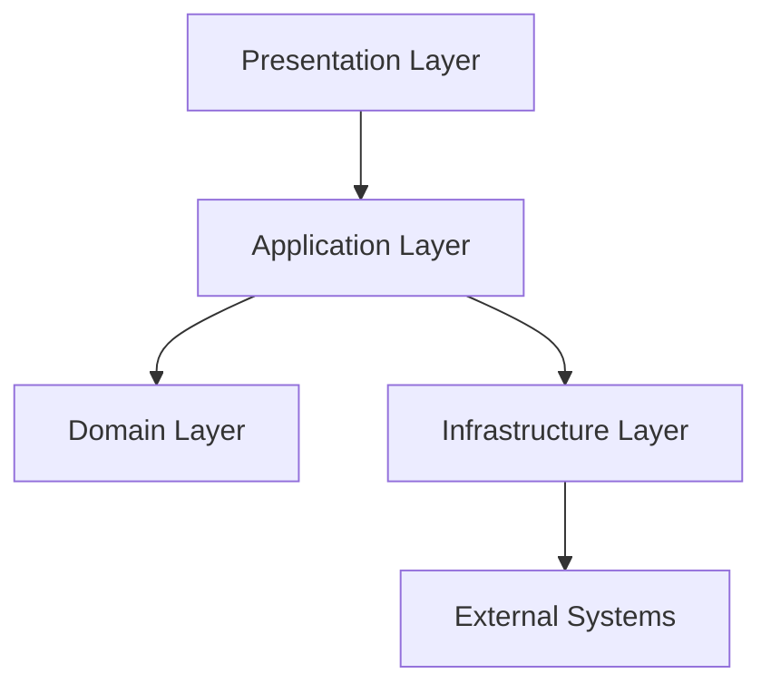
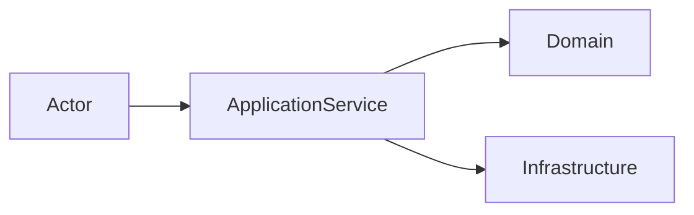
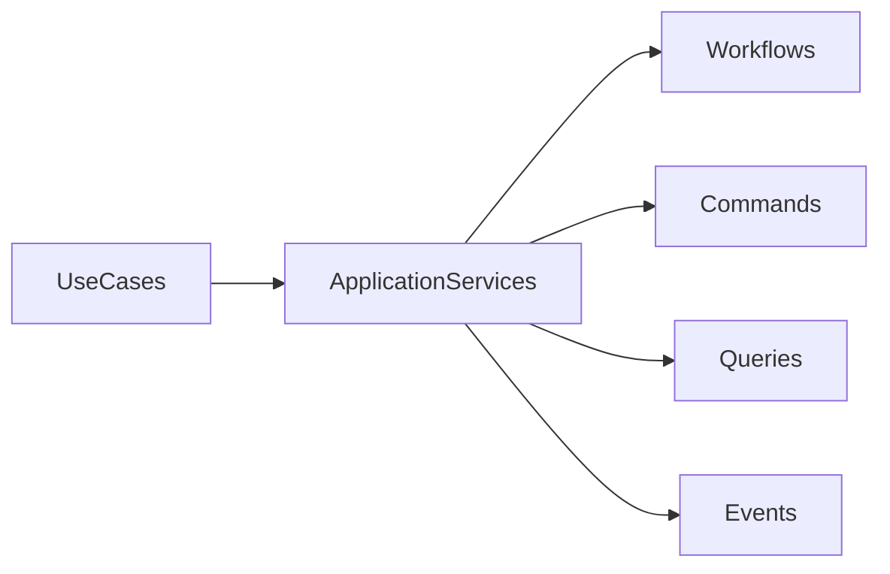
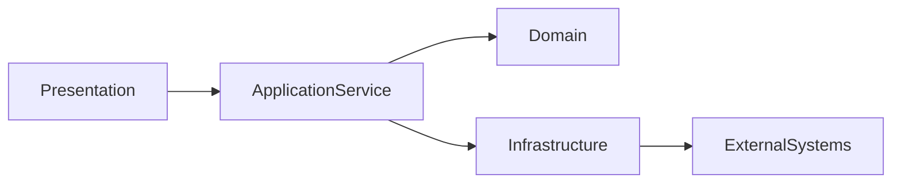
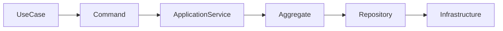
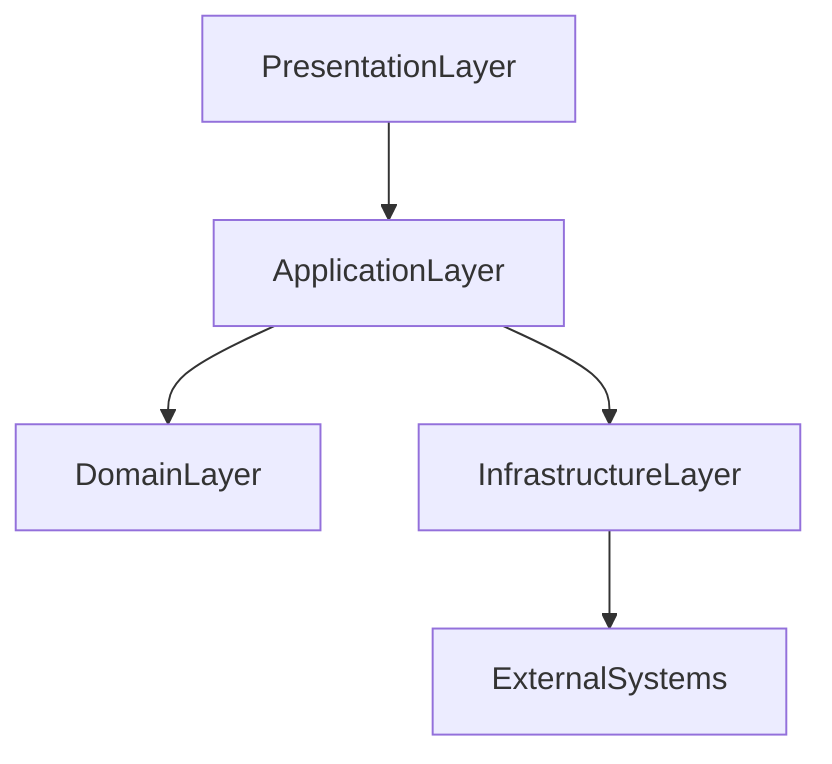
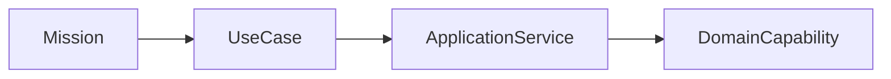
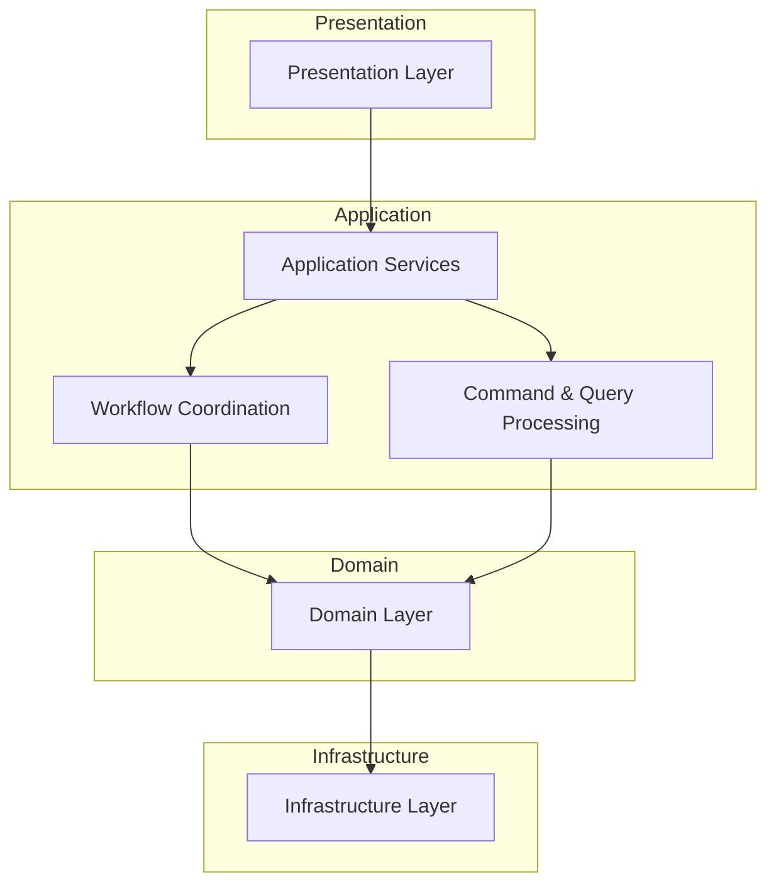

# ForgeOS Architecture — Application Model

**Document ID:** ARCH-APP-0001

**Title:** Application Model

**Status:** Approved

**Version:** 1.0.0

**Derived From**

- TDS-0004 — Application Model

**Related Documents**

- TDS-0002 — Domain Model
- TDS-0003 — Organization Model
- ARCH-0002 — Component Model
- ARCH-0003 — Architecture Enforcement Specification

---

# Purpose

This document provides the **Application Topology View** of the ForgeOS Application Model.

It visualizes how the Application Layer coordinates execution between the Presentation Layer, Domain Layer, Infrastructure Layer, and external systems while preserving the architectural rules defined by **TDS-0004**.

This document introduces **no new architectural decisions**.

The authoritative specification for the Application Layer remains **TDS-0004**.

---

# Scope

This view illustrates:

- application-layer decomposition;
- orchestration responsibilities;
- application topology;
- interaction boundaries;
- implementation mapping.

Business rules, organizational authority, transaction semantics, workflow behavior, and integration policy remain defined exclusively by **TDS-0004**.

---

# Architectural Traceability

| Concern | Authoritative Source |
|----------|----------------------|
| Application Services | TDS-0004 |
| Workflow Orchestration | TDS-0004 |
| Command–Query Responsibilities | TDS-0004 |
| Transaction Coordination | TDS-0004 |
| External Boundaries | TDS-0004 |

This document is a **derived implementation view** only.

---

# Application Topology

ForgeOS positions the Application Layer between presentation and business domains.

The topology illustrates architectural responsibility only.

It does not prescribe runtime deployment or implementation technology.

---

# Application Responsibilities

The Application Layer coordinates execution while preserving domain ownership.

| Responsibility | Description |
|---------------|-------------|
| Use Case Coordination | Executes complete application use cases |
| Workflow Orchestration | Coordinates multiple domain operations |
| Transaction Coordination | Defines application transaction boundaries |
| Command Processing | Coordinates state-changing requests |
| Query Processing | Coordinates information retrieval |
| Integration Coordination | Coordinates interaction with external systems |

Business rules remain exclusively within the Domain Layer.

---

# Architectural Position

The Application Layer acts as the orchestration boundary between user intent and business behavior.

The Application Layer coordinates.

The Domain Layer decides.

Infrastructure implements technical concerns.

---

# Application Decomposition

The Application Layer is conceptually decomposed into cohesive orchestration responsibilities.

This decomposition illustrates architectural responsibilities.

It does not define implementation modules or Rust crates.

---

# Architectural Principles Visualized

This view illustrates the following approved principles from **TDS-0004**.

- Application Services coordinate rather than decide.
- Business rules remain inside the Domain Layer.
- Commands and Queries remain separated.
- Transaction boundaries are explicit.
- External interaction is isolated through application boundaries.

These principles remain authoritative in **TDS-0004**.

---

# Relationship to Other Architecture Views

This document provides the **highest-level application perspective**.

Subsequent derived views focus on specific implementation concerns.

| Document | Primary Perspective |
|----------|---------------------|
| Application Model | Application topology |
| Application Services | Service decomposition |
| Workflow Orchestration | Execution coordination |
| Command–Query Model | Request processing |
| Integration Boundaries | External interaction |

Together these views improve implementation readiness while preserving **TDS-0004** as the sole authoritative specification.

*End of Part 1.*

# Application Collaboration View

This section visualizes how the Application Layer coordinates execution across architectural boundaries while preserving the orchestration responsibilities defined by **TDS-0004**.

The diagrams in this section illustrate application coordination only.

They do not redefine workflow semantics, transaction boundaries, command responsibilities, or domain ownership.

---

# Application Collaboration Model

Application Services coordinate interactions between application use cases and business domains.

The Application Service remains the orchestration point.

Domain ownership remains unchanged.

---

# Application Execution Flow

A representative application execution flow is illustrated below.

This flow represents architectural coordination.

Business behavior remains within aggregates.

---

# Application Coordination

Application Services coordinate multiple architectural concerns while preserving separation of responsibilities.

| Architectural Concern | Coordinated By |
|-----------------------|----------------|
| Use Case Execution | Application Service |
| Workflow Progression | Application Service |
| Aggregate Interaction | Application Service |
| Transaction Scope | Application Service |
| External Coordination | Application Service |

The responsibilities shown above derive directly from **TDS-0004**.

---

# Application Interaction Boundaries

The Application Layer interacts with neighboring layers through explicit architectural boundaries.

The boundaries preserve architectural isolation.

Implementation technology remains outside the scope of this view.

---

# Workflow Coordination

Application Services coordinate workflow execution.

Workflow coordination preserves:

- aggregate boundaries;
- transaction boundaries;
- organizational ownership;
- application responsibilities.

Workflow behavior remains defined by **TDS-0004**.

---

# Transaction Coordination

Application Services establish transaction scope.

Aggregates preserve business consistency.

Infrastructure implements persistence.

These responsibilities remain architecturally distinct.

---

# Organizational Alignment

The Application Layer coordinates execution in support of organizational missions.

The diagram illustrates organizational alignment.

Mission semantics remain defined by **TDS-0003**.

---

# Relationship to Other Application Views

This document provides the **application topology perspective**.

The remaining application architecture views provide focused implementation perspectives.

| Document | Primary Perspective |
|----------|---------------------|
| Application Model | Application topology |
| Application Services | Service responsibilities |
| Workflow Orchestration | Execution coordination |
| Command–Query Model | Request processing |
| Integration Boundaries | External interaction |

Together these views improve implementation readiness while preserving **TDS-0004** as the authoritative application specification.

---

# Architectural Traceability

Every application interaction shown in this document derives directly from:

- TDS-0004 — Application Model

This document introduces no additional application responsibilities or orchestration semantics.

*End of Part 2.*

# Implementation Guidance

This document provides the implementation-oriented **Application Topology View** of the ForgeOS Application Model.

Implementation teams should use this view to understand how the Application Layer coordinates execution while preserving domain ownership, organizational authority, and architectural isolation.

Application behavior remains defined exclusively by **TDS-0004**.

---

# Application Implementation Mapping

The conceptual responsibilities of the Application Layer map to implementation responsibilities as follows.

| Application Responsibility | Implementation Responsibility |
|----------------------------|-------------------------------|
| Use Case Coordination | Application Service implementation |
| Workflow Orchestration | Workflow coordination components |
| Command Processing | Command handling services |
| Query Processing | Query handling services |
| Transaction Coordination | Transaction management |
| Integration Coordination | Integration adapter coordination |

This mapping supports implementation planning.

It does not prescribe implementation technology or programming constructs.

---

# Application Topology During Implementation

Implementation shall preserve the approved application decomposition.

This topology illustrates architectural coordination.

It does not prescribe runtime deployment or crate structure.

---

# Architectural Boundaries

Implementation shall preserve the following application boundaries.

- Application Services coordinate rather than decide.
- Domain behavior is accessed only through approved domain contracts.
- Transaction boundaries remain explicit.
- Command and Query responsibilities remain separated.
- External interactions remain isolated from the Domain Layer.

These boundaries originate from **TDS-0004**.

---

# Relationship to Other Application Views

This document provides the highest-level application architecture perspective.

The remaining derived application views refine specific implementation concerns.

| Document | Primary Perspective |
|----------|---------------------|
| Application Model | Application topology |
| Application Services | Service decomposition |
| Workflow Orchestration | Workflow execution |
| Command–Query Model | Request coordination |
| Integration Boundaries | External interaction |

Together these views provide implementation guidance while preserving **TDS-0004** as the sole authoritative specification.

---

# Architectural Traceability

Every application concept visualized by this document originates from approved architectural authority.

| Concern | Authoritative Source |
|----------|----------------------|
| Application Responsibilities | TDS-0004 |
| Workflow Coordination | TDS-0004 |
| Transaction Coordination | TDS-0004 |
| External Boundaries | TDS-0004 |
| Architecture Enforcement | ARCH-0003 |

This document introduces no new architectural decisions.

---

# Usage During Implementation

Implementation teams should reference this document when:

- decomposing the Application Layer;
- assigning orchestration responsibilities;
- validating application boundaries;
- reviewing interaction between architectural layers;
- onboarding engineers to the application architecture.

Workflow behavior, transaction semantics, and orchestration rules shall always be obtained from **TDS-0004**.

---

# Codex Readiness

## Implementation Status

**Ready for implementation of the ForgeOS Application Layer topology.**

Using this document together with **TDS-0004**, a Senior Software Engineer can:

- identify Application Layer responsibilities;
- preserve orchestration boundaries;
- coordinate domain interactions;
- maintain separation between orchestration and business logic;
- align implementation with the approved application architecture.

No additional architectural decisions are required to implement the Application Layer topology.

---

# Architectural Authority

This document is a **derived architectural view**.

It is **not** an authoritative source of application architecture.

This document shall not be used to introduce or modify:

- application responsibilities;
- orchestration semantics;
- transaction coordination;
- command or query responsibilities;
- integration boundaries.

Any changes to those concepts shall first be made in **TDS-0004** and then reflected in this document.

---

# Document Completion

This document is complete.

It provides the implementation-oriented **Application Topology View** of the ForgeOS Application Model and serves as the architectural entry point for implementing application-layer orchestration while preserving the approved ForgeOS architecture.