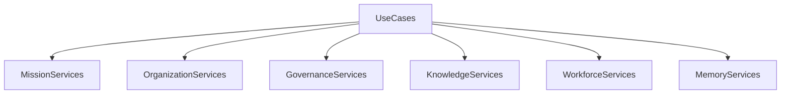
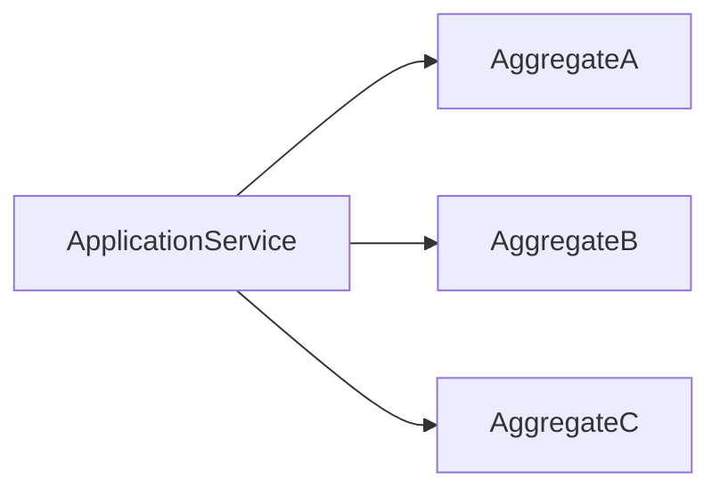
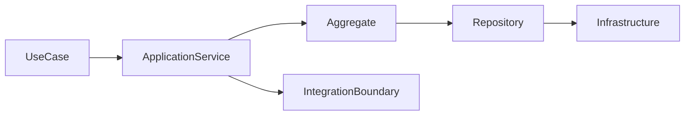
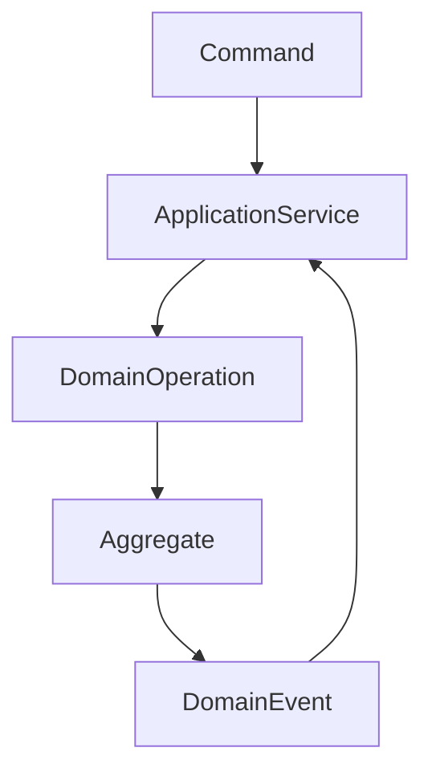
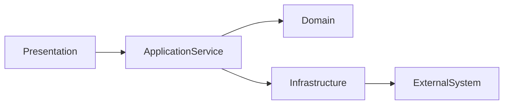
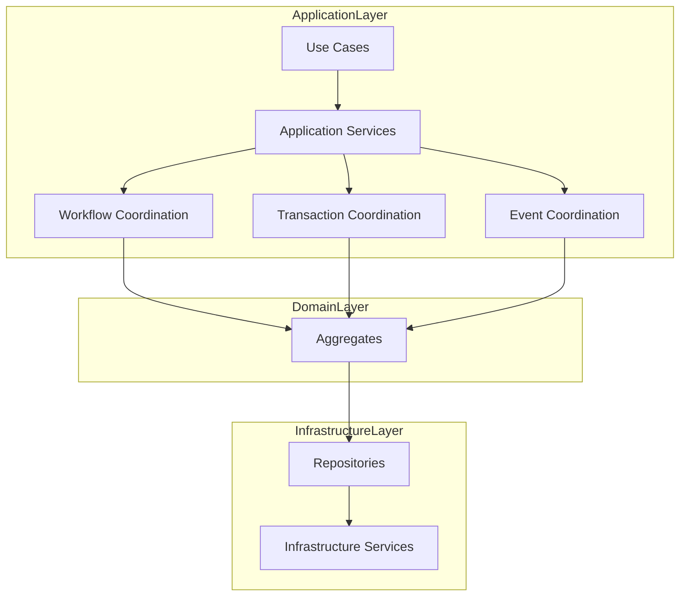

# ForgeOS Architecture — Application Services

**Document ID:** ARCH-APP-0002

**Title:** Application Services

**Status:** Approved

**Version:** 1.0.0

**Derived From**

- TDS-0004 — Application Model

**Related Documents**

- ARCH-APP-0001 — Application Model
- TDS-0002 — Domain Model
- TDS-0003 — Organization Model

---

# Purpose

This document provides the **Application Service View** of the ForgeOS Application Model.

It visualizes how Application Services decompose the Application Layer into cohesive orchestration responsibilities.

This document introduces **no new architectural decisions**.

Application Service behavior remains defined exclusively by **TDS-0004**.

---

# Scope

This view illustrates:

- application service decomposition;
- service responsibilities;
- orchestration relationships;
- interaction with the Domain Layer;
- implementation mapping.

Business rules, workflow semantics, transaction coordination, and integration policy remain defined exclusively by **TDS-0004**.

---

# Architectural Traceability

| Concern | Authoritative Source |
|----------|----------------------|
| Application Services | TDS-0004 |
| Use Cases | TDS-0004 |
| Workflow Coordination | TDS-0004 |
| Transaction Boundaries | TDS-0004 |
| Application Invariants | TDS-0004 |

This document is a **derived architectural view** only.

---

# Application Service Decomposition

Application Services are the primary orchestration units of the Application Layer.

The service categories illustrate orchestration responsibilities.

They do not prescribe implementation modules or crate boundaries.

---

# Service Responsibilities

Every Application Service coordinates one cohesive area of application behavior.

| Service Category | Primary Responsibility |
|-----------------|------------------------|
| Mission Services | Coordinate mission-oriented use cases |
| Organization Services | Coordinate organizational operations |
| Governance Services | Coordinate governance workflows |
| Knowledge Services | Coordinate knowledge promotion |
| Workforce Services | Coordinate capability management |
| Memory Services | Coordinate institutional preservation |

Business rules remain within the Domain Layer.

---

# Service Collaboration

Application Services coordinate domain execution without assuming business ownership.

The Application Service coordinates.

Each aggregate remains independently responsible for enforcing its own business invariants.

---

# Service Principles

This view visualizes the following approved principles from **TDS-0004**.

- Application Services coordinate rather than decide.
- Every use case has one coordinating Application Service.
- Services remain cohesive.
- Services preserve aggregate boundaries.
- Services remain independent of infrastructure implementation.

These principles remain authoritative in **TDS-0004**.

---

# Relationship to Other Application Views

This document focuses on **service decomposition**.

The remaining application architecture views address:

| Document | Primary Perspective |
|----------|---------------------|
| Application Model | Overall application topology |
| Application Services | Service decomposition |
| Workflow Orchestration | Execution flow |
| Command–Query Model | Request coordination |
| Integration Boundaries | External interaction |

Together they provide complementary implementation perspectives while preserving **TDS-0004** as the sole authoritative specification.

*End of Part 1.*

# Application Service Collaboration View

This section visualizes how Application Services collaborate with the Domain Layer while preserving the orchestration, transaction, and ownership rules defined by **TDS-0004**.

The diagrams in this section illustrate orchestration relationships only.

They do not redefine business behavior, workflow semantics, transaction coordination, or domain ownership.

---

# Service Collaboration Model

Application Services coordinate interactions among use cases, domain aggregates, repositories, and external integrations.

Application Services remain the sole orchestration component.

Business ownership remains within the Domain Layer.

---

# Application Execution Relationships

The relationship between application coordination and domain execution is illustrated below.

Application Services coordinate execution before and after domain behavior.

Business decisions remain inside aggregates.

---

# Service Coordination Responsibilities

Application Services coordinate multiple architectural concerns while maintaining separation of responsibilities.

| Coordinated Concern | Coordinated By |
|---------------------|----------------|
| Use Case Execution | Application Service |
| Aggregate Interaction | Application Service |
| Transaction Coordination | Application Service |
| Domain Event Handling | Application Service |
| External Integration | Application Service |

These responsibilities derive directly from **TDS-0004**.

---

# Service Interaction Boundaries

Application Services interact only through approved architectural contracts.

The interaction boundaries preserve architectural isolation.

Application Services do not bypass domain contracts.

---

# Implementation Mapping

Application Service responsibilities map conceptually to implementation concerns.

| Application Service Concern | Implementation Concern |
|-----------------------------|------------------------|
| Use Case Coordination | Application orchestration |
| Aggregate Coordination | Domain interaction |
| Transaction Scope | Transaction management |
| Event Coordination | Event orchestration |
| Integration Coordination | Integration adapter coordination |

This mapping supports implementation planning.

It does not prescribe concrete implementation patterns.

---

# Service Stability

Implementation may optimize orchestration workflows.

Implementation shall preserve:

- service cohesion;
- orchestration responsibility;
- aggregate isolation;
- transaction coordination;
- domain ownership.

These architectural characteristics remain stable throughout implementation.

---

# Relationship to Other Application Views

The Application Service View focuses on **orchestration responsibilities**.

The Application Model defines the overall topology.

The Workflow Orchestration View defines execution flow.

The Command–Query Model defines request responsibilities.

Together these documents provide complementary implementation perspectives while preserving **TDS-0004** as the authoritative specification.

---

# Architectural Traceability

Every service relationship shown in this document derives directly from:

- TDS-0004 — Application Model

This document introduces no additional application responsibilities or orchestration semantics.

*End of Part 2.*

# Implementation Guidance

This document provides the implementation-oriented **Application Service View** of the ForgeOS Application Model.

Implementation teams should use this view to understand how Application Services coordinate execution while preserving domain ownership, transaction boundaries, and architectural isolation.

Application behavior remains defined exclusively by **TDS-0004**.

---

# Application Service Implementation Mapping

The conceptual responsibilities of Application Services map to implementation concerns as follows.

| Application Service Responsibility | Implementation Responsibility |
|-----------------------------------|-------------------------------|
| Use Case Coordination | Application orchestration |
| Aggregate Coordination | Domain interaction |
| Workflow Coordination | Execution sequencing |
| Transaction Coordination | Transaction management |
| Domain Event Coordination | Event processing |
| External Integration Coordination | Integration adapter orchestration |

This mapping supports implementation planning.

It does not prescribe implementation technology or programming constructs.

---

# Application Service Topology During Implementation

Implementation shall preserve the approved service decomposition.

The topology illustrates orchestration responsibilities.

It does not prescribe Rust modules or runtime deployment.

---

# Service Boundaries

Implementation shall preserve the following service boundaries.

- Every use case has one coordinating Application Service.
- Application Services coordinate rather than decide.
- Business rules remain inside aggregates.
- Aggregate interaction occurs only through approved domain contracts.
- Transaction scope remains explicitly defined.
- Infrastructure concerns remain outside the Application Layer.

These boundaries derive directly from **TDS-0004**.

---

# Relationship to Other Application Views

This document complements the remaining application architecture views.

| Document | Primary Perspective |
|----------|---------------------|
| Application Model | Application topology |
| Application Services | Service decomposition |
| Workflow Orchestration | Workflow execution |
| Command–Query Model | Request coordination |
| Integration Boundaries | External interaction |

Together these views provide implementation clarity while preserving **TDS-0004** as the sole authoritative application specification.

---

# Architectural Traceability

Every application service concept visualized by this document originates from approved architectural authority.

| Concern | Authoritative Source |
|----------|----------------------|
| Application Services | TDS-0004 |
| Use Cases | TDS-0004 |
| Workflow Coordination | TDS-0004 |
| Transaction Coordination | TDS-0004 |
| Architecture Enforcement | ARCH-0003 |

This document introduces no new application architecture.

---

# Usage During Implementation

Implementation teams should reference this document when:

- decomposing Application Services;
- assigning orchestration responsibilities;
- implementing application workflows;
- validating aggregate interaction;
- reviewing application-layer cohesion.

Service responsibilities and orchestration rules shall always be obtained from **TDS-0004**.

---

# Codex Readiness

## Implementation Status

**Ready for implementation of ForgeOS Application Services.**

Using this document together with **TDS-0004**, a Senior Software Engineer can:

- decompose the Application Layer into cohesive services;
- assign orchestration responsibilities;
- preserve transaction coordination;
- coordinate domain interactions;
- maintain architectural separation between orchestration and business logic.

No additional architectural decisions are required to implement the Application Service layer.

---

# Architectural Authority

This document is a **derived architectural view**.

It is **not** an authoritative source of application architecture.

This document shall not be used to introduce or modify:

- service responsibilities;
- orchestration semantics;
- transaction boundaries;
- aggregate interaction rules;
- application-layer invariants.

Any changes to those concepts shall first be made in **TDS-0004** and then reflected in this document.

---

# Document Completion

This document is complete.

It provides the implementation-oriented **Application Service View** of the ForgeOS Application Model and serves as the architectural reference for implementing application-layer orchestration while preserving the approved ForgeOS architecture.