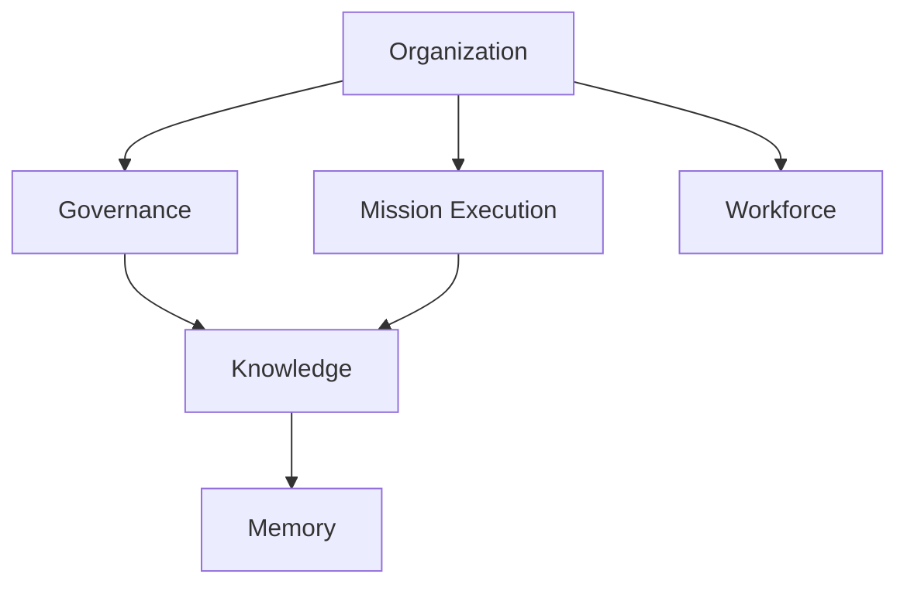
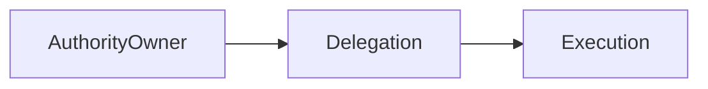
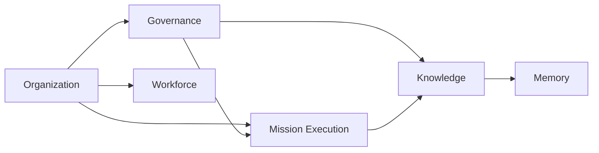
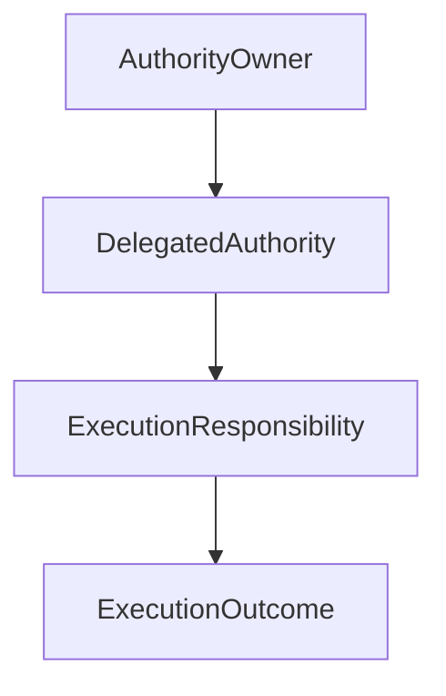
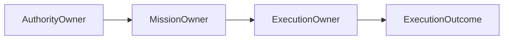
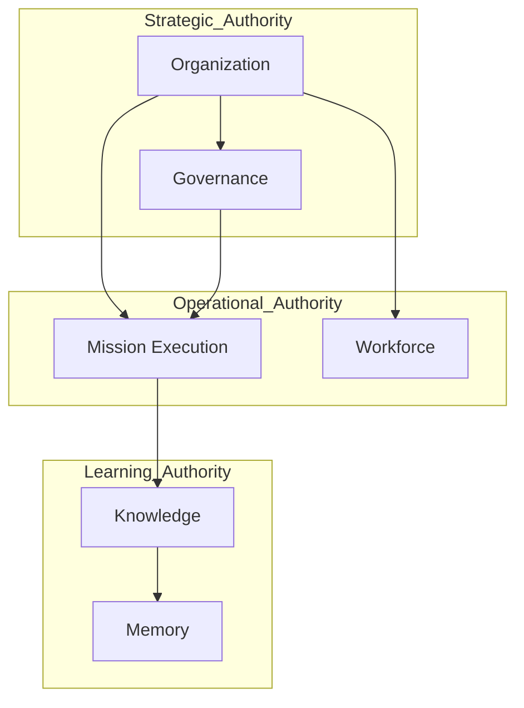

# ForgeOS Architecture — Authority Model

**Document ID:** ARCH-ORG-0002

**Title:** Authority Model

**Status:** Approved

**Version:** 1.0.0

**Derived From**

- TDS-0003 — Organization Model

**Related Documents**

- ARCH-ORG-0001 — Organization Model
- ARCH-0003 — Architecture Enforcement Specification

---

# Purpose

This document provides the **Authority Allocation View** of the ForgeOS Organization Model.

It visualizes how organizational authority is allocated, exercised, and delegated according to the authoritative rules defined in **TDS-0003**.

This document introduces no new authority relationships, governance policies, delegation semantics, or ownership rules.

The authoritative organizational specification remains **TDS-0003**.

---

# Scope

This view illustrates:

- authority allocation;
- authority relationships;
- authority delegation;
- accountability boundaries;
- implementation responsibilities.

Authority semantics remain exclusively defined by **TDS-0003**.

---

# Architectural Traceability

| Authority Concern | Authoritative Source |
|-------------------|----------------------|
| Organizational Authority | TDS-0003 |
| Delegation | TDS-0003 |
| Responsibility Ownership | TDS-0003 |
| Accountability | TDS-0003 |
| Organizational Invariants | TDS-0003 |

This document is a derived implementation view only.

---

# Authority Allocation

Authority is allocated to permanent Organizational Units.

The diagram illustrates organizational authority relationships.

It does not imply implementation dependencies.

---

# Authority Ownership Principles

Authority allocation follows the approved principles defined in **TDS-0003**.

- Every authority has exactly one owner.
- Authority ownership is explicit.
- Authority remains traceable.
- Authority may be delegated.
- Delegation does not transfer ownership.

These principles are visualized here only.

---

# Authority Responsibility Matrix

| Organizational Unit | Strategic Authority | Operational Authority | Governance Authority | Capability Authority |
|----------------------|:------------------:|:---------------------:|:--------------------:|:--------------------:|
| Organization | ✓ | ✓ | | ✓ |
| Governance | ✓ | | ✓ | |
| Mission Execution | | ✓ | | ✓ |
| Workforce | | ✓ | | ✓ |
| Knowledge | | | | ✓ |
| Memory | | | | |

The matrix summarizes authority allocation already established in **TDS-0003**.

---

# Delegation Model Overview

Authority delegation is represented conceptually below.

Delegation enables execution while preserving accountability.

Ownership remains unchanged.

---

# Accountability Boundaries

Authority establishes accountability boundaries.

Every authority relationship includes:

- one authority owner;
- one delegated scope (where applicable);
- one accountability chain;
- one governance relationship.

These boundaries remain stable throughout implementation.

*End of Part 1.*

# Authority Relationship View

This section visualizes how authority is exercised across Organizational Units while preserving the ownership, delegation, and governance rules defined by **TDS-0003**.

The diagrams in this section illustrate organizational authority only.

They do not redefine ownership, introduce approval policies, or extend delegation semantics.

---

# Organizational Authority Relationships

The approved authority relationships are illustrated below.

The arrows indicate organizational authority relationships and coordination.

They do not represent software dependencies.

---

# Delegation Flow

Authority may be delegated while ownership remains unchanged.

Execution proceeds under delegated authority.

Organizational accountability remains with the authority owner.

---

# Accountability Chain

The organizational accountability chain is illustrated below.

The accountability chain remains continuous throughout execution.

Delegation does not interrupt accountability.

---

# Authority Allocation During Implementation

Implementation shall preserve the following authority allocations.

| Organizational Unit | Primary Authority During Implementation |
|----------------------|------------------------------------------|
| Organization | Strategic direction and organizational ownership |
| Governance | Policy approval and compliance |
| Mission Execution | Mission coordination and execution oversight |
| Workforce | Capability allocation and competency management |
| Knowledge | Knowledge stewardship and promotion |
| Memory | Historical preservation and institutional traceability |

This table summarizes authority already defined in **TDS-0003**.

---

# Authority Stability

Implementation may refine execution workflows.

Implementation shall not redefine:

- authority ownership;
- accountability;
- delegation semantics;
- organizational ownership;
- governance authority.

These remain authoritative in **TDS-0003**.

---

# Relationship to Organizational Topology

The Organization Model defines **where** responsibilities exist.

The Authority Model illustrates **who exercises authority** over those responsibilities.

Together they provide complementary implementation perspectives while preserving the same organizational architecture.

---

# Architectural Traceability

Every authority relationship shown in this document derives directly from:

- TDS-0003 — Organization Model

This document introduces no new authority relationships or governance semantics.

*End of Part 2.*

# Implementation Guidance

This document provides the implementation-oriented **Authority Allocation View** of the ForgeOS Organization Model.

Implementation teams should use this view to understand how authority is allocated, exercised, delegated, and preserved during implementation.

Authority semantics remain defined exclusively by **TDS-0003**.

---

# Authority Implementation Mapping

The approved Organizational Units provide the implementation authority for organizational responsibilities.

| Organizational Unit | Primary Authority During Implementation |
|----------------------|------------------------------------------|
| Organization | Organizational strategy, identity, and long-term direction |
| Governance | Policy approval, standards, architectural compliance |
| Mission Execution | Mission planning, coordination, execution oversight |
| Workforce | Capability assignment, competency stewardship |
| Knowledge | Knowledge promotion, blueprint stewardship |
| Memory | Institutional preservation, historical traceability |

This mapping supports implementation planning only.

It does not redefine organizational authority.

---

# Authority Topology During Implementation

Implementation shall preserve the approved authority structure.

The topology illustrates authority coordination.

It does not define implementation dependencies.

---

# Delegation Boundaries

Implementation shall preserve the following delegation boundaries.

- Delegation transfers execution authority only.
- Accountability remains attached to the authority owner.
- Organizational ownership remains unchanged.
- Governance authority cannot be bypassed through delegation.
- Delegated execution remains traceable.

These delegation boundaries originate from **TDS-0003**.

---

# Relationship to Other Organizational Views

This document complements the remaining organizational architecture views.

| Document | Primary Perspective |
|----------|---------------------|
| Organization Model | Organizational topology |
| Authority Model | Authority allocation |
| Governance Model | Governance execution |
| Mission Lifecycle | Mission progression |
| Capability Lifecycle | Capability evolution |

Together these views provide implementation clarity while preserving **TDS-0003** as the sole authoritative organizational specification.

---

# Architectural Traceability

Every authority concept visualized by this document originates from approved architectural authority.

| Concern | Authoritative Source |
|----------|----------------------|
| Organizational Authority | TDS-0003 |
| Delegation | TDS-0003 |
| Accountability | TDS-0003 |
| Organizational Invariants | TDS-0003 |
| Architecture Enforcement | ARCH-0003 |

This document introduces no additional authority semantics.

---

# Usage During Implementation

Implementation teams should reference this document when:

- assigning implementation authority;
- validating delegation paths;
- reviewing accountability chains;
- implementing approval workflows;
- preserving authority ownership.

Authority behavior and governance policy shall always be obtained from **TDS-0003**.

---

# Codex Readiness

## Implementation Status

**Ready for implementation of the ForgeOS organizational authority model.**

Using this document together with **TDS-0003**, a Senior Software Engineer can:

- implement authority ownership;
- implement delegation mechanisms;
- preserve accountability chains;
- align approval responsibilities;
- maintain organizational authority boundaries.

No additional architectural decisions are required to implement the approved authority model.

---

# Architectural Authority

This document is a **derived architectural view**.

It is **not** an authoritative source of organizational policy.

This document shall not be used to introduce or modify:

- authority relationships;
- delegation rules;
- accountability;
- governance responsibilities;
- ownership semantics.

Any changes to those concepts shall first be made in **TDS-0003** and then reflected in this document.

---

# Document Completion

This document is complete.

It provides the implementation-oriented **Authority Allocation View** of the ForgeOS Organization Model and serves as the architectural reference for implementing organizational authority, delegation, and accountability while preserving the approved organizational architecture.