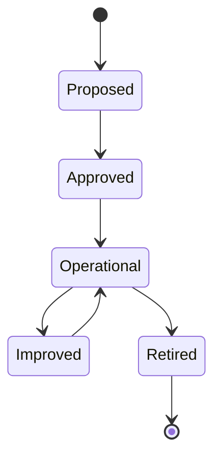
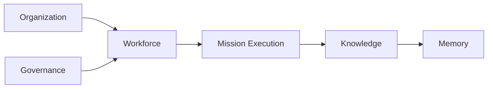
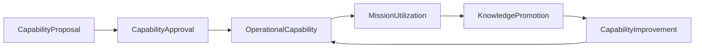
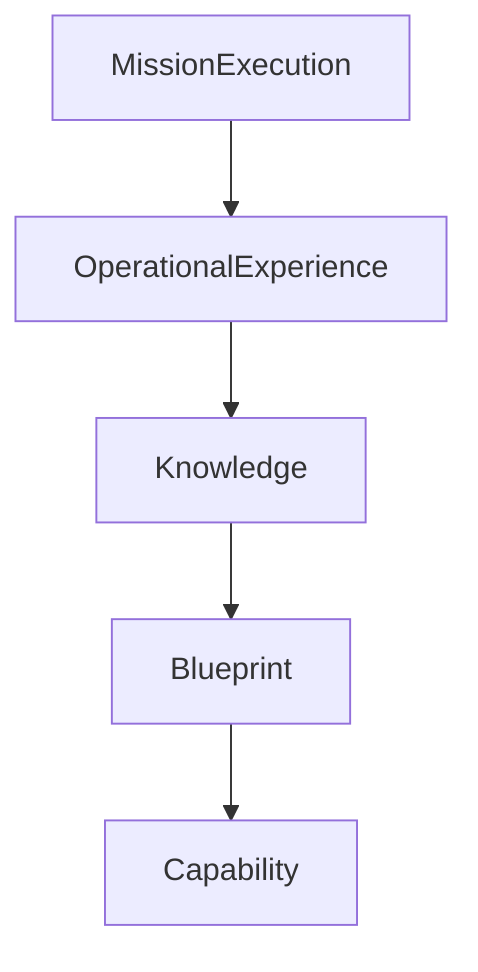
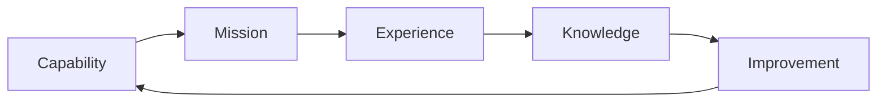
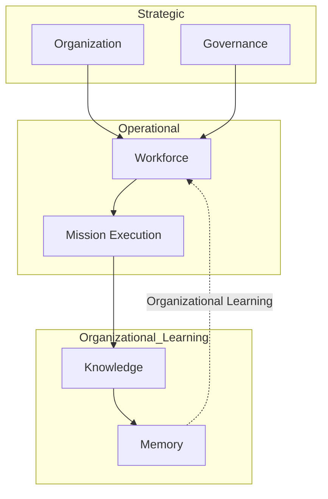

# ForgeOS Architecture — Capability Lifecycle

**Document ID:** ARCH-ORG-0005

**Title:** Capability Lifecycle

**Status:** Approved

**Version:** 1.0.0

**Derived From**

- TDS-0003 — Organization Model

**Related Documents**

- ARCH-ORG-0001 — Organization Model
- ARCH-ORG-0003 — Governance Model
- ARCH-ORG-0004 — Mission Lifecycle

---

# Purpose

This document provides the **Capability Lifecycle View** of the ForgeOS Organization Model.

It visualizes the organizational lifecycle of capabilities defined by **TDS-0003**, showing how long-lived organizational capabilities evolve independently of individual missions.

This document introduces no new capability lifecycle stages, organizational responsibilities, governance policies, ownership semantics, or authority relationships.

The authoritative organizational specification remains **TDS-0003**.

---

# Scope

This view illustrates:

- capability lifecycle progression;
- capability stewardship;
- organizational participation;
- capability evolution;
- implementation mapping.

Capability ownership, governance, organizational responsibilities, and lifecycle semantics remain defined exclusively by **TDS-0003**.

---

# Architectural Traceability

| Capability Concern | Authoritative Source |
|--------------------|----------------------|
| Capability Ownership | TDS-0003 |
| Capability Lifecycle | TDS-0003 |
| Organizational Participation | TDS-0003 |
| Organizational Invariants | TDS-0003 |

This document is a derived implementation view only.

---

# Capability Lifecycle Overview

Organizational capabilities evolve continuously throughout the life of the organization.

The lifecycle visualizes organizational capability evolution.

Lifecycle semantics remain defined by **TDS-0003**.

---

# Organizational Participation

Capability evolution involves collaboration among permanent Organizational Units.

Participation illustrates organizational collaboration.

Capability ownership remains unchanged.

---

# Capability Stewardship

Capability stewardship remains singular throughout the lifecycle.

| Lifecycle Stage | Organizational Responsibility |
|-----------------|-------------------------------|
| Proposal | Organization |
| Approval | Governance |
| Operational Stewardship | Workforce |
| Improvement | Workforce |
| Knowledge Promotion | Knowledge |
| Historical Preservation | Memory |

The responsibilities shown above summarize the organizational model defined by **TDS-0003**.

---

# Capability Principles

The Capability Lifecycle View illustrates the following approved principles.

- Capabilities are organizational assets.
- Capabilities outlive missions.
- Capability ownership remains singular.
- Organizational learning improves capabilities.
- Institutional memory preserves capability evolution.

These principles originate from **TDS-0003**.

---

# Organizational Perspective

Capabilities provide enduring organizational competency.

Missions consume capabilities.

Knowledge improves capabilities.

Memory preserves organizational capability history.

The lifecycle maintains these distinctions throughout implementation.

---

# Lifecycle Stability

Implementation may refine capability management workflows.

Implementation shall preserve:

- capability ownership;
- governance participation;
- organizational stewardship;
- historical traceability.

These characteristics remain authoritative in **TDS-0003**.

*End of Part 1.*

# Capability Evolution View

This section visualizes how organizational capabilities evolve while preserving the ownership, governance, and stewardship rules defined by **TDS-0003**.

The diagrams in this section illustrate organizational capability evolution only.

They do not redefine lifecycle semantics, ownership, governance, or organizational responsibilities.

---

# Capability Evolution Model

Organizational capabilities evolve continuously through operational use and organizational learning.

Capability evolution is continuous.

Operational experience contributes to long-term organizational capability.

---

# Organizational Learning Integration

Capability evolution is integrated with organizational learning.

The diagram illustrates organizational learning.

It does not prescribe implementation mechanisms.

---

# Capability Responsibility Matrix

| Capability Activity | Organizational Unit |
|---------------------|---------------------|
| Capability Proposal | Organization |
| Capability Approval | Governance |
| Capability Stewardship | Workforce |
| Mission Consumption | Mission Execution |
| Knowledge Promotion | Knowledge |
| Historical Preservation | Memory |

This matrix summarizes capability stewardship defined by **TDS-0003**.

---

# Capability Consumption

Capabilities are organizational assets consumed by missions.

Implementation shall preserve the following principles.

- Capabilities are not owned by missions.
- Multiple missions may consume the same capability.
- Capability ownership remains independent of mission execution.
- Capability improvement follows validated organizational learning.

These principles remain authoritative in **TDS-0003**.

---

# Capability Improvement Cycle

The organizational capability improvement cycle is illustrated below.

The cycle represents organizational evolution rather than runtime execution.

---

# Capability Stability

Implementation may improve capability management processes.

Implementation shall preserve:

- capability ownership;
- organizational stewardship;
- governance participation;
- organizational traceability;
- separation between capability ownership and mission ownership.

These characteristics remain stable throughout implementation.

---

# Relationship to Other Organizational Views

The Capability Lifecycle View focuses on **organizational capability evolution**.

The Mission Lifecycle View focuses on **organizational execution**.

The Knowledge domain captures validated organizational learning.

The Memory domain preserves institutional history.

Together these views visualize different aspects of the same organizational model defined by **TDS-0003**.

---

# Architectural Traceability

Every capability lifecycle interaction shown in this document derives directly from:

- TDS-0003 — Organization Model

This document introduces no new organizational rules, lifecycle stages, or stewardship responsibilities.

*End of Part 2.*

# Implementation Guidance

This document provides the implementation-oriented **Capability Lifecycle View** of the ForgeOS Organization Model.

Implementation teams should use this view to understand how organizational capabilities evolve, are stewarded, and are improved throughout the lifetime of the organization.

Capability ownership, stewardship, governance, and lifecycle semantics remain defined exclusively by **TDS-0003**.

---

# Capability Lifecycle Implementation Mapping

The approved Organizational Units participate in capability evolution according to their defined organizational responsibilities.

| Capability Lifecycle Concern | Implementation Responsibility |
|------------------------------|-------------------------------|
| Capability Proposal | Capability planning services |
| Capability Approval | Governance approval services |
| Capability Stewardship | Workforce capability services |
| Mission Capability Coordination | Mission coordination services |
| Knowledge Promotion | Knowledge stewardship services |
| Historical Preservation | Memory services |

This mapping supports implementation planning only.

It does not redefine capability ownership or organizational authority.

---

# Capability Lifecycle During Implementation

Implementation shall preserve the approved organizational capability progression.

The diagram illustrates organizational capability evolution.

It is not a runtime execution model.

---

# Capability Boundaries

Implementation shall preserve the following capability boundaries.

- Capability ownership remains singular.
- Capabilities remain organizational assets.
- Missions consume capabilities without acquiring ownership.
- Governance approves capability evolution.
- Workforce stewards operational capabilities.
- Knowledge promotes validated organizational learning.
- Memory preserves historical capability evolution.

These boundaries derive directly from **TDS-0003**.

---

# Relationship to Other Organizational Views

This document complements the remaining organizational architecture views.

| Document | Primary Perspective |
|----------|---------------------|
| Organization Model | Organizational topology |
| Authority Model | Organizational authority |
| Governance Model | Governance oversight |
| Mission Lifecycle | Organizational execution |
| Capability Lifecycle | Organizational capability evolution |

Together these views provide implementation guidance while preserving **TDS-0003** as the sole authoritative organizational specification.

---

# Architectural Traceability

Every capability lifecycle concept visualized by this document originates from approved architectural authority.

| Concern | Authoritative Source |
|----------|----------------------|
| Capability Ownership | TDS-0003 |
| Capability Lifecycle | TDS-0003 |
| Organizational Participation | TDS-0003 |
| Organizational Invariants | TDS-0003 |
| Architecture Enforcement | ARCH-0003 |

This document introduces no new organizational authority or lifecycle semantics.

---

# Usage During Implementation

Implementation teams should reference this document when:

- implementing capability lifecycle workflows;
- implementing capability stewardship;
- coordinating capability improvement;
- preserving capability ownership;
- validating organizational learning flows.

Capability governance and stewardship shall always be obtained from **TDS-0003**.

---

# Codex Readiness

## Implementation Status

**Ready for implementation of the ForgeOS capability lifecycle.**

Using this document together with **TDS-0003**, a Senior Software Engineer can:

- implement capability lifecycle workflows;
- preserve capability ownership;
- coordinate organizational capability evolution;
- integrate governance approval into capability changes;
- maintain the separation between capability stewardship, mission execution, knowledge promotion, and institutional memory.

No additional architectural decisions are required to implement the approved capability lifecycle.

---

# Architectural Authority

This document is a **derived architectural view**.

It is **not** an authoritative source of organizational policy.

This document shall not be used to introduce or modify:

- capability lifecycle stages;
- capability ownership;
- stewardship responsibilities;
- governance participation;
- organizational responsibilities.

Any changes to those concepts shall first be made in **TDS-0003** and then reflected in this document.

---

# Document Completion

This document is complete.

It provides the implementation-oriented **Capability Lifecycle View** of the ForgeOS Organization Model and serves as the architectural reference for implementing capability stewardship, organizational capability evolution, governance integration, and organizational learning while preserving the approved organizational architecture.