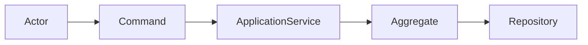
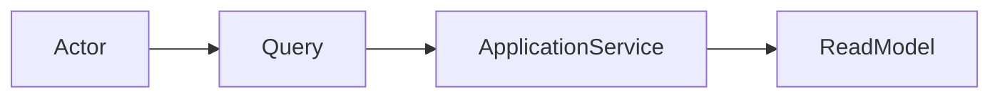
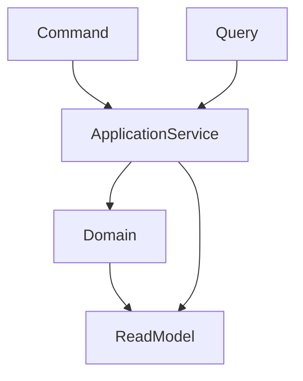
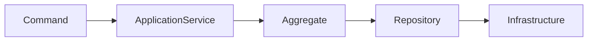
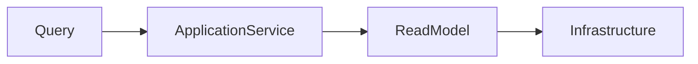
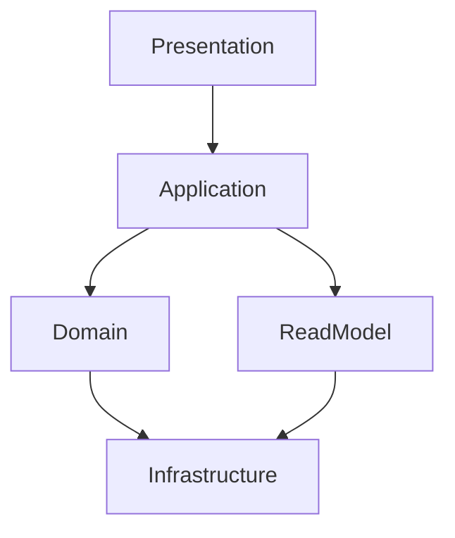
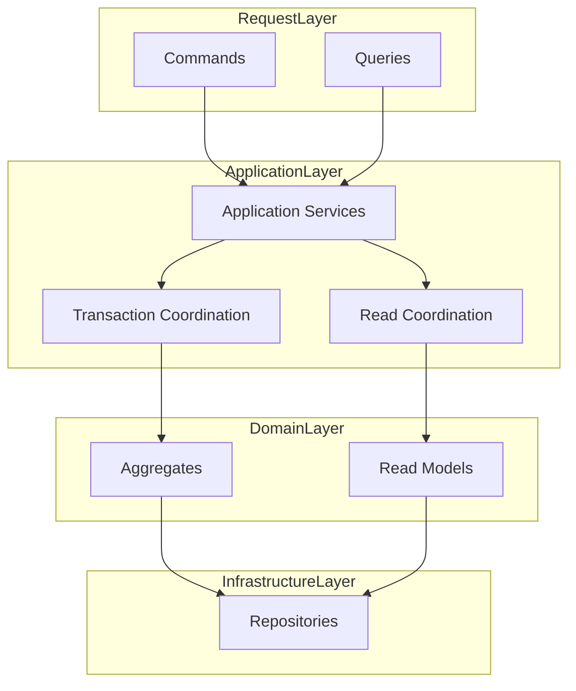

# ForgeOS Architecture — Command–Query Model

**Document ID:** ARCH-APP-0004

**Title:** Command–Query Model

**Status:** Approved

**Version:** 1.0.0

**Derived From**

- TDS-0004 — Application Model

**Related Documents**

- ARCH-APP-0001 — Application Model
- ARCH-APP-0002 — Application Services
- ARCH-APP-0003 — Workflow Orchestration

---

# Purpose

This document provides the **Command–Query View** of the ForgeOS Application Model.

It visualizes the architectural separation between state-changing operations (Commands) and information-retrieval operations (Queries) defined by **TDS-0004**.

This document introduces **no new architectural decisions**.

Command and Query semantics remain authoritatively defined by **TDS-0004**.

---

# Scope

This view illustrates:

- command processing;
- query processing;
- command–query separation;
- interaction boundaries;
- implementation mapping.

Business rules, transaction semantics, workflow orchestration, and application responsibilities remain defined exclusively by **TDS-0004**.

---

# Architectural Traceability

| Concern | Authoritative Source |
|----------|----------------------|
| Commands | TDS-0004 |
| Queries | TDS-0004 |
| Command–Query Separation | TDS-0004 |
| Transaction Coordination | TDS-0004 |
| Application Invariants | TDS-0004 |

This document is a **derived architectural view** only.

---

# Command Processing Topology

Commands initiate business state changes through the Application Layer.

Commands coordinate state changes.

Business decisions remain within aggregates.

---

# Query Processing Topology

Queries retrieve information without modifying business state.

Queries remain free of side effects.

Read behavior remains independent from command execution.

---

# Command–Query Separation

Commands and Queries are architecturally independent.

This separation improves architectural clarity.

It does not prescribe a specific implementation strategy.

---

# Command–Query Responsibilities

| Concern | Coordinated By |
|----------|----------------|
| Command Execution | Application Service |
| Transaction Coordination | Application Service |
| Aggregate Coordination | Application Service |
| Query Execution | Application Service |
| Read Model Coordination | Application Service |

These responsibilities derive directly from **TDS-0004**.

---

# Architectural Principles

This view visualizes the following approved principles.

- Commands modify business state.
- Queries never modify business state.
- Command and Query responsibilities remain separated.
- Business rules remain inside the Domain Layer.
- Application Services coordinate request execution.

These principles remain authoritative in **TDS-0004**.

---

# Relationship to Other Application Views

This document focuses on **request processing responsibilities**.

The remaining application architecture views address:

| Document | Primary Perspective |
|----------|---------------------|
| Application Model | Application topology |
| Application Services | Service decomposition |
| Workflow Orchestration | Execution coordination |
| Command–Query Model | Request processing |
| Integration Boundaries | External interaction |

Together these views provide complementary implementation perspectives while preserving **TDS-0004** as the authoritative specification.

*End of Part 1.*

# Command–Query Collaboration View

This section visualizes how Commands and Queries are coordinated by the Application Layer while preserving the separation of responsibilities defined by **TDS-0004**.

The diagrams in this section illustrate application coordination only.

They do not redefine workflow semantics, transaction coordination, domain ownership, or business behavior.

---

# Command Processing Model

Command execution coordinates state-changing business operations.

The Application Service coordinates command execution.

Business consistency remains the responsibility of the aggregate.

---

# Query Processing Model

Query execution coordinates information retrieval without modifying business state.

Queries remain free of side effects.

Read processing is independent of command execution.

---

# Request Coordination Responsibilities

Application Services coordinate both request categories while preserving architectural separation.

| Coordinated Concern | Coordinated By |
|---------------------|----------------|
| Command Coordination | Application Service |
| Aggregate Interaction | Application Service |
| Transaction Coordination | Application Service |
| Query Coordination | Application Service |
| Read Model Access | Application Service |

These responsibilities derive directly from **TDS-0004**.

---

# Architectural Boundaries

Command and Query processing occurs through explicit application boundaries.

Commands and Queries remain architecturally distinct while sharing the Application Layer as their orchestration boundary.

---

# Command–Query Stability

Implementation may optimize request handling.

Implementation shall preserve:

- command and query separation;
- explicit transaction coordination for commands;
- side-effect-free query execution;
- aggregate isolation;
- application-layer orchestration.

These architectural characteristics remain stable throughout implementation.

---

# Relationship to Other Application Views

The Command–Query Model focuses on **request processing responsibilities**.

The Workflow Orchestration View focuses on **execution sequencing**.

The Application Services View focuses on **service decomposition**.

Together these architectural views provide complementary implementation guidance while preserving **TDS-0004** as the authoritative specification.

---

# Architectural Traceability

Every command and query relationship shown in this document derives directly from:

- TDS-0004 — Application Model

This document introduces no additional application responsibilities or request-processing semantics.

*End of Part 2.*

# Implementation Guidance

This document provides the implementation-oriented **Command–Query View** of the ForgeOS Application Model.

Implementation teams should use this view to understand how state-changing requests and information-retrieval requests are coordinated while preserving application orchestration, domain ownership, and architectural isolation.

Command and Query behavior remains defined exclusively by **TDS-0004**.

---

# Command–Query Implementation Mapping

The conceptual request responsibilities map to implementation concerns as follows.

| Request Concern | Implementation Responsibility |
|-----------------|-------------------------------|
| Command Coordination | Command orchestration |
| Aggregate Coordination | Domain interaction |
| Transaction Coordination | Transaction management |
| Query Coordination | Query orchestration |
| Read Model Coordination | Read model access |

This mapping supports implementation planning.

It does not prescribe implementation technology or programming constructs.

---

# Command–Query Topology During Implementation

Implementation shall preserve the approved request-processing architecture.

The topology illustrates architectural coordination.

It does not prescribe runtime deployment or implementation structure.

---

# Architectural Boundaries

Implementation shall preserve the following request-processing boundaries.

- Commands modify business state only through approved domain contracts.
- Queries remain free of side effects.
- Transaction coordination applies only to state-changing workflows.
- Read processing remains independent of command execution.
- Aggregate ownership remains unchanged.

These boundaries derive directly from **TDS-0004**.

---

# Relationship to Other Application Views

This document complements the remaining application architecture views.

| Document | Primary Perspective |
|----------|---------------------|
| Application Model | Application topology |
| Application Services | Service decomposition |
| Workflow Orchestration | Workflow execution |
| Command–Query Model | Request coordination |
| Integration Boundaries | External interaction |

Together these views provide implementation clarity while preserving **TDS-0004** as the sole authoritative application specification.

---

# Architectural Traceability

Every command and query concept visualized by this document originates from approved architectural authority.

| Concern | Authoritative Source |
|----------|----------------------|
| Command Processing | TDS-0004 |
| Query Processing | TDS-0004 |
| Command–Query Separation | TDS-0004 |
| Transaction Coordination | TDS-0004 |
| Architecture Enforcement | ARCH-0003 |

This document introduces no new application architecture.

---

# Usage During Implementation

Implementation teams should reference this document when:

- implementing command processing;
- implementing query processing;
- preserving request separation;
- coordinating transactions;
- validating read-model access.

Request-processing rules shall always be obtained from **TDS-0004**.

---

# Codex Readiness

## Implementation Status

**Ready for implementation of the ForgeOS Command–Query architecture.**

Using this document together with **TDS-0004**, a Senior Software Engineer can:

- implement command processing;
- implement query processing;
- preserve command–query separation;
- coordinate transactions for state-changing workflows;
- implement read models without violating architectural boundaries.

No additional architectural decisions are required to implement the approved Command–Query architecture.

---

# Architectural Authority

This document is a **derived architectural view**.

It is **not** an authoritative source of application architecture.

This document shall not be used to introduce or modify:

- command semantics;
- query semantics;
- transaction responsibilities;
- read-model responsibilities;
- application-layer invariants.

Any changes to those concepts shall first be made in **TDS-0004** and then reflected in this document.

---

# Document Completion

This document is complete.

It provides the implementation-oriented **Command–Query View** of the ForgeOS Application Model and serves as the architectural reference for implementing request processing while preserving the approved ForgeOS application architecture.