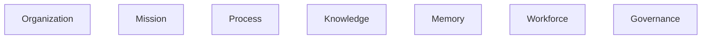
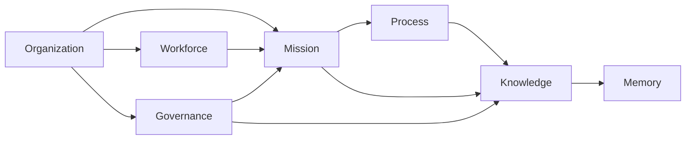
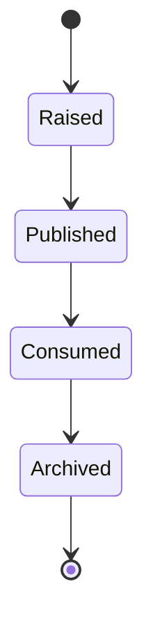
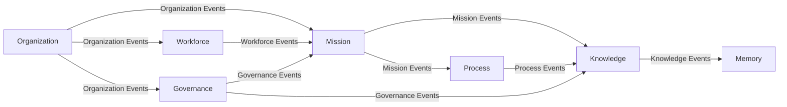
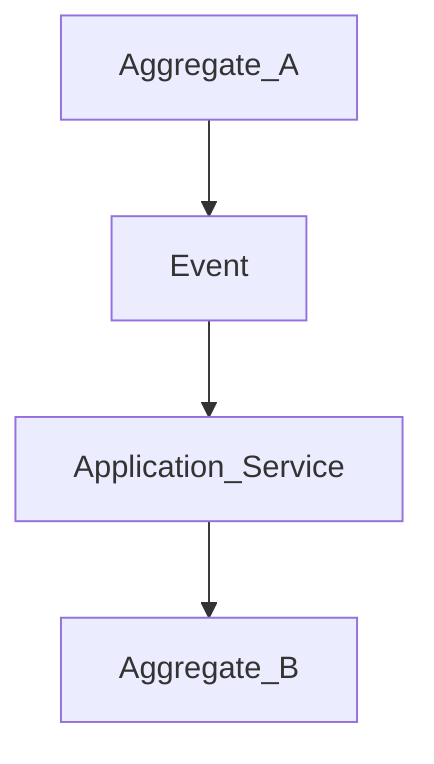
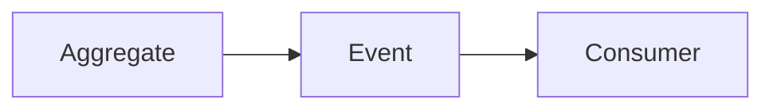
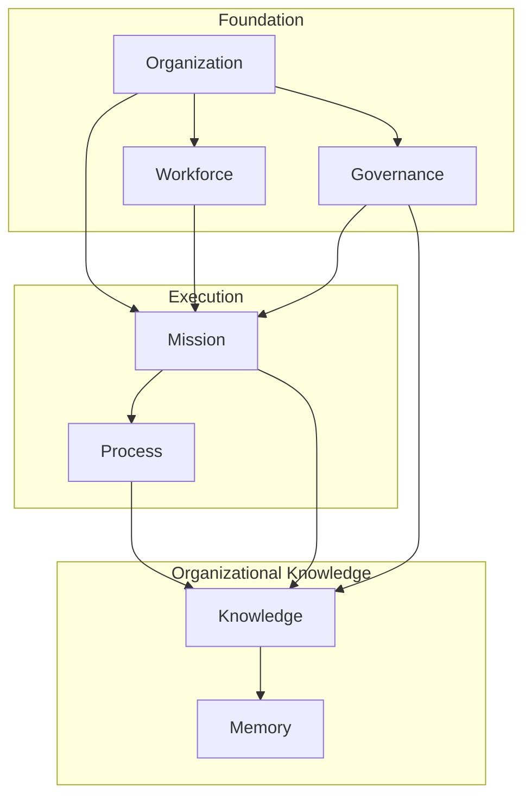

# ForgeOS Architecture — Domain Event Model

**Document ID:** ARCH-DOM-0003

**Title:** Domain Event Model

**Status:** Approved

**Version:** 1.0.0

**Derived From**

- TDS-0002 — Domain Model

**Related Documents**

- ARCH-0002 — Component Model
- ARCH-0003 — Architecture Enforcement Specification
- ARCH-DOM-0001 — Domain Model
- ARCH-DOM-0002 — Aggregate Boundaries

---

# Purpose

This document provides the **Event Interaction View** of the ForgeOS Domain Model.

It visualizes how approved domain events communicate completed business facts between bounded contexts.

This document introduces no new events, business rules, or ownership.

The authoritative definition of all domain events remains **TDS-0002**.

---

# Scope

This view illustrates:

- event ownership;
- event publication;
- event consumption;
- event interaction;
- event flow.

Event payloads, event versioning policies, and business semantics remain defined by TDS-0002 and future implementation.

---

# Architectural Traceability

| Architectural View | Authoritative Source |
|--------------------|----------------------|
| Published Events | TDS-0002 |
| Consumed Events | TDS-0002 |
| Aggregate Ownership | TDS-0002 |
| Bounded Contexts | TDS-0002 |
| Enforcement Rules | ARCH-0003 |

---

# Event Ownership Model

Every domain event has exactly one architectural owner.

Ownership follows aggregate ownership.

Each bounded context publishes only the events it owns.

Other contexts consume events without acquiring ownership.

---

# Event Publication Responsibilities

| Bounded Context | Representative Published Events |
|-----------------|---------------------------------|
| Organization | OrganizationCreated, OrganizationUpdated, CapabilityRegistered |
| Mission | MissionCreated, MissionStarted, MissionCompleted |
| Process | ProcessDefined, ProcessStarted, ProcessCompleted |
| Knowledge | KnowledgeCreated, KnowledgePromoted, BlueprintPublished |
| Memory | MemoryRecorded, MemoryInstitutionalized, TimelineRebuilt |
| Workforce | ProfessionalRegistered, CapabilityAssigned, CompetencyEvaluated |
| Governance | DecisionApproved, PolicyPublished, AuthorityDelegated |

This table summarizes events already defined by **TDS-0002**.

---

# Event Communication Principles

Domain events represent **completed business facts**.

They shall:

- be immutable;
- originate from one bounded context;
- describe completed business outcomes;
- preserve architectural ownership.

Events shall not:

- transfer aggregate ownership;
- expose persistence details;
- initiate direct aggregate mutation.

---

# Conceptual Event Flow

The following diagram illustrates the conceptual direction of event propagation.

The arrows indicate event propagation only.

They do not imply synchronous invocation or direct repository access.

---

# Event Lifecycle

Every domain event follows the same conceptual lifecycle.

Implementation mechanisms are outside the scope of this document.

---

# Event Architectural Invariants

The following invariants are illustrated by this view.

- Every event has one architectural owner.
- Events are immutable.
- Events represent completed business facts.
- Event publication originates from aggregate ownership.
- Event consumption does not imply ownership transfer.

These invariants originate from **TDS-0002** and are enforced by **ARCH-0003**.

*End of Part 1.*

# Event Interaction View

This section illustrates how domain events coordinate bounded contexts while preserving the ownership and consistency boundaries defined by **TDS-0002**.

The diagrams in this section represent conceptual event flow.

They do not prescribe messaging technology, transport mechanisms, or runtime infrastructure.

---

# Event Interaction Model

Domain events propagate completed business facts between bounded contexts.

Event flow is directional.

Architectural ownership remains with the publishing bounded context.

---

# Event Communication Rules

The following communication mechanisms are approved.

- publish domain event;
- consume domain event;
- correlate using immutable identifiers;
- coordinate using Application Services.

The following mechanisms are prohibited.

- direct aggregate mutation through events;
- repository access initiated by an event;
- ownership transfer through event payloads;
- event-driven modification of foreign aggregates.

These rules preserve bounded context isolation.

---

# Event Coordination

Business workflows involving multiple bounded contexts are coordinated by the Application Layer.

The Application Layer coordinates responses to events without altering aggregate ownership.

---

# Event Responsibilities

Each bounded context is responsible for:

- raising its own domain events;
- validating event publication;
- preserving event immutability;
- documenting published events.

Each consuming context is responsible for:

- interpreting received events;
- maintaining local consistency;
- updating derived state where appropriate.

No consuming context acquires ownership of the originating business fact.

---

# Event Isolation

Event isolation preserves architectural independence.

The event acts as the approved communication contract.

The publisher and consumer remain independently implementable.

---

# Event Consistency

Event publication occurs after the originating aggregate has successfully enforced its business invariants.

The originating aggregate remains the authoritative source of the business fact.

Consumers shall treat received events as immutable historical facts.

---

# Event Interaction Summary

| Concern | Architectural Responsibility |
|----------|------------------------------|
| Event Creation | Publishing Aggregate |
| Event Ownership | Publishing Bounded Context |
| Event Publication | Publishing Aggregate |
| Event Consumption | Consuming Bounded Context |
| Cross-Context Coordination | Application Layer |
| Event Enforcement | ARCH-0003 |

This separation preserves architectural ownership while enabling organizational collaboration.

---

# Relationship to Aggregate Boundaries

Domain events do not replace aggregate boundaries.

Instead they enable communication **between** independently consistent aggregates.

Aggregate consistency remains local.

Organizational consistency is achieved through coordinated event processing and application orchestration.

---

# Architectural Traceability

The event interaction model illustrated here derives directly from:

- TDS-0002 — Domain Model
- ARCH-0002 — Component Model
- ARCH-0003 — Architecture Enforcement Specification

This document introduces no additional architectural behavior.

*End of Part 2.*

# Event Topology

This section presents the domain event model from an implementation perspective.

It summarizes event ownership, event propagation, and coordination responsibilities while preserving the architectural rules defined by **TDS-0002**.

The topology shown below is conceptual.

It does not prescribe runtime messaging infrastructure.

---

# Domain Event Topology

The topology visualizes conceptual event flow only.

Architectural ownership remains unchanged.

---

# Event Ownership Matrix

| Publishing Context | Representative Events | Consuming Contexts |
|--------------------|----------------------|--------------------|
| Organization | OrganizationCreated, OrganizationUpdated, CapabilityRegistered | Mission, Workforce, Governance |
| Mission | MissionCreated, MissionStarted, MissionCompleted | Process, Knowledge |
| Process | ProcessDefined, ProcessCompleted | Knowledge |
| Knowledge | KnowledgeCreated, KnowledgePromoted, BlueprintPublished | Memory |
| Memory | MemoryRecorded, MemoryInstitutionalized | Governance (where applicable) |
| Workforce | ProfessionalRegistered, CapabilityAssigned, CompetencyEvaluated | Mission |
| Governance | DecisionApproved, PolicyPublished, AuthorityDelegated | Mission, Knowledge |

This table summarizes event relationships already defined by **TDS-0002**.

---

# Implementation Guidance

Implementation teams should use this view to:

- identify the publishing bounded context for each event;
- determine the intended consumers;
- preserve event immutability;
- maintain event ownership;
- coordinate event-driven workflows through the Application Layer.

Event transport, serialization, persistence, and messaging infrastructure remain implementation concerns governed by future implementation work and applicable Technology Decision Records.

---

# Relationship to Other Architectural Views

This document focuses exclusively on event interactions.

Related implementation views include:

| Document | Architectural View |
|----------|--------------------|
| Domain Model | Bounded Context View |
| Aggregate Boundaries | Consistency Boundary View |
| Domain Event Model | Event Interaction View |
| Entity Relationships | Structural Relationship View |
| Persistence Model | Persistence Ownership View |

Together these documents provide complementary implementation perspectives while preserving **TDS-0002** as the sole authoritative business specification.

---

# Architectural Traceability

All information presented in this document is derived from approved architectural artifacts.

| Concern | Authoritative Source |
|----------|----------------------|
| Event Definitions | TDS-0002 |
| Event Ownership | TDS-0002 |
| Aggregate Ownership | TDS-0002 |
| Bounded Contexts | TDS-0002 |
| Architectural Enforcement | ARCH-0003 |

This document introduces no new business rules or architectural ownership.

---

# Usage During Implementation

Implementation teams should reference this document when:

- implementing domain event publication;
- implementing event consumers;
- validating event ownership;
- coordinating cross-context workflows;
- reviewing event-driven interactions.

Business semantics and event definitions shall always be obtained from **TDS-0002**.

---

# Codex Readiness

## Implementation Status

**Ready for implementation of the ForgeOS domain event model.**

Using this document together with **TDS-0002**, a Senior Software Engineer can:

- implement domain event publication;
- implement event consumers;
- preserve event ownership;
- coordinate cross-context event flows;
- maintain event isolation;
- enforce event immutability.

No additional architectural decisions are required to implement the approved event model.

---

# Architectural Authority

This document is a derived architectural view.

It shall not be used to introduce or modify:

- domain events;
- event ownership;
- business semantics;
- aggregate responsibilities;
- orchestration rules.

Any such changes shall first be made in **TDS-0002** and then reflected in this document.

---

# Document Completion

This document is complete.

It provides the implementation-oriented **Event Interaction View** of the ForgeOS Domain Model and serves as the architectural reference for implementing event publication, event consumption, and cross-context collaboration.