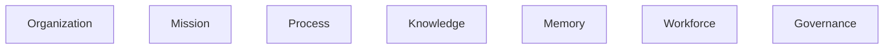
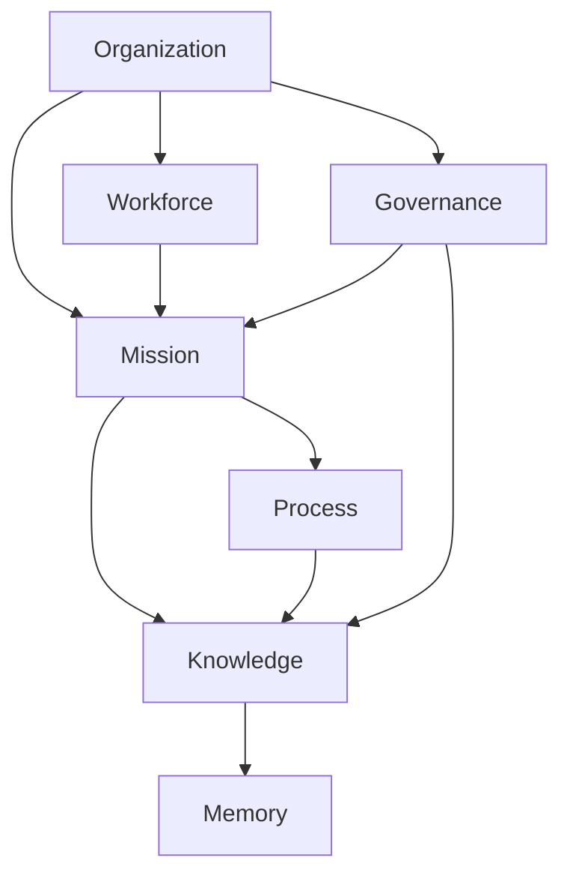
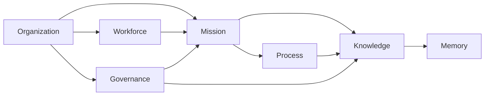
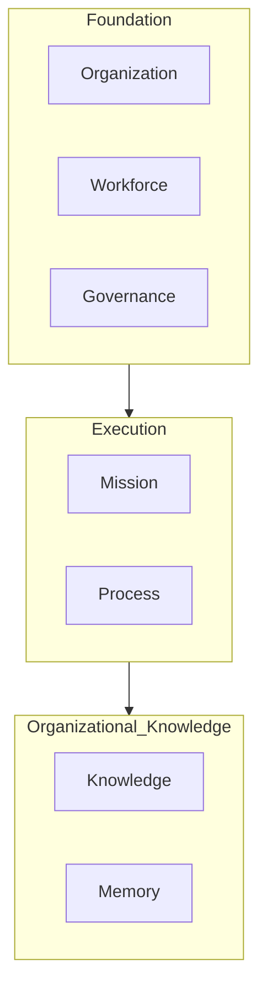
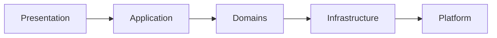

# ForgeOS Architecture — Domain Model

**Document ID:** ARCH-DOM-0001

**Title:** Domain Model

**Status:** Approved

**Version:** 1.0.0

**Derived From**

- TDS-0002 — Domain Model

**Related Documents**

- ARCH-0002 — Component Model
- ARCH-0003 — Architecture Enforcement Specification
- ARCH-0004 — Workspace Specification

---

# Purpose

This document provides the architectural **Bounded Context View** of the ForgeOS Domain Model.

It visualizes the approved domain decomposition defined by **TDS-0002** to support implementation.

This document does not define new business rules, aggregates, entities, repositories, or events.

The authoritative specification remains **TDS-0002**.

---

# Scope

This view provides:

- bounded context decomposition;
- context responsibilities;
- conceptual dependencies;
- implementation responsibilities;
- context interaction diagrams.

Detailed aggregate definitions remain in TDS-0002.

---

# Architectural Traceability

| Architectural View | Authoritative Source |
|--------------------|----------------------|
| Bounded Contexts | TDS-0002 |
| Aggregate Definitions | TDS-0002 |
| Repository Contracts | TDS-0002 |
| Domain Events | TDS-0002 |
| Persistence Ownership | TDS-0002 |

This document introduces no additional architectural authority.

---

# Domain Decomposition

ForgeOS is composed of seven bounded contexts.



Each bounded context represents one business capability.

Each bounded context has one architectural owner.

---

# Context Responsibilities

| Context | Primary Responsibility |
|----------|------------------------|
| Organization | Organizational identity |
| Mission | Organizational execution |
| Process | Workflow execution |
| Knowledge | Organizational knowledge |
| Memory | Institutional memory |
| Workforce | Organizational capability |
| Governance | Organizational authority |

Responsibility ownership is defined by TDS-0002.

---

# Context Map

The approved conceptual relationship between contexts is illustrated below.



This diagram illustrates conceptual collaboration only.

Implementation dependencies remain governed by ARCH-0002 and ARCH-0003.

---

# Architectural Responsibilities

Each bounded context is responsible for:

- protecting its aggregate invariants;
- owning its aggregate roots;
- owning its repository interfaces;
- publishing domain events;
- consuming external events through approved contracts.

No bounded context owns another bounded context.

---

# Context Isolation

Every bounded context is isolated.

Isolation is achieved through:

- aggregate boundaries;
- repository ownership;
- immutable identifiers;
- published domain events;
- application-layer orchestration.

Direct mutation of foreign aggregates is prohibited.

---

# Business Capability Model

The domain model can be viewed as three conceptual capability groups.

```mermaid
graph LR

subgraph Foundation

Organization

Governance

Workforce

end

subgraph Execution

Mission

Process

end

subgraph Knowledge

Knowledge

Memory

end
```

These groups are conceptual views.

They do not define implementation layers or dependencies.

---

# Relationship to Implementation Domains

Each bounded context maps directly to one Implementation Domain defined by ARCH-0002.

| Bounded Context | Implementation Domain |
|-----------------|-----------------------|
| Organization | Organization Domain |
| Mission | Mission Domain |
| Process | Process Domain |
| Knowledge | Knowledge Domain |
| Memory | Memory Domain |
| Workforce | Workforce Domain |
| Governance | Governance Domain |

This mapping is one-to-one.

---

# Architectural Invariants

The following invariants are visualized by this view.

- Every bounded context has one architectural owner.
- Business capability ownership is exclusive.
- Contexts communicate through approved contracts.
- Aggregate ownership does not cross context boundaries.
- Context decomposition remains stable.

These invariants originate from TDS-0002.

*End of Part 1.*

# Context Collaboration View

This section visualizes how the bounded contexts collaborate while preserving the ownership and consistency rules defined in **TDS-0002**.

The diagrams in this section illustrate conceptual collaboration only.

They do not redefine implementation dependencies, repository ownership, or aggregate ownership.

---

# Primary Collaboration Paths

The principal business collaborations between bounded contexts are shown below.



Arrows indicate conceptual collaboration and information flow.

They do not imply direct repository access or aggregate mutation.

---

# Context Independence

Every bounded context remains independently implementable.

Each context owns:

- aggregate roots;
- entities;
- value objects;
- repository interfaces;
- business invariants;
- published domain events.

Implementation independence is preserved even when collaboration exists.

---

# Context Communication

Communication between bounded contexts follows the architectural contracts established in **ARCH-0003**.

Permitted interaction mechanisms are:

- immutable identifiers;
- published domain events;
- application-service orchestration;
- repository interfaces owned by the originating context.

Direct aggregate access is prohibited.

---

# Responsibility Matrix

| Bounded Context | Owns Business Rules | Owns Aggregates | Publishes Events | Consumes Events |
|-----------------|:-------------------:|:---------------:|:----------------:|:---------------:|
| Organization | ✓ | ✓ | ✓ | ✓ |
| Mission | ✓ | ✓ | ✓ | ✓ |
| Process | ✓ | ✓ | ✓ | ✓ |
| Knowledge | ✓ | ✓ | ✓ | ✓ |
| Memory | ✓ | ✓ | ✓ | ✓ |
| Workforce | ✓ | ✓ | ✓ | ✓ |
| Governance | ✓ | ✓ | ✓ | ✓ |

This matrix summarizes responsibilities already defined in TDS-0002.

---

# Domain Topology

Viewed architecturally, the bounded contexts form three cooperating capability areas.



This topology is intended to help engineers understand the organization of the business model.

It does not introduce implementation layering.

---

# Context Evolution

The bounded context model is expected to remain stable throughout the ForgeOS MVP.

Future business capabilities should normally be incorporated into an existing bounded context.

Introducing a new bounded context requires architectural review because it changes the approved business decomposition defined in TDS-0002.

---

# Traceability Matrix

| Architectural View | Traceability |
|--------------------|--------------|
| Organization Context | TDS-0002 |
| Mission Context | TDS-0002 |
| Process Context | TDS-0002 |
| Knowledge Context | TDS-0002 |
| Memory Context | TDS-0002 |
| Workforce Context | TDS-0002 |
| Governance Context | TDS-0002 |

This view is intentionally non-authoritative.

Its purpose is to improve implementation comprehension.

*End of Part 2.*

# Implementation Guidance

This architectural view supports implementation by presenting the approved domain decomposition in a form that is directly translatable into implementation domains.

Implementation shall derive business behavior exclusively from **TDS-0002**.

This document provides architectural orientation only.

---

# Implementation Mapping

Each bounded context is implemented as one architectural implementation domain.

The implementation mapping is fixed for the ForgeOS MVP.

| Bounded Context | Implementation Domain | Architectural Owner |
|-----------------|-----------------------|---------------------|
| Organization | Organization Domain | Organization Domain |
| Mission | Mission Domain | Mission Domain |
| Process | Process Domain | Process Domain |
| Knowledge | Knowledge Domain | Knowledge Domain |
| Memory | Memory Domain | Memory Domain |
| Workforce | Workforce Domain | Workforce Domain |
| Governance | Governance Domain | Governance Domain |

This mapping preserves the ownership model established by ARCH-0002.

---

# Implementation Responsibilities

During implementation, each bounded context is expected to provide:

- one or more aggregate roots;
- domain entities;
- immutable value objects;
- repository interfaces;
- domain services where appropriate;
- published domain events;
- business invariants.

The detailed definitions remain the responsibility of TDS-0002.

---

# Architectural Boundaries

The implementation shall preserve the following boundaries.



The domain model occupies the **Domains** layer only.

Application orchestration, infrastructure implementations, and presentation behavior remain outside the scope of this document.

---

# Architectural Traceability

Every element shown in this architectural view is traceable to the authoritative specification.

| This View | Authoritative Source |
|------------|----------------------|
| Context decomposition | TDS-0002 |
| Context responsibilities | TDS-0002 |
| Aggregate ownership | TDS-0002 |
| Repository ownership | TDS-0002 |
| Domain event ownership | TDS-0002 |
| Architectural ownership | ARCH-0002 |

No information in this document supersedes its authoritative source.

---

# Relationship to Other Architectural Views

This document provides the highest-level implementation view of the ForgeOS business model.

The remaining derived architectural views provide progressively more focused perspectives.

| Document | Primary View |
|----------|--------------|
| Domain Model | Bounded Context View |
| Aggregate Boundaries | Consistency Boundary View |
| Domain Event Model | Event Flow View |
| Entity Relationships | Structural Relationship View |
| Persistence Model | Persistence Ownership View |

Together, these documents improve implementation clarity without redefining the approved domain model.

---

# Usage During Implementation

Implementation teams should use this document to:

- understand the business decomposition;
- identify the correct implementation domain;
- understand conceptual collaboration;
- navigate the architecture package.

Business rules, aggregate behavior, and repository contracts shall always be obtained from TDS-0002.

---

# Codex Readiness

## Implementation Status

**Ready for implementation of bounded contexts.**

Using this document together with **TDS-0002**, a Senior Software Engineer can:

- identify every bounded context;
- understand its primary responsibility;
- locate its architectural owner;
- determine conceptual collaboration paths;
- map implementation work to the correct domain.

No additional architectural decisions are required to understand the bounded context structure.

---

# Architectural Authority

This document is a derived architectural view.

It shall not be used to introduce or modify:

- business rules;
- aggregate definitions;
- repository contracts;
- domain events;
- architectural ownership.

Any such changes shall be made in **TDS-0002** and then reflected here.

---

# Document Completion

This document is complete.

It provides the implementation-oriented **Bounded Context View** of the ForgeOS Domain Model and serves as the architectural entry point for understanding the business decomposition of ForgeOS.