# ForgeOS Architecture — Entity Relationships

**Document ID:** ARCH-DOM-0004

**Title:** Entity Relationships

**Status:** Approved

**Version:** 1.0.0

**Derived From**

- TDS-0002 — Domain Model

**Related Documents**

- ARCH-DOM-0001 — Domain Model
- ARCH-DOM-0002 — Aggregate Boundaries
- ARCH-0002 — Component Model
- ARCH-0003 — Architecture Enforcement Specification

---

# Purpose

This document provides the **Structural Relationship View** of the ForgeOS Domain Model.

It visualizes the structural organization of aggregate roots, entities, and value objects that have already been defined in **TDS-0002**.

This document introduces no new entities, aggregates, relationships, or business rules.

The authoritative source remains **TDS-0002**.

---

# Scope

This view illustrates:

- aggregate composition;
- entity ownership;
- value object placement;
- structural relationships;
- ownership boundaries.

Behavior, lifecycle, repository contracts, and business invariants remain defined by **TDS-0002**.

---

# Architectural Traceability

| Structural View | Authoritative Source |
|-----------------|----------------------|
| Aggregate Roots | TDS-0002 |
| Internal Entities | TDS-0002 |
| Value Objects | TDS-0002 |
| Ownership Rules | TDS-0002 |
| Architectural Ownership | ARCH-0002 |

---

# Structural Modeling Principles

This document visualizes the following approved architectural principles.

- Every entity belongs to exactly one aggregate.
- Every value object belongs to one bounded context.
- Internal entities are not externally accessible.
- Relationships across bounded contexts use identifiers rather than object references.
- Structural ownership follows aggregate ownership.

These principles originate from **TDS-0002**.

---

# Aggregate Composition Overview

Each bounded context owns one aggregate root.

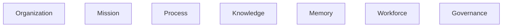

Each aggregate encapsulates all internal entities required to preserve its business invariants.

---

# Structural Ownership Model

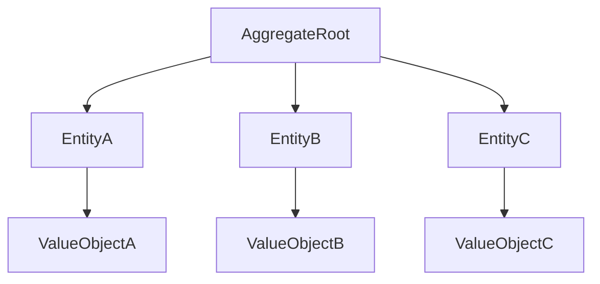

This pattern is representative of every aggregate defined by **TDS-0002**.

Internal entities remain private to the aggregate.

---

# Organization Aggregate Structure

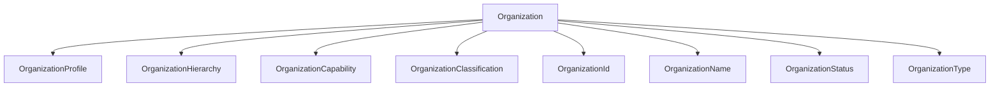

This diagram summarizes the Organization aggregate composition already defined in **TDS-0002**.

---

# Mission Aggregate Structure

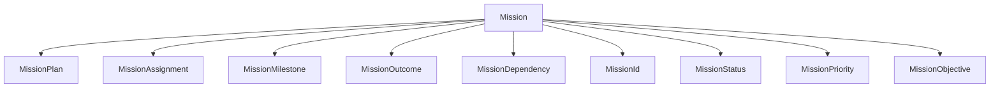

The Mission aggregate owns all planning and execution entities within its consistency boundary.

---

# Structural Ownership Rules

The diagrams above illustrate the following ownership rules.

- Aggregate roots own entities.
- Entities do not own aggregates.
- Value objects are immutable.
- Entities are not shared across aggregates.
- Aggregate composition defines implementation ownership.

Ownership semantics remain defined by **TDS-0002**.

*End of Part 1.*

# Process Aggregate Structure

The Process aggregate encapsulates all workflow-related entities within a single consistency boundary.

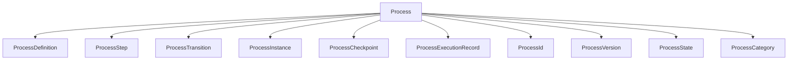

The Process aggregate owns every structural element required to define, execute, and version organizational workflows.

Ownership remains exclusive.

---

# Knowledge Aggregate Structure

The Knowledge aggregate encapsulates validated organizational knowledge.

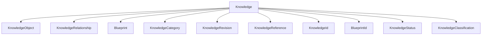

Knowledge relationships remain internal to the aggregate.

Cross-context communication occurs through domain events rather than structural references.

---

# Memory Aggregate Structure

The Memory aggregate preserves institutional history.

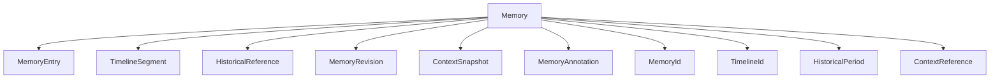

Historical records remain structurally independent from operational entities.

---

# Workforce Aggregate Structure

The Workforce aggregate owns organizational capability.

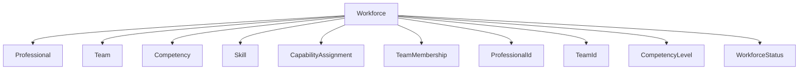

Professional capability remains entirely contained within the Workforce aggregate.

---

# Governance Aggregate Structure

The Governance aggregate owns organizational authority.

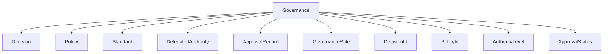

Governance entities remain structurally isolated from operational business entities.

---

# Aggregate Composition Summary

| Aggregate | Internal Entities | Value Objects |
|-----------|-------------------|---------------|
| Organization | ✓ | ✓ |
| Mission | ✓ | ✓ |
| Process | ✓ | ✓ |
| Knowledge | ✓ | ✓ |
| Memory | ✓ | ✓ |
| Workforce | ✓ | ✓ |
| Governance | ✓ | ✓ |

Every aggregate follows the same structural pattern:

- one aggregate root;
- multiple internal entities;
- immutable value objects.

This uniformity simplifies implementation while preserving business boundaries.

---

# Structural Isolation

Aggregate composition preserves architectural isolation.

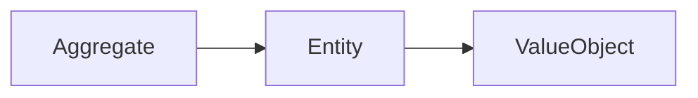

No entity is shared between aggregates.

No value object crosses aggregate ownership without explicit copying or reconstruction.

---

# Relationship Principles

The structures shown in this document illustrate the following approved principles.

- Aggregate roots encapsulate all mutable state.
- Entities exist only within their owning aggregate.
- Value objects remain immutable.
- Structural ownership follows aggregate ownership.
- Cross-context relationships use identifiers rather than shared entities.

These principles originate from **TDS-0002** and are enforced through **ARCH-0003**.

*End of Part 2.*

# Cross-Aggregate Structural Relationships

This section illustrates how aggregates relate structurally while preserving the ownership model defined by **TDS-0002**.

Cross-aggregate relationships are conceptual.

They do not imply object ownership, shared entity graphs, or direct persistence relationships.

---

# Structural Relationship Topology

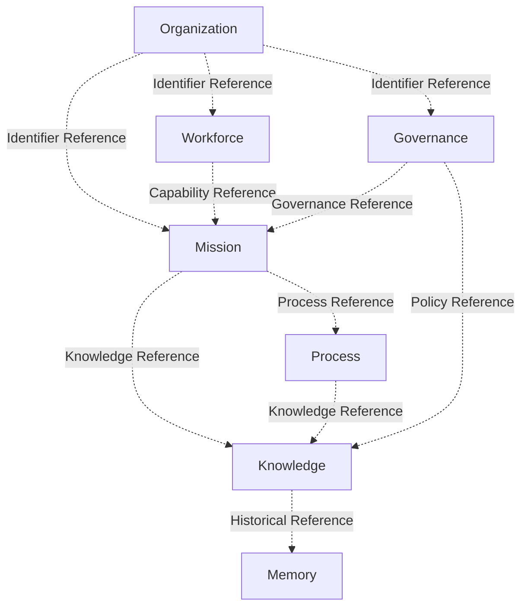

Relationships between aggregates are expressed through immutable identifiers and approved architectural contracts.

No aggregate owns another aggregate.

---

# Structural Ownership Summary

The following ownership hierarchy applies throughout the Domain Model.

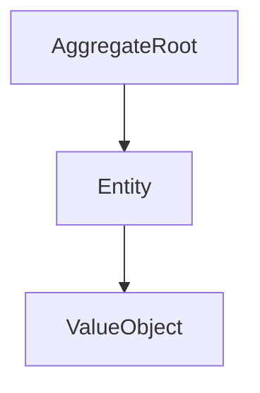

Ownership flows downward only.

Reverse ownership is prohibited.

Cross-aggregate ownership is prohibited.

---

# Implementation Guidance

Implementation teams should apply the following structural rules.

## Aggregate Root

Responsible for:

- enforcing invariants;
- coordinating internal entities;
- publishing domain events;
- exposing repository operations.

---

## Internal Entities

Responsible for:

- representing mutable business concepts;
- supporting aggregate behavior;
- remaining inaccessible outside the aggregate boundary.

---

## Value Objects

Responsible for:

- representing immutable business concepts;
- expressing business meaning through value;
- remaining persistence-agnostic.

---

## Cross-Aggregate References

Cross-aggregate relationships shall:

- reference immutable identifiers;
- avoid direct entity references;
- preserve aggregate isolation;
- maintain ownership boundaries.

---

# Structural Traceability

Every structural relationship illustrated in this document originates from the authoritative Domain Model.

| Structural Concern | Authoritative Source |
|--------------------|----------------------|
| Aggregate Composition | TDS-0002 |
| Entity Ownership | TDS-0002 |
| Value Object Placement | TDS-0002 |
| Aggregate Ownership | TDS-0002 |
| Architectural Ownership | ARCH-0002 |

This document introduces no new structural relationships.

---

# Relationship to Other Architectural Views

This document complements the remaining architectural views.

| Document | Primary Perspective |
|----------|---------------------|
| Domain Model | Business decomposition |
| Aggregate Boundaries | Consistency boundaries |
| Domain Event Model | Information flow |
| Entity Relationships | Structural ownership |
| Persistence Model | Persistence ownership |

Each document presents one implementation perspective while preserving **TDS-0002** as the authoritative specification.

---

# Usage During Implementation

Implementation teams should reference this document when:

- creating aggregate structures;
- implementing entity ownership;
- defining value objects;
- reviewing aggregate composition;
- validating structural isolation.

Business behavior, lifecycle rules, and repository contracts remain defined by **TDS-0002**.

---

# Codex Readiness

## Implementation Status

**Ready for implementation of aggregate structures, entities, and value objects.**

Using this document together with **TDS-0002**, a Senior Software Engineer can:

- implement aggregate composition;
- define internal entities;
- implement immutable value objects;
- preserve ownership boundaries;
- avoid cross-aggregate structural coupling.

No additional architectural decisions are required to implement the approved structural model.

---

# Architectural Authority

This document is a derived architectural view.

It shall not be used to introduce or modify:

- aggregate composition;
- entities;
- value objects;
- ownership rules;
- structural relationships.

Changes to the structural model shall first be made in **TDS-0002** and subsequently reflected in this document.

---

# Document Completion

This document is complete.

It provides the implementation-oriented **Structural Relationship View** of the ForgeOS Domain Model and serves as the architectural reference for implementing aggregate composition, entity ownership, and value object placement.