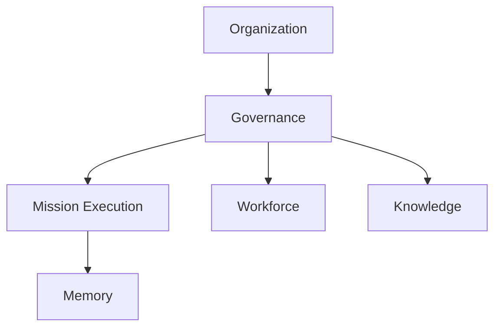
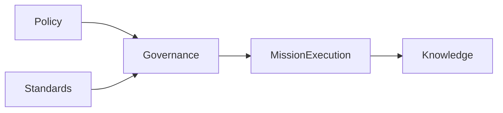
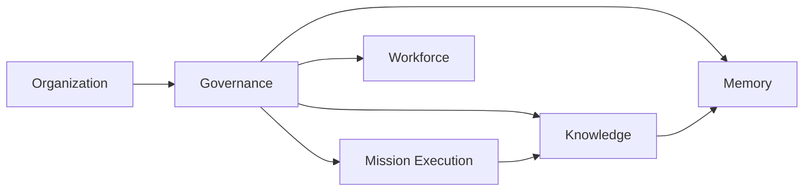
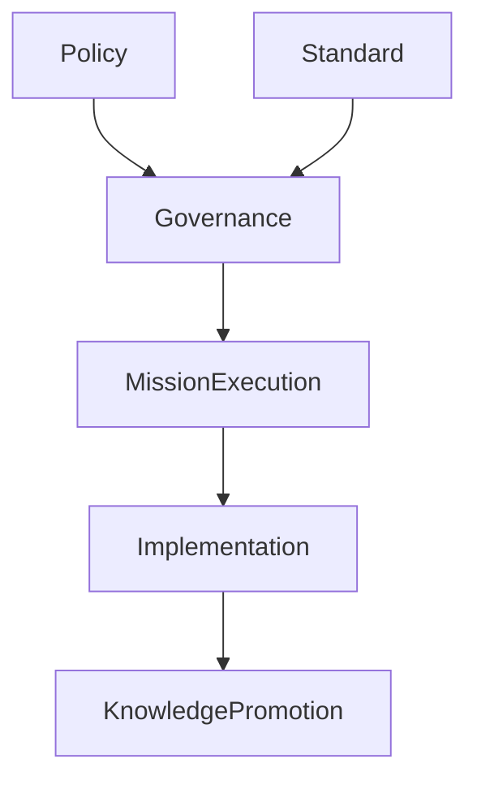
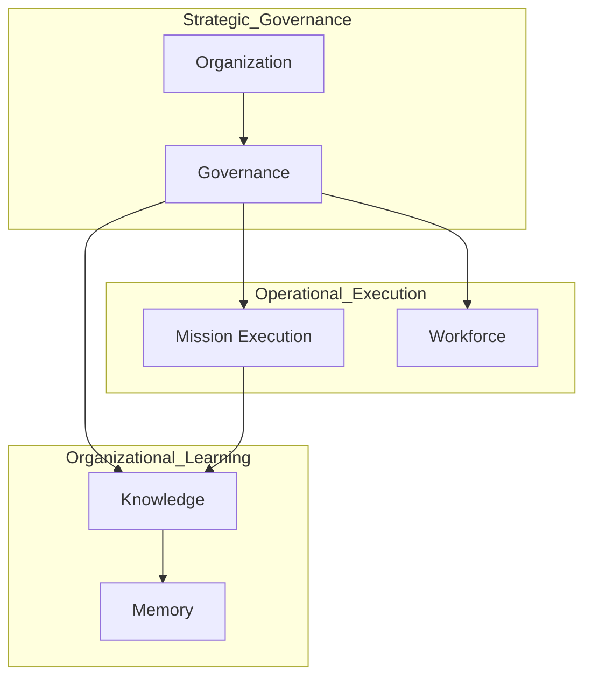

# ForgeOS Architecture — Governance Model

**Document ID:** ARCH-ORG-0003

**Title:** Governance Model

**Status:** Approved

**Version:** 1.0.0

**Derived From**

- TDS-0003 — Organization Model

**Related Documents**

- ARCH-ORG-0001 — Organization Model
- ARCH-ORG-0002 — Authority Model
- ARCH-0003 — Architecture Enforcement Specification

---

# Purpose

This document provides the **Governance View** of the ForgeOS Organization Model.

It visualizes the governance responsibilities, governance relationships, policy flow, and organizational oversight defined by **TDS-0003**.

This document introduces no new governance policies, organizational authority, delegation semantics, ownership rules, or organizational responsibilities.

The authoritative organizational specification remains **TDS-0003**.

---

# Scope

This view illustrates:

- governance responsibilities;
- governance relationships;
- governance oversight;
- policy flow;
- implementation governance mapping.

Governance policy, approval authority, delegation, and organizational ownership remain defined exclusively by **TDS-0003**.

---

# Architectural Traceability

| Governance Concern | Authoritative Source |
|--------------------|----------------------|
| Governance Responsibilities | TDS-0003 |
| Organizational Authority | TDS-0003 |
| Organizational Policies | TDS-0003 |
| Organizational Standards | TDS-0003 |
| Organizational Invariants | TDS-0003 |

This document is a derived implementation view only.

---

# Governance Topology

The Governance Unit provides organizational oversight while remaining operationally independent.

The topology illustrates governance relationships.

It does not imply implementation dependencies.

---

# Governance Responsibilities

The Governance Unit owns the following organizational responsibilities.

| Responsibility | Purpose |
|----------------|---------|
| Policy Stewardship | Maintain organizational policies |
| Standards Stewardship | Maintain engineering and organizational standards |
| Architectural Compliance | Verify conformance with approved architecture |
| Decision Approval | Approve governed organizational decisions |
| Authority Management | Maintain explicit authority relationships |
| Organizational Integrity | Preserve organizational consistency |

These responsibilities originate from **TDS-0003**.

---

# Governance Oversight Model

Governance provides organizational constraints rather than operational execution.

Governance defines constraints.

Execution operates within those constraints.

---

# Governance Allocation

Governance authority remains concentrated within the Governance Unit.

| Organizational Unit | Governance Responsibility |
|----------------------|---------------------------|
| Organization | Strategic governance sponsorship |
| Governance | Governance ownership |
| Mission Execution | Governance compliance |
| Workforce | Governance compliance |
| Knowledge | Governance-controlled promotion |
| Memory | Governance-controlled preservation |

Responsibility ownership remains unchanged.

---

# Governance Principles

The Governance View illustrates the following approved principles.

- Governance constrains execution.
- Governance ownership remains singular.
- Governance authority is explicit.
- Governance remains traceable.
- Governance is implementation-independent.

These principles remain authoritative in **TDS-0003**.

---

# Organizational Integrity

Governance maintains organizational integrity by preserving:

- organizational ownership;
- authority relationships;
- policy compliance;
- architectural consistency;
- accountability.

The mechanisms for preserving integrity remain defined by **TDS-0003**.

*End of Part 1.*

# Governance Interaction View

This section visualizes how governance interacts with Organizational Units while preserving the authority, ownership, and organizational responsibilities defined by **TDS-0003**.

The diagrams in this section illustrate governance relationships only.

They do not introduce new governance policies, approval mechanisms, or organizational authority.

---

# Governance Interaction Model

Governance provides organizational oversight across the permanent Organizational Units.

Governance supervises organizational execution.

Execution remains operationally independent.

---

# Organizational Compliance Flow

The approved organizational compliance relationship is illustrated below.

Governance establishes organizational constraints.

Operational execution proceeds within those constraints.

---

# Governance Coordination

Governance coordinates organizational integrity through approved organizational relationships.

| Organizational Unit | Governance Relationship | Organizational Purpose |
|----------------------|--------------------------|------------------------|
| Organization | Strategic governance sponsorship | Organizational direction |
| Mission Execution | Governance compliance | Mission integrity |
| Workforce | Capability governance | Competency integrity |
| Knowledge | Knowledge approval | Organizational learning |
| Memory | Historical preservation oversight | Organizational traceability |

The coordination model derives directly from **TDS-0003**.

---

# Governance During Implementation

Implementation shall preserve the following governance responsibilities.

| Concern | Organizational Responsibility |
|----------|-------------------------------|
| Policy Publication | Governance |
| Standards Publication | Governance |
| Architectural Compliance | Governance |
| Organizational Approval | Governance |
| Mission Execution | Mission Execution Unit |
| Capability Management | Workforce Unit |
| Knowledge Stewardship | Knowledge Unit |
| Historical Preservation | Memory Unit |

Implementation shall not redistribute governance authority.

---

# Governance Stability

Implementation may evolve execution processes.

Implementation shall preserve:

- governance ownership;
- governance authority;
- organizational compliance;
- policy stewardship;
- standards stewardship.

These governance characteristics remain stable throughout the ForgeOS MVP.

---

# Relationship to Organizational Topology

The Organization Model defines **organizational structure**.

The Governance Model illustrates **organizational oversight**.

The Authority Model illustrates **decision authority**.

Together these architectural views provide complementary implementation guidance without extending **TDS-0003**.

---

# Architectural Traceability

Every governance interaction shown in this document derives directly from:

- TDS-0003 — Organization Model

This document introduces no additional governance semantics.

*End of Part 2.*

# Implementation Guidance

This document provides the implementation-oriented **Governance View** of the ForgeOS Organization Model.

Implementation teams should use this view to understand how governance constrains execution, preserves organizational integrity, and allocates governance responsibilities.

Governance policy, authority, and delegation remain defined exclusively by **TDS-0003**.

---

# Governance Implementation Mapping

The Governance Unit provides implementation oversight for organizational governance concerns.

| Governance Concern | Implementation Responsibility |
|--------------------|-------------------------------|
| Policy Stewardship | Governance services |
| Standards Stewardship | Standards management |
| Architectural Compliance | Compliance verification |
| Decision Approval | Decision workflow implementation |
| Authority Management | Authority validation |
| Organizational Integrity | Organizational consistency verification |

This mapping supports implementation planning only.

It does not redefine governance authority.

---

# Governance Topology During Implementation

Implementation shall preserve the approved governance structure.

The topology illustrates governance relationships.

Software architecture remains defined elsewhere in the Architecture Package.

---

# Governance Boundaries

Implementation shall preserve the following governance boundaries.

- Governance remains organizationally independent.
- Governance approves rather than executes.
- Governance ownership remains singular.
- Organizational compliance remains traceable.
- Governance authority remains explicit.

These boundaries derive directly from **TDS-0003**.

---

# Relationship to Other Organizational Views

This document complements the remaining organizational architecture views.

| Document | Primary Perspective |
|----------|---------------------|
| Organization Model | Organizational topology |
| Authority Model | Authority allocation |
| Governance Model | Governance oversight |
| Mission Lifecycle | Organizational execution lifecycle |
| Capability Lifecycle | Capability evolution |

Together these views provide implementation clarity while preserving **TDS-0003** as the sole authoritative organizational specification.

---

# Architectural Traceability

Every governance concept visualized by this document originates from approved architectural authority.

| Concern | Authoritative Source |
|----------|----------------------|
| Governance Responsibilities | TDS-0003 |
| Governance Relationships | TDS-0003 |
| Organizational Integrity | TDS-0003 |
| Organizational Invariants | TDS-0003 |
| Architecture Enforcement | ARCH-0003 |

This document introduces no additional governance rules.

---

# Usage During Implementation

Implementation teams should reference this document when:

- implementing governance services;
- implementing approval workflows;
- validating organizational compliance;
- preserving governance boundaries;
- reviewing organizational oversight responsibilities.

Governance policy and organizational authority shall always be obtained from **TDS-0003**.

---

# Codex Readiness

## Implementation Status

**Ready for implementation of the ForgeOS governance model.**

Using this document together with **TDS-0003**, a Senior Software Engineer can:

- implement governance services;
- implement organizational approval workflows;
- preserve governance boundaries;
- validate organizational compliance;
- maintain governance ownership.

No additional architectural decisions are required to implement the approved governance model.

---

# Architectural Authority

This document is a **derived architectural view**.

It is **not** an authoritative source of organizational policy.

This document shall not be used to introduce or modify:

- governance policies;
- governance authority;
- organizational responsibilities;
- delegation semantics;
- ownership rules.

Any changes to those concepts shall first be made in **TDS-0003** and then reflected in this document.

---

# Document Completion

This document is complete.

It provides the implementation-oriented **Governance View** of the ForgeOS Organization Model and serves as the architectural reference for implementing governance services, organizational compliance, and oversight while preserving the approved organizational architecture.