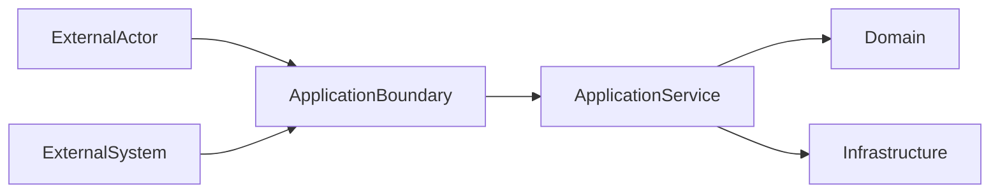
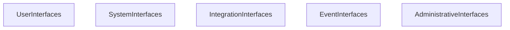
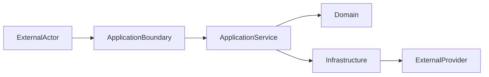
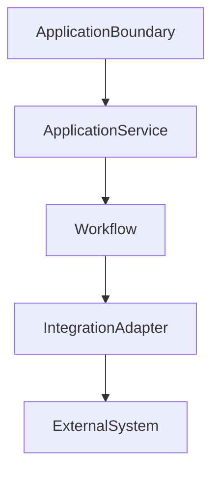
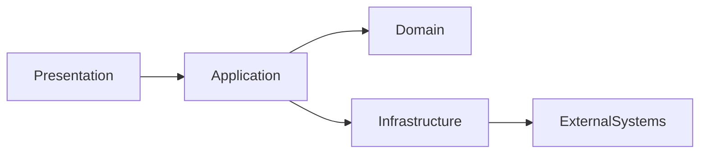
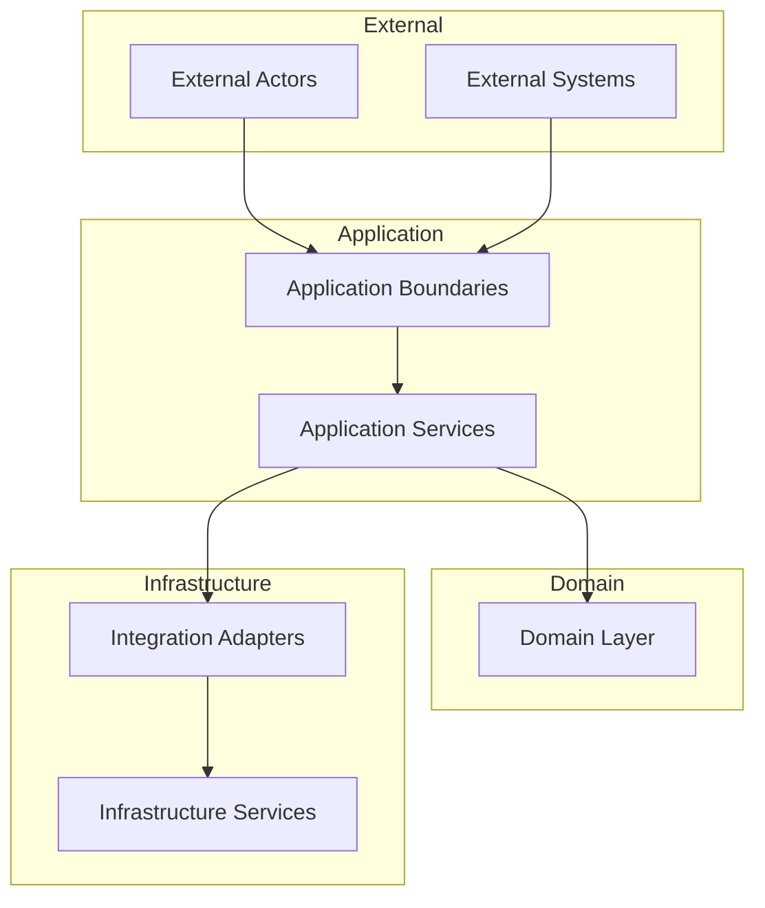

# ForgeOS Architecture — Integration Boundaries

**Document ID:** ARCH-APP-0005

**Title:** Integration Boundaries

**Status:** Approved

**Version:** 1.0.0

**Derived From**

- TDS-0004 — Application Model

**Related Documents**

- ARCH-APP-0001 — Application Model
- ARCH-APP-0002 — Application Services
- ARCH-APP-0003 — Workflow Orchestration
- ARCH-APP-0004 — Command–Query Model

---

# Purpose

This document provides the **Integration Boundary View** of the ForgeOS Application Model.

It visualizes how the Application Layer interacts with external actors and systems through controlled architectural boundaries while preserving domain isolation and orchestration responsibilities defined by **TDS-0004**.

This document introduces **no new architectural decisions**.

Integration behavior remains authoritatively defined by **TDS-0004**.

---

# Scope

This view illustrates:

- application integration boundaries;
- external interaction topology;
- interface responsibilities;
- integration coordination;
- implementation mapping.

Transport protocols, infrastructure technologies, external providers, and implementation mechanisms remain outside the scope of this document.

---

# Architectural Traceability

| Concern | Authoritative Source |
|----------|----------------------|
| Integration Boundaries | TDS-0004 |
| External Interfaces | TDS-0004 |
| Application Contracts | TDS-0004 |
| Application Services | TDS-0004 |
| Domain Isolation | TDS-0004 |

This document is a **derived architectural view** only.

---

# Integration Boundary Topology

All external interaction passes through controlled Application Boundaries.

The topology illustrates architectural responsibility.

It does not prescribe communication technology or deployment architecture.

---

# Integration Responsibilities

Application Boundaries coordinate interaction between ForgeOS and external systems.

| Responsibility | Coordinated By |
|----------------|----------------|
| Request Validation | Application Boundary |
| Use Case Coordination | Application Service |
| External Translation | Application Boundary |
| Response Coordination | Application Boundary |
| Integration Isolation | Application Boundary |

Business rules remain within the Domain Layer.

---

# Integration Principles

This view visualizes the following approved principles from **TDS-0004**.

- External systems interact only through Application Boundaries.
- Domain behavior remains isolated.
- Application Services coordinate execution.
- External technologies remain replaceable.
- Application Contracts remain implementation-independent.

These principles remain authoritative in **TDS-0004**.

---

# Interface Categories

The Application Layer recognizes the following conceptual interface categories.

These categories organize architectural responsibilities.

They do not prescribe implementation mechanisms.

---

# Relationship to Other Application Views

This document focuses on **external interaction architecture**.

The remaining application architecture views address:

| Document | Primary Perspective |
|----------|---------------------|
| Application Model | Overall topology |
| Application Services | Service decomposition |
| Workflow Orchestration | Execution coordination |
| Command–Query Model | Request processing |
| Integration Boundaries | External interaction |

Together these views provide complementary implementation perspectives while preserving **TDS-0004** as the authoritative specification.

*End of Part 1.*

# Integration Collaboration View

This section visualizes how the Application Layer coordinates interactions with external actors and systems while preserving the architectural boundaries defined by **TDS-0004**.

The diagrams in this section illustrate integration relationships only.

They do not redefine transport protocols, infrastructure technologies, application responsibilities, or domain behavior.

---

# External Interaction Model

External interactions are coordinated through explicit Application Boundaries.

Application Boundaries isolate external interaction from business behavior.

Domain ownership remains unchanged.

---

# Integration Coordination Relationships

Application Services coordinate external interaction while preserving architectural separation.

Application Services coordinate execution.

Infrastructure components implement external communication.

---

# Integration Responsibilities

Application coordination preserves separation of responsibilities.

| Coordinated Concern | Coordinated By |
|---------------------|----------------|
| Request Validation | Application Boundary |
| Workflow Invocation | Application Service |
| Integration Coordination | Application Service |
| External Communication | Infrastructure |
| Response Translation | Application Boundary |

These responsibilities derive directly from **TDS-0004**.

---

# Architectural Boundaries

Integration occurs through explicit architectural boundaries.

External systems never interact directly with the Domain Layer.

Architectural isolation is preserved throughout execution.

---

# Integration Stability

Implementation may replace external technologies.

Implementation shall preserve:

- application boundaries;
- domain isolation;
- orchestration responsibilities;
- interface independence;
- integration replaceability.

These architectural characteristics remain stable throughout implementation.

---

# Relationship to Other Application Views

The Integration Boundary View focuses on **external interaction architecture**.

The Workflow Orchestration View focuses on **execution coordination**.

The Command–Query Model focuses on **request processing**.

Together these architectural views provide complementary implementation guidance while preserving **TDS-0004** as the authoritative specification.

---

# Architectural Traceability

Every integration relationship shown in this document derives directly from:

- TDS-0004 — Application Model

This document introduces no additional integration responsibilities or interface semantics.

*End of Part 2.*

# Implementation Guidance

This document provides the implementation-oriented **Integration Boundary View** of the ForgeOS Application Model.

Implementation teams should use this view to understand how the Application Layer interacts with external actors and systems while preserving domain isolation, application orchestration, and architectural replaceability.

Integration behavior remains defined exclusively by **TDS-0004**.

---

# Integration Implementation Mapping

The conceptual responsibilities of Application Boundaries map to implementation concerns as follows.

| Integration Responsibility | Implementation Responsibility |
|----------------------------|-------------------------------|
| Request Validation | Boundary validation |
| Use Case Invocation | Application orchestration |
| External Translation | Interface translation |
| Integration Coordination | Adapter orchestration |
| Response Translation | Boundary response handling |

This mapping supports implementation planning.

It does not prescribe implementation technology or programming constructs.

---

# Integration Topology During Implementation

Implementation shall preserve the approved integration architecture.

The topology illustrates architectural coordination.

It does not prescribe transport protocols, runtime deployment, or crate structure.

---

# Integration Boundaries

Implementation shall preserve the following architectural boundaries.

- All external interaction passes through Application Boundaries.
- Application Services coordinate external interactions.
- Domain behavior remains isolated from external technologies.
- Integration Adapters isolate provider-specific implementation.
- External systems never access aggregates directly.
- Application Contracts remain implementation-independent.

These boundaries derive directly from **TDS-0004**.

---

# Relationship to Other Application Views

This document complements the remaining application architecture views.

| Document | Primary Perspective |
|----------|---------------------|
| Application Model | Application topology |
| Application Services | Service decomposition |
| Workflow Orchestration | Workflow execution |
| Command–Query Model | Request coordination |
| Integration Boundaries | External interaction architecture |

Together these views provide implementation clarity while preserving **TDS-0004** as the sole authoritative application specification.

---

# Architectural Traceability

Every integration concept visualized by this document originates from approved architectural authority.

| Concern | Authoritative Source |
|----------|----------------------|
| Integration Boundaries | TDS-0004 |
| Application Contracts | TDS-0004 |
| External Interfaces | TDS-0004 |
| Domain Isolation | TDS-0004 |
| Architecture Enforcement | ARCH-0003 |

This document introduces no new application architecture.

---

# Usage During Implementation

Implementation teams should reference this document when:

- implementing application boundaries;
- integrating external providers;
- designing interface adapters;
- validating domain isolation;
- reviewing external interaction architecture.

Integration behavior and application boundary responsibilities shall always be obtained from **TDS-0004**.

---

# Codex Readiness

## Implementation Status

**Ready for implementation of ForgeOS integration boundaries.**

Using this document together with **TDS-0004**, a Senior Software Engineer can:

- implement application boundaries;
- isolate external providers;
- preserve domain isolation;
- coordinate external integrations;
- maintain implementation-independent application contracts.

No additional architectural decisions are required to implement the approved integration architecture.

---

# Architectural Authority

This document is a **derived architectural view**.

It is **not** an authoritative source of application architecture.

This document shall not be used to introduce or modify:

- integration responsibilities;
- application boundary semantics;
- external interface responsibilities;
- domain isolation rules;
- application-layer invariants.

Any changes to those concepts shall first be made in **TDS-0004** and then reflected in this document.

---

# Document Completion

This document is complete.

It provides the implementation-oriented **Integration Boundary View** of the ForgeOS Application Model and serves as the architectural reference for implementing external interaction while preserving the approved ForgeOS application architecture.