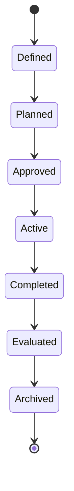
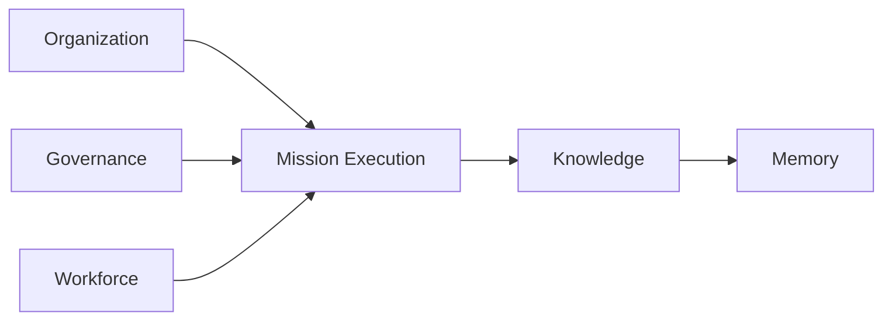
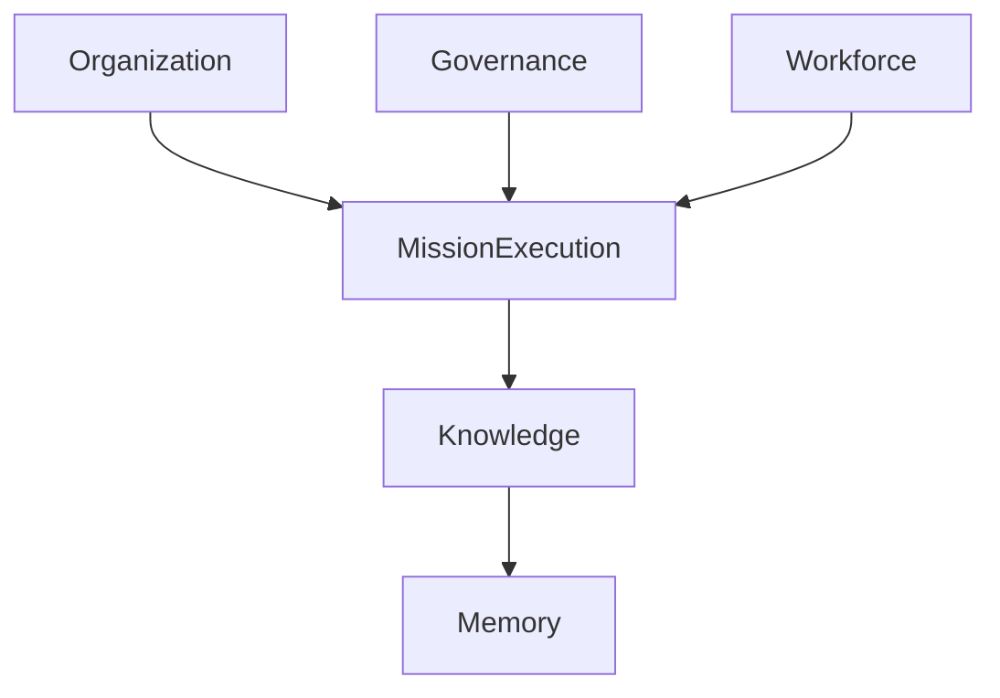
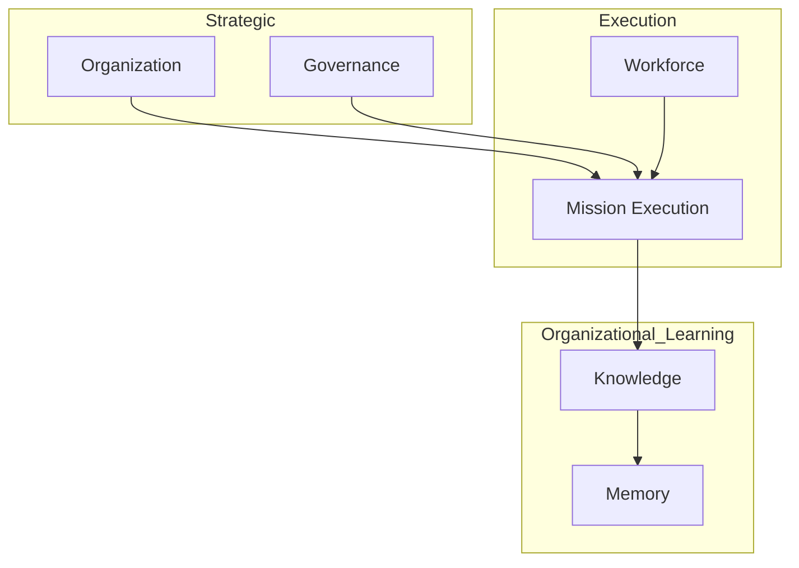

# ForgeOS Architecture — Mission Lifecycle

**Document ID:** ARCH-ORG-0004

**Title:** Mission Lifecycle

**Status:** Approved

**Version:** 1.0.0

**Derived From**

- TDS-0003 — Organization Model

**Related Documents**

- ARCH-ORG-0001 — Organization Model
- ARCH-ORG-0002 — Authority Model
- ARCH-ORG-0003 — Governance Model

---

# Purpose

This document provides the **Mission Lifecycle View** of the ForgeOS Organization Model.

It visualizes the approved organizational lifecycle for missions defined by **TDS-0003**, enabling implementation teams to understand how missions progress through the organization.

This document introduces no new lifecycle stages, governance rules, ownership semantics, delegation rules, or organizational responsibilities.

The authoritative organizational specification remains **TDS-0003**.

---

# Scope

This view illustrates:

- mission lifecycle progression;
- organizational participation;
- lifecycle ownership;
- organizational interactions;
- implementation mapping.

Mission semantics, authority, governance, and ownership remain defined exclusively by **TDS-0003**.

---

# Architectural Traceability

| Mission Lifecycle Concern | Authoritative Source |
|---------------------------|----------------------|
| Mission Ownership | TDS-0003 |
| Mission Lifecycle | TDS-0003 |
| Organizational Participation | TDS-0003 |
| Organizational Invariants | TDS-0003 |

This document is a derived implementation view only.

---

# Mission Lifecycle Overview

A mission progresses through the organizational lifecycle defined by **TDS-0003**.

This lifecycle visualizes the organizational progression of a mission.

Lifecycle authority remains defined by **TDS-0003**.

---

# Organizational Participation

Mission progression involves collaboration among permanent Organizational Units.

Participation illustrates organizational collaboration.

It does not imply ownership transfer.

---

# Mission Ownership

Mission ownership remains singular throughout the lifecycle.

| Lifecycle Stage | Organizational Responsibility |
|-----------------|-------------------------------|
| Definition | Mission Ownership |
| Planning | Mission Ownership |
| Approval | Governance |
| Execution | Mission Execution |
| Evaluation | Mission Ownership |
| Archival | Memory |

The responsibilities shown above are summarized from **TDS-0003**.

---

# Mission Progression Principles

The Mission Lifecycle View illustrates the following approved principles.

- Every mission has one owner.
- Missions consume capabilities.
- Governance constrains execution.
- Organizational learning follows execution.
- Institutional memory preserves mission history.

These principles originate from **TDS-0003**.

---

# Organizational Perspective

Mission execution is operational.

Mission ownership is organizational.

Mission outcomes contribute to organizational learning.

The lifecycle preserves these distinctions throughout implementation.

---

# Lifecycle Stability

Implementation may refine execution workflows.

Implementation shall preserve:

- lifecycle ownership;
- governance participation;
- accountability;
- organizational traceability.

These characteristics remain authoritative in **TDS-0003**.

*End of Part 1.*

# Mission Progression View

This section visualizes how missions progress through the Organization Model while preserving the ownership, governance, delegation, and accountability defined by **TDS-0003**.

The diagrams illustrate organizational progression only.

They do not redefine lifecycle semantics or introduce additional organizational behavior.

---

# Mission Progression Model

Mission progression follows the approved organizational lifecycle.

Mission progression remains organizational.

Implementation technology is outside the scope of this view.

---

# Organizational Interaction

Mission progression coordinates multiple Organizational Units.

The interaction model illustrates collaboration.

Responsibility ownership remains unchanged.

---

# Lifecycle Responsibility Matrix

| Lifecycle Activity | Organizational Unit |
|--------------------|---------------------|
| Mission Definition | Organization |
| Mission Planning | Mission Execution |
| Mission Approval | Governance |
| Capability Allocation | Workforce |
| Mission Execution | Mission Execution |
| Knowledge Promotion | Knowledge |
| Institutional Preservation | Memory |

The responsibilities summarized above derive directly from **TDS-0003**.

---

# Mission Execution Boundaries

Implementation shall preserve the following mission boundaries.

- Mission ownership remains singular.
- Mission execution remains operational.
- Governance approves rather than executes.
- Workforce supplies capabilities.
- Knowledge captures validated learning.
- Memory preserves historical outcomes.

These boundaries remain authoritative in **TDS-0003**.

---

# Organizational Learning Flow

Mission outcomes contribute to organizational capability.

This flow illustrates organizational learning rather than runtime execution.

---

# Mission Stability

Implementation may optimize execution processes.

Implementation shall preserve:

- mission ownership;
- governance participation;
- accountability;
- organizational traceability;
- capability independence.

These organizational characteristics remain stable throughout implementation.

---

# Relationship to Other Organizational Views

The Mission Lifecycle View focuses on **organizational progression**.

The Organization Model defines **organizational structure**.

The Authority Model defines **decision authority**.

The Governance Model defines **organizational oversight**.

Together these views provide complementary implementation guidance while preserving **TDS-0003** as the authoritative organizational specification.

---

# Architectural Traceability

Every lifecycle interaction shown in this document derives directly from:

- TDS-0003 — Organization Model

This document introduces no new organizational rules or lifecycle semantics.

*End of Part 2.*

# Implementation Guidance

This document provides the implementation-oriented **Mission Lifecycle View** of the ForgeOS Organization Model.

Implementation teams should use this view to understand how missions progress through the organization while preserving ownership, governance, delegation, and accountability.

Mission semantics remain defined exclusively by **TDS-0003**.

---

# Mission Lifecycle Implementation Mapping

The approved Organizational Units participate in mission progression according to their defined responsibilities.

| Mission Lifecycle Concern | Implementation Responsibility |
|---------------------------|-------------------------------|
| Mission Definition | Mission planning services |
| Mission Approval | Governance approval services |
| Mission Coordination | Mission orchestration services |
| Capability Allocation | Workforce coordination services |
| Knowledge Promotion | Knowledge stewardship services |
| Institutional Preservation | Memory services |

This mapping supports implementation planning only.

It does not redefine organizational responsibilities.

---

# Mission Lifecycle During Implementation

Implementation shall preserve the approved organizational progression.

The diagram illustrates organizational participation.

Software execution remains defined elsewhere in the architecture.

---

# Lifecycle Boundaries

Implementation shall preserve the following organizational boundaries.

- Mission ownership remains singular.
- Governance approves mission progression.
- Workforce provides organizational capability.
- Knowledge records validated organizational learning.
- Memory preserves institutional history.
- Organizational accountability remains continuous.

These lifecycle boundaries derive directly from **TDS-0003**.

---

# Relationship to Other Organizational Views

This document complements the remaining organizational architecture views.

| Document | Primary Perspective |
|----------|---------------------|
| Organization Model | Organizational topology |
| Authority Model | Authority allocation |
| Governance Model | Governance oversight |
| Mission Lifecycle | Organizational mission progression |
| Capability Lifecycle | Organizational capability evolution |

Together these views provide implementation clarity while preserving **TDS-0003** as the sole authoritative organizational specification.

---

# Architectural Traceability

Every mission lifecycle concept visualized by this document originates from approved architectural authority.

| Concern | Authoritative Source |
|----------|----------------------|
| Mission Lifecycle | TDS-0003 |
| Mission Ownership | TDS-0003 |
| Organizational Participation | TDS-0003 |
| Organizational Invariants | TDS-0003 |
| Architecture Enforcement | ARCH-0003 |

This document introduces no additional lifecycle semantics.

---

# Usage During Implementation

Implementation teams should reference this document when:

- implementing mission lifecycle workflows;
- assigning mission responsibilities;
- coordinating organizational participation;
- validating mission progression;
- preserving organizational accountability.

Mission ownership and governance shall always be obtained from **TDS-0003**.

---

# Codex Readiness

## Implementation Status

**Ready for implementation of the ForgeOS mission lifecycle.**

Using this document together with **TDS-0003**, a Senior Software Engineer can:

- implement mission lifecycle workflows;
- preserve mission ownership;
- coordinate organizational participation;
- integrate governance checkpoints;
- maintain organizational accountability throughout mission execution.

No additional architectural decisions are required to implement the approved mission lifecycle.

---

# Architectural Authority

This document is a **derived architectural view**.

It is **not** an authoritative source of organizational policy.

This document shall not be used to introduce or modify:

- mission lifecycle stages;
- mission ownership;
- governance participation;
- delegation rules;
- organizational responsibilities.

Any changes to those concepts shall first be made in **TDS-0003** and then reflected in this document.

---

# Document Completion

This document is complete.

It provides the implementation-oriented **Mission Lifecycle View** of the ForgeOS Organization Model and serves as the architectural reference for implementing mission progression, organizational participation, governance checkpoints, and organizational accountability.