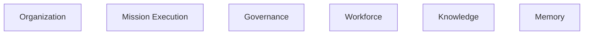
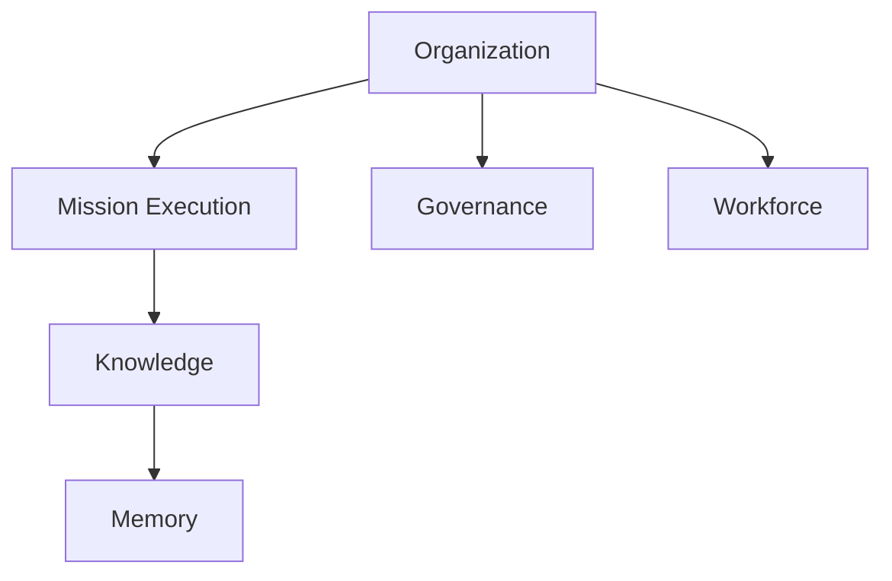
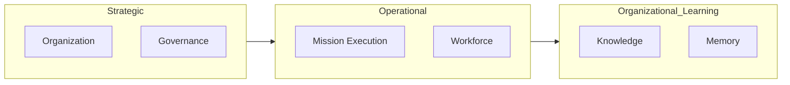
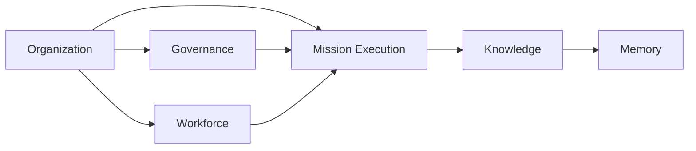
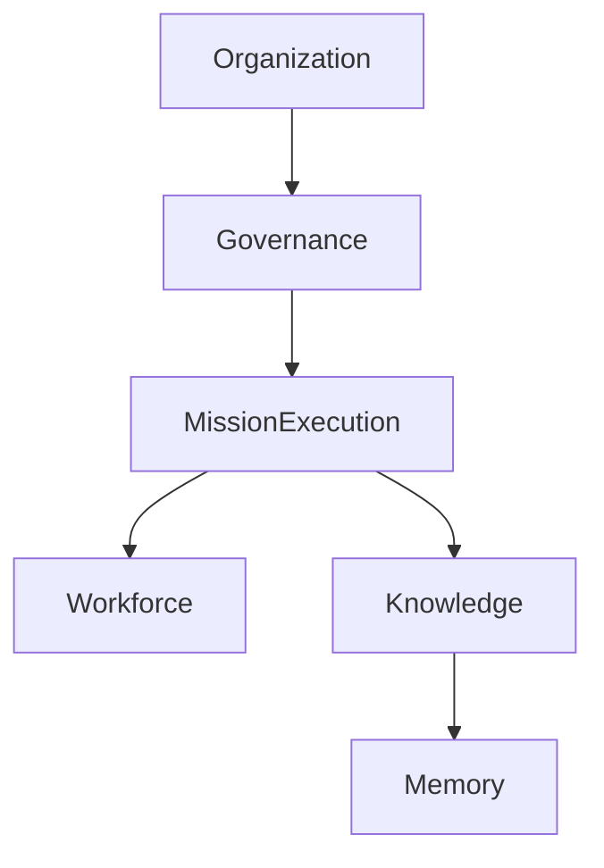
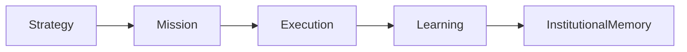
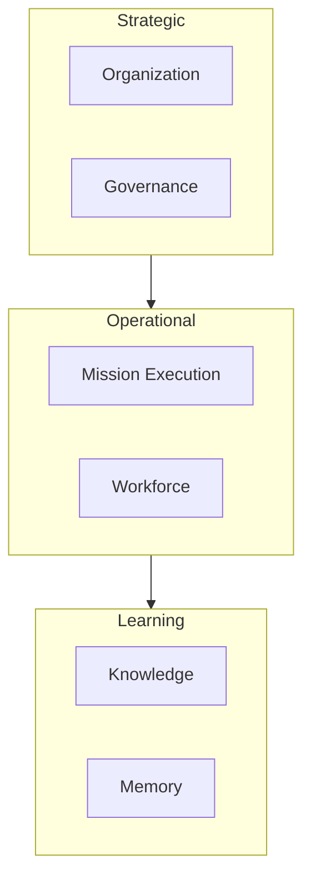

# ForgeOS Architecture — Organization Model

**Document ID:** ARCH-ORG-0001

**Title:** Organization Model

**Status:** Approved

**Version:** 1.0.0

**Derived From**

- TDS-0003 — Organization Model

**Related Documents**

- TDS-0002 — Domain Model
- ARCH-0002 — Component Model
- ARCH-0003 — Architecture Enforcement Specification

---

# Purpose

This document provides the **Organizational Topology View** of the ForgeOS Organization Model.

It visualizes the approved organizational decomposition defined by **TDS-0003** to support implementation.

This document introduces no new organizational policies, responsibilities, authority, governance rules, or ownership.

The authoritative organizational specification remains **TDS-0003**.

---

# Scope

This view illustrates:

- organizational decomposition;
- organizational units;
- organizational collaboration;
- responsibility allocation;
- implementation mapping.

Authority, governance, delegation, ownership, and organizational behavior remain defined exclusively by **TDS-0003**.

---

# Architectural Traceability

| Organizational View | Authoritative Source |
|----------------------|----------------------|
| Organizational Units | TDS-0003 |
| Organizational Responsibilities | TDS-0003 |
| Mission Ownership | TDS-0003 |
| Capability Ownership | TDS-0003 |
| Governance Relationships | TDS-0003 |

This document is a derived implementation view only.

---

# Organizational Decomposition

ForgeOS is organized into six permanent Organizational Units.

Each Organizational Unit owns one persistent area of organizational responsibility.

Temporary execution structures are intentionally excluded from this view.

---

# Organizational Topology

The approved organizational topology is illustrated below.

The topology visualizes organizational relationships.

It does not define software dependencies or runtime architecture.

---

# Organizational Responsibilities

| Organizational Unit | Primary Organizational Responsibility |
|----------------------|----------------------------------------|
| Organization | Organizational identity and strategic direction |
| Mission Execution | Mission planning, coordination, and delivery |
| Governance | Organizational policies, standards, and approvals |
| Workforce | Organizational capability and competency |
| Knowledge | Organizational learning and validated knowledge |
| Memory | Institutional history and organizational traceability |

Responsibility ownership is defined by **TDS-0003**.

---

# Organizational Capability Areas

The organization can be viewed as three collaborating capability areas.

These capability areas are conceptual organizational views.

They do not define implementation layers.

---

# Responsibility Ownership

Every organizational responsibility satisfies the following characteristics.

- exactly one owner;
- explicit accountability;
- traceable governance;
- measurable responsibility;
- organizational permanence.

Ownership semantics remain defined by **TDS-0003**.

---

# Organizational Isolation

Each Organizational Unit remains independently accountable.

Collaboration occurs through:

- mission coordination;
- governance approval;
- capability consumption;
- knowledge promotion;
- institutional learning.

Collaboration does not imply shared ownership.

---

# Relationship to Implementation

Each Organizational Unit maps to one or more implementation domains.

The mapping supports implementation planning only.

Implementation ownership continues to follow the architectural ownership model defined elsewhere in the architecture package.

---

# Organizational Invariants Visualized

This view illustrates the following approved organizational invariants.

- Every responsibility has exactly one owner.
- Organizational Units are permanent.
- Governance constrains execution.
- Capabilities persist beyond missions.
- Organizational identity remains stable.

These invariants originate from **TDS-0003**.

*End of Part 1.*

# Organizational Collaboration View

This section illustrates how the approved Organizational Units collaborate while preserving the ownership, authority, and governance rules defined by **TDS-0003**.

The diagrams in this section visualize organizational collaboration only.

They do not introduce new authority relationships, governance policies, or ownership semantics.

---

# Organizational Collaboration Model

The primary organizational collaborations are illustrated below.

The arrows indicate organizational collaboration.

They do not imply organizational ownership transfer.

---

# Responsibility Collaboration

Each Organizational Unit fulfills its responsibilities independently while cooperating through approved organizational relationships.

| Organizational Unit | Collaborates Primarily With | Collaboration Purpose |
|----------------------|-----------------------------|-----------------------|
| Organization | Governance, Mission Execution, Workforce | Strategic direction |
| Governance | Organization, Mission Execution, Knowledge | Organizational integrity |
| Mission Execution | Workforce, Knowledge | Mission delivery |
| Workforce | Mission Execution | Capability assignment |
| Knowledge | Mission Execution, Memory | Organizational learning |
| Memory | Knowledge | Institutional preservation |

The collaboration model derives directly from **TDS-0003**.

---

# Organizational Coordination

Organizational coordination occurs through approved mechanisms.

Coordination aligns organizational activities while preserving responsibility ownership.

---

# Organizational Responsibility Flow

The conceptual progression of organizational responsibilities is illustrated below.

This flow represents organizational progression rather than software execution.

---

# Implementation Mapping

Each Organizational Unit serves as the implementation owner for one or more organizational capabilities.

| Organizational Unit | Representative Organizational Capabilities |
|----------------------|---------------------------------------------|
| Organization | Strategic direction, organizational identity |
| Governance | Policies, standards, approvals |
| Mission Execution | Mission planning, mission delivery |
| Workforce | Competencies, professional capability |
| Knowledge | Knowledge promotion, blueprint stewardship |
| Memory | Institutional history, historical traceability |

Capability definitions remain authoritative in **TDS-0003**.

---

# Organizational Stability

Implementation shall preserve the stability of Organizational Units.

The following changes are expected during implementation:

- capability refinement;
- workflow optimization;
- execution improvement.

The following structures are expected to remain stable:

- Organizational Units;
- responsibility ownership;
- governance relationships;
- authority boundaries.

---

# Organizational Traceability

Every organizational relationship shown in this document derives directly from **TDS-0003**.

No additional organizational relationships are introduced.

---

# Relationship to Other Organizational Views

This document provides the organizational topology perspective.

The remaining organizational architecture views provide focused implementation perspectives.

| Document | Primary Perspective |
|----------|---------------------|
| Organization Model | Organizational topology |
| Authority Model | Authority relationships |
| Governance Model | Governance responsibilities |
| Mission Lifecycle | Mission progression |
| Capability Lifecycle | Capability evolution |

Together these views improve implementation readiness while preserving **TDS-0003** as the sole authoritative organizational specification.

*End of Part 2.*

# Implementation Guidance

This document provides the implementation-oriented organizational topology for ForgeOS.

Implementation teams should use this view to understand **how organizational responsibilities are partitioned**, not how they are implemented.

Business behavior, governance policy, delegation semantics, and organizational authority remain defined exclusively by **TDS-0003**.

---

# Organizational Implementation Mapping

The approved Organizational Units provide the implementation ownership boundaries for organizational capabilities.

| Organizational Unit | Implementation Responsibility |
|----------------------|-------------------------------|
| Organization | Organizational identity and strategic coordination |
| Mission Execution | Mission orchestration and operational execution |
| Governance | Policy enforcement and decision governance |
| Workforce | Capability management and workforce coordination |
| Knowledge | Knowledge stewardship and organizational learning |
| Memory | Institutional history and historical traceability |

This mapping supports implementation planning.

It does not redefine ownership.

---

# Organizational Topology During Implementation

Implementation shall preserve the approved organizational decomposition.

This diagram illustrates organizational coordination.

Software architecture remains defined elsewhere within the Architecture Package.

---

# Organizational Boundaries

Implementation shall preserve the following organizational boundaries.

- Organizational Units remain independent.
- Responsibility ownership remains singular.
- Organizational collaboration remains explicit.
- Governance remains independent from execution.
- Organizational capabilities remain persistent.

These boundaries originate from **TDS-0003**.

---

# Relationship to the Domain Model

The Organization Model complements the ForgeOS Domain Model.

The relationship between the two specifications is summarized below.

| Domain Perspective | Organizational Perspective |
|--------------------|----------------------------|
| Business Capability | Organizational Responsibility |
| Aggregate Ownership | Organizational Ownership |
| Domain Events | Organizational Collaboration |
| Repository Ownership | Responsibility Ownership |
| Consistency Boundary | Accountability Boundary |

The two models address different concerns while remaining architecturally aligned.

---

# Relationship to Other Organizational Views

This document provides the highest-level organizational perspective.

The remaining derived organizational views provide progressively more focused implementation guidance.

| Document | Primary Perspective |
|----------|---------------------|
| Organization Model | Organizational topology |
| Authority Model | Authority allocation |
| Governance Model | Governance execution |
| Mission Lifecycle | Organizational execution lifecycle |
| Capability Lifecycle | Organizational capability evolution |

Together they form the complete implementation-oriented view of **TDS-0003**.

---

# Architectural Traceability

Every organizational concept visualized by this document originates from approved architectural authority.

| Concern | Authoritative Source |
|----------|----------------------|
| Organizational Units | TDS-0003 |
| Responsibility Ownership | TDS-0003 |
| Organizational Topology | TDS-0003 |
| Organizational Invariants | TDS-0003 |
| Component Ownership | ARCH-0002 |
| Architecture Enforcement | ARCH-0003 |

This document introduces no new organizational rules.

---

# Usage During Implementation

Implementation teams should reference this document when:

- determining organizational ownership;
- assigning implementation responsibilities;
- reviewing organizational decomposition;
- validating collaboration boundaries;
- onboarding new engineers.

Organizational policy and governance shall always be obtained from **TDS-0003**.

---

# Codex Readiness

## Implementation Status

**Ready for implementation of the ForgeOS organizational topology.**

Using this document together with **TDS-0003**, a Senior Software Engineer can:

- identify every Organizational Unit;
- map organizational responsibilities;
- preserve ownership boundaries;
- understand organizational collaboration;
- align implementation work with the approved organizational structure.

No additional architectural decisions are required to implement the organizational topology.

---

# Architectural Authority

This document is a **derived architectural view**.

It is **not** an authoritative source of organizational policy.

This document shall not be used to introduce or modify:

- organizational responsibilities;
- authority relationships;
- governance policies;
- delegation rules;
- ownership semantics.

Any changes to those concepts shall first be made in **TDS-0003** and then reflected in this document.

---

# Document Completion

This document is complete.

It provides the implementation-oriented **Organizational Topology View** of the ForgeOS Organization Model and serves as the architectural entry point for implementing organizational decomposition, collaboration, and responsibility boundaries.