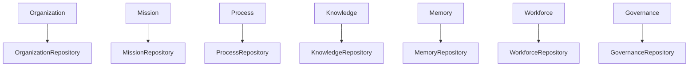
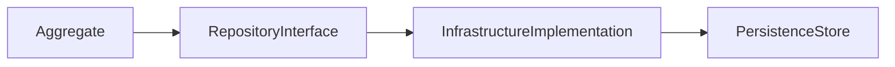
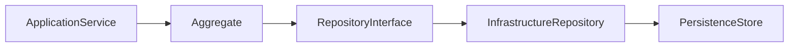
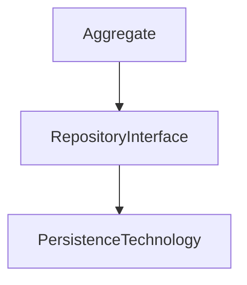
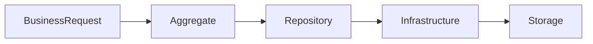
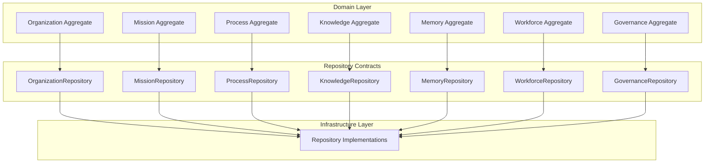

# ForgeOS Architecture — Persistence Model

**Document ID:** ARCH-DOM-0005

**Title:** Persistence Model

**Status:** Approved

**Version:** 1.0.0

**Derived From**

- TDS-0002 — Domain Model

**Related Documents**

- ARCH-0002 — Component Model
- ARCH-0003 — Architecture Enforcement Specification
- ARCH-0004 — Workspace Specification
- ARCH-DOM-0002 — Aggregate Boundaries

---

# Purpose

This document provides the **Persistence Ownership View** of the ForgeOS Domain Model.

It visualizes how persistence responsibilities are distributed across aggregate roots while preserving the architectural ownership defined by **TDS-0002**.

This document does not introduce persistence technology, storage engines, schemas, or implementation details.

The authoritative source for repository ownership remains **TDS-0002**.

---

# Scope

This view illustrates:

- repository ownership;
- aggregate-to-repository mapping;
- persistence boundaries;
- read and write ownership;
- persistence responsibilities.

Persistence technology, storage strategy, indexing, migration, and optimization remain outside the scope of this document.

---

# Architectural Traceability

| Persistence Concern | Authoritative Source |
|---------------------|----------------------|
| Aggregate Ownership | TDS-0002 |
| Repository Contracts | TDS-0002 |
| Persistence Ownership | TDS-0002 |
| Architectural Ownership | ARCH-0002 |
| Enforcement Rules | ARCH-0003 |

This document introduces no new persistence behavior.

---

# Persistence Ownership Principles

The persistence model visualizes the following approved principles.

- Every aggregate owns exactly one repository interface.
- Repository ownership follows aggregate ownership.
- Repository implementations belong to Infrastructure.
- Business domains remain persistence-agnostic.
- Read models do not become aggregate owners.
- Persistence responsibilities do not cross aggregate boundaries.

These principles originate from **TDS-0002**.

---

# Repository Ownership Model

Every aggregate root owns one repository interface.

Repository interfaces belong to the owning bounded context.

Repository implementations belong to the Infrastructure Domain.

---

# Repository Ownership Matrix

| Aggregate Root | Repository Interface | Architectural Owner |
|----------------|----------------------|---------------------|
| Organization | OrganizationRepository | Organization Domain |
| Mission | MissionRepository | Mission Domain |
| Process | ProcessRepository | Process Domain |
| Knowledge | KnowledgeRepository | Knowledge Domain |
| Memory | MemoryRepository | Memory Domain |
| Workforce | WorkforceRepository | Workforce Domain |
| Governance | GovernanceRepository | Governance Domain |

Ownership is singular.

Repository ownership shall never be shared.

---

# Persistence Boundary

Every repository persists one aggregate root.

The persistence store is intentionally abstract.

No persistence technology is implied by this architectural view.

---

# Repository Responsibilities

Every repository interface is responsible for:

- aggregate retrieval;
- aggregate persistence;
- aggregate archival;
- existence verification;
- optimistic concurrency support.

Business behavior remains inside the aggregate.

Persistence behavior remains inside Infrastructure.

---

# Architectural Invariants

This view illustrates the following approved invariants.

- Aggregate ownership determines persistence ownership.
- One repository persists one aggregate.
- Repository interfaces remain technology-independent.
- Repository implementations remain replaceable.
- Infrastructure never owns business behavior.

These invariants derive from **TDS-0002** and **ARCH-0003**.

*End of Part 1.*

# Read and Write Ownership

This section visualizes how persistence operations preserve aggregate ownership while remaining independent of persistence technology.

The ownership model shown here derives directly from **TDS-0002**.

No additional persistence behavior is introduced.

---

# Persistence Interaction Model

Aggregate persistence follows the approved architectural flow.

Business behavior remains inside the aggregate.

Infrastructure performs persistence on behalf of the repository contract.

---

# Write Ownership

Write operations originate from the owning aggregate.

The following write responsibilities are preserved.

| Operation | Architectural Owner |
|-----------|---------------------|
| Create Aggregate | Aggregate Root |
| Modify Aggregate | Aggregate Root |
| Validate Invariants | Aggregate Root |
| Persist Aggregate | Repository Interface |
| Execute Storage Operation | Infrastructure |

Business state transitions are completed before persistence occurs.

---

# Read Ownership

Read operations retrieve aggregates through the repository interface.

The following responsibilities apply.

| Operation | Architectural Owner |
|-----------|---------------------|
| Aggregate Retrieval | Repository Interface |
| Aggregate Reconstruction | Infrastructure |
| Business Validation | Aggregate Root |
| Derived Read Models | Application Layer (where applicable) |

Repository implementations remain responsible only for persistence concerns.

---

# Repository Isolation

Repository interfaces remain isolated from persistence technology.

Aggregates are unaware of:

- storage engines;
- database vendors;
- serialization formats;
- indexing strategies;
- transport mechanisms.

These concerns belong exclusively to Infrastructure.

---

# Aggregate Persistence Rules

The persistence model preserves the following approved rules.

- Every aggregate persists through one repository interface.
- Repository interfaces expose business-oriented operations.
- Infrastructure implements repository contracts.
- Persistence operations never bypass the aggregate root.
- Foreign aggregates are never persisted through another aggregate's repository.

---

# Read Model Principles

Read models provide optimized views of business data.

Read models:

- do not own aggregates;
- do not modify aggregate state;
- derive information from approved business sources;
- remain outside aggregate consistency boundaries.

Read models shall not become authoritative business objects.

---

# Persistence Responsibilities

| Concern | Architectural Responsibility |
|----------|------------------------------|
| Business Rules | Aggregate |
| Aggregate Consistency | Aggregate |
| Repository Contract | Domain |
| Repository Implementation | Infrastructure |
| Storage Technology | Infrastructure |
| Read Model Construction | Application Layer |

This separation preserves architectural ownership throughout the persistence lifecycle.

---

# Persistence Interaction Summary

The approved persistence flow is summarized below.

This flow represents architectural responsibilities rather than runtime implementation details.

---

# Architectural Traceability

The persistence interaction model derives directly from:

- TDS-0002 — Domain Model
- ARCH-0002 — Component Model
- ARCH-0003 — Architecture Enforcement Specification

This document introduces no additional persistence behavior.

*End of Part 2.*

# Persistence Topology

This section presents the persistence architecture from an implementation perspective.

It summarizes persistence ownership, repository relationships, and responsibility boundaries while preserving the architectural rules established by **TDS-0002**.

The topology is conceptual.

It does not prescribe storage technology, deployment topology, database architecture, or implementation strategy.

---

# Repository Topology

Repository interfaces remain part of the Domain Layer.

Repository implementations remain part of the Infrastructure Layer.

---

# Persistence Ownership Matrix

| Aggregate | Repository Interface | Persistence Owner | Infrastructure Responsibility |
|-----------|----------------------|-------------------|-------------------------------|
| Organization | OrganizationRepository | Organization Domain | Repository Implementation |
| Mission | MissionRepository | Mission Domain | Repository Implementation |
| Process | ProcessRepository | Process Domain | Repository Implementation |
| Knowledge | KnowledgeRepository | Knowledge Domain | Repository Implementation |
| Memory | MemoryRepository | Memory Domain | Repository Implementation |
| Workforce | WorkforceRepository | Workforce Domain | Repository Implementation |
| Governance | GovernanceRepository | Governance Domain | Repository Implementation |

Persistence ownership follows aggregate ownership.

Implementation responsibility follows Infrastructure ownership.

---

# Implementation Guidance

Implementation teams should use this view when:

- implementing repository interfaces;
- implementing persistence adapters;
- validating persistence ownership;
- reviewing aggregate persistence boundaries;
- implementing read models.

Implementation shall preserve the architectural separation between:

- business behavior;
- repository contracts;
- persistence implementation.

---

# Relationship to Other Architectural Views

This document complements the remaining Domain Architecture views.

| Document | Primary Perspective |
|----------|---------------------|
| Domain Model | Business decomposition |
| Aggregate Boundaries | Transactional consistency |
| Domain Event Model | Event interaction |
| Entity Relationships | Structural ownership |
| Persistence Model | Persistence ownership |

Each view supports implementation while remaining fully traceable to **TDS-0002**.

---

# Architectural Traceability

All persistence responsibilities shown in this document originate from approved architectural artifacts.

| Concern | Authoritative Source |
|----------|----------------------|
| Repository Contracts | TDS-0002 |
| Aggregate Ownership | TDS-0002 |
| Persistence Ownership | TDS-0002 |
| Architectural Ownership | ARCH-0002 |
| Enforcement Rules | ARCH-0003 |

This document introduces no new persistence responsibilities.

---

# Usage During Implementation

Implementation teams should reference this document when:

- implementing repository contracts;
- assigning persistence ownership;
- designing persistence adapters;
- validating repository boundaries;
- reviewing persistence architecture.

Repository behavior shall always be implemented according to **TDS-0002**.

Technology selection remains governed by the applicable Technology Decision Records.

---

# Codex Readiness

## Implementation Status

**Ready for implementation of the ForgeOS persistence architecture.**

Using this document together with **TDS-0002**, a Senior Software Engineer can:

- implement repository interfaces;
- implement persistence adapters;
- preserve persistence ownership;
- maintain aggregate isolation;
- implement read-model support without violating aggregate ownership;
- separate domain contracts from infrastructure implementations.

No additional architectural decisions are required to implement the approved persistence ownership model.

---

# Architectural Authority

This document is a derived architectural view.

It shall not be used to introduce or modify:

- repository contracts;
- persistence ownership;
- aggregate ownership;
- storage strategy;
- persistence technology.

Changes to the persistence architecture shall first be made in **TDS-0002** (or an applicable TDR where technology decisions are involved) and then reflected in this document.

---

# Document Completion

This document is complete.

It provides the implementation-oriented **Persistence Ownership View** of the ForgeOS Domain Model and serves as the architectural reference for implementing repository contracts, persistence boundaries, and infrastructure persistence adapters.