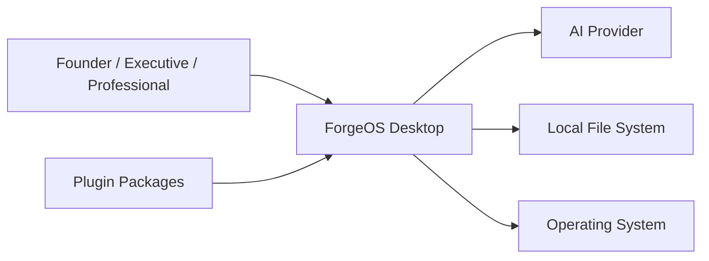
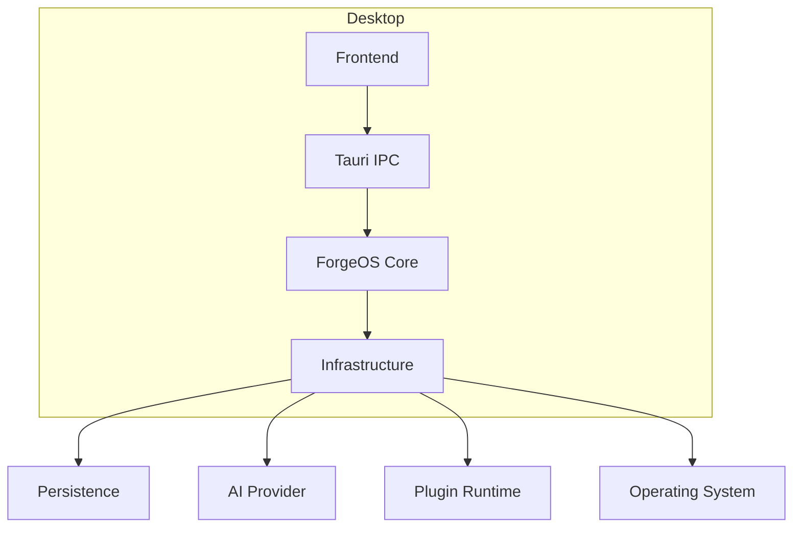

# ForgeOS Architecture — System Context

**Document ID:** ARCH-0001

**Title:** System Context

**Status:** Approved

**Version:** 1.0.0

**Related Documents**

- RFC-0001 — ForgeOS Genome
- RFC-0004 — Organization Model
- RFC-0021 — Mission Engine
- RFC-0022 — Process Engine
- RFC-0036 — Knowledge Query Engine
- TDS-0001 — System Architecture
- TDR-0001 — Programming Language
- TDR-0002 — Desktop Framework

---

# Purpose

This document defines the runtime context of ForgeOS Core.

Unlike the System Architecture (TDS-0001), which defines logical architecture, this document specifies how ForgeOS exists within its operating environment, what external systems it communicates with, and where implementation boundaries exist.

This document is implementation-oriented.

---

# Scope

This specification defines:

- runtime topology;
- external actors;
- external systems;
- trust boundaries;
- deployment boundaries;
- runtime ownership;
- system responsibilities.

Detailed component decomposition is defined separately in the Component Model.

---

# Architectural Position

ForgeOS is a **local-first desktop operating platform for Organizations**.

The application executes primarily on the user's workstation.

External services are optional integrations rather than runtime requirements.

The platform shall remain fully functional without Internet connectivity except where optional cloud-based providers are explicitly enabled.

---

# Runtime Topology

The ForgeOS runtime consists of the following execution environments:

```text
┌─────────────────────────────────────────────┐
│               User Workstation              │
│                                             │
│  ┌───────────────────────────────────────┐  │
│  │           ForgeOS Desktop             │  │
│  │                                       │  │
│  │  Frontend (UI)                        │  │
│  │           │                           │  │
│  │           ▼ IPC                       │  │
│  │  Tauri Runtime                        │  │
│  │           │                           │  │
│  │           ▼                           │  │
│  │  forgeos-core                         │  │
│  │           │                           │  │
│  │           ▼                           │  │
│  │ Infrastructure Providers              │  │
│  └───────────────────────────────────────┘  │
│                                             │
└─────────────────────────────────────────────┘
```

No business logic exists outside **forgeos-core**.

---

# Primary Runtime

ForgeOS executes as a single desktop application composed of distinct logical runtimes.

## Frontend Runtime

Responsibilities:

- render user interface;
- collect user interaction;
- display application state;
- invoke backend commands;
- visualize organizational information.

The frontend contains no business rules.

---

## Backend Runtime

The backend hosts:

- Application Layer;
- Domain Layer;
- Infrastructure Layer;
- Platform Layer.

All business decisions occur here.

---

## Infrastructure Runtime

Infrastructure adapters provide:

- persistence;
- search;
- AI integration;
- filesystem access;
- plugin loading;
- import/export;
- operating system integration.

Infrastructure does not define organizational behavior.

---

# External Actors

The following actors interact directly with ForgeOS.

## Founder

Primary organizational authority.

Capabilities include:

- configure Organizations;
- approve governance decisions;
- manage platform configuration;
- supervise autonomous execution.

---

## Executive

Responsible for strategic governance.

Capabilities include:

- approve strategic decisions;
- review organizational health;
- authorize major organizational changes.

---

## Professional

Primary operational user.

Capabilities include:

- execute Missions;
- create knowledge;
- manage Processes;
- collaborate with Teams.

---

## Administrator

Responsible for operational administration.

Capabilities include:

- manage runtime configuration;
- install plugins;
- configure integrations;
- maintain local deployment.

Administrative authority does not imply executive authority.

---

# External Systems

ForgeOS may communicate with the following external systems.

## AI Providers

Examples include:

- local LLM runtimes;
- OpenAI-compatible providers;
- enterprise AI services.

AI providers are optional.

ForgeOS shall remain operational without them.

---

## Local Filesystem

Used for:

- repository storage;
- attachments;
- exports;
- backups;
- plugin packages.

Filesystem access occurs exclusively through infrastructure services.

---

## Operating System

ForgeOS integrates with:

- window management;
- notifications;
- system tray;
- clipboard;
- file dialogs;
- application lifecycle.

No business logic depends directly upon operating system APIs.

---

## Future Integrations

Examples include:

- Git repositories;
- identity providers;
- enterprise authentication;
- cloud synchronization;
- organizational marketplaces.

These integrations remain optional.

---

# Runtime Responsibilities

| Runtime | Owns |
|---------|------|
| Frontend | Presentation |
| Tauri | Desktop hosting |
| forgeos-core | Organizational behavior |
| Infrastructure | External integrations |
| Platform | Runtime services |

Ownership boundaries are strict.

Responsibilities shall not overlap.

---

# Runtime Ownership Rules

The following rules are architectural invariants.

- Business logic belongs exclusively to **forgeos-core**.
- The frontend never evaluates business rules.
- Infrastructure never owns domain behavior.
- Platform services remain generic.
- External providers are replaceable.

Violation of these rules requires architectural review.

---

# Cross References

Authoritative ownership:

- Runtime architecture — TDS-0001
- Programming language — TDR-0001
- Desktop runtime — TDR-0002

This document defines how those decisions are realized within the executing system.

*End of Part 1.*

# Trust Boundaries

ForgeOS explicitly separates trust domains to prevent business logic, external integrations, and user interfaces from implicitly trusting one another.

Each trust boundary represents a point where validation, authorization, or protocol translation is required.

The implementation shall preserve these boundaries.

---

## Trust Boundary TB-1 — User Interface

Components:

- Frontend
- UI State
- Views
- User Interaction

Trust Level:

**Untrusted**

Reason:

User input is considered untrusted regardless of its origin.

Every command crossing into the backend shall undergo:

- structural validation;
- authorization;
- business validation.

The backend shall never assume frontend correctness.

---

## Trust Boundary TB-2 — IPC Boundary

Components:

- Tauri Commands
- DTO Serialization
- Request Routing

Trust Level:

**Validated**

Responsibilities:

- deserialize requests;
- validate schemas;
- authenticate caller;
- authorize operation;
- invoke Application Services.

Only DTOs may cross this boundary.

Domain entities shall never be serialized directly across IPC.

---

## Trust Boundary TB-3 — Application Boundary

Components:

- Command Handlers
- Query Handlers
- Application Services

Trust Level:

**Trusted**

Responsibilities:

- transaction coordination;
- workflow orchestration;
- authorization coordination;
- event publication.

Business rules remain delegated to the Domain Layer.

---

## Trust Boundary TB-4 — Domain Boundary

Components:

- Domain Aggregates
- Domain Services
- Domain Events

Trust Level:

**Authoritative**

The Domain Layer represents the highest trust level within ForgeOS.

Only the Domain may:

- evaluate business rules;
- enforce invariants;
- modify aggregate state;
- publish domain events.

No external component may bypass this boundary.

---

## Trust Boundary TB-5 — Infrastructure Boundary

Components:

- Repository Implementations
- AI Providers
- Filesystem
- Search
- Plugin Runtime

Trust Level:

**External**

Infrastructure is trusted only to perform technical operations.

Infrastructure shall never determine organizational behavior.

Infrastructure failures shall not corrupt domain state.

---

## Trust Boundary TB-6 — External Systems

Components:

- LLM Providers
- External APIs
- Cloud Services
- Git Providers

Trust Level:

**Zero Trust**

All external systems shall be treated as unreliable.

Every interaction shall include:

- timeout handling;
- retry policy;
- validation;
- error classification.

ForgeOS shall remain operational when external services are unavailable.

---

# Deployment Boundaries

ForgeOS MVP is deployed as a single desktop application.

Logical deployment boundaries remain explicit to support future distributed execution.

---

## Deployment Unit 1 — Desktop Host

Responsibilities:

- application startup;
- window lifecycle;
- IPC host;
- plugin loading;
- runtime bootstrap.

Implemented by:

- Tauri Runtime

---

## Deployment Unit 2 — ForgeOS Core

Responsibilities:

- application services;
- domain execution;
- organizational reasoning;
- event handling;
- orchestration.

Implemented by:

- Rust workspace

This deployment unit owns all business behavior.

---

## Deployment Unit 3 — Local Data Store

Responsibilities:

- persistence;
- indexing;
- snapshots;
- backups.

Implementation technology is defined by future TDRs.

The deployment boundary remains fixed.

---

## Deployment Unit 4 — Optional External Providers

Examples:

- AI Providers
- Synchronization
- Federation

These deployment units are optional.

ForgeOS Core shall not depend upon their availability.

---

# Storage Boundaries

Storage ownership follows domain ownership.

Every aggregate has one authoritative persistence owner.

---

## Organizational Data

Owner:

Organization Module

Examples:

- Organizations
- Teams
- Professionals
- Roles

---

## Knowledge Data

Owner:

Knowledge Module

Examples:

- Knowledge Objects
- Relationships
- Blueprints
- Standards

---

## Mission Data

Owner:

Mission Module

Examples:

- Missions
- Mission Plans
- Mission History

---

## Process Data

Owner:

Process Module

Examples:

- Process Definitions
- Process Instances
- Execution State

---

## Governance Data

Owner:

Governance Module

Examples:

- Decisions
- Policies
- Authority Records

---

## Memory Data

Owner:

Memory Module

Examples:

- Executive Memory
- Engineering Memory
- Organization Memory

---

# Storage Ownership Rules

The following rules are mandatory.

- Shared ownership of persistent entities is prohibited.
- Cross-module joins shall occur through identifiers rather than shared mutable state.
- Every persistent entity has exactly one owning module.
- Read models may aggregate information but do not own it.

These rules preserve modularity and future scalability.

---

# Security Boundaries

Security is enforced at multiple architectural layers.

---

## Authentication

Performed before Application Services execute.

Authentication implementation remains infrastructure.

---

## Authorization

Evaluated by the Application Layer using domain policies.

Authorization decisions may depend on:

- Organization;
- Role;
- Capability;
- Delegated Authority;
- Mission Assignment.

---

## Domain Authorization

Sensitive business operations shall be validated within the Domain.

Examples:

- approving Decisions;
- modifying Organization DNA;
- promoting Knowledge;
- changing Mission ownership.

The Domain remains the final authority.

---

## Secrets Management

Secrets include:

- API keys;
- provider credentials;
- encryption keys.

Secrets shall never be stored within domain entities.

Secrets belong exclusively to Infrastructure.

---

## Plugin Isolation

Plugins execute through published interfaces.

Plugins:

- cannot directly access repositories;
- cannot modify aggregates;
- cannot bypass Application Services.

Every plugin operation traverses the same trust boundaries as internal components.

---

# Failure Isolation

Failure domains shall remain isolated.

Examples:

| Failure | System Behavior |
|---------|-----------------|
| AI Provider unavailable | AI features degrade gracefully |
| Search index corruption | Search unavailable, core execution continues |
| Plugin failure | Plugin disabled without affecting Core |
| Filesystem export failure | Export fails without altering domain state |
| UI failure | Backend remains authoritative |

Failures shall not violate domain consistency.

---

# Cross References

This section implements runtime isolation defined by:

- TDS-0001 — System Architecture
- TDR-0001 — Programming Language
- TDR-0002 — Desktop Framework

It introduces no additional architectural decisions.

*End of Part 2.*

# External Interface Matrix

This section defines every externally visible runtime interface of ForgeOS Core.

An interface represents a stable contract between ForgeOS and another runtime component.

Implementation shall preserve these contracts.

---

## Interface I-001 — Desktop IPC

Provider

- ForgeOS Core

Consumer

- Frontend

Transport

- Tauri IPC

Direction

- Bidirectional

Responsibilities

- Execute commands
- Execute queries
- Deliver notifications
- Report progress

Ownership

Application Layer

---

## Interface I-002 — Local Persistence

Provider

- Persistence Provider

Consumer

- Repository Implementations

Direction

- Backend only

Responsibilities

- Read aggregates
- Persist aggregates
- Transaction management
- Snapshot storage

Ownership

Infrastructure Layer

---

## Interface I-003 — AI Provider

Provider

- AI Adapter

Consumer

- Context Builder
- AI Abstraction Layer

Direction

- Outbound

Responsibilities

- Prompt execution
- Completion generation
- Embedding generation
- Model metadata

Ownership

Infrastructure Layer

This interface shall never be accessed directly by Domain code.

---

## Interface I-004 — Plugin Runtime

Provider

- Plugin Host

Consumer

- ForgeOS Plugins

Responsibilities

- Register commands
- Register queries
- Register UI extensions
- Register services

Plugins communicate only through published extension interfaces.

---

## Interface I-005 — Filesystem

Provider

- Filesystem Adapter

Consumer

- Infrastructure Services

Responsibilities

- Import
- Export
- Backup
- Restore
- Attachment storage

Filesystem paths shall never be embedded in Domain entities.

---

## Interface I-006 — Operating System

Provider

- Tauri Runtime

Consumer

- Platform Layer

Responsibilities

- Window lifecycle
- Notifications
- Clipboard
- File dialogs
- System tray
- Native integrations

Business logic shall remain unaware of operating system APIs.

---

# Runtime Interaction Model

The following sequence illustrates a typical execution path.

```text
User
 │
 ▼
Frontend
 │
 ▼
IPC Command
 │
 ▼
Application Service
 │
 ▼
Domain Aggregate
 │
 ▼
Repository
 │
 ▼
Persistence
 │
 ▲
Repository
 │
 ▼
Domain Event
 │
 ▼
Event Subscribers
 │
 ▼
Application Response
 │
 ▼
IPC Response
 │
 ▼
Frontend
 │
 ▼
User
```

The Domain Aggregate remains the only component authorized to modify organizational state.

---

# Runtime Communication Rules

The following communication rules are mandatory.

## Rule RC-001

Frontend communicates exclusively through IPC.

Direct repository access is prohibited.

---

## Rule RC-002

Application Services invoke Domain logic.

Application Services shall not implement business rules.

---

## Rule RC-003

Domain modules communicate through:

- published interfaces;
- domain events.

Direct module coupling is prohibited.

---

## Rule RC-004

Infrastructure communicates outward.

Infrastructure shall not orchestrate business workflows.

---

## Rule RC-005

External providers shall never invoke Domain components directly.

All inbound communication passes through the Application Layer.

---

# C4 Level 1 — System Context



---

# Runtime Context Diagram



---

# Runtime Ownership Matrix

| Component | Owner | Technology |
|------------|-------|------------|
| Frontend | Presentation Layer | Web UI (defined later) |
| IPC | Desktop Runtime | Tauri |
| Application Services | Application Layer | Rust |
| Domain Model | Domain Layer | Rust |
| Repository Interfaces | Domain Layer | Rust |
| Repository Implementations | Infrastructure | Rust |
| Event Bus | Infrastructure | Rust |
| Plugin Host | Platform | Rust |
| AI Adapter | Infrastructure | Rust |
| Storage Adapter | Infrastructure | Rust |

Ownership is exclusive.

No component shall have multiple architectural owners.

---

# Runtime Lifecycle

ForgeOS initializes in the following order.

```text
Application Start

↓

Platform Bootstrap

↓

Configuration

↓

Infrastructure Initialization

↓

Repository Initialization

↓

Application Services

↓

Plugin Discovery

↓

Frontend Connection

↓

Ready
```

Shutdown occurs in reverse order.

Graceful shutdown shall ensure all pending domain transactions complete before process termination.

---

# Cross References

Implementation details are derived from:

- TDS-0001 — System Architecture
- TDR-0001 — Programming Language
- TDR-0002 — Desktop Framework

This document introduces no additional technology decisions.

*End of Part 3.*

# Non-Functional Constraints

This section defines implementation constraints that apply across the entire runtime. These constraints are architectural requirements rather than implementation preferences.

---

## Performance

ForgeOS shall remain responsive during normal desktop usage.

Implementation shall ensure:

- user interactions do not block on long-running operations;
- indexing and knowledge processing execute asynchronously;
- Mission execution does not freeze the UI;
- large repositories remain navigable without requiring full in-memory loading.

Performance optimization shall not compromise architectural boundaries.

---

## Reliability

The runtime shall tolerate failure of optional subsystems.

Representative examples include:

- unavailable AI providers;
- disabled plugins;
- failed exports;
- corrupted search indexes.

Such failures shall degrade functionality without compromising organizational data integrity.

---

## Availability

ForgeOS is designed as a local-first application.

Core capabilities shall remain available without:

- Internet connectivity;
- cloud services;
- external AI providers;
- synchronization services.

Optional integrations may become unavailable independently of ForgeOS Core.

---

## Maintainability

Every implementation shall preserve:

- module isolation;
- explicit ownership;
- interface-driven communication;
- dependency inversion;
- deterministic build behavior.

Architectural shortcuts that increase coupling are prohibited.

---

## Testability

Every Application Service shall be independently testable.

Every Domain module shall support isolated unit testing.

Infrastructure adapters shall be replaceable with test implementations.

Integration tests shall verify published interfaces rather than internal implementation details.

---

## Observability

Operational visibility shall include:

- structured logging;
- execution duration;
- command execution metrics;
- domain event tracing;
- infrastructure error classification.

Observability must not influence business behavior.

---

## Scalability

Although the MVP targets a single desktop runtime, implementation shall preserve future scalability by avoiding assumptions that require a single process or single machine architecture.

Examples include:

- interface-driven persistence;
- asynchronous event publication;
- modular repositories;
- explicit component ownership.

---

## Extensibility

Extension points shall remain stable.

Examples include:

- AI providers;
- storage providers;
- plugin modules;
- import/export providers;
- search providers.

New providers shall integrate through published interfaces rather than modifying existing components.

---

# Architecture Validation Rules

The following validation rules shall be used during implementation reviews.

## AV-001

No Domain module depends on Infrastructure.

---

## AV-002

No business logic exists within the frontend.

---

## AV-003

Repositories are accessed only through Domain-owned interfaces.

---

## AV-004

Every aggregate has a single owning module.

---

## AV-005

Cross-module communication occurs through:

- published interfaces; or
- domain events.

Direct cross-module state mutation is prohibited.

---

## AV-006

AI providers are accessed exclusively through the AI Abstraction Layer.

---

## AV-007

Plugins communicate through published extension contracts.

Plugins shall not access internal runtime state directly.

---

## AV-008

Infrastructure adapters shall be replaceable without modifying Domain code.

---

## AV-009

All external communication terminates within the Infrastructure Layer.

---

## AV-010

Circular dependencies between modules are prohibited.

---

# Implementation Assumptions

The following assumptions are explicitly permitted.

- Rust workspace implementation.
- Tauri desktop runtime.
- Interface-based dependency inversion.
- Repository pattern.
- Domain-driven modular architecture.
- Event-driven cross-module communication.
- DTO-based IPC communication.

The following assumptions are explicitly prohibited.

- Direct database access from UI components.
- Business logic within Infrastructure.
- Business logic within the frontend.
- Static coupling to AI providers.
- Cross-module mutable shared state.
- Domain awareness of desktop framework APIs.

---

# Cross-Reference Matrix

| Concern | Authoritative Document |
|----------|------------------------|
| Organizational Architecture | RFC Series |
| Runtime Architecture | TDS-0001 |
| Programming Language | TDR-0001 |
| Desktop Runtime | TDR-0002 |
| Runtime Context | ARCH-0001 (this document) |
| Component Decomposition | ARCH-0002 (Component Model) |
| Dependency Enforcement | ARCH-0003 (Dependency Rules) |

This document intentionally does not redefine decisions owned by RFCs, TDSs, or TDRs.

---

# Implementation Checklist

Before implementation begins, verify that:

- runtime boundaries are preserved;
- ownership rules are implemented;
- dependency rules compile successfully;
- IPC contracts are isolated from domain entities;
- infrastructure adapters are replaceable;
- domain modules publish events rather than invoking one another directly;
- plugin contracts remain interface-driven.

Any deviation requires architectural review.

---

# Codex Readiness

## Implementation Status

**Ready for implementation of the runtime topology defined by this document.**

A Senior Software Engineer can implement:

- runtime bootstrap;
- process boundaries;
- IPC routing;
- backend/frontend separation;
- infrastructure integration points;
- runtime initialization order;
- extension points;
- trust boundaries.

without introducing additional architectural decisions.

## Remaining Architectural Dependencies

Implementation of ForgeOS Core still requires the following implementation specifications:

- **ARCH-0002 — Component Model**
  - internal module decomposition;
  - crate ownership;
  - service boundaries;
  - interface contracts.

- **ARCH-0003 — Dependency Rules**
  - workspace dependency graph;
  - permitted crate dependencies;
  - compile-time enforcement strategy.

These documents refine internal implementation. They do not alter the runtime context defined here.

## Architectural Stability

This document is considered stable for the ForgeOS MVP.

Future revisions shall preserve:

- runtime ownership;
- trust boundaries;
- deployment boundaries;
- system context.

Changes to these concerns require formal architectural review because they affect the implementation foundation.

---

# Document Completion

This document is complete.

It serves as the authoritative implementation specification for the runtime context of ForgeOS and should be used together with:

- TDS-0001 — System Architecture
- TDR-0001 — Programming Language
- TDR-0002 — Desktop Framework
- ARCH-0002 — Component Model
- ARCH-0003 — Dependency Rules