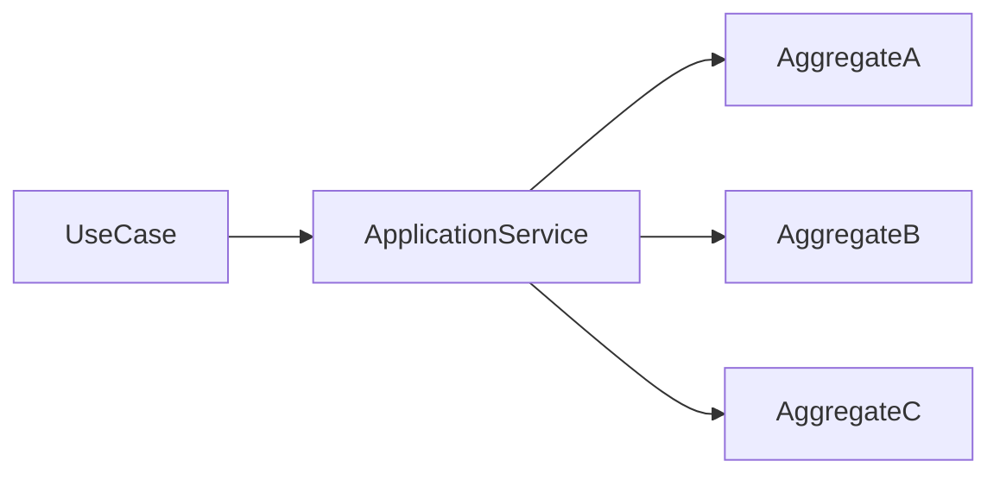
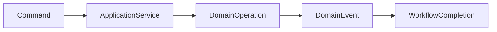
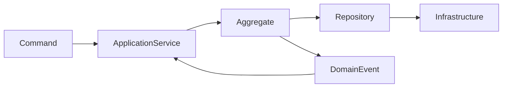
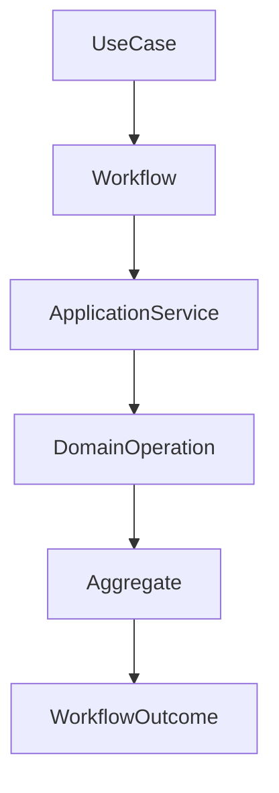
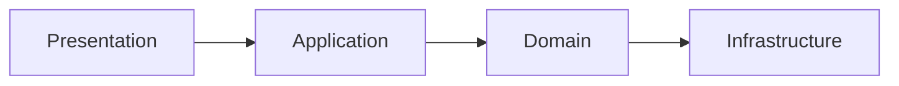
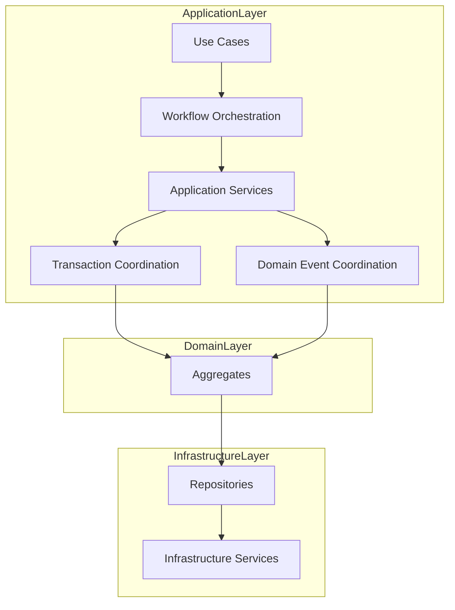

# ForgeOS Architecture — Workflow Orchestration

**Document ID:** ARCH-APP-0003

**Title:** Workflow Orchestration

**Status:** Approved

**Version:** 1.0.0

**Derived From**

- TDS-0004 — Application Model

**Related Documents**

- ARCH-APP-0001 — Application Model
- ARCH-APP-0002 — Application Services
- TDS-0002 — Domain Model
- TDS-0003 — Organization Model

---

# Purpose

This document provides the **Workflow Orchestration View** of the ForgeOS Application Model.

It visualizes how Application Services coordinate execution across multiple domain operations while preserving aggregate ownership, transaction boundaries, and organizational responsibilities defined by **TDS-0004**.

This document introduces **no new architectural decisions**.

Workflow behavior remains authoritatively defined by **TDS-0004**.

---

# Scope

This view illustrates:

- workflow orchestration;
- execution sequencing;
- orchestration relationships;
- aggregate coordination;
- implementation mapping.

Business rules, transaction semantics, and domain ownership remain defined exclusively by **TDS-0004**.

---

# Architectural Traceability

| Concern | Authoritative Source |
|----------|----------------------|
| Workflow Orchestration | TDS-0004 |
| Application Services | TDS-0004 |
| Transaction Coordination | TDS-0004 |
| Domain Event Handling | TDS-0004 |
| Application Invariants | TDS-0004 |

This document is a **derived architectural view** only.

---

# Workflow Orchestration Topology

Application Services coordinate execution across multiple domain operations.

The Application Service coordinates workflow execution.

Each aggregate remains responsible for its own business consistency.

---

# Workflow Execution Model

Workflow execution progresses through explicit orchestration stages.

The workflow illustrates application coordination.

Business decisions remain within the Domain Layer.

---

# Workflow Responsibilities

Application orchestration coordinates the following concerns.

| Workflow Responsibility | Coordinated By |
|--------------------------|----------------|
| Use Case Execution | Application Service |
| Aggregate Coordination | Application Service |
| Transaction Scope | Application Service |
| Domain Event Coordination | Application Service |
| Workflow Completion | Application Service |

These responsibilities derive directly from **TDS-0004**.

---

# Workflow Principles

This view visualizes the following approved principles from **TDS-0004**.

- Workflows are explicitly coordinated.
- Aggregate ownership remains unchanged.
- Transactions remain explicit.
- Application Services orchestrate rather than decide.
- Domain events communicate completed business facts.

These principles remain authoritative in **TDS-0004**.

---

# Relationship to Other Application Views

This document focuses on **workflow execution**.

The remaining application architecture views address:

| Document | Primary Perspective |
|----------|---------------------|
| Application Model | Application topology |
| Application Services | Service decomposition |
| Workflow Orchestration | Execution coordination |
| Command–Query Model | Request processing |
| Integration Boundaries | External interaction |

Together they provide complementary implementation perspectives while preserving **TDS-0004** as the authoritative specification.

*End of Part 1.*

# Workflow Collaboration View

This section visualizes how Application Services coordinate workflow execution across the Application and Domain Layers while preserving the orchestration, transaction, and ownership rules defined by **TDS-0004**.

The diagrams in this section illustrate workflow coordination only.

They do not redefine business behavior, transaction semantics, domain ownership, or application responsibilities.

---

# Workflow Collaboration Model

Application Services coordinate execution across multiple architectural responsibilities.

Application Services remain the orchestration point throughout workflow execution.

Business ownership remains within the Domain Layer.

---

# Workflow Execution Relationships

The relationship between orchestration and domain execution is illustrated below.

Workflow progression remains coordinated by the Application Layer.

Business decisions remain inside aggregates.

---

# Workflow Coordination Responsibilities

Application Services coordinate multiple execution concerns.

| Coordinated Concern | Coordinated By |
|---------------------|----------------|
| Workflow Initiation | Application Service |
| Aggregate Sequencing | Application Service |
| Transaction Coordination | Application Service |
| Domain Event Coordination | Application Service |
| Workflow Completion | Application Service |

These responsibilities derive directly from **TDS-0004**.

---

# Execution Boundaries

Workflow execution occurs through explicit architectural boundaries.

The workflow preserves architectural isolation.

Execution never bypasses approved domain contracts.

---

# Workflow Stability

Implementation may optimize execution sequences.

Implementation shall preserve:

- workflow orchestration;
- aggregate isolation;
- transaction coordination;
- domain ownership;
- application-layer responsibility.

These characteristics remain stable throughout implementation.

---

# Relationship to Other Application Views

The Workflow Orchestration View focuses on **execution coordination**.

The Application Services View focuses on **service responsibilities**.

The Command–Query Model focuses on **request processing**.

Together these architectural views provide complementary implementation guidance while preserving **TDS-0004** as the authoritative specification.

---

# Architectural Traceability

Every workflow relationship shown in this document derives directly from:

- TDS-0004 — Application Model

This document introduces no additional workflow semantics or orchestration responsibilities.

*End of Part 2.*

# Implementation Guidance

This document provides the implementation-oriented **Workflow Orchestration View** of the ForgeOS Application Model.

Implementation teams should use this view to understand how application workflows coordinate execution while preserving domain ownership, transaction boundaries, aggregate isolation, and organizational responsibilities.

Workflow semantics remain defined exclusively by **TDS-0004**.

---

# Workflow Implementation Mapping

The conceptual workflow responsibilities map to implementation concerns as follows.

| Workflow Responsibility | Implementation Responsibility |
|-------------------------|-------------------------------|
| Workflow Initiation | Use case coordination |
| Aggregate Sequencing | Application orchestration |
| Transaction Coordination | Transaction management |
| Domain Event Coordination | Event orchestration |
| Workflow Completion | Execution outcome coordination |

This mapping supports implementation planning.

It does not prescribe implementation technology or programming constructs.

---

# Workflow Topology During Implementation

Implementation shall preserve the approved workflow decomposition.

The topology illustrates orchestration responsibilities.

It does not prescribe runtime deployment or implementation structure.

---

# Workflow Boundaries

Implementation shall preserve the following workflow boundaries.

- Every workflow has one coordinating Application Service.
- Aggregate ownership remains unchanged.
- Transaction boundaries remain explicit.
- Workflow coordination remains independent of business decisions.
- Domain events communicate completed business facts.
- Infrastructure remains outside workflow orchestration.

These boundaries derive directly from **TDS-0004**.

---

# Relationship to Other Application Views

This document complements the remaining application architecture views.

| Document | Primary Perspective |
|----------|---------------------|
| Application Model | Application topology |
| Application Services | Service decomposition |
| Workflow Orchestration | Workflow execution |
| Command–Query Model | Request coordination |
| Integration Boundaries | External interaction |

Together these views provide implementation clarity while preserving **TDS-0004** as the sole authoritative application specification.

---

# Architectural Traceability

Every workflow orchestration concept visualized by this document originates from approved architectural authority.

| Concern | Authoritative Source |
|----------|----------------------|
| Workflow Orchestration | TDS-0004 |
| Application Services | TDS-0004 |
| Transaction Coordination | TDS-0004 |
| Domain Event Handling | TDS-0004 |
| Architecture Enforcement | ARCH-0003 |

This document introduces no new application architecture.

---

# Usage During Implementation

Implementation teams should reference this document when:

- implementing workflow orchestration;
- coordinating aggregate execution;
- implementing transaction boundaries;
- sequencing application activities;
- coordinating domain event reactions.

Workflow semantics and orchestration responsibilities shall always be obtained from **TDS-0004**.

---

# Codex Readiness

## Implementation Status

**Ready for implementation of ForgeOS workflow orchestration.**

Using this document together with **TDS-0004**, a Senior Software Engineer can:

- implement workflow coordination;
- preserve orchestration responsibilities;
- coordinate aggregate interactions;
- maintain explicit transaction boundaries;
- integrate domain event handling into application workflows.

No additional architectural decisions are required to implement workflow orchestration.

---

# Architectural Authority

This document is a **derived architectural view**.

It is **not** an authoritative source of application architecture.

This document shall not be used to introduce or modify:

- workflow semantics;
- orchestration responsibilities;
- transaction boundaries;
- domain event coordination;
- application-layer invariants.

Any changes to those concepts shall first be made in **TDS-0004** and then reflected in this document.

---

# Document Completion

This document is complete.

It provides the implementation-oriented **Workflow Orchestration View** of the ForgeOS Application Model and serves as the architectural reference for implementing application workflows while preserving the approved ForgeOS application architecture.