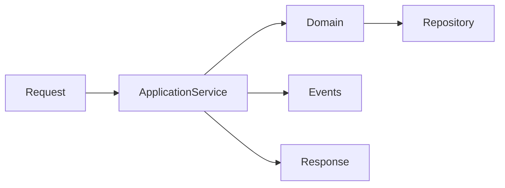
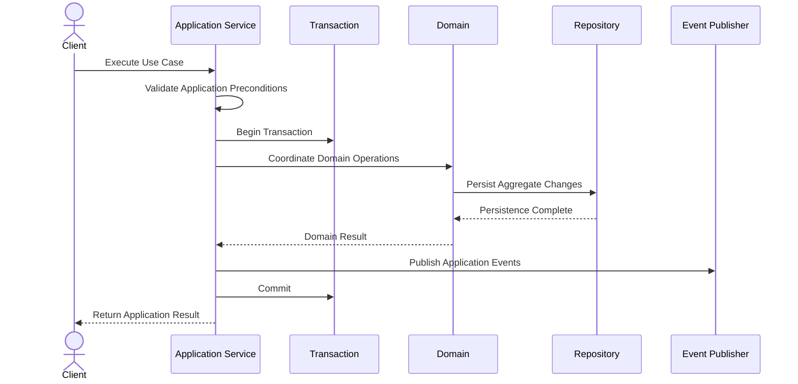
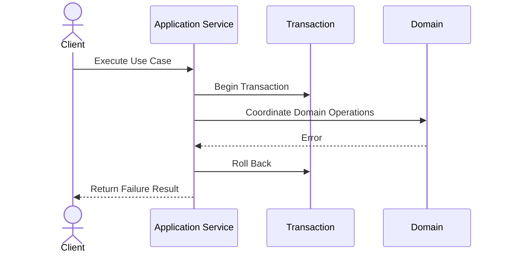
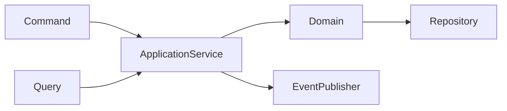
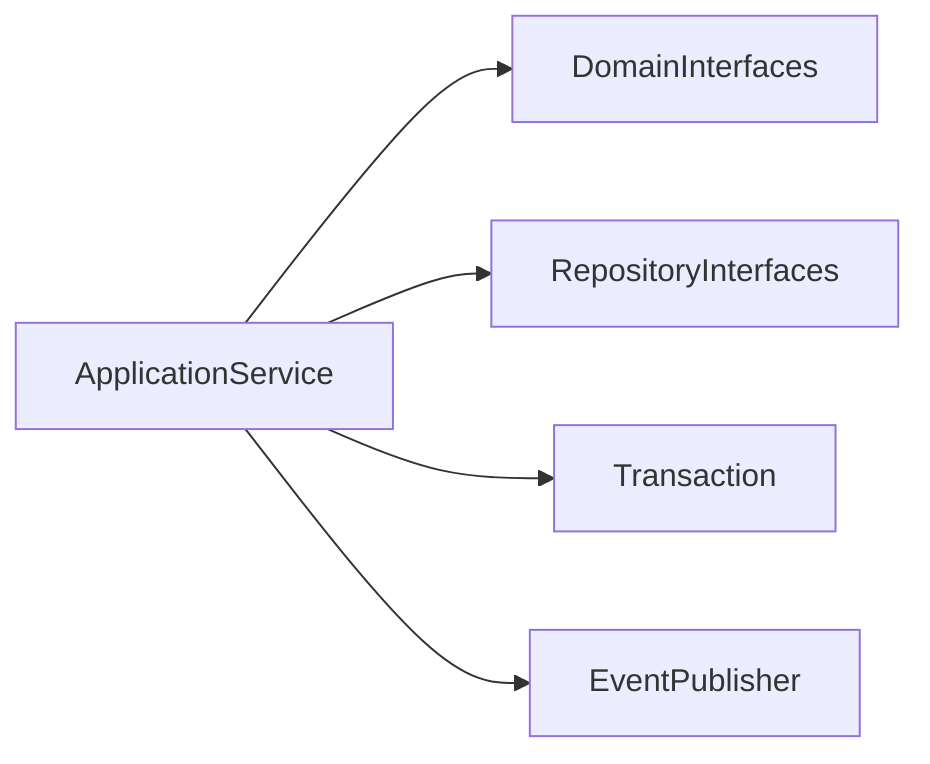

# Implementation Specification

# ISP-0001 — Application Service Pattern

**Status:** Approved

**Version:** 1.0.0

**Authoritative Level:** Implementation Specification

---

# Purpose

This document defines the canonical implementation pattern for Application Services in ForgeOS.

Unlike the Technical Design Specifications (TDS), this document does **not** define architecture.

Instead, it standardizes how the approved Application Architecture is implemented consistently across the repository.

This specification derives entirely from:

- TDS-0004 — Application Model
- TDS-0002 — Domain Model
- TDS-0003 — Organization Model

No architectural authority is introduced by this document.

---

# Scope

This specification defines:

- Application Service responsibilities;
- implementation structure;
- dependency expectations;
- orchestration flow;
- transaction ownership;
- interaction with domain components;
- implementation invariants.

This specification does **not** define:

- business rules;
- domain models;
- repository implementations;
- transport protocols;
- dependency injection mechanisms;
- infrastructure technologies.

Those concerns remain owned by their respective authoritative specifications.

---

# Architectural Traceability

| Concern | Authoritative Source |
|----------|----------------------|
| Application Services | TDS-0004 |
| Workflow Coordination | TDS-0004 |
| Aggregate Ownership | TDS-0002 |
| Organizational Responsibilities | TDS-0003 |
| Architecture Enforcement | ARCH-0003 |

---

# Application Service Purpose

An Application Service coordinates a complete application use case.

Its responsibility is orchestration.

It is responsible for **how** work is coordinated, never **what** business decisions are made.

Business decisions always remain inside the Domain Layer.

---

# Canonical Responsibilities

Every Application Service shall:

- coordinate exactly one primary use case;
- invoke domain behavior through approved interfaces;
- establish transaction boundaries;
- coordinate multiple aggregates when required;
- publish resulting application events;
- coordinate external integrations through approved boundaries;
- return an application outcome.

An Application Service shall never:

- contain business rules;
- bypass aggregate boundaries;
- manipulate persistence directly;
- communicate with external providers directly;
- own business state.

---

# Conceptual Structure

Every Application Service follows the same conceptual structure.



The diagram illustrates implementation responsibilities.

It does not prescribe Rust syntax or concrete framework usage.

---

# Application Service Lifecycle

Every execution follows the same high-level lifecycle.

```text
Receive Request
        ↓
Validate Application Preconditions
        ↓
Begin Transaction
        ↓
Coordinate Domain Operations
        ↓
Publish Application Events
        ↓
Commit / Roll Back
        ↓
Return Result
```

Business validation occurs inside the Domain Layer.

Application Services validate only application-level concerns.

---

# Dependency Rules

Application Services may depend on:

- Domain interfaces;
- Repository interfaces;
- Transaction abstraction;
- Event publication abstraction;
- Application contracts.

Application Services shall not depend directly on:

- SQL implementations;
- ORM implementations;
- HTTP clients;
- AI SDKs;
- file systems;
- concrete infrastructure components.

Infrastructure dependencies remain behind architectural interfaces.

---

# Implementation Invariants

The following invariants are mandatory.

1. Every use case has exactly one coordinating Application Service.
2. Application Services contain no business rules.
3. Application Services preserve aggregate ownership.
4. Transactions begin and end within the Application Layer.
5. Domain behavior is accessed only through approved interfaces.
6. External interaction occurs only through Integration Boundaries.
7. Application Services remain deterministic for equivalent inputs.

These invariants standardize implementation while preserving the approved architecture.

*End of Part 1.*

# Canonical Execution Flow

This section defines the standard execution flow implemented by every ForgeOS Application Service.

The sequence standardizes implementation.

It does not modify the architectural responsibilities defined by **TDS-0004**.

---

# Execution Sequence

Every Application Service executes the following conceptual sequence.



This sequence is normative for successful execution.

Implementation technology may vary without changing the sequence.

---

# Failure Sequence

Application Services coordinate failure recovery.



Business errors originate from the Domain Layer.

Application Services coordinate recovery.

---

# Orchestration Responsibilities

During execution an Application Service is responsible for:

| Stage | Responsibility |
|--------|----------------|
| Request Reception | Accept application request |
| Preconditions | Validate application-level requirements |
| Transaction | Coordinate transaction scope |
| Domain Coordination | Invoke domain behavior |
| Event Publication | Publish resulting application events |
| Completion | Return application outcome |

The Domain Layer remains responsible for business decisions.

---

# Interaction Model

Application Services coordinate interactions with other implementation components.



Application Services remain the central orchestration component.

---

# Request Coordination

Application Services coordinate both Commands and Queries.

## Commands

Commands initiate workflows that modify business state.

Application Services coordinate:

- transaction creation;
- aggregate interaction;
- event publication;
- completion.

---

## Queries

Queries retrieve information without modifying business state.

Application Services coordinate:

- read model access;
- response construction;
- application-level validation.

Queries remain free of side effects.

---

# Transaction Ownership

Transaction ownership remains within the Application Layer.

Application Services:

- begin transactions;
- coordinate execution;
- commit successful execution;
- roll back failed execution.

Aggregates never manage transaction scope.

---

# Event Coordination

Application Services coordinate publication of application-visible events after successful execution.

The publishing Domain remains the authoritative owner of every Domain Event.

Application Services:

- publish;
- dispatch;
- coordinate follow-up workflows.

Application Services never modify published events.

---

# Implementation Consistency Rules

Every Application Service implementation shall preserve the following characteristics.

- identical execution stages;
- explicit transaction boundaries;
- deterministic orchestration;
- aggregate isolation;
- explicit completion paths;
- explicit failure paths.

These rules enable consistent implementation across all ForgeOS vertical slices.

*End of Part 2.*

# Recommended Implementation Structure

This section defines the recommended implementation structure for ForgeOS Application Services.

The purpose is to establish a consistent implementation pattern across every vertical slice.

The structure described here derives entirely from the approved ForgeOS architecture.

It introduces no new architectural authority.

---

# Canonical Service Structure

Every Application Service should follow the same conceptual organization.

```text
Application Service
├── Public Interface
├── Dependencies
├── Execute()
│
├── Validate Application Preconditions
├── Begin Transaction
├── Coordinate Domain Operations
├── Publish Application Events
├── Complete Transaction
└── Return Application Result
```

This structure standardizes orchestration while allowing implementation details to evolve.

---

# Conceptual Rust Structure

The following illustrates the conceptual organization of an Application Service.

```text
ApplicationService

├── constructor(...)
├── execute(...)
│
├── validate_request(...)
├── coordinate_domain(...)
├── publish_events(...)
└── build_result(...)
```

Method names are illustrative.

Concrete naming remains a repository implementation decision.

---

# Dependency Structure

Every Application Service depends on abstractions rather than concrete implementations.



Concrete infrastructure implementations remain outside the Application Layer.

---

# Trait Boundaries

Application Services expose a stable application interface.

Implementation should preserve the following conceptual boundaries.

| Boundary | Responsibility |
|----------|----------------|
| Public Interface | Entry point for use case execution |
| Domain Interface | Business interaction |
| Repository Interface | Persistence abstraction |
| Transaction Interface | Transaction coordination |
| Event Interface | Event publication |

These are implementation contracts rather than architectural contracts.

---

# Construction Principles

Application Services should be:

- constructed through dependency injection;
- immutable after construction;
- independent of concrete infrastructure;
- reusable across execution contexts;
- deterministic for identical inputs.

Construction mechanisms remain implementation concerns.

---

# Testing Expectations

Every Application Service should be independently testable.

Implementation should support:

- isolated unit testing;
- mocked dependencies;
- deterministic execution;
- transaction verification;
- event publication verification;
- orchestration verification.

Business rule verification remains the responsibility of Domain tests.

---

# Implementation Mapping

The conceptual implementation responsibilities map to engineering responsibilities as follows.

| Implementation Concern | Primary Responsibility |
|------------------------|------------------------|
| Service Construction | Dependency composition |
| Request Validation | Application validation |
| Domain Coordination | Orchestration |
| Transaction Scope | Transaction abstraction |
| Event Publication | Event abstraction |
| Result Construction | Application response |

This mapping standardizes implementation without prescribing specific frameworks or libraries.

---

# Service Quality Objectives

Every Application Service implementation should exhibit the following characteristics.

- cohesive responsibilities;
- minimal dependencies;
- explicit orchestration;
- deterministic execution;
- implementation independence;
- high testability;
- stable public interfaces.

These objectives support long-term maintainability while remaining consistent with the approved ForgeOS architecture.

---

# Implementation Notes

This specification intentionally avoids defining:

- concrete Rust syntax;
- dependency injection frameworks;
- async runtime selection;
- serialization libraries;
- transport protocols;
- persistence frameworks.

Those decisions belong to implementation and future technology-specific guidance rather than the architectural or implementation pattern itself.

*End of Part 3.*

# Implementation Anti-Patterns

The following implementation patterns are prohibited because they violate the approved ForgeOS architecture.

## Business Logic in Application Services

Application Services shall not implement business rules.

Business decisions belong exclusively to the Domain Layer.

---

## Infrastructure Coupling

Application Services shall not depend directly on:

- database implementations;
- HTTP clients;
- AI SDKs;
- filesystem APIs;
- message brokers;
- external provider SDKs.

Infrastructure interaction shall occur through approved abstractions.

---

## Aggregate Boundary Violations

Application Services shall not:

- manipulate aggregate state directly;
- bypass aggregate methods;
- coordinate persistence independently of repository abstractions.

Aggregate consistency remains the responsibility of the Domain Layer.

---

## Hidden Orchestration

Application execution shall not rely on:

- implicit side effects;
- hidden transactions;
- undocumented execution sequences;
- runtime-discovered orchestration.

Execution flow shall remain explicit and reviewable.

---

## Transaction Leakage

Transaction scope shall not extend outside the Application Layer.

Repositories, aggregates, and infrastructure components shall not own transaction lifecycles.

---

# Implementation Compliance Checklist

Every Application Service implementation should satisfy the following checklist before acceptance.

| Requirement | Verification |
|-------------|--------------|
| One primary use case | Code review / architecture verification |
| No business rules | Domain review |
| Explicit transaction scope | Automated architecture verification |
| Uses approved interfaces | Static dependency analysis |
| No infrastructure coupling | Static dependency analysis |
| Aggregate boundaries preserved | Unit and integration testing |
| Event publication explicit | Automated testing |
| Deterministic orchestration | Unit testing |

This checklist is intended for both human review and automated enforcement.

---

# Repository Verification

Repository tooling should be capable of verifying the implementation pattern automatically.

Recommended verification includes:

- architectural dependency analysis;
- forbidden dependency detection;
- interface conformance;
- transaction ownership validation;
- application service discovery;
- architecture regression detection.

These checks complement the Architecture Enforcement Specification (`ARCH-0003`).

---

# Relationship to Future Implementation Specifications

This document establishes the implementation pattern for **Application Services** only.

Subsequent Implementation Specifications will refine adjacent concerns.

| Specification | Responsibility |
|--------------|----------------|
| ISP-0001 | Application Services |
| ISP-0002 | Command Handlers |
| ISP-0003 | Query Handlers |
| ISP-0004 | Repository Pattern |
| ISP-0005 | Domain Event Pattern |
| ISP-0006 | Transaction Pattern |
| ISP-0007 | Dependency Injection Pattern |
| ISP-0008 | Error Handling Pattern |
| ISP-0009 | Testing Pattern |
| ISP-0010 | Vertical Slice Pattern |

Together these documents form the canonical ForgeOS implementation standard.

---

# Codex Implementation Guidance

When generating or modifying Application Services, Codex should:

- preserve the approved orchestration lifecycle;
- keep business logic within the Domain Layer;
- depend only on approved abstractions;
- maintain explicit transaction ownership;
- preserve aggregate isolation;
- publish events through approved interfaces;
- produce deterministic, testable orchestration.

If a requested implementation would violate this specification or the approved architecture, the implementation should be revised rather than introducing an architectural exception.

---

# Codex Readiness

## Implementation Status

**Ready for implementation of ForgeOS Application Services.**

Using this specification together with the approved TDSs and derived architecture views, a Senior Software Engineer or Codex can consistently implement Application Services without inventing orchestration patterns, dependency structures, or lifecycle management.

No additional implementation decisions are required before creating the first Application Service.

---

# Implementation Authority

This document is an **Implementation Specification**.

It standardizes implementation of the approved architecture.

It shall **not** be used to introduce or modify:

- architectural boundaries;
- domain ownership;
- workflow semantics;
- transaction semantics;
- organizational authority.

Any changes to those concerns shall first be made in the authoritative TDS documents and then propagated through the derived architecture views before this specification is updated.

---

# Document Completion

This document is complete.

It establishes the canonical implementation pattern for ForgeOS Application Services and serves as the implementation reference for all future Application Service development. It bridges the approved architecture to executable code while preserving the architectural authority established by the TDS series.