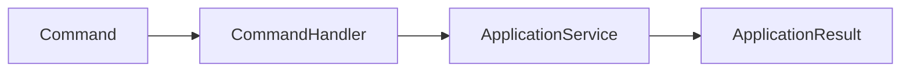
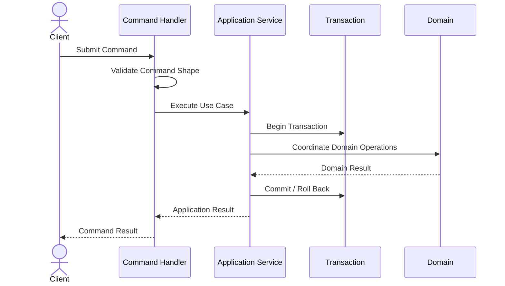
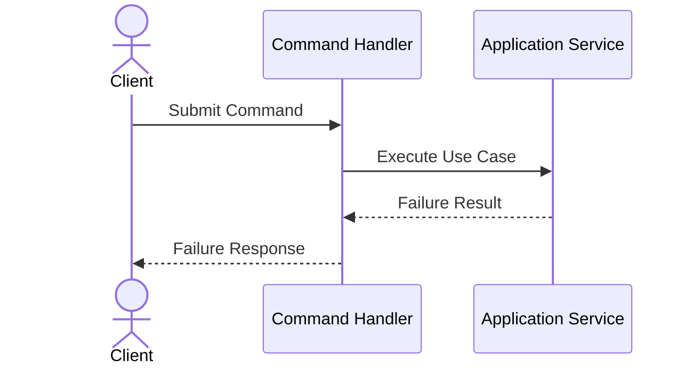
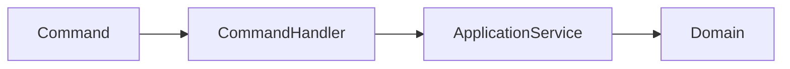
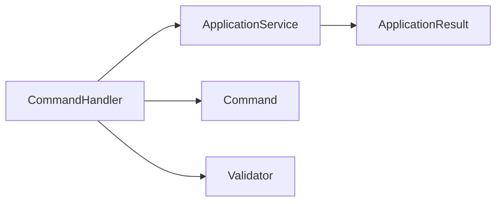

# Implementation Specification

# ISP-0002 — Command Handler Pattern

**Status:** Approved

**Version:** 1.0.0

**Authoritative Level:** Implementation Specification

---

# Purpose

This document defines the canonical implementation pattern for Command Handlers in ForgeOS.

A Command Handler is responsible for coordinating the execution of a single state-changing application request.

This specification standardizes implementation.

It introduces no architectural authority.

The architectural responsibilities remain defined by:

- TDS-0004 — Application Model
- ISP-0001 — Application Service Pattern

---

# Scope

This specification defines:

- command handler responsibilities;
- execution lifecycle;
- dependency expectations;
- transaction participation;
- interaction with Application Services;
- implementation invariants.

This specification does **not** define:

- business rules;
- domain models;
- repository implementations;
- infrastructure technologies;
- transport protocols.

Those concerns remain owned by their respective authoritative specifications.

---

# Architectural Traceability

| Concern | Authoritative Source |
|----------|----------------------|
| Commands | TDS-0004 |
| Application Services | TDS-0004 |
| Workflow Coordination | TDS-0004 |
| Application Service Pattern | ISP-0001 |
| Architecture Enforcement | ARCH-0003 |

---

# Command Handler Purpose

A Command Handler coordinates the execution of one Command.

Its responsibility is execution coordination.

It converts an application request into coordinated domain activity while preserving aggregate ownership and transaction boundaries.

Business decisions always remain within the Domain Layer.

---

# Canonical Responsibilities

Every Command Handler shall:

- coordinate exactly one Command type;
- invoke exactly one Application Service;
- propagate application context;
- coordinate execution outcomes;
- return one application result.

A Command Handler shall never:

- contain business rules;
- coordinate multiple unrelated Commands;
- access repositories directly;
- invoke infrastructure implementations directly;
- bypass the Application Service.

---

# Conceptual Structure

Every Command Handler follows the same conceptual structure.



The Command Handler delegates orchestration to the Application Service.

It does not replace it.

---

# Execution Lifecycle

Every Command Handler follows the same high-level lifecycle.

```text
Receive Command
        ↓
Validate Command Shape
        ↓
Invoke Application Service
        ↓
Receive Application Result
        ↓
Return Command Result
```

Validation performed by the Command Handler is limited to application-level request integrity.

Business validation remains within the Domain Layer.

---

# Dependency Rules

Command Handlers may depend on:

- Application Service interfaces;
- Command contracts;
- Application result types;
- Validation abstractions.

Command Handlers shall not depend directly on:

- repositories;
- aggregates;
- persistence implementations;
- external providers;
- infrastructure services.

These dependencies remain behind the Application Service.

---

# Implementation Invariants

The following invariants are mandatory.

1. Every Command has exactly one Command Handler.
2. Every Command Handler coordinates exactly one Command type.
3. Every Command Handler invokes exactly one Application Service.
4. Command Handlers contain no business rules.
5. Command Handlers never access infrastructure directly.
6. Command execution remains deterministic for equivalent inputs.
7. Aggregate ownership is preserved throughout execution.

These invariants establish a consistent implementation model for state-changing requests.

*End of Part 1.*

# Canonical Execution Flow

This section defines the standard execution flow implemented by every ForgeOS Command Handler.

The purpose is to ensure that every state-changing request follows an identical implementation pattern.

This specification derives entirely from the approved architecture.

It introduces no new architectural authority.

---

# Execution Sequence

Every Command Handler executes the following conceptual sequence.



The Command Handler delegates orchestration to the Application Service.

It never coordinates domain behavior directly.

---

# Failure Sequence

Command Handlers coordinate propagation of execution failures.



Failure recovery remains the responsibility of the Application Service.

Business failures originate from the Domain Layer.

---

# Command Validation

Command validation performed by the Command Handler is limited to application-level concerns.

Permitted validation includes:

- request completeness;
- required field presence;
- basic structural integrity;
- command contract conformance.

Command Handlers shall not perform:

- business validation;
- aggregate validation;
- authorization decisions owned by the Domain Layer;
- business invariant verification.

---

# Application Service Interaction

Each Command Handler coordinates exactly one Application Service.



This interaction remains stable across every ForgeOS implementation.

---

# Transaction Participation

Command Handlers participate in transaction execution without owning transaction scope.

Command Handlers:

- initiate application execution;
- invoke the appropriate Application Service;
- propagate execution outcomes.

Application Services:

- establish transaction scope;
- coordinate domain execution;
- complete or roll back transactions.

Transaction ownership never moves into the Command Handler.

---

# Result Propagation

Command Handlers translate application outcomes into command results.

The translation shall:

- preserve execution status;
- preserve domain outcomes;
- avoid modifying business information;
- remain deterministic.

Business interpretation remains outside the Command Handler.

---

# Implementation Consistency Rules

Every Command Handler implementation shall preserve the following characteristics.

- one command type;
- one Application Service;
- explicit execution flow;
- deterministic behavior;
- no infrastructure coupling;
- no business rules;
- explicit success and failure paths.

These rules standardize state-changing request handling across all ForgeOS vertical slices.

*End of Part 2.*

# Recommended Implementation Structure

This section defines the recommended implementation structure for ForgeOS Command Handlers.

Its purpose is to establish a consistent implementation pattern for every state-changing application request.

This structure derives entirely from the approved ForgeOS architecture.

It introduces no new architectural authority.

---

# Canonical Handler Structure

Every Command Handler should follow the same conceptual organization.

```text
Command Handler
├── Public Interface
├── Dependencies
├── Handle()
│
├── Validate Command Shape
├── Invoke Application Service
├── Translate Application Result
└── Return Command Result
```

This structure standardizes request coordination while allowing implementation details to evolve independently.

---

# Conceptual Rust Structure

The following illustrates the conceptual organization of a Command Handler.

```text
CommandHandler

├── constructor(...)
├── handle(...)
│
├── validate_command(...)
├── execute_application(...)
└── build_result(...)
```

Method names are illustrative.

Concrete naming conventions remain an implementation decision governed by repository standards.

---

# Dependency Structure

Every Command Handler depends exclusively on abstractions.



Concrete infrastructure implementations remain outside the Command Handler.

---

# Interface Boundaries

Command Handlers expose one stable application interface.

Implementation should preserve the following conceptual boundaries.

| Boundary | Responsibility |
|----------|----------------|
| Public Interface | Accept a single Command |
| Validation Interface | Verify command shape |
| Application Service Interface | Coordinate execution |
| Result Interface | Return application outcome |

These are implementation contracts rather than architectural contracts.

---

# Construction Principles

Command Handlers should be:

- constructed through dependency injection;
- immutable after construction;
- independent of infrastructure implementations;
- stateless between executions;
- deterministic for identical inputs.

Construction mechanisms remain implementation concerns.

---

# Testing Expectations

Every Command Handler should be independently testable.

Implementation should support:

- isolated unit testing;
- mocked Application Services;
- deterministic execution verification;
- request validation verification;
- result propagation verification;
- success and failure path verification.

Business rule verification remains the responsibility of Domain tests.

---

# Implementation Mapping

The conceptual implementation responsibilities map to engineering responsibilities as follows.

| Implementation Concern | Primary Responsibility |
|------------------------|------------------------|
| Handler Construction | Dependency composition |
| Command Validation | Application request validation |
| Application Invocation | Execution delegation |
| Result Translation | Response construction |
| Failure Propagation | Outcome coordination |

This mapping standardizes implementation while remaining independent of language features and frameworks.

---

# Quality Objectives

Every Command Handler implementation should exhibit the following characteristics.

- single responsibility;
- explicit execution flow;
- minimal dependencies;
- deterministic behavior;
- implementation independence;
- high testability;
- stable public interface.

These objectives improve maintainability while remaining consistent with the approved ForgeOS architecture.

---

# Implementation Notes

This specification intentionally does not define:

- concrete Rust syntax;
- async runtime selection;
- serialization libraries;
- dependency injection frameworks;
- transport protocols;
- infrastructure implementations.

Those decisions belong to technology-specific implementation guidance rather than this implementation pattern.

*End of Part 3.*

# Implementation Anti-Patterns

The following implementation patterns are prohibited because they violate the approved ForgeOS architecture or this implementation specification.

## Business Logic in Command Handlers

Command Handlers shall not implement business rules.

Business decisions belong exclusively to the Domain Layer.

---

## Application Service Bypass

Command Handlers shall not:

- invoke aggregates directly;
- access repositories directly;
- coordinate domain workflows independently;
- establish transaction scope.

Application Services remain the orchestration layer.

---

## Infrastructure Coupling

Command Handlers shall not depend directly on:

- database implementations;
- ORM frameworks;
- HTTP clients;
- AI SDKs;
- filesystem APIs;
- messaging providers.

Infrastructure interaction remains outside the Command Handler.

---

## Multiple Command Ownership

A Command Handler shall coordinate exactly one Command type.

Multiple unrelated Commands shall not share a handler implementation.

---

## Hidden Execution

Command execution shall not rely on:

- implicit workflow sequencing;
- undocumented side effects;
- hidden infrastructure behavior;
- runtime-discovered orchestration.

Execution flow shall remain explicit, deterministic, and reviewable.

---

# Implementation Compliance Checklist

Every Command Handler implementation should satisfy the following checklist before acceptance.

| Requirement | Verification |
|-------------|--------------|
| One Command per Handler | Static analysis / code review |
| One Application Service invocation | Static dependency analysis |
| No business rules | Domain review |
| No infrastructure coupling | Static dependency analysis |
| Explicit request validation | Unit testing |
| Deterministic execution | Unit testing |
| Success and failure paths verified | Unit and integration testing |
| Stable public interface | API review |

This checklist is intended for both human review and automated repository verification.

---

# Repository Verification

Repository tooling should automatically verify Command Handler compliance.

Recommended verification includes:

- handler discovery;
- one-to-one command ownership;
- forbidden dependency detection;
- application service dependency verification;
- architecture regression detection;
- implementation conformance validation.

These checks complement the architectural enforcement defined by **ARCH-0003**.

---

# Relationship to Future Implementation Specifications

This document establishes the implementation pattern for **Command Handlers** only.

Subsequent specifications refine adjacent implementation concerns.

| Specification | Responsibility |
|--------------|----------------|
| ISP-0001 | Application Services |
| ISP-0002 | Command Handlers |
| ISP-0003 | Query Handlers |
| ISP-0004 | Repository Pattern |
| ISP-0005 | Domain Event Pattern |
| ISP-0006 | Transaction Pattern |
| ISP-0007 | Dependency Injection Pattern |
| ISP-0008 | Error Handling Pattern |
| ISP-0009 | Testing Pattern |
| ISP-0010 | Vertical Slice Pattern |

Together these documents define the canonical ForgeOS implementation standard.

---

# Codex Implementation Guidance

When generating or modifying Command Handlers, Codex should:

- implement one handler per Command;
- delegate orchestration to the Application Service;
- avoid business logic;
- avoid direct infrastructure dependencies;
- preserve deterministic execution;
- implement explicit success and failure paths;
- maintain stable dependency boundaries.

If a requested implementation violates this specification or the approved architecture, the implementation should be revised rather than introducing an architectural exception.

---

# Codex Readiness

## Implementation Status

**Ready for implementation of ForgeOS Command Handlers.**

Using this specification together with the approved TDSs, derived architecture views, and **ISP-0001**, a Senior Software Engineer or Codex can consistently implement Command Handlers without inventing execution patterns, dependency structures, or handler responsibilities.

No additional implementation decisions are required before implementing state-changing application requests.

---

# Implementation Authority

This document is an **Implementation Specification**.

It standardizes implementation of the approved architecture.

It shall **not** be used to introduce or modify:

- application architecture;
- workflow semantics;
- transaction ownership;
- domain ownership;
- aggregate responsibilities.

Changes to those concerns shall first be made in the authoritative TDS documents and then propagated through the derived architecture views before this specification is updated.

---

# Document Completion

This document is complete.

It establishes the canonical implementation pattern for ForgeOS Command Handlers and serves as the implementation reference for all state-changing application requests. Together with **ISP-0001**, it provides a consistent implementation contract for application orchestration while preserving the architectural authority established by the ForgeOS TDS series.