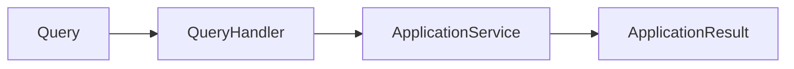
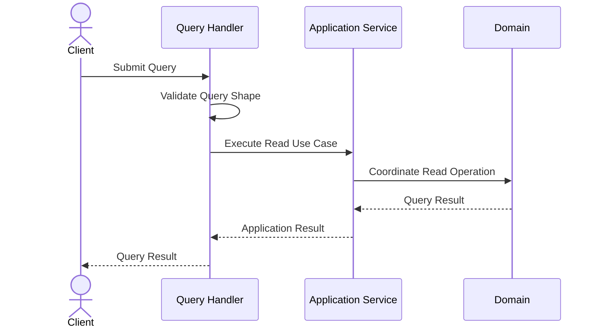
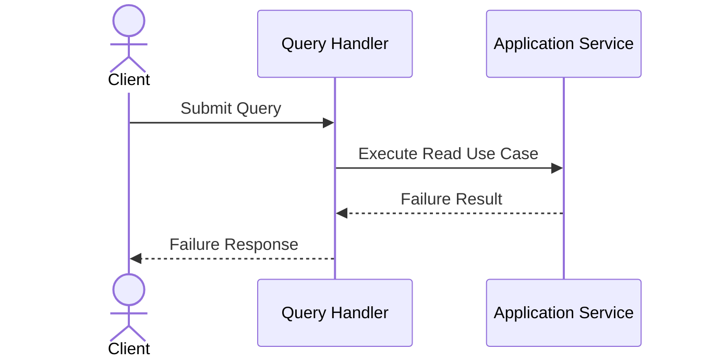
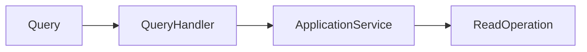
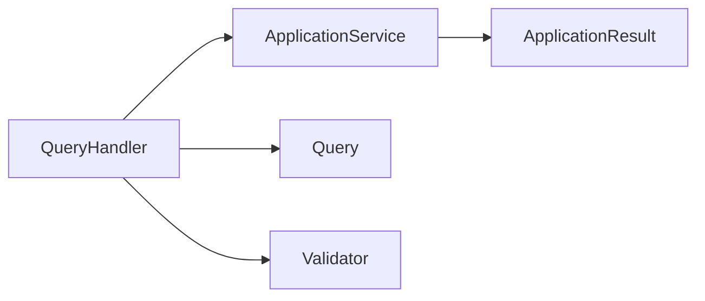

# Implementation Specification

# ISP-0003 — Query Handler Pattern

**Status:** Approved

**Version:** 1.0.0

**Authoritative Level:** Implementation Specification

---

# Purpose

This document defines the canonical implementation pattern for Query Handlers in ForgeOS.

A Query Handler is responsible for coordinating the execution of a single read-only application request.

Unlike Command Handlers, Query Handlers never modify business state.

This specification standardizes implementation.

It introduces no architectural authority.

The architectural responsibilities remain defined by:

- TDS-0004 — Application Model
- ISP-0001 — Application Service Pattern

---

# Scope

This specification defines:

- Query Handler responsibilities;
- execution lifecycle;
- dependency expectations;
- read coordination;
- interaction with Application Services;
- implementation invariants.

This specification does **not** define:

- business rules;
- domain models;
- persistence implementations;
- caching technologies;
- transport protocols;
- infrastructure technologies.

Those concerns remain owned by their respective authoritative specifications.

---

# Architectural Traceability

| Concern | Authoritative Source |
|----------|----------------------|
| Queries | TDS-0004 |
| Command–Query Separation | TDS-0004 |
| Application Services | TDS-0004 |
| Application Service Pattern | ISP-0001 |
| Architecture Enforcement | ARCH-0003 |

---

# Query Handler Purpose

A Query Handler coordinates one read-only application request.

Its responsibility is execution coordination.

It retrieves application information while preserving architectural isolation and ensuring that business state remains unchanged.

Business decisions always remain within the Domain Layer.

---

# Canonical Responsibilities

Every Query Handler shall:

- coordinate exactly one Query type;
- invoke exactly one Application Service;
- propagate application context;
- coordinate read execution;
- return one application result.

A Query Handler shall never:

- modify business state;
- contain business rules;
- coordinate unrelated Query types;
- invoke infrastructure implementations directly;
- bypass the Application Service.

---

# Conceptual Structure

Every Query Handler follows the same conceptual structure.



The Query Handler delegates orchestration to the Application Service.

It does not replace it.

---

# Execution Lifecycle

Every Query Handler follows the same high-level lifecycle.

```text id="4j8mpu"
Receive Query
        ↓
Validate Query Shape
        ↓
Invoke Application Service
        ↓
Receive Application Result
        ↓
Return Query Result
```

Validation performed by the Query Handler is limited to application-level request integrity.

Business interpretation remains within the Domain Layer.

---

# Dependency Rules

Query Handlers may depend on:

- Application Service interfaces;
- Query contracts;
- Application result types;
- Validation abstractions.

Query Handlers shall not depend directly on:

- repositories;
- aggregates;
- persistence implementations;
- external providers;
- infrastructure services.

Infrastructure dependencies remain behind the Application Service.

---

# Read Consistency

Every Query Handler shall preserve the following characteristics.

- read-only execution;
- deterministic behavior;
- side-effect-free processing;
- explicit response construction;
- architectural isolation.

Read execution shall never modify business state.

---

# Implementation Invariants

The following invariants are mandatory.

1. Every Query has exactly one Query Handler.
2. Every Query Handler coordinates exactly one Query type.
3. Every Query Handler invokes exactly one Application Service.
4. Query Handlers contain no business rules.
5. Query execution remains side-effect free.
6. Query Handlers never access infrastructure directly.
7. Query execution remains deterministic for equivalent inputs.

These invariants establish a consistent implementation model for read-only application requests.

*End of Part 1.*

# Canonical Execution Flow

This section defines the standard execution flow implemented by every ForgeOS Query Handler.

The purpose is to ensure that every read-only application request follows an identical implementation pattern.

This specification derives entirely from the approved architecture.

It introduces no new architectural authority.

---

# Execution Sequence

Every Query Handler executes the following conceptual sequence.



The Query Handler delegates orchestration to the Application Service.

It never coordinates domain behavior directly.

---

# Failure Sequence

Query Handlers coordinate propagation of execution failures.



Failure handling remains coordinated by the Application Service.

Business interpretation remains outside the Query Handler.

---

# Query Validation

Query validation performed by the Query Handler is limited to application-level concerns.

Permitted validation includes:

- request completeness;
- required parameter presence;
- structural integrity;
- query contract conformance.

Query Handlers shall not perform:

- business validation;
- authorization decisions owned by the Domain Layer;
- business invariant verification;
- aggregate consistency checks.

---

# Application Service Interaction

Each Query Handler coordinates exactly one Application Service.



This interaction remains stable across every ForgeOS implementation.

---

# Read Coordination

Query Handlers coordinate read execution without modifying business state.

Query Handlers:

- initiate read execution;
- invoke the appropriate Application Service;
- propagate application outcomes.

Application Services:

- coordinate read operations;
- invoke domain read behavior;
- return application results.

No transaction ownership is introduced by the Query Handler.

---

# Result Propagation

Query Handlers translate application outcomes into query results.

The translation shall:

- preserve returned information;
- preserve execution status;
- avoid modifying business data;
- remain deterministic.

Business interpretation remains outside the Query Handler.

---

# Implementation Consistency Rules

Every Query Handler implementation shall preserve the following characteristics.

- one Query type;
- one Application Service;
- explicit execution flow;
- deterministic behavior;
- no infrastructure coupling;
- no business rules;
- side-effect-free execution;
- explicit success and failure paths.

These rules standardize read-only request handling across all ForgeOS vertical slices.

*End of Part 2.*

# Recommended Implementation Structure

This section defines the recommended implementation structure for ForgeOS Query Handlers.

Its purpose is to establish a consistent implementation pattern for every read-only application request.

The structure described here derives entirely from the approved ForgeOS architecture.

It introduces no new architectural authority.

---

# Canonical Handler Structure

Every Query Handler should follow the same conceptual organization.

```text
Query Handler
├── Public Interface
├── Dependencies
├── Handle()
│
├── Validate Query Shape
├── Invoke Application Service
├── Translate Application Result
└── Return Query Result
```

This structure standardizes read coordination while allowing implementation details to evolve independently.

---

# Conceptual Rust Structure

The following illustrates the conceptual organization of a Query Handler.

```text
QueryHandler

├── constructor(...)
├── handle(...)
│
├── validate_query(...)
├── execute_application(...)
└── build_result(...)
```

Method names are illustrative.

Concrete naming conventions remain an implementation decision governed by repository standards.

---

# Dependency Structure

Every Query Handler depends exclusively on abstractions.



Concrete infrastructure implementations remain outside the Query Handler.

---

# Interface Boundaries

Query Handlers expose one stable application interface.

Implementation should preserve the following conceptual boundaries.

| Boundary | Responsibility |
|----------|----------------|
| Public Interface | Accept a single Query |
| Validation Interface | Verify query shape |
| Application Service Interface | Coordinate read execution |
| Result Interface | Return application outcome |

These are implementation contracts rather than architectural contracts.

---

# Construction Principles

Query Handlers should be:

- constructed through dependency injection;
- immutable after construction;
- independent of infrastructure implementations;
- stateless between executions;
- deterministic for identical inputs.

Construction mechanisms remain implementation concerns.

---

# Testing Expectations

Every Query Handler should be independently testable.

Implementation should support:

- isolated unit testing;
- mocked Application Services;
- deterministic execution verification;
- query validation verification;
- result propagation verification;
- success and failure path verification;
- side-effect verification.

Business rule verification remains the responsibility of Domain tests.

---

# Implementation Mapping

The conceptual implementation responsibilities map to engineering responsibilities as follows.

| Implementation Concern | Primary Responsibility |
|------------------------|------------------------|
| Handler Construction | Dependency composition |
| Query Validation | Application request validation |
| Application Invocation | Read coordination |
| Result Translation | Response construction |
| Failure Propagation | Outcome coordination |

This mapping standardizes implementation while remaining independent of language features and frameworks.

---

# Quality Objectives

Every Query Handler implementation should exhibit the following characteristics.

- single responsibility;
- explicit execution flow;
- minimal dependencies;
- deterministic behavior;
- implementation independence;
- high testability;
- stable public interface;
- side-effect-free execution.

These objectives improve maintainability while remaining consistent with the approved ForgeOS architecture.

---

# Implementation Notes

This specification intentionally does not define:

- concrete Rust syntax;
- async runtime selection;
- serialization libraries;
- dependency injection frameworks;
- transport protocols;
- persistence technologies.

Those decisions belong to technology-specific implementation guidance rather than this implementation pattern.

*End of Part 3.*

# Implementation Anti-Patterns

The following implementation patterns are prohibited because they violate the approved ForgeOS architecture or this implementation specification.

## Business Logic in Query Handlers

Query Handlers shall not implement business rules.

Business decisions belong exclusively to the Domain Layer.

---

## Application Service Bypass

Query Handlers shall not:

- invoke aggregates directly;
- access repositories directly;
- coordinate domain read behavior independently;
- invoke infrastructure implementations directly.

Application Services remain the orchestration layer.

---

## State Mutation

Query Handlers shall never:

- modify aggregate state;
- persist data;
- publish state-changing events;
- initiate write workflows;
- trigger side effects.

Queries remain strictly read-only.

---

## Infrastructure Coupling

Query Handlers shall not depend directly on:

- database implementations;
- ORM frameworks;
- HTTP clients;
- AI SDKs;
- filesystem APIs;
- messaging providers.

Infrastructure interaction remains outside the Query Handler.

---

## Multiple Query Ownership

A Query Handler shall coordinate exactly one Query type.

Multiple unrelated Query types shall not share a handler implementation.

---

## Hidden Execution

Query execution shall not rely on:

- implicit side effects;
- undocumented execution paths;
- hidden infrastructure behavior;
- runtime-discovered orchestration.

Execution flow shall remain explicit, deterministic, and reviewable.

---

# Implementation Compliance Checklist

Every Query Handler implementation should satisfy the following checklist before acceptance.

| Requirement | Verification |
|-------------|--------------|
| One Query per Handler | Static analysis / code review |
| One Application Service invocation | Static dependency analysis |
| No business rules | Domain review |
| No infrastructure coupling | Static dependency analysis |
| Explicit query validation | Unit testing |
| Side-effect-free execution | Unit and integration testing |
| Deterministic execution | Unit testing |
| Stable public interface | API review |

This checklist is intended for both human review and automated repository verification.

---

# Repository Verification

Repository tooling should automatically verify Query Handler compliance.

Recommended verification includes:

- handler discovery;
- one-to-one query ownership;
- forbidden dependency detection;
- application service dependency verification;
- side-effect detection where feasible;
- architecture regression detection;
- implementation conformance validation.

These checks complement the architectural enforcement defined by **ARCH-0003**.

---

# Relationship to Future Implementation Specifications

This document establishes the implementation pattern for **Query Handlers** only.

Subsequent specifications refine adjacent implementation concerns.

| Specification | Responsibility |
|--------------|----------------|
| ISP-0001 | Application Services |
| ISP-0002 | Command Handlers |
| ISP-0003 | Query Handlers |
| ISP-0004 | Repository Pattern |
| ISP-0005 | Domain Event Pattern |
| ISP-0006 | Transaction Pattern |
| ISP-0007 | Dependency Injection Pattern |
| ISP-0008 | Error Handling Pattern |
| ISP-0009 | Testing Pattern |
| ISP-0010 | Vertical Slice Pattern |

Together these documents define the canonical ForgeOS implementation standard.

---

# Codex Implementation Guidance

When generating or modifying Query Handlers, Codex should:

- implement one handler per Query;
- delegate orchestration to the Application Service;
- preserve read-only execution;
- avoid business logic;
- avoid direct infrastructure dependencies;
- implement deterministic execution;
- maintain explicit success and failure paths.

If a requested implementation violates this specification or the approved architecture, the implementation should be revised rather than introducing an architectural exception.

---

# Codex Readiness

## Implementation Status

**Ready for implementation of ForgeOS Query Handlers.**

Using this specification together with the approved TDSs, derived architecture views, and **ISP-0001**, a Senior Software Engineer or Codex can consistently implement Query Handlers without inventing read-processing patterns, dependency structures, or handler responsibilities.

No additional implementation decisions are required before implementing read-only application requests.

---

# Implementation Authority

This document is an **Implementation Specification**.

It standardizes implementation of the approved architecture.

It shall **not** be used to introduce or modify:

- application architecture;
- command–query separation;
- workflow semantics;
- domain ownership;
- aggregate responsibilities.

Changes to those concerns shall first be be made in the authoritative TDS documents and then propagated through the derived architecture views before this specification is updated.

---

# Document Completion

This document is complete.

It establishes the canonical implementation pattern for ForgeOS Query Handlers and serves as the implementation reference for all read-only application requests. Together with **ISP-0001** and **ISP-0002**, it completes the standardized CQRS entry-point patterns for ForgeOS while preserving the architectural authority established by the TDS series.