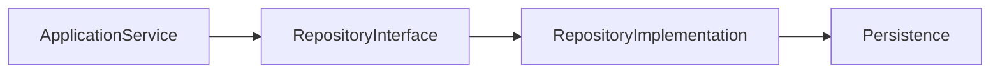
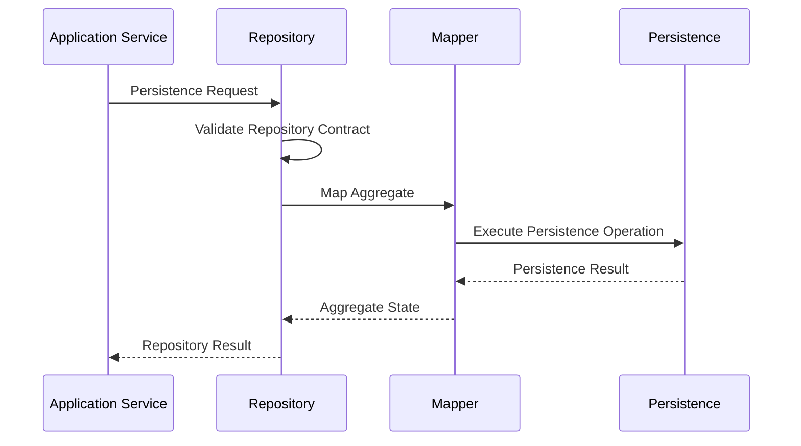
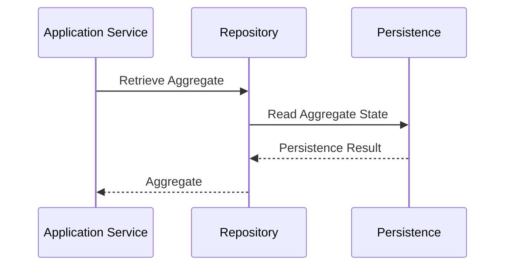
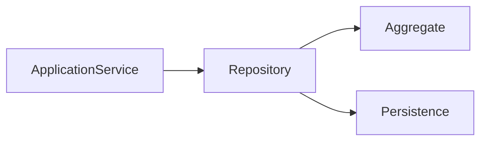
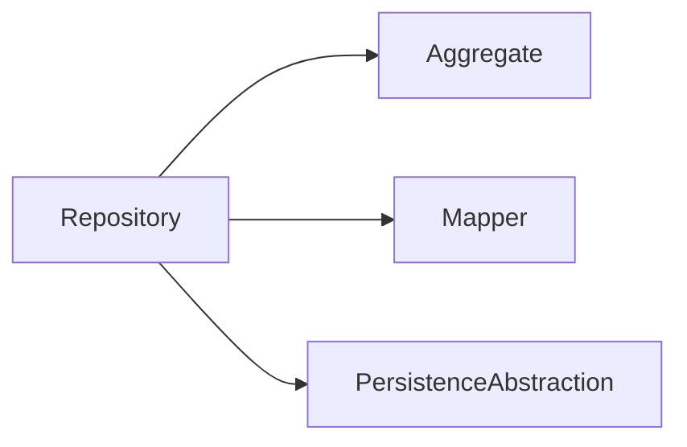

# Implementation Specification

# ISP-0004 — Repository Pattern

**Status:** Approved

**Version:** 1.0.0

**Authoritative Level:** Implementation Specification

---

# Purpose

This document defines the canonical implementation pattern for Repository interfaces in ForgeOS.

Repositories provide the persistence abstraction between the Domain Layer and Infrastructure Layer while preserving aggregate ownership and architectural isolation.

This specification standardizes repository implementation.

It introduces no architectural authority.

The architectural responsibilities remain defined by:

- TDS-0002 — Domain Model
- TDS-0004 — Application Model
- ISP-0001 — Application Service Pattern

---

# Scope

This specification defines:

- repository responsibilities;
- persistence abstraction;
- aggregate interaction;
- transaction participation;
- dependency expectations;
- implementation invariants.

This specification does **not** define:

- database technologies;
- ORM implementations;
- storage engines;
- query optimization;
- infrastructure providers.

Those concerns remain implementation decisions outside this specification.

---

# Normative Requirements

The key words **MUST**, **SHALL**, **SHOULD**, and **MAY** are to be interpreted as described in RFC 2119.

### Mandatory Requirements

Repositories:

- **MUST** expose persistence through abstractions.
- **MUST** preserve aggregate ownership.
- **MUST NOT** contain business rules.
- **SHALL NOT** expose persistence technology.
- **SHALL** remain independent of infrastructure implementations.

### Recommended Practices

Repositories:

- **SHOULD** expose cohesive interfaces.
- **SHOULD** minimize persistence responsibilities.
- **SHOULD** remain independently testable.

---

# Architectural Traceability

| Concern | Authoritative Source |
|----------|----------------------|
| Aggregate Ownership | TDS-0002 |
| Application Coordination | TDS-0004 |
| Repository Responsibilities | ISP-0001 |
| Architecture Enforcement | ARCH-0003 |

---

# Repository Purpose

A Repository abstracts persistence for one aggregate or aggregate family.

Its responsibility is persistence coordination.

It provides controlled access to aggregate state while preventing persistence concerns from leaking into the Domain Layer.

Repositories own neither business behavior nor transaction scope.

---

# Canonical Responsibilities

Every Repository shall:

- persist aggregate state;
- retrieve aggregate state;
- preserve aggregate consistency boundaries;
- expose persistence through interfaces;
- coordinate persistence without exposing implementation details.

A Repository shall never:

- implement business rules;
- coordinate application workflows;
- own transaction lifecycles;
- expose database semantics;
- manipulate unrelated aggregates.

---

# Conceptual Structure

Every Repository follows the same conceptual structure.



Application Services depend on Repository interfaces.

Infrastructure provides Repository implementations.

---

# Repository Lifecycle

Every repository interaction follows the same conceptual lifecycle.

```text id="a9fru2"
Receive Persistence Request
            ↓
Validate Repository Contract
            ↓
Execute Persistence Operation
            ↓
Return Aggregate State
```

Repositories coordinate persistence.

Business decisions remain within aggregates.

---

# Dependency Rules

Repositories may depend on:

- aggregate interfaces;
- persistence abstractions;
- mapping abstractions;
- infrastructure contracts.

Repositories shall not depend directly on:

- Application Services;
- Command Handlers;
- Query Handlers;
- presentation components;
- external provider SDKs.

Dependencies shall always respect the approved architectural boundaries.

---

# Implementation Invariants

The following invariants are mandatory.

1. Every Repository owns one aggregate persistence boundary.
2. Repository interfaces remain stable.
3. Business rules never enter repositories.
4. Repository implementations remain replaceable.
5. Aggregate ownership is preserved.
6. Persistence technology remains hidden.
7. Transaction ownership remains outside the Repository.

These invariants establish the canonical ForgeOS persistence abstraction.

*End of Part 1.*

# Canonical Execution Flow

This section defines the standard execution flow implemented by every ForgeOS Repository.

The purpose is to ensure that every persistence operation follows a consistent implementation pattern while preserving aggregate ownership and architectural isolation.

This specification derives entirely from the approved ForgeOS architecture.

It introduces no new architectural authority.

---

# Persistence Execution Sequence

Every Repository executes the following conceptual sequence.



Repositories coordinate persistence.

They do not coordinate business behavior.

---

# Retrieval Sequence

Aggregate retrieval follows the same architectural pattern.



Repositories return aggregate state without interpreting business meaning.

---

# Aggregate Interaction

Repositories interact exclusively with their owned aggregate boundary.



Repositories neither coordinate multiple aggregates nor bypass aggregate ownership.

---

# Transaction Participation

Repositories participate in transactions without owning transaction scope.

Repositories:

- execute persistence operations;
- preserve persistence consistency;
- return persistence outcomes.

Application Services:

- establish transaction scope;
- coordinate commit and rollback;
- determine workflow completion.

Transaction ownership never moves into the Repository.

---

# Persistence Coordination

Repositories coordinate persistence through approved abstractions.

Repositories shall:

- isolate persistence implementation;
- expose stable interfaces;
- preserve aggregate boundaries;
- return aggregate state.

Repositories shall not:

- expose storage semantics;
- expose persistence technology;
- leak implementation details.

---

# Mapping Responsibilities

Repository implementations coordinate mapping between domain representations and persistence representations.

Mapping shall:

- preserve aggregate identity;
- preserve aggregate integrity;
- remain deterministic;
- avoid introducing business behavior.

Business interpretation remains within the Domain Layer.

---

# Implementation Consistency Rules

Every Repository implementation shall preserve the following characteristics.

- one aggregate boundary;
- explicit persistence flow;
- deterministic behavior;
- stable repository interface;
- hidden persistence implementation;
- explicit success and failure paths.

These rules standardize persistence across all ForgeOS vertical slices.

*End of Part 2.*

# Recommended Implementation Structure

This section defines the recommended implementation structure for ForgeOS Repositories.

Its purpose is to establish a consistent persistence abstraction across every ForgeOS vertical slice.

The structure described here derives entirely from the approved ForgeOS architecture.

It introduces no new architectural authority.

---

# Canonical Repository Structure

Every Repository should follow the same conceptual organization.

```text id="z2px1c"
Repository
├── Public Interface
├── Persistence Dependencies
├── Aggregate Mapper
│
├── Load()
├── Save()
├── Delete()
├── Exists()
└── Commit Participation
```

This structure standardizes persistence coordination while allowing implementation technologies to evolve independently.

---

# Conceptual Rust Structure

The following illustrates the conceptual organization of a Repository.

```text id="t7my4v"
Repository

├── constructor(...)
│
├── load(...)
├── save(...)
├── delete(...)
├── exists(...)
│
├── map_to_domain(...)
└── map_to_persistence(...)
```

Method names are illustrative.

Concrete naming conventions remain an implementation decision governed by repository standards.

---

# Dependency Structure

Every Repository depends exclusively on abstractions.



Concrete storage implementations remain outside the Repository interface.

---

# Interface Boundaries

Repositories expose one stable persistence interface.

Implementation should preserve the following conceptual boundaries.

| Boundary | Responsibility |
|----------|----------------|
| Public Interface | Aggregate persistence contract |
| Aggregate Boundary | Aggregate state ownership |
| Mapping Boundary | Domain ↔ persistence transformation |
| Persistence Boundary | Storage abstraction |

These are implementation contracts rather than architectural contracts.

---

# Construction Principles

Repositories should be:

- constructed through dependency injection;
- immutable after construction;
- independent of storage technology;
- reusable across execution contexts;
- deterministic for equivalent persistence operations.

Construction mechanisms remain implementation concerns.

---

# Testing Expectations

Every Repository should be independently testable.

Implementation should support:

- isolated unit testing;
- mocked persistence abstractions;
- aggregate mapping verification;
- persistence contract verification;
- success and failure path verification;
- deterministic persistence behavior.

Aggregate business rule verification remains the responsibility of Domain tests.

---

# Implementation Mapping

The conceptual repository responsibilities map to engineering responsibilities as follows.

| Implementation Concern | Primary Responsibility |
|------------------------|------------------------|
| Repository Construction | Dependency composition |
| Aggregate Loading | Persistence retrieval |
| Aggregate Saving | Persistence coordination |
| Aggregate Mapping | Representation transformation |
| Persistence Errors | Failure propagation |

This mapping standardizes implementation while remaining independent of language features and persistence technologies.

---

# Quality Objectives

Every Repository implementation should exhibit the following characteristics.

- single aggregate ownership;
- stable persistence contract;
- minimal dependencies;
- deterministic persistence behavior;
- implementation independence;
- high testability;
- replaceable storage technology.

These objectives improve maintainability while remaining consistent with the approved ForgeOS architecture.

---

# Implementation Notes

This specification intentionally does not define:

- SQL syntax;
- ORM frameworks;
- NoSQL technologies;
- serialization formats;
- migration tooling;
- database vendors.

Those decisions belong to technology-specific implementation guidance rather than this implementation pattern.

*End of Part 3.*

# Implementation Anti-Patterns

The following implementation patterns are prohibited because they violate the approved ForgeOS architecture or this implementation specification.

## Business Logic in Repositories

Repositories shall not implement business rules.

Business decisions belong exclusively to the Domain Layer.

---

## Aggregate Boundary Violations

Repositories shall not:

- modify aggregate internals outside approved aggregate operations;
- coordinate multiple unrelated aggregates;
- expose aggregate implementation details;
- bypass aggregate identity management.

Aggregate ownership shall always remain explicit.

---

## Transaction Ownership

Repositories shall not:

- begin transactions;
- commit transactions;
- roll back transactions;
- coordinate workflow completion.

Transaction ownership remains within the Application Layer.

---

## Persistence Technology Leakage

Repositories shall not expose:

- SQL statements;
- ORM-specific APIs;
- database vendor features;
- storage-specific types;
- persistence implementation details.

The Repository interface shall remain persistence-agnostic.

---

## Infrastructure Coupling

Repository interfaces shall not depend directly on:

- presentation components;
- Command Handlers;
- Query Handlers;
- transport protocols;
- external provider SDKs.

Architectural dependencies shall remain one-directional.

---

## Hidden Persistence Behavior

Repository implementations shall not rely on:

- undocumented side effects;
- implicit persistence operations;
- runtime-discovered mappings;
- hidden transaction behavior.

Persistence behavior shall remain explicit, deterministic, and reviewable.

---

# Implementation Compliance Checklist

Every Repository implementation should satisfy the following checklist before acceptance.

| Requirement | Verification |
|-------------|--------------|
| One aggregate boundary | Static analysis / code review |
| Stable repository interface | API review |
| No business rules | Domain review |
| No transaction ownership | Architecture verification |
| Persistence technology hidden | Static dependency analysis |
| Aggregate mapping verified | Unit testing |
| Deterministic persistence behavior | Unit and integration testing |
| Replaceable implementation | Integration testing |

This checklist is intended for both human review and automated repository verification.

---

# Reference Implementation Checklist

A ForgeOS Repository implementation should satisfy the following implementation requirements.

| Requirement | Status |
|------------|--------|
| Repository interface exposes only domain abstractions | □ |
| Aggregate identity preserved during persistence | □ |
| Mapping isolated from business behavior | □ |
| Storage technology hidden behind abstractions | □ |
| No direct transaction ownership | □ |
| No infrastructure leakage into domain contracts | □ |
| Success and failure paths explicitly implemented | □ |
| Repository independently testable | □ |

This checklist is suitable for automated conformance verification and Codex-generated implementation review.

---

# Repository Verification

Repository tooling should automatically verify Repository compliance.

Recommended verification includes:

- repository discovery;
- aggregate ownership verification;
- forbidden dependency detection;
- persistence abstraction verification;
- transaction ownership validation;
- architecture regression detection;
- implementation conformance validation.

These checks complement the architectural enforcement defined by **ARCH-0003**.

---

# Relationship to Future Implementation Specifications

This document establishes the implementation pattern for **Repositories** only.

Subsequent specifications refine adjacent implementation concerns.

| Specification | Responsibility |
|--------------|----------------|
| ISP-0001 | Application Services |
| ISP-0002 | Command Handlers |
| ISP-0003 | Query Handlers |
| ISP-0004 | Repository Pattern |
| ISP-0005 | Domain Event Pattern |
| ISP-0006 | Transaction Pattern |
| ISP-0007 | Dependency Injection Pattern |
| ISP-0008 | Error Handling Pattern |
| ISP-0009 | Testing Pattern |
| ISP-0010 | Vertical Slice Pattern |

Together these documents define the canonical ForgeOS implementation standard.

---

# Codex Implementation Guidance

When generating or modifying Repository implementations, Codex should:

- preserve aggregate ownership;
- expose only repository abstractions;
- hide persistence implementation details;
- avoid business logic;
- avoid transaction ownership;
- produce deterministic persistence behavior;
- maintain replaceable storage implementations.

If a requested implementation violates this specification or the approved architecture, the implementation should be revised rather than introducing an architectural exception.

---

# Codex Readiness

## Implementation Status

**Ready for implementation of ForgeOS Repository abstractions.**

Using this specification together with the approved TDSs, derived architecture views, and previous ISPs, a Senior Software Engineer or Codex can consistently implement Repository interfaces and implementations without inventing persistence patterns or violating aggregate ownership.

No additional implementation decisions are required before implementing persistence abstractions.

---

# Implementation Authority

This document is an **Implementation Specification**.

It standardizes implementation of the approved architecture.

It shall **not** be used to introduce or modify:

- aggregate ownership;
- transaction ownership;
- application architecture;
- domain behavior;
- persistence architecture.

Changes to those concerns shall first be made in the authoritative TDS documents and then propagated through the derived architecture views before this specification is updated.

---

# Document Completion

This document is complete.

It establishes the canonical implementation pattern for ForgeOS Repositories and serves as the implementation reference for all persistence abstractions. Together with **ISP-0001**, **ISP-0002**, and **ISP-0003**, it provides a complete, implementation-ready contract for application orchestration, CQRS entry points, and persistence while preserving the architectural authority established by the ForgeOS TDS series.