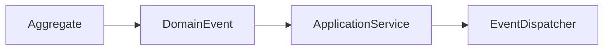
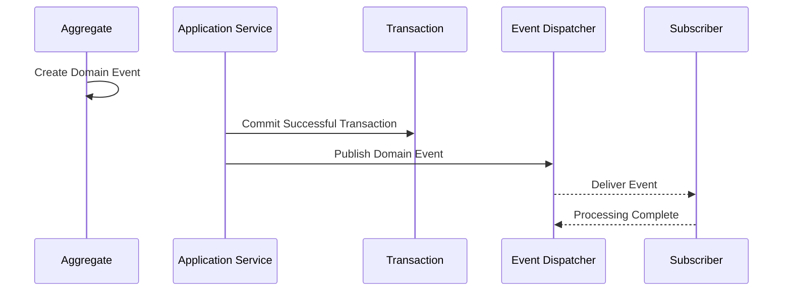
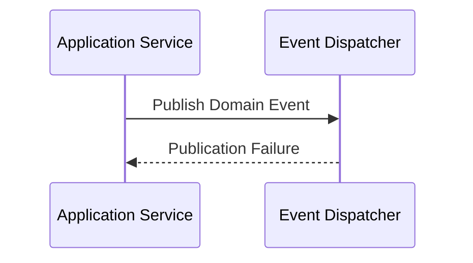
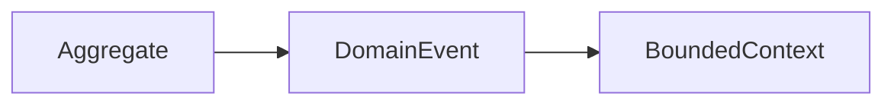
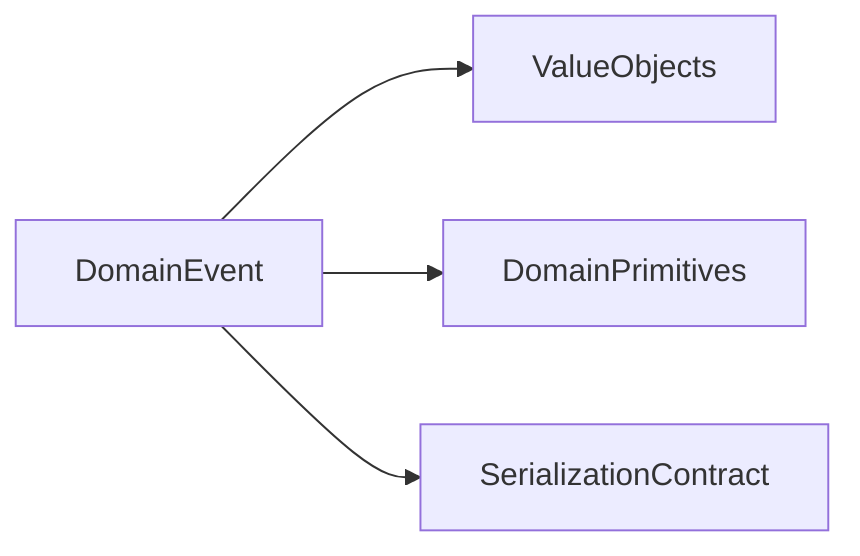

# Implementation Specification

# ISP-0005 — Domain Event Pattern

**Status:** Approved

**Version:** 1.0.0

**Authoritative Level:** Implementation Specification

---

# Purpose

This document defines the canonical implementation pattern for Domain Events in ForgeOS.

Domain Events communicate completed business facts that have already occurred within a bounded context.

This specification standardizes how Domain Events are represented, published, and coordinated during implementation.

It introduces no architectural authority.

The architectural responsibilities remain defined by:

- TDS-0002 — Domain Model
- TDS-0004 — Application Model
- ISP-0001 — Application Service Pattern

---

# Scope

This specification defines:

- Domain Event responsibilities;
- publication lifecycle;
- ownership rules;
- event abstractions;
- event coordination;
- implementation invariants.

This specification does **not** define:

- messaging technologies;
- event brokers;
- transport protocols;
- infrastructure implementations;
- asynchronous runtimes.

Those concerns remain implementation decisions outside this specification.

---

# Normative Requirements

The key words **MUST**, **SHALL**, **SHOULD**, and **MAY** are to be interpreted as described in RFC 2119.

### Mandatory Requirements

Domain Events:

- **MUST** represent completed business facts.
- **MUST** remain immutable after publication.
- **MUST** be owned by exactly one bounded context.
- **SHALL NOT** contain business behavior.
- **SHALL NOT** expose infrastructure concerns.

### Recommended Practices

Domain Events:

- **SHOULD** be self-describing.
- **SHOULD** minimize payload size while preserving business meaning.
- **SHOULD** remain independently testable.

---

# Architectural Traceability

| Concern | Authoritative Source |
|----------|----------------------|
| Domain Events | TDS-0002 |
| Application Coordination | TDS-0004 |
| Application Service Pattern | ISP-0001 |
| Architecture Enforcement | ARCH-0003 |

---

# Domain Event Purpose

A Domain Event records that a business fact has occurred.

It communicates completed business state transitions to interested application components.

A Domain Event does not initiate business behavior.

Application Services coordinate any resulting workflows.

---

# Canonical Responsibilities

Every Domain Event shall:

- represent one completed business fact;
- belong to one bounded context;
- remain immutable after creation;
- expose a stable event contract;
- support deterministic serialization.

A Domain Event shall never:

- implement business rules;
- coordinate workflows;
- invoke repositories;
- invoke Application Services;
- mutate aggregate state.

---

# Conceptual Structure

Every Domain Event follows the same conceptual structure.



The Aggregate creates the event.

The Application Service coordinates publication.

---

# Event Lifecycle

Every Domain Event follows the same conceptual lifecycle.

```text
Business State Changes
          ↓
Aggregate Creates Event
          ↓
Application Service Collects Event
          ↓
Application Service Publishes Event
          ↓
Subscribers Observe Event
```

Events communicate completed business facts.

They never coordinate execution.

---

# Dependency Rules

Domain Events may depend on:

- value objects;
- domain primitives;
- event abstractions.

Domain Events shall not depend directly on:

- repositories;
- Application Services;
- infrastructure implementations;
- transport protocols;
- messaging technologies.

Dependencies shall remain independent of infrastructure.

---

# Implementation Invariants

The following invariants are mandatory.

1. Every Domain Event represents one completed business fact.
2. Domain Events are immutable.
3. Domain Events belong to one bounded context.
4. Business behavior never enters Domain Events.
5. Publication occurs only after successful business execution.
6. Event contracts remain stable.
7. Infrastructure concerns remain outside Domain Events.

These invariants establish the canonical ForgeOS Domain Event model.

*End of Part 1.*

# Canonical Publication Flow

This section defines the standard publication flow implemented by every ForgeOS Domain Event.

The purpose is to ensure that completed business facts are published consistently while preserving bounded context ownership and architectural isolation.

This specification derives entirely from the approved ForgeOS architecture.

It introduces no new architectural authority.

---

# Event Publication Sequence

Every Domain Event follows the same conceptual publication sequence.



Publication occurs only after successful business execution.

Business state shall never depend on subscriber execution.

---

# Publication Failure

Publication failures are coordinated separately from business execution.



Publication failure handling is an application concern.

Previously committed business state remains authoritative.

---

# Event Ownership

Every Domain Event belongs to one bounded context.



Ownership remains stable throughout the event lifecycle.

Domain Events never migrate between bounded contexts.

---

# Subscriber Interaction

Subscribers observe Domain Events.

Subscribers may:

- coordinate application workflows;
- trigger additional use cases;
- update read models;
- initiate external notifications.

Subscribers shall not:

- reinterpret business ownership;
- modify published events;
- alter completed business facts.

---

# Event Dispatch Responsibilities

The event dispatch mechanism coordinates delivery.

It shall:

- preserve event immutability;
- preserve publication order within an execution context where required by the architecture;
- deliver stable event contracts;
- isolate delivery from business execution.

Dispatch technology remains an implementation concern.

---

# Event Collection

Application Services collect Domain Events produced during business execution.

Application Services:

- collect events;
- publish events after successful completion;
- coordinate event dispatch.

Aggregates remain responsible only for creating Domain Events.

---

# Implementation Consistency Rules

Every Domain Event implementation shall preserve the following characteristics.

- immutable event payload;
- one bounded-context owner;
- explicit publication sequence;
- deterministic event contract;
- publication after successful business execution;
- infrastructure-independent event definition.

These rules standardize Domain Event implementation across all ForgeOS vertical slices.

*End of Part 2.*

# Recommended Implementation Structure

This section defines the recommended implementation structure for ForgeOS Domain Events.

Its purpose is to establish a consistent event representation across every ForgeOS bounded context.

The structure described here derives entirely from the approved ForgeOS architecture.

It introduces no new architectural authority.

---

# Canonical Domain Event Structure

Every Domain Event should follow the same conceptual organization.

```text id="8v3zjp"
Domain Event
├── Event Metadata
├── Business Payload
├── Event Identity
├── Event Version
└── Serialization Contract
```

This structure standardizes event representation while allowing implementation technologies to evolve independently.

---

# Conceptual Rust Structure

The following illustrates the conceptual organization of a Domain Event.

```text id="m2a8gf"
DomainEvent

├── event_id
├── event_type
├── event_version
├── occurred_at
├── aggregate_id
└── payload
```

The fields shown are conceptual.

Concrete field names and types remain implementation decisions governed by repository standards.

---

# Dependency Structure

Every Domain Event depends exclusively on domain abstractions.



Infrastructure implementations remain outside the Domain Event definition.

---

# Interface Boundaries

Domain Events expose one stable event contract.

Implementation should preserve the following conceptual boundaries.

| Boundary | Responsibility |
|----------|----------------|
| Event Identity | Unique event identification |
| Business Payload | Completed business fact |
| Version Boundary | Event compatibility |
| Serialization Boundary | Stable event representation |

These are implementation contracts rather than architectural contracts.

---

# Construction Principles

Domain Events should be:

- created only by aggregates;
- immutable after creation;
- independent of infrastructure technologies;
- deterministic for equivalent business facts;
- version-aware for compatibility.

Construction mechanisms remain implementation concerns.

---

# Testing Expectations

Every Domain Event should be independently testable.

Implementation should support:

- immutable payload verification;
- serialization verification;
- version compatibility verification;
- identity verification;
- deterministic construction verification;
- event contract verification.

Business behavior verification remains the responsibility of Domain tests.

---

# Implementation Mapping

The conceptual event responsibilities map to engineering responsibilities as follows.

| Implementation Concern | Primary Responsibility |
|------------------------|------------------------|
| Event Construction | Aggregate responsibility |
| Event Metadata | Event identification |
| Event Payload | Business fact representation |
| Event Versioning | Compatibility management |
| Serialization | Stable event transport representation |

This mapping standardizes implementation while remaining independent of language features and transport technologies.

---

# Quality Objectives

Every Domain Event implementation should exhibit the following characteristics.

- immutable representation;
- stable event contract;
- deterministic payload;
- implementation independence;
- high testability;
- backward-compatible evolution;
- bounded-context ownership.

These objectives improve maintainability while remaining consistent with the approved ForgeOS architecture.

---

# Implementation Notes

This specification intentionally does not define:

- messaging middleware;
- event brokers;
- serialization libraries;
- wire formats;
- asynchronous runtimes;
- distributed event infrastructure.

Those decisions belong to technology-specific implementation guidance rather than this implementation pattern.

*End of Part 3.*

# Implementation Anti-Patterns

The following implementation patterns are prohibited because they violate the approved ForgeOS architecture or this implementation specification.

## Business Logic in Domain Events

Domain Events shall not implement business rules.

They represent completed business facts only.

Business decisions belong exclusively to the Domain Layer.

---

## Mutable Events

Domain Events shall never be modified after creation.

The following are prohibited:

- mutable payloads;
- mutable metadata;
- mutable identifiers;
- mutable timestamps.

Domain Events remain immutable throughout their lifecycle.

---

## Infrastructure Coupling

Domain Events shall not depend directly on:

- message brokers;
- transport protocols;
- HTTP clients;
- database implementations;
- serialization frameworks;
- infrastructure SDKs.

Infrastructure concerns remain outside Domain Event definitions.

---

## Event Ownership Violations

Domain Events shall not:

- belong to multiple bounded contexts;
- migrate ownership between bounded contexts;
- expose unrelated aggregate information.

Bounded-context ownership remains explicit and permanent.

---

## Workflow Coordination

Domain Events shall not:

- invoke Application Services;
- coordinate workflows;
- publish additional events;
- invoke repositories;
- trigger infrastructure operations.

Application Services remain responsible for orchestration.

---

## Hidden Semantics

Domain Events shall not rely on:

- undocumented payload meaning;
- implicit version semantics;
- runtime-generated contracts;
- hidden business interpretation.

Event contracts shall remain explicit, deterministic, and reviewable.

---

# Implementation Compliance Checklist

Every Domain Event implementation should satisfy the following checklist before acceptance.

| Requirement | Verification |
|-------------|--------------|
| Represents one completed business fact | Domain review |
| Immutable after creation | Unit testing |
| One bounded-context owner | Architecture review |
| Stable event contract | API review |
| No business logic | Domain review |
| No infrastructure coupling | Static dependency analysis |
| Deterministic serialization | Unit testing |
| Version compatibility verified | Compatibility testing |

This checklist is intended for both human review and automated repository verification.

---

# Reference Implementation Checklist

A ForgeOS Domain Event implementation should satisfy the following implementation requirements.

| Requirement | Status |
|------------|--------|
| Immutable event definition | □ |
| Stable event identity | □ |
| Explicit event version | □ |
| Deterministic payload representation | □ |
| No infrastructure dependencies | □ |
| No workflow responsibilities | □ |
| Serialization contract verified | □ |
| Independently testable | □ |

This checklist is suitable for automated conformance verification and Codex-generated implementation review.

---

# Repository Verification

Repository tooling should automatically verify Domain Event compliance.

Recommended verification includes:

- event discovery;
- bounded-context ownership verification;
- immutability verification;
- forbidden dependency detection;
- version compatibility validation;
- architecture regression detection;
- implementation conformance validation.

These checks complement the architectural enforcement defined by **ARCH-0003**.

---

# Relationship to Future Implementation Specifications

This document establishes the implementation pattern for **Domain Events** only.

Subsequent specifications refine adjacent implementation concerns.

| Specification | Responsibility |
|--------------|----------------|
| ISP-0001 | Application Services |
| ISP-0002 | Command Handlers |
| ISP-0003 | Query Handlers |
| ISP-0004 | Repository Pattern |
| ISP-0005 | Domain Event Pattern |
| ISP-0006 | Transaction Pattern |
| ISP-0007 | Dependency Injection Pattern |
| ISP-0008 | Error Handling Pattern |
| ISP-0009 | Testing Pattern |
| ISP-0010 | Vertical Slice Pattern |

Together these documents define the canonical ForgeOS implementation standard.

---

# Codex Implementation Guidance

When generating or modifying Domain Events, Codex should:

- represent exactly one completed business fact;
- preserve immutability after creation;
- maintain bounded-context ownership;
- avoid business logic;
- avoid infrastructure dependencies;
- maintain stable event contracts;
- preserve deterministic serialization.

If a requested implementation violates this specification or the approved architecture, the implementation should be revised rather than introducing an architectural exception.

---

# Codex Readiness

## Implementation Status

**Ready for implementation of ForgeOS Domain Events.**

Using this specification together with the approved TDSs, derived architecture views, and previous ISPs, a Senior Software Engineer or Codex can consistently implement Domain Events without inventing event contracts, ownership rules, or publication responsibilities.

No additional implementation decisions are required before implementing the ForgeOS event model.

---

# Implementation Authority

This document is an **Implementation Specification**.

It standardizes implementation of the approved architecture.

It shall **not** be used to introduce or modify:

- domain ownership;
- bounded-context ownership;
- workflow semantics;
- application architecture;
- event architecture.

Changes to those concerns shall first be made in the authoritative TDS documents and then propagated through the derived architecture views before this specification is updated.

---

# Document Completion

This document is complete.

It establishes the canonical implementation pattern for ForgeOS Domain Events and serves as the implementation reference for all business event representations. Together with **ISP-0001** through **ISP-0004**, it provides a complete implementation contract for orchestration, CQRS entry points, persistence abstractions, and event coordination while preserving the architectural authority established by the ForgeOS TDS series.