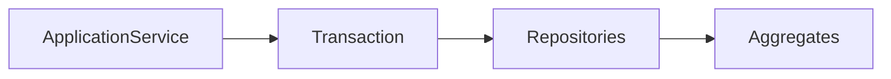
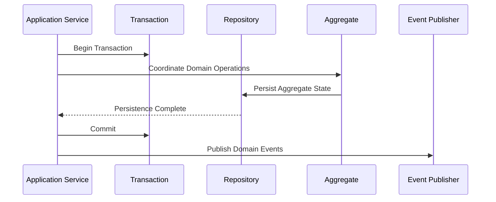
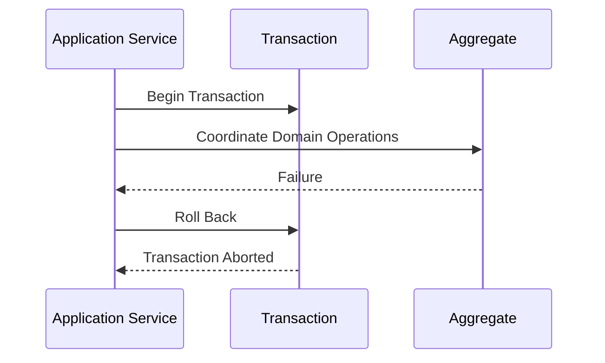
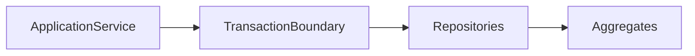
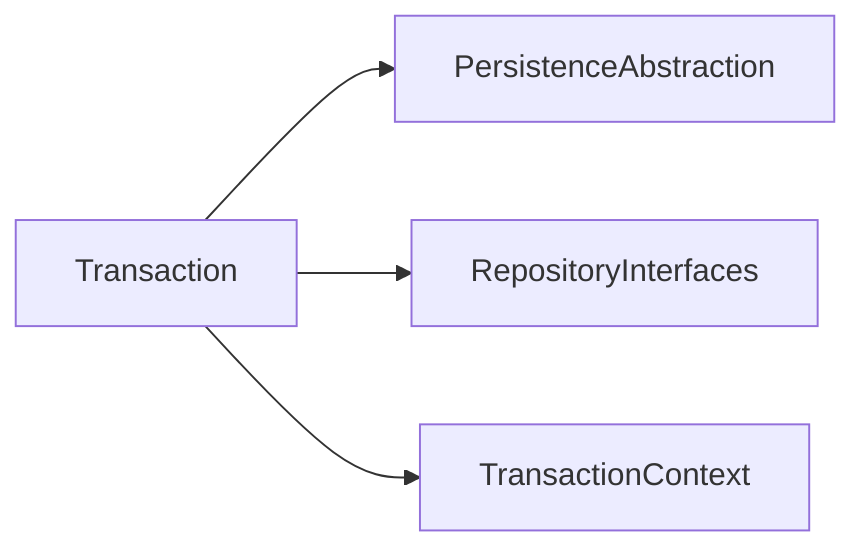

# Implementation Specification

# ISP-0006 — Transaction Pattern

**Status:** Approved

**Version:** 1.0.0

**Authoritative Level:** Implementation Specification

---

# Purpose

This document defines the canonical implementation pattern for transaction coordination in ForgeOS.

Transactions provide the consistency boundary for state-changing application workflows while preserving aggregate ownership, application orchestration, and architectural isolation.

This specification standardizes transaction implementation.

It introduces no architectural authority.

The architectural responsibilities remain defined by:

- TDS-0004 — Application Model
- ISP-0001 — Application Service Pattern
- ISP-0004 — Repository Pattern
- ISP-0005 — Domain Event Pattern

---

# Scope

This specification defines:

- transaction responsibilities;
- transaction lifecycle;
- ownership rules;
- commit and rollback coordination;
- interaction with Application Services and Repositories;
- implementation invariants.

This specification does **not** define:

- database transaction technologies;
- distributed transaction protocols;
- storage engines;
- infrastructure frameworks;
- persistence vendor capabilities.

Those concerns remain implementation decisions outside this specification.

---

# Normative Requirements

The key words **MUST**, **SHALL**, **SHOULD**, and **MAY** are to be interpreted as described in RFC 2119.

## Mandatory Requirements

Transactions:

- **MUST** define an explicit consistency boundary.
- **MUST** be coordinated by the Application Layer.
- **MUST NOT** contain business rules.
- **SHALL NOT** be owned by Repositories or Aggregates.
- **SHALL** complete with either commit or rollback.

## Recommended Practices

Transactions:

- **SHOULD** be short-lived.
- **SHOULD** minimize resource ownership.
- **SHOULD** remain deterministic for equivalent execution paths.

---

# Architectural Traceability

| Concern | Authoritative Source |
|----------|----------------------|
| Transaction Coordination | TDS-0004 |
| Application Services | ISP-0001 |
| Repository Participation | ISP-0004 |
| Domain Event Publication | ISP-0005 |
| Architecture Enforcement | ARCH-0003 |

---

# Transaction Purpose

A transaction coordinates a single unit of work.

Its responsibility is consistency coordination.

A transaction guarantees that all state changes within its boundary are either completed successfully or discarded together.

Business decisions remain within the Domain Layer.

---

# Canonical Responsibilities

Every transaction shall:

- establish one consistency boundary;
- coordinate persistence operations;
- coordinate commit or rollback;
- preserve aggregate consistency;
- complete before application execution finishes.

A transaction shall never:

- implement business rules;
- coordinate application workflows;
- own aggregate behavior;
- expose persistence technology;
- extend beyond its application use case.

---

# Conceptual Structure

Every transaction follows the same conceptual structure.



The Application Service owns the transaction lifecycle.

Repositories participate in, but do not own, the transaction.

---

# Transaction Lifecycle

Every transaction follows the same conceptual lifecycle.

```text
Begin Transaction
        ↓
Execute Domain Operations
        ↓
Persist Aggregate Changes
        ↓
Commit
   OR
Rollback
```

Commit and rollback are mutually exclusive terminal states.

---

# Dependency Rules

Transactions may depend on:

- transaction abstractions;
- repository interfaces;
- persistence abstractions.

Transactions shall not depend directly on:

- presentation components;
- Command Handlers;
- Query Handlers;
- transport protocols;
- external providers.

Transaction coordination remains independent of infrastructure technology.

---

# Implementation Invariants

The following invariants are mandatory.

1. Every state-changing use case owns one transaction boundary.
2. Transaction ownership remains within the Application Layer.
3. Commit and rollback are mutually exclusive.
4. Aggregate consistency is preserved.
5. Repositories never own transaction scope.
6. Domain Events are published only after successful completion.
7. Transaction implementation remains replaceable.

These invariants establish the canonical ForgeOS transaction model.

*End of Part 1.*

# Canonical Execution Flow

This section defines the standard execution flow implemented by every ForgeOS transaction.

The purpose is to ensure that every state-changing application workflow follows a consistent transaction lifecycle while preserving aggregate ownership and architectural isolation.

This specification derives entirely from the approved ForgeOS architecture.

It introduces no new architectural authority.

---

# Transaction Execution Sequence

Every transaction follows the same conceptual execution sequence.



Domain Events are published only after a successful commit.

Transaction completion precedes event publication.

---

# Rollback Sequence

Rollback coordinates unsuccessful execution.



Rollback restores transactional consistency.

Domain Events shall not be published after rollback.

---

# Repository Participation

Repositories participate in transaction execution.

Repositories:

- execute persistence operations;
- preserve persistence consistency;
- return persistence outcomes.

Repositories never:

- begin transactions;
- commit transactions;
- roll back transactions;
- coordinate workflow completion.

Transaction ownership remains exclusively within the Application Layer.

---

# Consistency Boundaries

Every transaction establishes one consistency boundary.



All state-changing persistence operations within the use case execute inside the same transaction boundary.

---

# Commit Coordination

Successful completion requires:

- successful domain execution;
- successful persistence;
- successful commit.

Only after successful commit may the Application Service coordinate Domain Event publication.

Commit finalizes the consistency boundary.

---

# Failure Coordination

Failure handling shall preserve transactional integrity.

Failure shall result in:

- rollback of pending persistence changes;
- abandonment of incomplete state changes;
- suppression of Domain Event publication;
- propagation of an application failure outcome.

Previously committed state remains authoritative.

---

# Implementation Consistency Rules

Every transaction implementation shall preserve the following characteristics.

- one transaction per state-changing use case;
- explicit begin and completion;
- mutually exclusive commit and rollback;
- deterministic transaction lifecycle;
- explicit consistency boundary;
- post-commit Domain Event publication.

These rules standardize transaction management across all ForgeOS vertical slices.

*End of Part 2.*

# Recommended Implementation Structure

This section defines the recommended implementation structure for ForgeOS transaction coordination.

Its purpose is to establish a consistent transaction abstraction across every ForgeOS Application Service.

The structure described here derives entirely from the approved ForgeOS architecture.

It introduces no new architectural authority.

---

# Canonical Transaction Structure

Every transaction implementation should follow the same conceptual organization.

```text id="2pc6nm"
Transaction
├── Public Interface
├── Persistence Dependencies
├── Transaction Context
│
├── Begin()
├── Commit()
├── RollBack()
└── Completion State
```

This structure standardizes transaction coordination while allowing implementation technologies to evolve independently.

---

# Conceptual Rust Structure

The following illustrates the conceptual organization of a transaction abstraction.

```text id="n4yf7q"
Transaction

├── begin(...)
├── commit(...)
├── rollback(...)
│
├── is_active(...)
├── completion_state(...)
```

Method names are illustrative.

Concrete naming conventions remain an implementation decision governed by repository standards.

---

# Dependency Structure

Every transaction depends exclusively on abstractions.



Concrete persistence implementations remain outside the transaction abstraction.

---

# Interface Boundaries

Transactions expose one stable coordination interface.

Implementation should preserve the following conceptual boundaries.

| Boundary | Responsibility |
|----------|----------------|
| Public Interface | Transaction lifecycle |
| Context Boundary | Execution context |
| Repository Boundary | Persistence participation |
| Completion Boundary | Commit or rollback outcome |

These are implementation contracts rather than architectural contracts.

---

# Construction Principles

Transactions should be:

- created by the Application Layer;
- short-lived;
- immutable in configuration after creation;
- independent of persistence technology;
- deterministic for equivalent execution paths.

Construction mechanisms remain implementation concerns.

---

# Testing Expectations

Every transaction implementation should be independently testable.

Implementation should support:

- lifecycle verification;
- commit verification;
- rollback verification;
- completion-state verification;
- repository participation verification;
- deterministic execution verification.

Business behavior verification remains the responsibility of Domain tests.

---

# Implementation Mapping

The conceptual transaction responsibilities map to engineering responsibilities as follows.

| Implementation Concern | Primary Responsibility |
|------------------------|------------------------|
| Transaction Construction | Application composition |
| Begin Coordination | Lifecycle initiation |
| Commit Coordination | Successful completion |
| Rollback Coordination | Failure recovery |
| Completion State | Transaction outcome |

This mapping standardizes implementation while remaining independent of language features and persistence technologies.

---

# Quality Objectives

Every transaction implementation should exhibit the following characteristics.

- explicit lifecycle;
- deterministic completion;
- replaceable implementation;
- minimal dependencies;
- implementation independence;
- high testability;
- stable coordination interface.

These objectives improve maintainability while remaining consistent with the approved ForgeOS architecture.

---

# Implementation Notes

This specification intentionally does not define:

- SQL transaction APIs;
- distributed transaction protocols;
- two-phase commit;
- database vendors;
- persistence frameworks;
- runtime execution models.

Those decisions belong to technology-specific implementation guidance rather than this implementation pattern.

*End of Part 3.*

# Implementation Anti-Patterns

The following implementation patterns are prohibited because they violate the approved ForgeOS architecture or this implementation specification.

## Business Logic in Transactions

Transactions shall not implement business rules.

Transactions coordinate consistency only.

Business decisions belong exclusively to the Domain Layer.

---

## Repository-Owned Transactions

Repositories shall not:

- begin transactions;
- commit transactions;
- roll back transactions;
- determine transaction boundaries.

Transaction ownership remains exclusively within the Application Layer.

---

## Aggregate-Owned Transactions

Aggregates shall not:

- manage transaction lifecycles;
- coordinate persistence consistency;
- determine commit behavior;
- coordinate rollback behavior.

Aggregates own business behavior, not transaction coordination.

---

## Long-Lived Transactions

Transactions shall not:

- span multiple independent application use cases;
- remain active across user interactions;
- persist beyond the lifetime of the coordinating Application Service.

Transaction scope shall remain short-lived and explicit.

---

## Infrastructure Leakage

Transaction abstractions shall not expose:

- database-specific transaction APIs;
- storage vendor features;
- ORM-specific transaction objects;
- infrastructure implementation details.

Infrastructure technology shall remain hidden behind transaction abstractions.

---

## Hidden Transaction Behavior

Transactions shall not rely on:

- implicit commits;
- undocumented rollbacks;
- hidden retry behavior;
- runtime-discovered transaction semantics.

Transaction behavior shall remain explicit, deterministic, and reviewable.

---

# Implementation Compliance Checklist

Every transaction implementation should satisfy the following checklist before acceptance.

| Requirement | Verification |
|-------------|--------------|
| One transaction boundary per state-changing use case | Architecture review |
| Application Layer owns transaction | Static analysis |
| Repositories do not own transactions | Static dependency analysis |
| Explicit commit and rollback | Unit testing |
| Domain Events published only after commit | Integration testing |
| Rollback suppresses event publication | Integration testing |
| Deterministic lifecycle | Unit testing |
| Stable transaction abstraction | API review |

This checklist is intended for both human review and automated repository verification.

---

# Reference Implementation Checklist

A ForgeOS transaction implementation should satisfy the following implementation requirements.

| Requirement | Status |
|------------|--------|
| Explicit transaction lifecycle | □ |
| Begin, commit, and rollback implemented | □ |
| One consistency boundary per use case | □ |
| Repository participation only | □ |
| No infrastructure leakage | □ |
| Post-commit Domain Event publication | □ |
| Rollback prevents event publication | □ |
| Independently testable | □ |

This checklist is suitable for automated conformance verification and Codex-generated implementation review.

---

# Repository Verification

Repository tooling should automatically verify transaction compliance.

Recommended verification includes:

- transaction abstraction discovery;
- Application Layer ownership verification;
- repository participation verification;
- forbidden dependency detection;
- event publication ordering verification;
- architecture regression detection;
- implementation conformance validation.

These checks complement the architectural enforcement defined by **ARCH-0003**.

---

# Relationship to Future Implementation Specifications

This document establishes the implementation pattern for **transaction coordination** only.

Subsequent specifications refine adjacent implementation concerns.

| Specification | Responsibility |
|--------------|----------------|
| ISP-0001 | Application Services |
| ISP-0002 | Command Handlers |
| ISP-0003 | Query Handlers |
| ISP-0004 | Repository Pattern |
| ISP-0005 | Domain Event Pattern |
| ISP-0006 | Transaction Pattern |
| ISP-0007 | Dependency Injection Pattern |
| ISP-0008 | Error Handling Pattern |
| ISP-0009 | Testing Pattern |
| ISP-0010 | Vertical Slice Pattern |

Together these documents define the canonical ForgeOS implementation standard.

---

# Codex Implementation Guidance

When generating or modifying transaction coordination code, Codex should:

- create one transaction boundary per state-changing use case;
- keep transaction ownership in the Application Layer;
- ensure commit and rollback are mutually exclusive;
- publish Domain Events only after successful commit;
- avoid infrastructure leakage;
- preserve deterministic transaction behavior.

If a requested implementation violates this specification or the approved architecture, the implementation should be revised rather than introducing an architectural exception.

---

# Codex Readiness

## Implementation Status

**Ready for implementation of ForgeOS transaction coordination.**

Using this specification together with the approved TDSs, derived architecture views, and previous ISPs, a Senior Software Engineer or Codex can consistently implement transaction coordination without inventing lifecycle rules, ownership boundaries, or consistency semantics.

No additional implementation decisions are required before implementing transactional workflows.

---

# Implementation Authority

This document is an **Implementation Specification**.

It standardizes implementation of the approved architecture.

It shall **not** be used to introduce or modify:

- transaction ownership;
- aggregate ownership;
- application architecture;
- domain behavior;
- consistency boundaries.

Changes to those concerns shall first be made in the authoritative TDS documents and then propagated through the derived architecture views before this specification is updated.

---

# Document Completion

This document is complete.

It establishes the canonical implementation pattern for ForgeOS transaction coordination and serves as the implementation reference for all state-changing application workflows. Together with **ISP-0001** through **ISP-0005**, it provides a complete implementation contract for orchestration, CQRS entry points, persistence, event publication, and transactional consistency while preserving the architectural authority established by the ForgeOS TDS series.