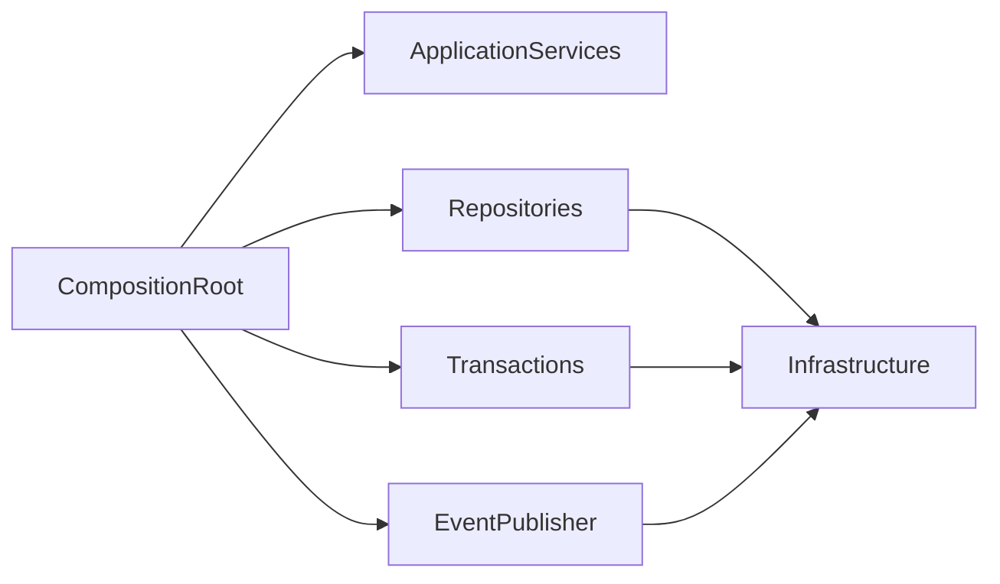
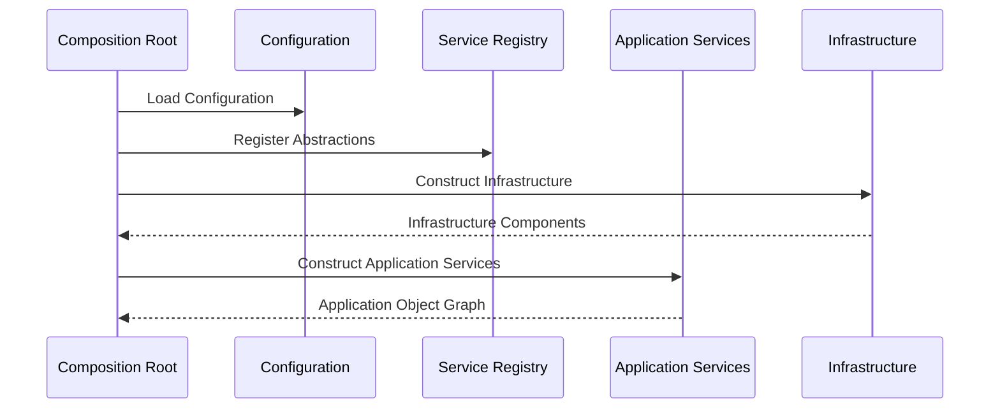
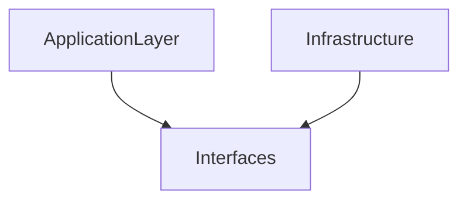
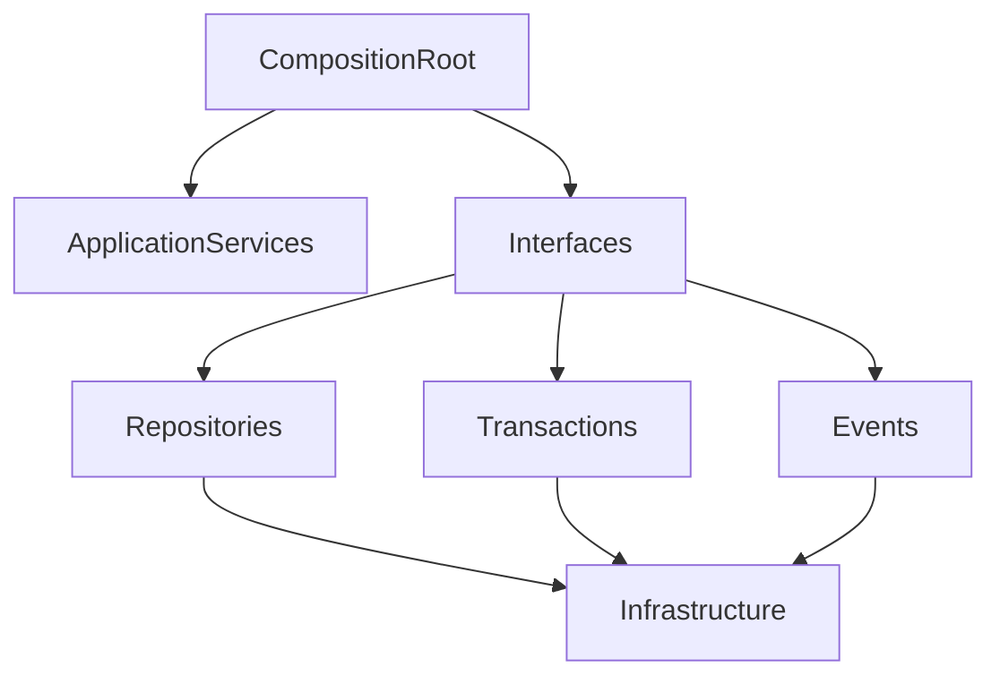

# Implementation Specification

# ISP-0007 — Dependency Injection Pattern

**Status:** Approved

**Version:** 1.0.0

**Authoritative Level:** Implementation Specification

---

# Purpose

This document defines the canonical dependency injection pattern for ForgeOS.

Dependency Injection (DI) provides the composition mechanism used to assemble Application Services, Repositories, Transaction coordinators, Event Publishers, and other implementation components while preserving the architectural boundaries established by the approved TDS series.

This specification standardizes component composition.

It introduces no architectural authority.

The architectural responsibilities remain defined by:

- TDS-0004 — Application Model
- ISP-0001 — Application Service Pattern
- ISP-0004 — Repository Pattern
- ISP-0006 — Transaction Pattern

---

# Scope

This specification defines:

- dependency injection responsibilities;
- component composition;
- lifetime ownership;
- dependency resolution;
- implementation invariants.

This specification does **not** define:

- DI frameworks;
- IoC containers;
- runtime reflection;
- service discovery technologies;
- plugin loading mechanisms.

Those concerns remain implementation decisions outside this specification.

---

# Normative Requirements

The key words **MUST**, **SHALL**, **SHOULD**, and **MAY** are to be interpreted as described in RFC 2119.

## Mandatory Requirements

Dependency Injection:

- **MUST** construct components through abstractions.
- **MUST** preserve architectural boundaries.
- **MUST NOT** introduce hidden dependencies.
- **SHALL NOT** depend on concrete infrastructure from the Application Layer.
- **SHALL** produce deterministic component composition.

## Recommended Practices

Dependency Injection:

- **SHOULD** use constructor injection.
- **SHOULD** minimize mutable shared state.
- **SHOULD** make dependency graphs explicit and testable.

---

# Architectural Traceability

| Concern | Authoritative Source |
|----------|----------------------|
| Application Composition | TDS-0004 |
| Application Services | ISP-0001 |
| Repository Abstractions | ISP-0004 |
| Transaction Coordination | ISP-0006 |
| Architecture Enforcement | ARCH-0003 |

---

# Dependency Injection Purpose

Dependency Injection assembles implementation components without embedding construction logic inside business components.

Its responsibility is composition.

Business behavior remains within the Domain Layer.

Application behavior remains within the Application Layer.

Infrastructure provides concrete implementations.

---

# Canonical Responsibilities

The Dependency Injection mechanism shall:

- construct implementation components;
- inject dependencies through abstractions;
- preserve lifetime ownership;
- isolate infrastructure implementations;
- provide deterministic object graphs.

The Dependency Injection mechanism shall never:

- implement business rules;
- coordinate workflows;
- own application state;
- bypass architectural boundaries;
- introduce runtime-specific business behavior.

---

# Conceptual Structure

Every ForgeOS composition root follows the same conceptual structure.



The composition root constructs the application object graph.

Business components remain unaware of construction mechanisms.

---

# Composition Lifecycle

Every application composition follows the same conceptual lifecycle.

```text
Create Composition Root
          ↓
Register Abstractions
          ↓
Bind Implementations
          ↓
Construct Object Graph
          ↓
Provide Root Application Services
```

Application execution begins only after successful composition.

---

# Dependency Rules

Composition may depend on:

- interfaces;
- implementation factories;
- configuration abstractions;
- infrastructure implementations.

Composition shall not depend on:

- presentation workflows;
- business rules;
- aggregate internals;
- runtime-generated business behavior.

Dependencies shall remain explicit.

---

# Implementation Invariants

The following invariants are mandatory.

1. Every dependency is injected through an abstraction.
2. Construction occurs outside business components.
3. Application Services never construct dependencies directly.
4. Infrastructure remains replaceable.
5. Object graphs remain deterministic.
6. Lifetime ownership is explicit.
7. Component construction remains independently testable.

These invariants establish the canonical ForgeOS dependency injection model.

*End of Part 1.*

# Canonical Composition Flow

This section defines the standard dependency composition flow implemented by every ForgeOS application.

The purpose is to ensure that every application instance is assembled consistently while preserving architectural boundaries and implementation independence.

This specification derives entirely from the approved ForgeOS architecture.

It introduces no new architectural authority.

---

# Composition Sequence

Every ForgeOS application follows the same conceptual composition sequence.



Component construction is coordinated exclusively by the Composition Root.

Business components never construct dependencies directly.

---

# Dependency Resolution

Dependency resolution follows a deterministic sequence.


Resolution occurs through explicit abstractions.

Implementation details remain hidden from consuming components.

---

# Lifetime Ownership

Every component has an explicit owner.

| Component | Lifetime Owner |
|-----------|----------------|
| Application Service | Composition Root |
| Repository | Composition Root |
| Transaction Coordinator | Composition Root |
| Event Publisher | Composition Root |
| Infrastructure Service | Composition Root |

Lifetime ownership remains centralized.

Business components do not manage dependency lifetimes.

---

# Component Construction

The Composition Root coordinates all implementation construction.

It shall:

- construct infrastructure implementations;
- bind abstractions to implementations;
- inject dependencies explicitly;
- return fully composed application components.

It shall not:

- execute business workflows;
- invoke application use cases;
- coordinate domain behavior.

---

# Dependency Visibility

Dependencies remain explicit throughout the implementation.

Every dependency shall be:

- declared;
- injected;
- testable;
- replaceable.

Hidden service location and runtime dependency discovery are prohibited.

---

# Infrastructure Participation

Infrastructure implementations participate only through registered abstractions.



The Application Layer depends only on interfaces.

Concrete infrastructure remains isolated behind abstractions.

---

# Implementation Consistency Rules

Every dependency injection implementation shall preserve the following characteristics.

- deterministic object graph construction;
- explicit dependency ownership;
- constructor-based composition;
- implementation replaceability;
- infrastructure isolation;
- independently testable components.

These rules standardize application composition across all ForgeOS vertical slices.

*End of Part 2.*

# Recommended Implementation Structure

This section defines the recommended implementation structure for ForgeOS Dependency Injection.

Its purpose is to establish a consistent component composition pattern across every ForgeOS vertical slice.

The structure described here derives entirely from the approved ForgeOS architecture.

It introduces no new architectural authority.

---

# Canonical Composition Structure

Every ForgeOS application should follow the same conceptual composition organization.

```text
Composition Root
├── Configuration Loading
├── Infrastructure Construction
├── Repository Binding
├── Transaction Binding
├── Event Publisher Binding
├── Application Service Construction
└── Runtime Startup
```

The Composition Root is responsible for assembling the application.

It is not responsible for executing business behavior.

---

# Conceptual Rust Composition Structure

The following illustrates the conceptual organization of application composition.

```text
ApplicationComposition

├── load_configuration(...)
│
├── create_infrastructure(...)
│
├── create_repositories(...)
│
├── create_transactions(...)
│
├── create_event_publishers(...)
│
├── create_application_services(...)
│
└── build_application(...)
```

Function names are illustrative.

Concrete implementation structure remains governed by repository coding standards.

---

# Dependency Graph Structure

The application object graph should follow a one-directional dependency flow.



Dependencies flow inward through abstractions.

Infrastructure remains at the outer boundary.

---

# Interface Boundaries

Dependency Injection should preserve the following conceptual boundaries.

| Boundary | Responsibility |
|----------|----------------|
| Composition Boundary | Assemble application components |
| Interface Boundary | Define stable contracts |
| Implementation Boundary | Provide concrete behavior |
| Lifetime Boundary | Own component lifecycle |

These are implementation contracts rather than architectural contracts.

---

# Constructor Injection

ForgeOS components should prefer explicit constructor injection.

Constructor injection provides:

- visible dependencies;
- compile-time verification;
- simpler testing;
- deterministic composition.

Hidden dependency acquisition patterns should be avoided.

---

# Testing Expectations

The composition system should be independently testable.

Implementation should support:

- dependency graph verification;
- missing dependency detection;
- alternative implementation injection;
- isolated component testing;
- composition startup verification.

Business behavior testing remains the responsibility of Application and Domain tests.

---

# Implementation Mapping

The conceptual dependency responsibilities map to engineering responsibilities as follows.

| Implementation Concern | Primary Responsibility |
|------------------------|------------------------|
| Composition Root | Object graph creation |
| Interface Binding | Abstraction mapping |
| Infrastructure Construction | Concrete implementation creation |
| Dependency Injection | Component wiring |
| Lifetime Management | Resource ownership |

This mapping standardizes implementation while remaining independent of DI frameworks.

---

# Quality Objectives

Every Dependency Injection implementation should exhibit the following characteristics.

- explicit dependencies;
- deterministic composition;
- minimal hidden state;
- replaceable implementations;
- simple testing setup;
- clear ownership;
- stable application startup.

These objectives improve maintainability while remaining consistent with the approved ForgeOS architecture.

---

# Implementation Notes

This specification intentionally does not define:

- specific DI containers;
- service locator patterns;
- reflection-based injection;
- runtime scanning;
- framework-specific registration syntax;
- deployment-specific composition.

Those decisions belong to technology-specific implementation guidance rather than this implementation pattern.

*End of Part 3.*

# Implementation Anti-Patterns

The following implementation patterns are prohibited because they violate the approved ForgeOS architecture or this implementation specification.

## Hidden Dependencies

Components shall not acquire dependencies implicitly.

The following patterns are prohibited:

- global mutable services;
- service locator access;
- runtime dependency discovery;
- hidden singleton access.

Dependencies shall always be explicit.

---

## Business Logic in Composition Root

The Composition Root shall not:

- implement business rules;
- execute workflows;
- coordinate application behavior;
- manipulate domain state.

Its responsibility is construction only.

---

## Circular Dependencies

Dependency graphs shall not contain cycles.

The following are prohibited:

- Application Services depending on Composition Roots;
- Infrastructure depending on Application Services;
- Domain components depending on infrastructure implementations.

Dependencies shall flow in one direction.

---

## Concrete Infrastructure Injection

Application components shall not receive concrete infrastructure implementations.

Prohibited examples include:

- database clients;
- message broker clients;
- filesystem implementations;
- external provider SDKs.

Application components shall depend only on approved abstractions.

---

## Runtime Mutation of Object Graphs

Dependency graphs shall not be modified after application startup.

The following are prohibited:

- replacing services during execution;
- dynamic dependency mutation;
- runtime service reassignment.

Composition shall remain deterministic.

---

# Implementation Compliance Checklist

Every Dependency Injection implementation should satisfy the following checklist before acceptance.

| Requirement | Verification |
|-------------|--------------|
| Explicit dependency declaration | Code review |
| Constructor-based injection | Static analysis |
| No hidden dependencies | Static dependency analysis |
| No circular dependencies | Dependency graph verification |
| Composition Root isolation | Architecture review |
| Infrastructure abstraction preserved | Static analysis |
| Deterministic object graph | Startup testing |
| Components independently testable | Unit testing |

This checklist is intended for both human review and automated repository verification.

---

# Reference Implementation Checklist

A ForgeOS dependency injection implementation should satisfy the following requirements.

| Requirement | Status |
|------------|--------|
| Composition Root exists | □ |
| All dependencies explicitly declared | □ |
| Application components depend on abstractions | □ |
| Infrastructure remains replaceable | □ |
| No service locator usage | □ |
| No circular dependencies | □ |
| Component lifetime ownership defined | □ |
| Application startup composition verified | □ |

This checklist is suitable for automated conformance verification and Codex-generated implementation review.

---

# Repository Verification

Repository tooling should automatically verify dependency injection compliance.

Recommended verification includes:

- dependency graph analysis;
- circular dependency detection;
- forbidden dependency detection;
- concrete infrastructure leakage detection;
- composition verification;
- architecture regression detection;
- implementation conformance validation.

These checks complement the architectural enforcement defined by **ARCH-0003**.

---

# Relationship to Future Implementation Specifications

This document establishes the implementation pattern for **Dependency Injection** only.

Subsequent specifications refine adjacent implementation concerns.

| Specification | Responsibility |
|--------------|----------------|
| ISP-0001 | Application Services |
| ISP-0002 | Command Handlers |
| ISP-0003 | Query Handlers |
| ISP-0004 | Repository Pattern |
| ISP-0005 | Domain Event Pattern |
| ISP-0006 | Transaction Pattern |
| ISP-0007 | Dependency Injection Pattern |
| ISP-0008 | Error Handling Pattern |
| ISP-0009 | Testing Pattern |
| ISP-0010 | Vertical Slice Pattern |

Together these documents define the canonical ForgeOS implementation standard.

---

# Codex Implementation Guidance

When generating or modifying dependency composition code, Codex should:

- create explicit dependency graphs;
- prefer constructor injection;
- preserve abstraction boundaries;
- keep composition separate from execution;
- avoid hidden dependencies;
- maintain deterministic startup composition;
- keep infrastructure replaceable.

If a requested implementation violates this specification or the approved architecture, the implementation should be revised rather than introducing an architectural exception.

---

# Codex Readiness

## Implementation Status

**Ready for implementation of ForgeOS Dependency Injection.**

Using this specification together with the approved TDSs, derived architecture views, and previous ISPs, a Senior Software Engineer or Codex can consistently assemble ForgeOS application components without inventing dependency ownership models or introducing hidden coupling.

No additional implementation decisions are required before implementing application composition.

---

# Implementation Authority

This document is an **Implementation Specification**.

It standardizes implementation of the approved architecture.

It shall **not** be used to introduce or modify:

- architectural boundaries;
- application responsibilities;
- domain ownership;
- infrastructure ownership;
- deployment architecture.

Changes to those concerns shall first be made in the authoritative TDS documents and then propagated through the derived architecture views before this specification is updated.

---

# Document Completion

This document is complete.

It establishes the canonical implementation pattern for ForgeOS Dependency Injection and serves as the implementation reference for application composition. Together with **ISP-0001** through **ISP-0006**, it provides a complete implementation contract for orchestration, CQRS, persistence, events, transactions, and component composition while preserving the architectural authority established by the ForgeOS TDS series.