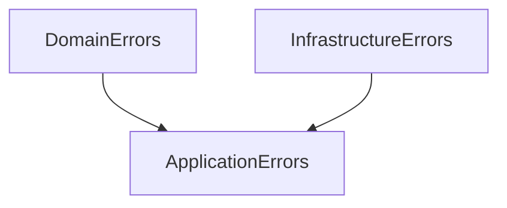
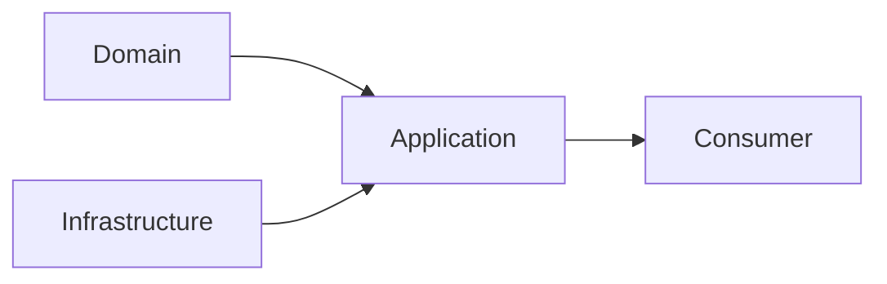
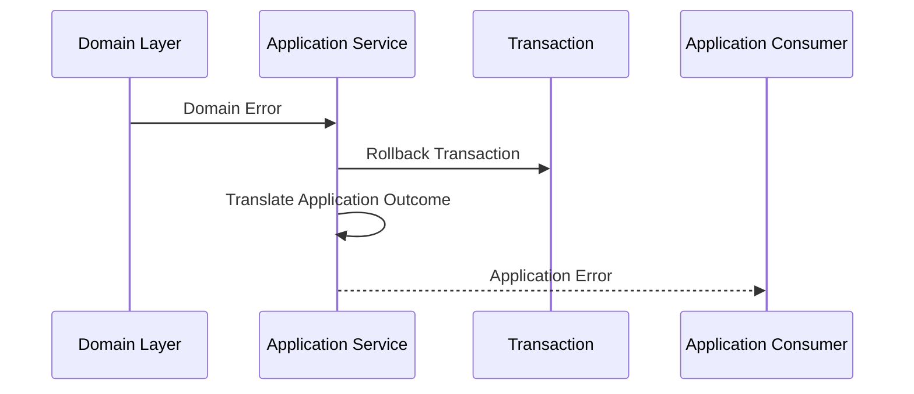
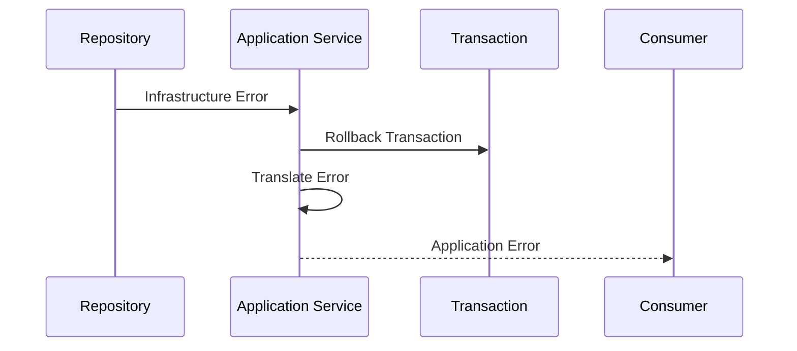
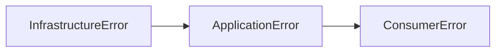
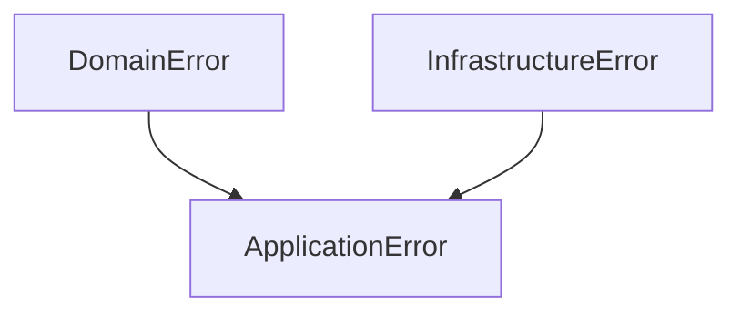
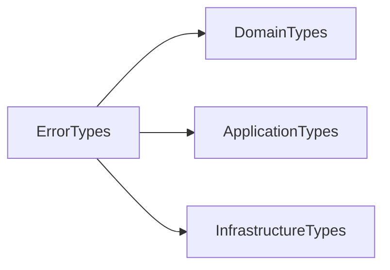

# Implementation Specification

# ISP-0008 — Error Handling Pattern

**Status:** Approved

**Version:** 1.0.0

**Authoritative Level:** Implementation Specification

---

# Purpose

This document defines the canonical error handling pattern for ForgeOS.

Error handling provides a consistent mechanism for representing, propagating, translating, and testing failures across the Domain Layer, Application Layer, and Infrastructure Layer while preserving architectural boundaries.

This specification standardizes implementation behavior.

It introduces no architectural authority.

The architectural responsibilities remain defined by:

* TDS-0002 — Domain Model
* TDS-0004 — Application Model
* ISP-0001 — Application Service Pattern
* ISP-0006 — Transaction Pattern

---

# Scope

This specification defines:

* error ownership;
* error classification;
* propagation flow;
* translation boundaries;
* implementation invariants.

This specification does **not** define:

* programming language error libraries;
* logging frameworks;
* observability platforms;
* transport-specific error formats;
* user interface messages.

Those concerns remain implementation decisions outside this specification.

---

# Normative Requirements

The key words **MUST**, **SHALL**, **SHOULD**, and **MAY** are to be interpreted as described in RFC 2119.

## Mandatory Requirements

Error handling:

* **MUST** preserve the origin of failures.
* **MUST** maintain architectural ownership boundaries.
* **MUST NOT** hide business failures as technical failures.
* **SHALL NOT** expose infrastructure details to the Domain Layer.
* **SHALL** provide deterministic error propagation.

## Recommended Practices

Error handling:

* **SHOULD** provide structured error types.
* **SHOULD** preserve diagnostic context.
* **SHOULD** remain independently testable.

---

# Architectural Traceability

| Concern                        | Authoritative Source |
| ------------------------------ | -------------------- |
| Domain Error Ownership         | TDS-0002             |
| Application Error Coordination | TDS-0004             |
| Transaction Failure Handling   | ISP-0006             |
| Repository Failures            | ISP-0004             |
| Architecture Enforcement       | ARCH-0003            |

---

# Error Handling Purpose

Error handling communicates unsuccessful execution while preserving the responsibility boundary where the failure originated.

Each layer owns its own errors.

Higher layers may translate errors for their consumers but shall not redefine their meaning.

---

# Canonical Error Categories

ForgeOS recognizes three primary error categories.



---

# Domain Errors

Domain Errors represent business rule violations.

Examples:

* invalid state transition;
* violated aggregate invariant;
* business constraint failure.

Domain Errors:

* originate in the Domain Layer;
* remain meaningful to the business context;
* never contain infrastructure details.

---

# Application Errors

Application Errors represent application coordination failures.

Examples:

* workflow execution failure;
* transaction coordination failure;
* missing application precondition.

Application Errors:

* coordinate use case outcomes;
* preserve underlying causes;
* translate errors for application consumers.

---

# Infrastructure Errors

Infrastructure Errors represent technical failures.

Examples:

* persistence failure;
* external service failure;
* communication failure.

Infrastructure Errors:

* originate outside the Domain Layer;
* remain isolated behind abstractions;
* may be translated into Application Errors.

---

# Error Ownership Model

Each layer owns the errors it creates.



Errors flow upward.

Responsibilities do not flow downward.

---

# Error Handling Invariants

The following invariants are mandatory.

1. Domain errors remain owned by the Domain Layer.
2. Infrastructure errors never leak into domain contracts.
3. Application Services coordinate error propagation.
4. Transactions rollback on failed state-changing execution.
5. Error translation preserves original meaning.
6. Errors remain deterministic and testable.
7. Error handling never replaces business rules.

These invariants establish the canonical ForgeOS error handling model.

*End of Part 1.*


# Canonical Error Propagation Flow

This section defines the standard error propagation flow implemented by ForgeOS components.

The purpose is to ensure that failures move through architectural boundaries without losing ownership, meaning, or diagnostic context.

This specification derives entirely from the approved ForgeOS architecture.

It introduces no new architectural authority.

---

# Error Propagation Sequence

Every failed execution follows the same conceptual propagation sequence.



The Application Layer coordinates failure propagation.

It does not redefine the original business meaning.

---

# Infrastructure Failure Sequence

Infrastructure failures follow the same upward propagation model.



Infrastructure details remain isolated from business components.

---

# Error Translation Boundaries

Errors may be translated only at architectural boundaries.



Translation shall preserve:

* original failure category;
* diagnostic context;
* execution outcome.

Translation shall not change business meaning.

---

# Domain Error Handling

Domain Errors represent meaningful business failures.

Application Services shall:

* receive Domain Errors;
* preserve their meaning;
* coordinate transaction rollback where required;
* return an appropriate application outcome.

Application Services shall not:

* replace Domain Errors with generic failures;
* reinterpret business rules;
* hide violated invariants.

---

# Transaction Failure Handling

When a state-changing workflow fails:

```text id="transaction-error-flow"
Execution Failure
        ↓
Capture Error
        ↓
Rollback Transaction
        ↓
Suppress Event Publication
        ↓
Return Failure Outcome
```

Domain Events shall only be published after successful completion.

---

# Repository Error Handling

Repositories communicate persistence failures through abstraction boundaries.

Repositories shall:

* return structured persistence failures;
* preserve technical context;
* avoid exposing storage-specific details.

Repositories shall not:

* convert technical failures into business failures;
* implement recovery workflows;
* hide persistence problems.

---

# Error Context Preservation

Every error propagation step should preserve:

* original source;
* failure category;
* relevant context;
* correlation information where applicable.

Error handling shall avoid losing the information required for diagnosis.

---

# Implementation Consistency Rules

Every ForgeOS implementation shall preserve the following characteristics.

* explicit error ownership;
* deterministic propagation;
* clear translation boundaries;
* transaction-aware failure handling;
* preserved diagnostic context;
* no hidden error conversion.

These rules standardize failure handling across all ForgeOS vertical slices.

*End of Part 2.*


# Recommended Implementation Structure

This section defines the recommended implementation structure for ForgeOS error handling.

Its purpose is to establish a consistent error representation and propagation model across every ForgeOS vertical slice.

The structure described here derives entirely from the approved ForgeOS architecture.

It introduces no new architectural authority.

---

# Canonical Error Structure

Every ForgeOS error implementation should follow the same conceptual organization.

```text id="3w7qzn"
Error
├── Error Category
├── Error Identifier
├── Error Context
├── Original Cause
└── Display / Consumer Translation
```

This structure standardizes failure representation while allowing implementation technologies to evolve independently.

---

# Conceptual Rust Error Structure

The following illustrates the conceptual organization of ForgeOS errors.

```text id="5x4h2m"
ForgeError

├── category
├── code
├── message
├── context
├── source_error
└── metadata
```

The fields shown are conceptual.

Concrete types and naming conventions remain implementation decisions governed by repository standards.

---

# Error Type Boundaries

Each architectural layer should maintain its own error representation.



The Application Layer coordinates translation.

The Domain Layer does not depend on Application or Infrastructure errors.

---

# Dependency Structure

Error definitions should depend only on stable abstractions.



Infrastructure details should not leak into domain contracts.

---

# Interface Boundaries

Error handling should preserve the following conceptual boundaries.

| Boundary                | Responsibility                 |
| ----------------------- | ------------------------------ |
| Domain Boundary         | Business rule failures         |
| Application Boundary    | Workflow coordination failures |
| Infrastructure Boundary | Technical failures             |
| Consumer Boundary       | External representation        |

These are implementation contracts rather than architectural contracts.

---

# Error Construction Principles

Errors should be:

* created at the layer where they originate;
* immutable after creation;
* structured rather than string-only;
* traceable to original causes;
* deterministic for equivalent failures.

Construction mechanisms remain implementation concerns.

---

# Testing Expectations

Every error handling implementation should be independently testable.

Implementation should support:

* error category verification;
* propagation testing;
* translation testing;
* rollback behavior testing;
* source error preservation;
* consumer response verification.

Business rule testing remains the responsibility of Domain tests.

---

# Implementation Mapping

The conceptual error responsibilities map to engineering responsibilities as follows.

| Implementation Concern        | Primary Responsibility   |
| ----------------------------- | ------------------------ |
| Domain Error Creation         | Domain Layer             |
| Application Error Mapping     | Application Layer        |
| Infrastructure Error Wrapping | Infrastructure Boundary  |
| Error Propagation             | Application Coordination |
| Consumer Translation          | Interface Layer          |

This mapping standardizes implementation while remaining independent of language-specific error libraries.

---

# Quality Objectives

Every ForgeOS error implementation should exhibit the following characteristics.

* clear ownership;
* preserved context;
* deterministic propagation;
* explicit translation boundaries;
* minimal coupling;
* high testability;
* stable consumer behavior.

These objectives improve maintainability while remaining consistent with the approved ForgeOS architecture.

---

# Implementation Notes

This specification intentionally does not define:

* specific Rust error crates;
* logging frameworks;
* tracing systems;
* HTTP status mappings;
* user-facing message formats;
* observability platforms.

Those decisions belong to technology-specific implementation guidance rather than this implementation pattern.

*End of Part 3.*


# Implementation Anti-Patterns

The following implementation patterns are prohibited because they violate the approved ForgeOS architecture or this implementation specification.

## Generic Error Replacement

Errors shall not be replaced with meaningless generic failures.

Prohibited examples:

* "Operation failed";
* "Unknown error";
* "System failure".

Error handling shall preserve the original failure meaning.

---

## Business Logic in Error Handling

Error handling shall not:

* determine business outcomes;
* implement business rules;
* bypass domain validation;
* replace aggregate behavior.

Errors communicate failures.

They do not decide business behavior.

---

## Error Information Loss

Error translation shall not remove essential context.

The following are prohibited:

* dropping source errors;
* removing failure categories;
* hiding diagnostic information;
* converting structured errors into strings prematurely.

---

## Infrastructure Leakage

Infrastructure errors shall not leak into domain contracts.

Prohibited examples:

* database exception types in domain APIs;
* HTTP client errors in aggregate methods;
* provider-specific failures in business models.

Infrastructure failures must be translated at appropriate boundaries.

---

## Silent Error Suppression

The following are prohibited:

* ignored errors;
* empty error handlers;
* automatic recovery without defined behavior;
* hidden fallback execution.

Every failure path shall be explicit.

---

## Inconsistent Error Ownership

Layers shall not create errors outside their responsibility.

Examples:

* Domain Layer creating infrastructure errors;
* Repository creating business rule errors;
* Application Layer creating domain invariant violations.

Error ownership must remain aligned with architectural boundaries.

---

# Implementation Compliance Checklist

Every error handling implementation should satisfy the following checklist before acceptance.

| Requirement                            | Verification                  |
| -------------------------------------- | ----------------------------- |
| Errors have explicit ownership         | Architecture review           |
| Domain errors remain domain-owned      | Domain review                 |
| Infrastructure errors remain isolated  | Static dependency analysis    |
| Error context preserved                | Unit testing                  |
| Translation boundaries explicit        | Application testing           |
| Transaction failures handled correctly | Integration testing           |
| No silent failures                     | Static analysis / code review |
| Stable consumer representation         | API review                    |

This checklist is intended for both human review and automated repository verification.

---

# Reference Implementation Checklist

A ForgeOS error handling implementation should satisfy the following requirements.

| Requirement                   | Status |
| ----------------------------- | ------ |
| Structured error types exist  | □      |
| Error categories are explicit | □      |
| Source context preserved      | □      |
| Layer ownership maintained    | □      |
| No infrastructure leakage     | □      |
| Translation rules implemented | □      |
| Failure paths tested          | □      |
| Consumer responses verified   | □      |

This checklist is suitable for automated conformance verification and Codex-generated implementation review.

---

# Repository Verification

Repository tooling should automatically verify error handling compliance.

Recommended verification includes:

* forbidden dependency detection;
* error ownership analysis;
* ignored error detection;
* translation boundary verification;
* transaction failure-path verification;
* architecture regression detection;
* implementation conformance validation.

These checks complement the architectural enforcement defined by **ARCH-0003**.

---

# Relationship to Future Implementation Specifications

This document establishes the implementation pattern for **Error Handling** only.

Subsequent specifications refine adjacent implementation concerns.

| Specification | Responsibility               |
| ------------- | ---------------------------- |
| ISP-0001      | Application Services         |
| ISP-0002      | Command Handlers             |
| ISP-0003      | Query Handlers               |
| ISP-0004      | Repository Pattern           |
| ISP-0005      | Domain Event Pattern         |
| ISP-0006      | Transaction Pattern          |
| ISP-0007      | Dependency Injection Pattern |
| ISP-0008      | Error Handling Pattern       |
| ISP-0009      | Testing Pattern              |
| ISP-0010      | Vertical Slice Pattern       |

Together these documents define the canonical ForgeOS implementation standard.

---

# Codex Implementation Guidance

When generating or modifying error handling code, Codex should:

* preserve error ownership boundaries;
* keep domain errors separate from technical failures;
* preserve original context;
* translate errors only at appropriate boundaries;
* avoid silent failure handling;
* maintain deterministic failure behavior;
* keep infrastructure details isolated.

If a requested implementation violates this specification or the approved architecture, the implementation should be revised rather than introducing an architectural exception.

---

# Codex Readiness

## Implementation Status

**Ready for implementation of ForgeOS error handling.**

Using this specification together with the approved TDSs, derived architecture views, and previous ISPs, a Senior Software Engineer or Codex can consistently implement error representation, propagation, and translation without inventing failure ownership models.

No additional implementation decisions are required before implementing ForgeOS error handling.

---

# Implementation Authority

This document is an **Implementation Specification**.

It standardizes implementation of the approved architecture.

It shall **not** be used to introduce or modify:

* domain ownership;
* application responsibilities;
* transaction semantics;
* infrastructure architecture;
* business rules.

Changes to those concerns shall first be made in the authoritative TDS documents and then propagated through the derived architecture views before this specification is updated.

---

# Document Completion

This document is complete.

It establishes the canonical implementation pattern for ForgeOS Error Handling and serves as the implementation reference for failures across Domain, Application, and Infrastructure boundaries.

Together with **ISP-0001** through **ISP-0007**, it provides a complete implementation contract covering orchestration, CQRS, persistence, events, transactions, composition, and failure management while preserving the architectural authority established by the ForgeOS TDS series.
