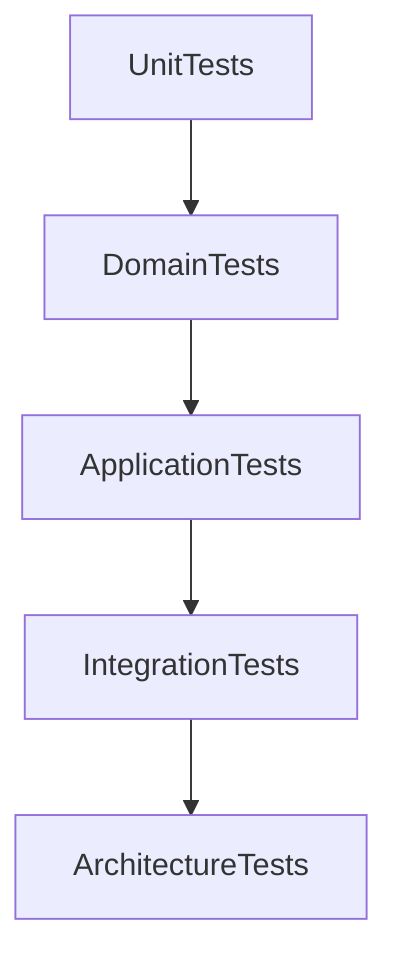
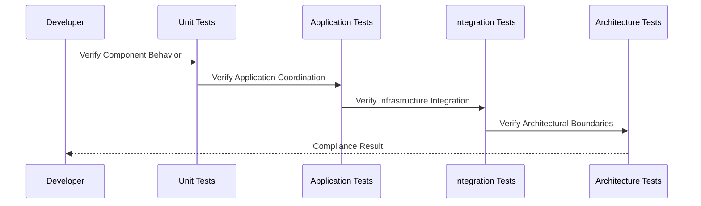
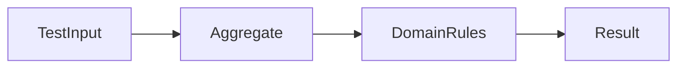
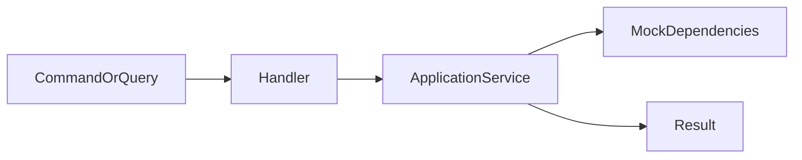
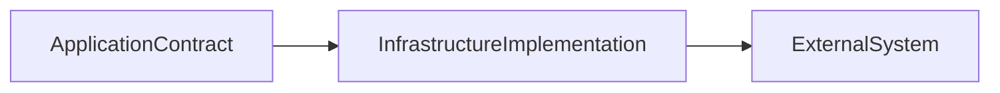
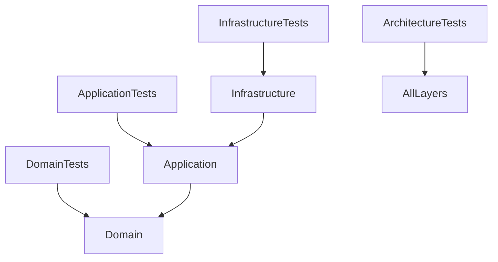
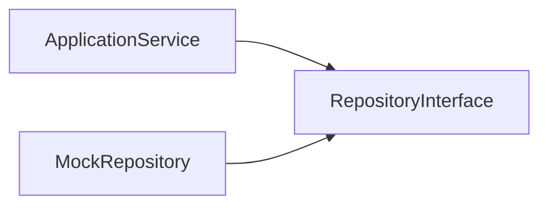

# Implementation Specification

# ISP-0009 — Testing Pattern

**Status:** Approved

**Version:** 1.0.0

**Authoritative Level:** Implementation Specification

---

# Purpose

This document defines the canonical testing pattern for ForgeOS.

Testing provides verification that implementations preserve approved architectural boundaries, application behavior, domain correctness, and infrastructure isolation.

This specification standardizes testing implementation.

It introduces no architectural authority.

The architectural responsibilities remain defined by:

* TDS-0002 — Domain Model
* TDS-0004 — Application Model
* ARCH-0003 — Architecture Enforcement
* ISP-0001 through ISP-0008

---

# Scope

This specification defines:

* testing responsibilities;
* test boundaries;
* verification layers;
* test organization;
* implementation invariants.

This specification does **not** define:

* testing frameworks;
* assertion libraries;
* CI platforms;
* coverage targets;
* deployment validation systems.

Those concerns remain implementation decisions outside this specification.

---

# Normative Requirements

The key words **MUST**, **SHALL**, **SHOULD**, and **MAY** are to be interpreted as described in RFC 2119.

## Mandatory Requirements

Testing:

* **MUST** verify behavior at the correct architectural boundary.
* **MUST** preserve separation between Domain, Application, and Infrastructure concerns.
* **MUST NOT** require infrastructure for pure domain verification.
* **SHALL** verify implementation invariants.
* **SHALL** provide deterministic results.

## Recommended Practices

Tests:

* **SHOULD** remain isolated.
* **SHOULD** express business intent clearly.
* **SHOULD** avoid testing implementation details unnecessarily.
* **SHOULD** support automated execution.

---

# Architectural Traceability

| Concern                 | Authoritative Source |
| ----------------------- | -------------------- |
| Domain Behavior         | TDS-0002             |
| Application Behavior    | TDS-0004             |
| Architecture Boundaries | ARCH-0003            |
| Application Services    | ISP-0001             |
| Commands / Queries      | ISP-0002 / ISP-0003  |
| Repository Behavior     | ISP-0004             |
| Events                  | ISP-0005             |
| Transactions            | ISP-0006             |
| Dependency Composition  | ISP-0007             |
| Error Handling          | ISP-0008             |

---

# Testing Purpose

Testing verifies that ForgeOS implementations satisfy intended behavior while preserving architectural boundaries.

Each architectural layer has its own testing responsibility.

Testing does not replace architecture.

It verifies implementation against architecture.

---

# Canonical Testing Layers

ForgeOS implementations are verified through multiple testing layers.



Each layer validates different responsibilities.

---

# Domain Testing

Domain tests verify:

* business rules;
* aggregate behavior;
* value object behavior;
* domain invariants;
* domain event creation.

Domain tests shall:

* execute without infrastructure;
* remain deterministic;
* verify business meaning.

---

# Application Testing

Application tests verify:

* Command Handler behavior;
* Query Handler behavior;
* Application Service orchestration;
* transaction coordination;
* error propagation.

Application tests should isolate infrastructure through abstractions.

---

# Infrastructure Testing

Infrastructure tests verify:

* Repository implementations;
* external integrations;
* persistence behavior;
* technical adapters.

Infrastructure tests shall not redefine domain correctness.

---

# Architecture Testing

Architecture tests verify:

* dependency direction;
* forbidden coupling;
* layer boundaries;
* implementation compliance.

Architecture tests protect against architectural regression.

---

# Testing Invariants

The following invariants are mandatory.

1. Domain tests remain infrastructure-independent.
2. Application tests verify orchestration behavior.
3. Infrastructure tests verify technical behavior.
4. Architecture tests verify boundaries.
5. Tests remain deterministic.
6. Test ownership follows implementation ownership.
7. Tests do not introduce architectural decisions.

These invariants establish the canonical ForgeOS testing model.

*End of Part 1.*


# Canonical Testing Flow

This section defines the standard testing execution flow implemented across ForgeOS components.

The purpose is to ensure that every implementation is verified at the correct architectural boundary while maintaining deterministic and meaningful test results.

This specification derives entirely from the approved ForgeOS architecture.

It introduces no new architectural authority.

---

# Test Execution Sequence

Every ForgeOS test suite follows the same conceptual progression.



Each testing layer validates its own responsibility.

---

# Domain Test Flow

Domain testing follows the following sequence.



Domain tests verify business correctness without requiring:

* databases;
* external services;
* infrastructure implementations.

---

# Application Test Flow

Application tests verify orchestration behavior.



Application tests verify:

* command execution;
* query execution;
* dependency interaction;
* transaction coordination;
* error propagation.

---

# Infrastructure Test Flow

Infrastructure tests verify technical implementations.



Infrastructure tests verify:

* persistence behavior;
* adapter correctness;
* external communication.

They do not verify business rules.

---

# Fixture Ownership

Test fixtures shall belong to the layer they support.

| Fixture Type               | Owner                |
| -------------------------- | -------------------- |
| Domain Objects             | Domain Tests         |
| Application Requests       | Application Tests    |
| Repository Implementations | Infrastructure Tests |
| Architecture Rules         | Architecture Tests   |

Fixtures shall not introduce dependencies from lower layers into higher layers.

---

# Mocking Boundaries

Mocking shall occur only at architectural boundaries.

Permitted mocking:

* Application Service dependencies;
* Repository interfaces;
* External provider abstractions;
* Event publisher abstractions.

Prohibited mocking:

* Domain rules;
* Aggregate behavior;
* Value object behavior.

Business behavior should be tested directly.

---

# Verification Strategy

Every implementation change should be verified through the smallest appropriate testing layer.

```text id="testing-strategy"
Domain Change
      ↓
Domain Tests

Application Change
      ↓
Application Tests

Infrastructure Change
      ↓
Infrastructure Tests

Architecture Change
      ↓
Architecture Tests
```

Testing effort should match the ownership boundary.

---

# Failure Verification

Tests shall verify both successful and unsuccessful execution paths.

Required verification includes:

* valid execution;
* invalid input handling;
* business rule failures;
* infrastructure failures;
* transaction rollback behavior;
* error propagation.

---

# Implementation Consistency Rules

Every ForgeOS testing implementation shall preserve the following characteristics.

* correct layer ownership;
* deterministic execution;
* explicit verification boundaries;
* isolated responsibilities;
* meaningful failure detection;
* architecture preservation.

These rules standardize testing across all ForgeOS vertical slices.

*End of Part 2.*

# Recommended Implementation Structure

This section defines the recommended implementation structure for ForgeOS testing.

Its purpose is to establish a consistent verification organization across every ForgeOS vertical slice.

The structure described here derives entirely from the approved ForgeOS architecture.

It introduces no new architectural authority.

---

# Canonical Test Structure

Every ForgeOS implementation should organize tests according to architectural responsibility.

```text id="b6y7xm"
Tests
├── Domain Tests
│   ├── Aggregate Tests
│   ├── Value Object Tests
│   └── Domain Event Tests
│
├── Application Tests
│   ├── Command Handler Tests
│   ├── Query Handler Tests
│   └── Application Service Tests
│
├── Infrastructure Tests
│   ├── Repository Tests
│   └── External Adapter Tests
│
└── Architecture Tests
    └── Boundary Verification
```

Test organization should reflect ownership boundaries.

---

# Conceptual Rust Test Structure

The following illustrates the conceptual organization of ForgeOS tests.

```text id="h7x4pm"
tests/

├── domain/
│   ├── aggregate_tests
│   ├── value_object_tests
│   └── event_tests
│
├── application/
│   ├── command_handler_tests
│   ├── query_handler_tests
│   └── service_tests
│
├── infrastructure/
│   ├── repository_tests
│   └── adapter_tests
│
└── architecture/
    └── dependency_tests
```

Directory names are illustrative.

Concrete repository organization remains governed by implementation standards.

---

# Test Dependency Structure

Tests should preserve the same dependency direction as production code.



Tests should not create invalid production dependencies.

---

# Test Double Boundaries

Test doubles should exist only where architectural abstractions exist.



Mock implementations replace abstractions, not business behavior.

---

# Test Construction Principles

Tests should be:

* deterministic;
* isolated;
* explicit;
* focused on behavior;
* independent from execution order.

Tests should avoid:

* shared mutable state;
* hidden fixtures;
* environmental assumptions;
* implementation-detail assertions.

---

# Testing Mapping

The conceptual testing responsibilities map to engineering responsibilities as follows.

| Testing Concern      | Primary Responsibility   |
| -------------------- | ------------------------ |
| Domain Tests         | Business correctness     |
| Application Tests    | Workflow coordination    |
| Infrastructure Tests | Technical correctness    |
| Architecture Tests   | Boundary preservation    |
| Integration Tests    | Cross-component behavior |

This mapping standardizes verification while remaining independent of testing frameworks.

---

# Quality Objectives

Every ForgeOS testing implementation should exhibit the following characteristics.

* clear ownership;
* reliable execution;
* meaningful assertions;
* minimal coupling;
* fast feedback loops;
* regression prevention;
* architectural protection.

These objectives improve maintainability while remaining consistent with the approved ForgeOS architecture.

---

# Implementation Notes

This specification intentionally does not define:

* testing frameworks;
* mocking libraries;
* coverage percentages;
* CI/CD pipelines;
* performance testing tools;
* test reporting systems.

Those decisions belong to technology-specific implementation guidance rather than this implementation pattern.

*End of Part 3.*

# Implementation Anti-Patterns

The following implementation patterns are prohibited because they violate the approved ForgeOS architecture or this implementation specification.

## Testing Implementation Details Instead of Behavior

Tests shall verify observable behavior and architectural contracts.

The following are prohibited:

* asserting private implementation details;
* testing internal helper structure;
* coupling tests to refactoring-sensitive code paths.

Tests should protect behavior, not implementation shape.

---

## Infrastructure-Dependent Domain Tests

Domain tests shall not require:

* databases;
* external services;
* network communication;
* infrastructure implementations.

Domain correctness must remain independently verifiable.

---

## Excessive Mocking

Tests shall not mock the behavior they are intended to verify.

The following are prohibited:

* mocking aggregates;
* mocking domain rules;
* replacing business logic with test doubles.

Test doubles should only replace architectural boundaries.

---

## Non-Deterministic Tests

Tests shall not depend on:

* execution order;
* timing assumptions;
* external state;
* uncontrolled randomness.

Test results shall remain reproducible.

---

## Missing Failure Path Testing

Tests shall not verify only successful execution.

Required failure scenarios include:

* invalid business state;
* dependency failure;
* transaction failure;
* error propagation.

---

## Architecture Bypass Through Tests

Tests shall not create invalid dependencies that production code cannot have.

Examples:

* Domain tests importing infrastructure;
* Application tests bypassing Application Services;
* Architecture tests depending on implementation details.

Tests must preserve architectural boundaries.

---

# Implementation Compliance Checklist

Every ForgeOS testing implementation should satisfy the following checklist before acceptance.

| Requirement                                      | Verification        |
| ------------------------------------------------ | ------------------- |
| Tests organized by ownership boundary            | Code review         |
| Domain tests remain infrastructure-free          | Dependency analysis |
| Application behavior tested through abstractions | Application testing |
| Infrastructure behavior tested independently     | Integration testing |
| Architecture boundaries verified                 | Architecture tests  |
| Success and failure paths covered                | Test review         |
| Tests remain deterministic                       | Automated execution |
| No implementation-detail coupling                | Code review         |

This checklist is intended for both human review and automated repository verification.

---

# Reference Implementation Checklist

A ForgeOS testing implementation should satisfy the following requirements.

| Requirement                                 | Status |
| ------------------------------------------- | ------ |
| Domain tests exist                          | □      |
| Application tests exist                     | □      |
| Infrastructure tests exist                  | □      |
| Architecture tests exist                    | □      |
| Test boundaries match production boundaries | □      |
| Failure scenarios verified                  | □      |
| Test fixtures have clear ownership          | □      |
| Test execution is deterministic             | □      |

This checklist is suitable for automated conformance verification and Codex-generated implementation review.

---

# Repository Verification

Repository tooling should automatically verify testing compliance.

Recommended verification includes:

* test location verification;
* forbidden dependency detection;
* architecture test execution;
* missing test category detection;
* deterministic execution checks;
* implementation conformance validation.

These checks complement the architectural enforcement defined by **ARCH-0003**.

---

# Relationship to Future Implementation Specifications

This document establishes the implementation pattern for **Testing** only.

The final implementation specification will refine complete application delivery structure.

| Specification | Responsibility               |
| ------------- | ---------------------------- |
| ISP-0001      | Application Services         |
| ISP-0002      | Command Handlers             |
| ISP-0003      | Query Handlers               |
| ISP-0004      | Repository Pattern           |
| ISP-0005      | Domain Event Pattern         |
| ISP-0006      | Transaction Pattern          |
| ISP-0007      | Dependency Injection Pattern |
| ISP-0008      | Error Handling Pattern       |
| ISP-0009      | Testing Pattern              |
| ISP-0010      | Vertical Slice Pattern       |

Together these documents define the canonical ForgeOS implementation standard.

---

# Codex Implementation Guidance

When generating or modifying tests, Codex should:

* place tests according to architectural ownership;
* verify behavior rather than implementation details;
* preserve dependency boundaries;
* test both success and failure paths;
* use mocks only at abstraction boundaries;
* maintain deterministic execution;
* include architecture verification where appropriate.

If a requested test structure violates this specification or the approved architecture, the implementation should be revised rather than introducing an architectural exception.

---

# Codex Readiness

## Implementation Status

**Ready for implementation of ForgeOS testing strategy.**

Using this specification together with the approved TDSs, derived architecture views, and previous ISPs, a Senior Software Engineer or Codex can consistently create tests without inventing ownership boundaries, mocking strategies, or verification responsibilities.

No additional implementation decisions are required before implementing ForgeOS testing infrastructure.

---

# Implementation Authority

This document is an **Implementation Specification**.

It standardizes implementation of the approved architecture.

It shall **not** be used to introduce or modify:

* architectural boundaries;
* business rules;
* application responsibilities;
* deployment strategy;
* quality policies.

Changes to those concerns shall first be made in the authoritative TDS documents and then propagated through the derived architecture views before this specification is updated.

---

# Document Completion

This document is complete.

It establishes the canonical implementation pattern for ForgeOS Testing and serves as the implementation reference for verification across Domain, Application, Infrastructure, and Architecture boundaries.

Together with **ISP-0001** through **ISP-0008**, it provides a complete implementation contract covering orchestration, CQRS, persistence, events, transactions, composition, errors, and verification while preserving the architectural authority established by the ForgeOS TDS series.
