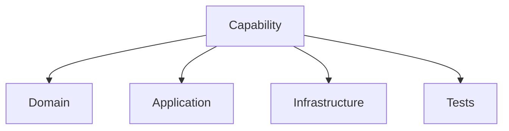
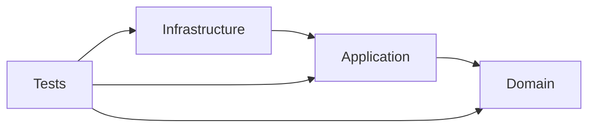
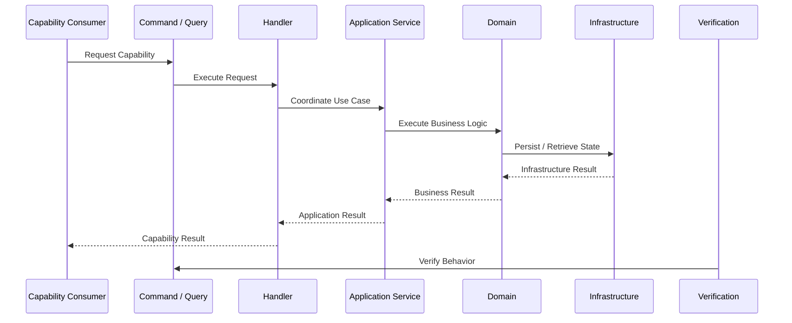
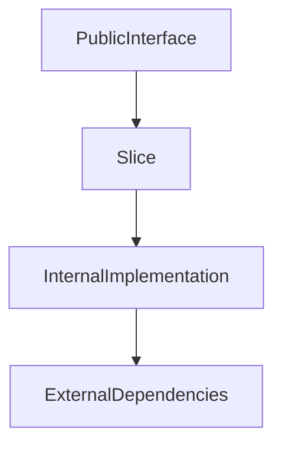
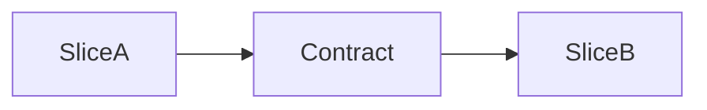
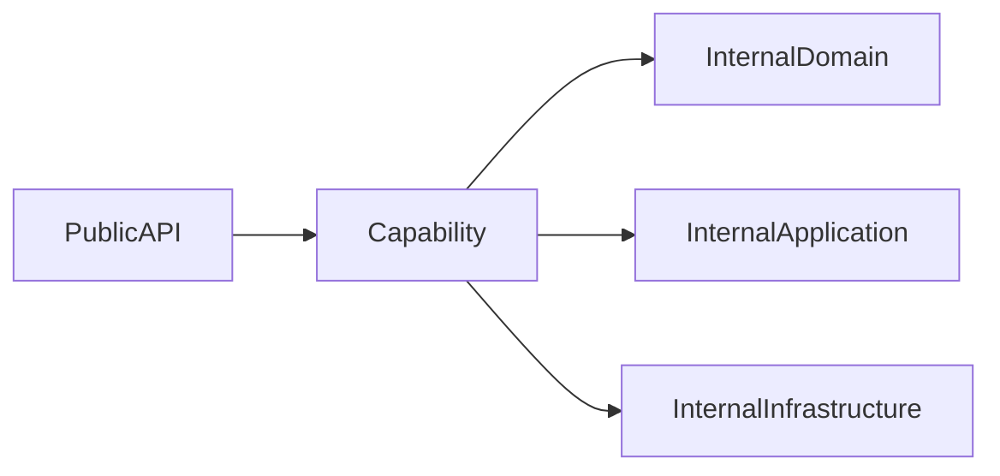

# Implementation Specification

# ISP-0010 — Vertical Slice Pattern

**Status:** Approved

**Version:** 1.0.0

**Authoritative Level:** Implementation Specification

---

# Purpose

This document defines the canonical implementation pattern for Vertical Slices in ForgeOS.

A Vertical Slice represents a complete implementation capability that crosses the required architectural layers while preserving ownership boundaries.

Vertical Slices provide the delivery structure used to implement ForgeOS capabilities incrementally.

This specification standardizes implementation organization.

It introduces no architectural authority.

The architectural responsibilities remain defined by:

* TDS-0002 — Domain Model
* TDS-0003 — Organization Model
* TDS-0004 — Application Model
* ISP-0001 through ISP-0009

---

# Scope

This specification defines:

* vertical slice composition;
* capability organization;
* implementation boundaries;
* slice ownership;
* delivery structure;
* implementation invariants.

This specification does **not** define:

* business capabilities;
* domain boundaries;
* product priorities;
* organizational ownership;
* deployment strategy.

Those concerns remain defined by their respective authoritative documents.

---

# Normative Requirements

The key words **MUST**, **SHALL**, **SHOULD**, and **MAY** are to be interpreted as described in RFC 2119.

## Mandatory Requirements

Vertical Slices:

* **MUST** represent complete implementation capabilities.
* **MUST** preserve approved architectural boundaries.
* **MUST NOT** bypass Domain ownership.
* **SHALL** include all required implementation layers.
* **SHALL** remain independently testable.

## Recommended Practices

Vertical Slices:

* **SHOULD** minimize coupling with unrelated capabilities.
* **SHOULD** evolve independently where possible.
* **SHOULD** provide clear implementation ownership.

---

# Architectural Traceability

| Concern                      | Authoritative Source |
| ---------------------------- | -------------------- |
| Domain Responsibilities      | TDS-0002             |
| Organizational Context       | TDS-0003             |
| Application Responsibilities | TDS-0004             |
| Application Services         | ISP-0001             |
| Commands / Queries           | ISP-0002 / ISP-0003  |
| Repositories                 | ISP-0004             |
| Events                       | ISP-0005             |
| Transactions                 | ISP-0006             |
| Dependency Injection         | ISP-0007             |
| Error Handling               | ISP-0008             |
| Testing                      | ISP-0009             |

---

# Vertical Slice Purpose

A Vertical Slice organizes implementation around a capability rather than a technical layer.

Instead of organizing code primarily by:

* controllers;
* services;
* repositories;
* models;

ForgeOS implementations organize around complete business capabilities.

Each slice contains the implementation required to deliver that capability.

---

# Canonical Slice Structure

Every Vertical Slice follows the same conceptual organization.



A slice crosses layers while preserving layer responsibilities.

---

# Slice Composition

A complete Vertical Slice may contain:

```text id="slice-layout"
Capability
├── Domain
│   ├── Aggregate Behavior
│   ├── Value Objects
│   └── Domain Events
│
├── Application
│   ├── Commands
│   ├── Queries
│   ├── Handlers
│   └── Application Services
│
├── Infrastructure
│   ├── Repository Implementations
│   └── External Adapters
│
└── Tests
    ├── Domain Tests
    ├── Application Tests
    └── Integration Tests
```

The slice structure reflects implementation ownership.

---

# Dependency Rules

Vertical Slices shall preserve architectural dependency direction.



Higher-level policies remain independent from lower-level implementations.

---

# Implementation Invariants

The following invariants are mandatory.

1. Every Vertical Slice represents one complete capability.
2. Domain ownership remains unchanged.
3. Application orchestration remains explicit.
4. Infrastructure remains replaceable.
5. Tests remain aligned with ownership boundaries.
6. Slices do not create hidden dependencies.
7. Slice organization does not override architecture.

These invariants establish the canonical ForgeOS Vertical Slice model.

*End of Part 1.*

# Canonical Slice Execution Flow

This section defines the standard execution flow implemented by every ForgeOS Vertical Slice.

The purpose is to ensure that each capability is delivered as a complete implementation unit while preserving architectural boundaries and ownership.

This specification derives entirely from the approved ForgeOS architecture.

It introduces no new architectural authority.

---

# Capability Execution Sequence

Every Vertical Slice follows the same conceptual execution sequence.



The slice represents the complete path from request to verified outcome.

---

# Capability Delivery Lifecycle

Every Vertical Slice follows the same conceptual delivery lifecycle.

```text id="delivery-lifecycle"
Define Capability
        ↓
Model Domain Behavior
        ↓
Create Application Flow
        ↓
Implement Infrastructure Support
        ↓
Verify Through Tests
        ↓
Deliver Capability
```

Implementation proceeds capability-by-capability.

---

# Slice Boundary Model

Each Vertical Slice maintains a clear boundary.



External consumers interact through approved interfaces.

Internal implementation details remain isolated.

---

# Integration Boundaries

Vertical Slices integrate through approved architectural mechanisms.

Permitted integration mechanisms include:

* Application Services;
* Domain Events;
* Repository abstractions;
* defined application contracts.

Slices shall not integrate through:

* direct database access;
* internal aggregate manipulation;
* hidden shared state;
* infrastructure coupling.

---

# Capability Independence

A Vertical Slice should minimize dependency on unrelated capabilities.

A slice may depend on:

* shared domain abstractions;
* approved application contracts;
* common infrastructure abstractions.

A slice shall not:

* bypass another capability's ownership;
* modify another slice's internal state;
* create hidden coupling.

---

# Dependency Coordination

Dependencies between slices shall follow explicit contracts.



The contract defines the integration point.

The internal implementation remains owned by each slice.

---

# Transaction and Event Coordination

Vertical Slices preserve existing transaction and event rules.

State-changing slices:

* execute within transaction boundaries;
* publish Domain Events after successful completion.

Read-only slices:

* preserve query isolation;
* do not modify business state.

---

# Implementation Consistency Rules

Every Vertical Slice implementation shall preserve the following characteristics.

* complete capability ownership;
* explicit dependency boundaries;
* independent verification;
* minimal unrelated coupling;
* consistent architectural layering;
* replaceable infrastructure.

These rules standardize capability delivery across all ForgeOS implementations.

*End of Part 2.*

# Recommended Implementation Structure

This section defines the recommended implementation structure for ForgeOS Vertical Slices.

Its purpose is to establish a consistent capability-oriented organization across all ForgeOS implementations.

The structure described here derives entirely from the approved ForgeOS architecture.

It introduces no new architectural authority.

---

# Canonical Vertical Slice Structure

Every capability should be organized as an independent implementation unit.

```text id="g8p4kv"
Capability Slice

├── Domain
│   ├── Aggregates
│   ├── Value Objects
│   ├── Domain Services
│   └── Domain Events
│
├── Application
│   ├── Commands
│   ├── Queries
│   ├── Handlers
│   └── Application Services
│
├── Infrastructure
│   ├── Repository Implementations
│   └── External Adapters
│
└── Tests
    ├── Domain Tests
    ├── Application Tests
    └── Integration Tests
```

The slice contains all required implementation elements for one capability.

---

# Conceptual Rust Project Structure

The following illustrates a conceptual ForgeOS project organization.

```text id="j6m2rq"
src/

├── capabilities/
│
│   ├── capability_a/
│   │   ├── domain/
│   │   ├── application/
│   │   ├── infrastructure/
│   │   └── tests/
│   │
│   └── capability_b/
│       ├── domain/
│       ├── application/
│       ├── infrastructure/
│       └── tests/
│
├── shared/
│   ├── kernel/
│   ├── contracts/
│   └── infrastructure/
│
└── composition/
    └── application_bootstrap/
```

Folder names are illustrative.

Concrete repository structure remains governed by implementation standards.

---

# Capability Module Structure

Each capability should expose a controlled public boundary.



Consumers interact through approved capability interfaces.

---

# Shared Component Rules

Shared components should remain limited.

A component may become shared only when:

* it represents genuine common behavior;
* ownership is clear;
* duplication has meaningful architectural cost.

Shared components shall not become a location for unrelated functionality.

---

# Implementation Mapping

The conceptual Vertical Slice responsibilities map to engineering responsibilities as follows.

| Implementation Concern | Primary Responsibility   |
| ---------------------- | ------------------------ |
| Capability Boundary    | Feature ownership        |
| Domain Layer           | Business correctness     |
| Application Layer      | Use case coordination    |
| Infrastructure Layer   | Technical implementation |
| Tests                  | Behavior verification    |
| Composition Layer      | Runtime assembly         |

This mapping standardizes implementation while preserving architectural ownership.

---

# Deployment Mapping

Vertical Slices may be deployed together or independently depending on system architecture.

Deployment decisions remain outside this specification.

Regardless of deployment strategy, every slice shall preserve:

* domain ownership;
* application boundaries;
* infrastructure isolation;
* test ownership.

---

# Quality Objectives

Every Vertical Slice implementation should exhibit the following characteristics.

* capability-focused organization;
* clear ownership;
* independent evolution;
* minimal coupling;
* explicit contracts;
* complete verification;
* architectural consistency.

These objectives improve maintainability while remaining consistent with the approved ForgeOS architecture.

---

# Implementation Notes

This specification intentionally does not define:

* microservice boundaries;
* deployment topology;
* repository folder naming conventions;
* module naming conventions;
* programming language constraints;
* build system organization.

Those decisions belong to technology-specific implementation guidance rather than this implementation pattern.

*End of Part 3.*

# Implementation Anti-Patterns

The following implementation patterns are prohibited because they violate the approved ForgeOS architecture or this implementation specification.

## Layer-First Organization Without Capability Ownership

Vertical Slices shall not be implemented as disconnected technical layers.

Prohibited organization:

```text
controllers/
services/
repositories/
models/
```

without capability ownership.

Implementation organization shall preserve complete capability boundaries.

---

## Cross-Slice Internal Access

A Vertical Slice shall not directly access another slice's internal implementation.

Prohibited examples:

* modifying another slice's aggregates;
* accessing another slice's repositories;
* depending on internal application services;
* sharing hidden state.

Integration shall occur through approved contracts.

---

## Shared State Between Slices

Vertical Slices shall not rely on:

* global mutable state;
* hidden shared databases as coordination mechanisms;
* undocumented communication paths.

Dependencies shall remain explicit.

---

## Capability Ownership Violation

A Vertical Slice shall not:

* redefine another capability's business rules;
* bypass domain ownership;
* duplicate ownership without justification;
* modify another capability's internal behavior.

Ownership boundaries shall remain clear.

---

## Infrastructure-Driven Design

Vertical Slices shall not be organized around infrastructure concerns.

Prohibited examples:

* database tables defining capability boundaries;
* external APIs determining domain ownership;
* framework structure overriding business structure.

Business capability remains the organizing principle.

---

## Incomplete Slices

A Vertical Slice shall not represent only a technical fragment.

Incomplete examples:

* repository without application behavior;
* handler without domain behavior;
* domain model without verification.

A slice should represent a complete deliverable capability.

---

# Implementation Compliance Checklist

Every Vertical Slice implementation should satisfy the following checklist before acceptance.

| Requirement                        | Verification              |
| ---------------------------------- | ------------------------- |
| Represents complete capability     | Architecture review       |
| Domain ownership preserved         | Domain review             |
| Application orchestration explicit | Application review        |
| Infrastructure isolated            | Dependency analysis       |
| Tests included                     | Test review               |
| Dependencies explicit              | Architecture verification |
| Integration through contracts      | Code review               |
| No hidden shared state             | Static analysis           |

This checklist is intended for both human review and automated repository verification.

---

# Reference Implementation Checklist

A ForgeOS Vertical Slice implementation should satisfy the following requirements.

| Requirement                      | Status |
| -------------------------------- | ------ |
| Capability boundary defined      | □      |
| Domain implementation included   | □      |
| Application flow included        | □      |
| Infrastructure adapters included | □      |
| Tests included                   | □      |
| Public contracts defined         | □      |
| Internal implementation isolated | □      |
| Dependencies verified            | □      |

This checklist is suitable for automated conformance verification and Codex-generated implementation review.

---

# Repository Verification

Repository tooling should automatically verify Vertical Slice compliance.

Recommended verification includes:

* capability structure detection;
* forbidden cross-slice dependency detection;
* architecture boundary verification;
* missing layer detection;
* test presence verification;
* implementation conformance validation.

These checks complement the architectural enforcement defined by **ARCH-0003**.

---

# Relationship to Implementation Specification Package

This document completes the initial ForgeOS Implementation Specification Package.

The package establishes implementation standards for:

| Specification | Responsibility               |
| ------------- | ---------------------------- |
| ISP-0001      | Application Services         |
| ISP-0002      | Command Handlers             |
| ISP-0003      | Query Handlers               |
| ISP-0004      | Repository Pattern           |
| ISP-0005      | Domain Event Pattern         |
| ISP-0006      | Transaction Pattern          |
| ISP-0007      | Dependency Injection Pattern |
| ISP-0008      | Error Handling Pattern       |
| ISP-0009      | Testing Pattern              |
| ISP-0010      | Vertical Slice Pattern       |

Together these specifications provide a complete implementation contract.

---

# Codex Implementation Guidance

When generating or modifying ForgeOS capabilities, Codex should:

* organize implementation around capabilities;
* preserve Domain ownership;
* preserve Application orchestration boundaries;
* isolate Infrastructure concerns;
* include appropriate tests;
* integrate through approved contracts;
* avoid hidden cross-slice dependencies.

If a requested implementation violates this specification or the approved architecture, the implementation should be revised rather than introducing an architectural exception.

---

# Codex Readiness

## Implementation Status

**Ready for implementation of ForgeOS Vertical Slices.**

Using this specification together with the approved TDS documents and the complete Implementation Specification Package, a Senior Software Engineer or Codex can consistently implement complete ForgeOS capabilities without inventing organization structures, dependency boundaries, or ownership models.

No additional implementation decisions are required before implementing ForgeOS capabilities.

---

# Implementation Authority

This document is an **Implementation Specification**.

It standardizes implementation of the approved architecture.

It shall **not** be used to introduce or modify:

* business capability definitions;
* domain boundaries;
* organizational ownership;
* deployment architecture;
* product decisions.

Changes to those concerns shall first be made in the authoritative TDS documents and then propagated through derived architecture views before this specification is updated.

---

# Document Completion

This document is complete.

It establishes the canonical implementation pattern for ForgeOS Vertical Slices and completes the initial Implementation Specification Package.

The package now provides implementation guidance for:

* application orchestration;
* command processing;
* query processing;
* persistence abstraction;
* domain events;
* transactions;
* dependency composition;
* error handling;
* testing;
* capability delivery.

All implementation specifications remain subordinate to the approved ForgeOS architecture documents.

No additional architectural decisions are required for this implementation view.
