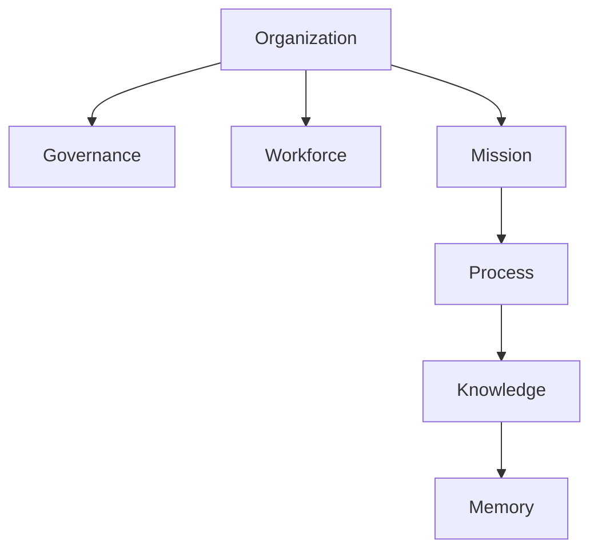
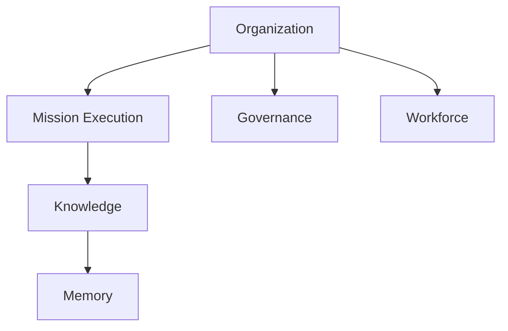
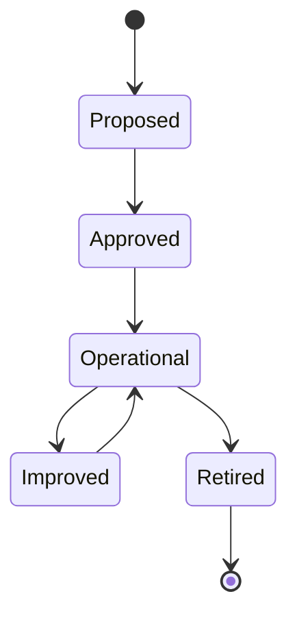
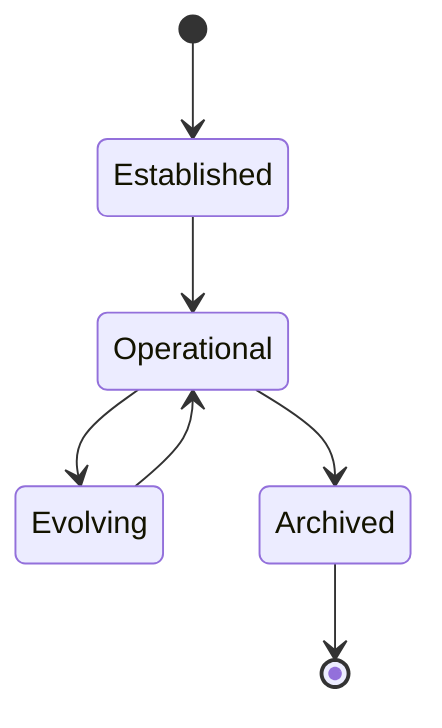
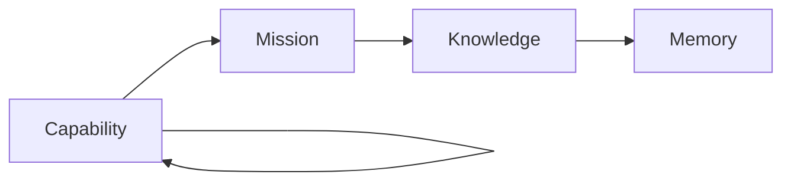
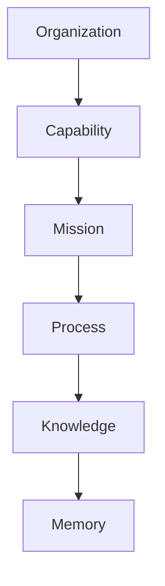
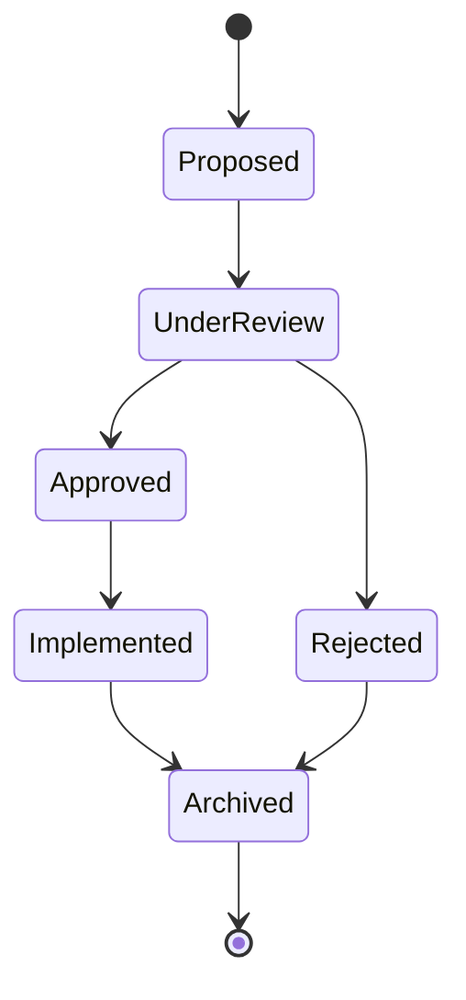
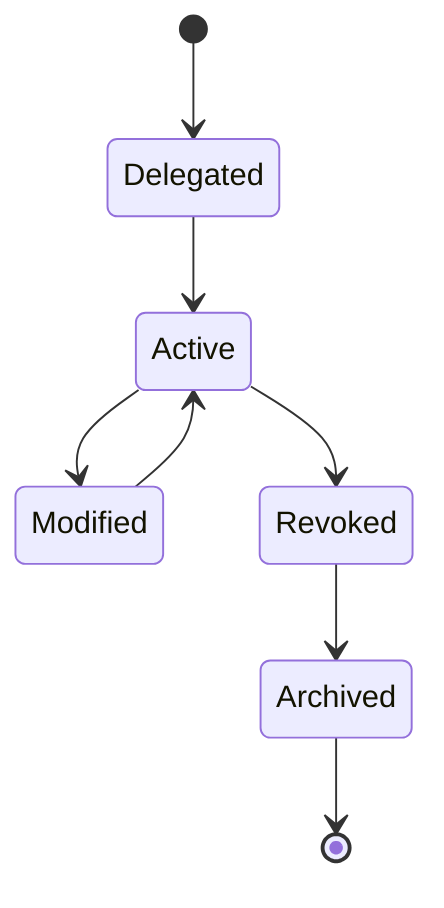
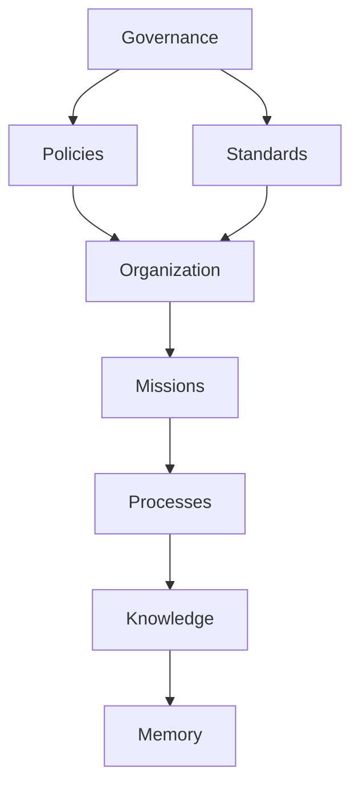
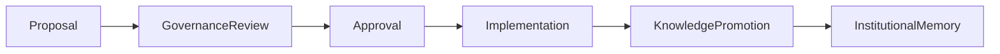

# Technical Design Specification

# TDS-0003 — Organization Model

**Status:** Approved

**Version:** 1.0.0

**Authoritative Level:** Technical Design Specification

---

# Purpose

This document defines the authoritative organizational model for ForgeOS.

It specifies how organizational responsibilities, authority, ownership, governance, and execution are structured.

Unlike the Domain Model, which defines business capabilities, the Organization Model defines how those capabilities are governed and executed.

This specification enables consistent implementation of organizational behavior without requiring engineers to infer governance rules.

---

# Scope

This specification defines:

- organizational structure;
- organizational units;
- responsibility ownership;
- authority delegation;
- mission ownership;
- capability ownership;
- governance relationships;
- organizational lifecycle.

This specification does not define:

- implementation technologies;
- runtime architecture;
- storage strategy;
- infrastructure topology.

Those concerns are defined by the applicable TDRs and Architecture Package.

---

# Architectural Authority

This document is the authoritative specification for the ForgeOS organizational model.

Derived architectural views may visualize this model but shall not redefine:

- organizational ownership;
- authority relationships;
- governance responsibilities;
- organizational lifecycle.

---

# Ubiquitous Language

The following terms are normative within this specification.

| Term | Canonical Meaning |
|------|-------------------|
| Organization | The enduring operational entity responsible for achieving missions through governed execution. |
| Organizational Unit | A logical area of responsibility with defined authority and ownership. |
| Organizational Capability | A persistent competency owned by an organizational unit. |
| Organizational Responsibility | An obligation assigned to exactly one organizational owner. |
| Organizational Authority | The right to approve, reject, delegate, or govern organizational decisions. |
| Delegation | The transfer of execution authority without transferring ownership. |
| Governance | The organizational mechanism responsible for maintaining policy, standards, and decision integrity. |
| Mission Ownership | Accountability for achieving a mission outcome. |
| Capability Ownership | Accountability for maintaining a long-term organizational capability. |

These terms shall be used consistently throughout the repository.

---

# Organizational Principles

The ForgeOS Organization Model is founded on the following principles.

## Singular Ownership

Every organizational responsibility has exactly one organizational owner.

Ownership shall never be shared.

---

## Explicit Authority

Authority shall always be explicitly defined.

Authority shall never be inferred from implementation.

---

## Delegated Execution

Execution authority may be delegated.

Ownership remains with the original organizational owner.

---

## Stable Capabilities

Organizational capabilities are persistent.

Missions consume capabilities but do not own them.

---

## Mission Orientation

Organizations exist to accomplish missions.

Processes, capabilities, governance, and workforce exist to support mission execution.

---

## Governance Before Execution

Policies and standards constrain execution.

Execution shall not redefine governance.

---

# Organizational Topology

The conceptual organizational structure is shown below.

This topology represents organizational relationships.

It does not define runtime dependencies.

---

# Organizational Layers

ForgeOS recognizes four conceptual organizational layers.

| Layer | Responsibility |
|--------|----------------|
| Strategic | Organizational direction and governance |
| Operational | Mission ownership and organizational execution |
| Execution | Process execution and workforce coordination |
| Learning | Knowledge promotion and institutional memory |

These layers organize responsibility rather than software architecture.

---

# Organizational Responsibility Model

Every organizational responsibility shall satisfy the following requirements.

- one owner;
- explicit authority;
- traceable delegation;
- measurable accountability;
- governed execution.

Responsibility ownership shall remain stable throughout the lifecycle of the responsibility.

---

# Organizational Invariants

The following organizational invariants are normative.

1. Every responsibility has exactly one owner.
2. Every authority relationship is explicit.
3. Delegation does not transfer ownership.
4. Capabilities outlive missions.
5. Governance constrains execution.
6. Organizational responsibilities are traceable.
7. Organizational ownership is independent of implementation technology.

These invariants define the permanent organizational architecture of ForgeOS.

---

# Cross References

| Concern | Authoritative Document |
|----------|------------------------|
| System Architecture | TDS-0001 |
| Domain Model | TDS-0002 |
| Organization Model | **TDS-0003 (this document)** |
| Technology Decisions | TDR Series |
| Component Ownership | ARCH-0002 |
| Architecture Enforcement | ARCH-0003 |
| Workspace Organization | ARCH-0004 |

*End of Part 1.*

# Organizational Units

ForgeOS organizes organizational responsibility through Organizational Units.

An Organizational Unit is a permanent area of responsibility with defined ownership, authority, capabilities, and governance obligations.

Organizational Units are business constructs.

They are not implementation modules, software components, or Rust crates.

---

# Organizational Unit Model

Every Organizational Unit owns:

- one organizational purpose;
- one area of responsibility;
- one or more organizational capabilities;
- explicit authority;
- measurable accountability.

An Organizational Unit may collaborate with other units but shall not transfer ownership of its responsibilities.

---

# Organizational Topology

The approved Organizational Units are shown below.

The topology illustrates organizational responsibility.

It does not define implementation dependencies.

---

# Organization Unit

## Purpose

Provides enduring organizational identity and strategic direction.

## Primary Responsibilities

- organizational identity;
- organizational strategy;
- organizational capability ownership;
- mission portfolio ownership;
- organizational evolution.

## Authority

The Organization Unit owns strategic organizational decisions.

Strategic authority may not be delegated permanently.

---

# Mission Execution Unit

## Purpose

Transforms organizational intent into executable missions.

## Primary Responsibilities

- mission ownership;
- mission planning;
- mission execution;
- mission completion;
- mission coordination.

## Authority

Owns execution authority for assigned missions.

Execution authority may be delegated while mission ownership remains unchanged.

---

# Governance Unit

## Purpose

Maintains organizational integrity through policies, standards, and decision governance.

## Primary Responsibilities

- policy ownership;
- architectural governance;
- standards publication;
- approval authority;
- organizational compliance.

## Authority

Owns governance authority.

Governance decisions remain traceable throughout their lifecycle.

---

# Workforce Unit

## Purpose

Develops and maintains organizational capability.

## Primary Responsibilities

- workforce capability;
- competency management;
- professional development;
- capability assignment;
- organizational capacity.

## Authority

Owns workforce capability decisions.

Capability ownership remains independent from mission ownership.

---

# Knowledge Unit

## Purpose

Maintains validated organizational knowledge.

## Primary Responsibilities

- knowledge promotion;
- blueprint publication;
- knowledge classification;
- organizational learning;
- knowledge stewardship.

## Authority

Owns promoted organizational knowledge.

Knowledge publication follows governance requirements.

---

# Memory Unit

## Purpose

Preserves institutional history.

## Primary Responsibilities

- institutional memory;
- historical traceability;
- organizational chronology;
- historical provenance;
- long-term retention.

## Authority

Owns historical organizational records.

Historical ownership remains independent from operational ownership.

---

# Organizational Relationships

Organizational Units collaborate while preserving ownership.

The following principles apply.

- collaboration does not transfer ownership;
- authority remains explicit;
- governance constrains execution;
- capabilities support missions;
- organizational learning follows execution.

---

# Organizational Capability Ownership

Every organizational capability belongs to exactly one Organizational Unit.

Capabilities may be consumed by multiple missions.

Capability ownership shall remain singular.

---

# Responsibility Matrix

| Organizational Unit | Strategic | Operational | Governance | Capability | Learning |
|---------------------|:---------:|:-----------:|:----------:|:----------:|:--------:|
| Organization | ✓ | ✓ | | ✓ | |
| Mission Execution | | ✓ | | ✓ | |
| Governance | ✓ | | ✓ | | |
| Workforce | | ✓ | | ✓ | |
| Knowledge | | | | ✓ | ✓ |
| Memory | | | | | ✓ |

The matrix summarizes organizational ownership.

Detailed authority remains defined in this specification.

---

# Organizational Boundaries

Organizational Units are permanent.

Temporary organizational structures may exist during execution but shall always belong to one permanent Organizational Unit.

Ownership shall never be assigned to temporary organizational structures.

---

# Cross References

The Organizational Units defined in this section coordinate with:

- TDS-0002 — Domain Model
- ARCH-0002 — Component Model

This specification remains the authoritative definition of organizational ownership.

*End of Part 2.*

# Mission Ownership

Mission Ownership establishes organizational accountability for achieving a defined business outcome.

Ownership represents accountability rather than execution.

Execution may be delegated.

Ownership remains singular.

---

## Mission Ownership Model

Every mission shall have:

- one mission owner;
- one mission objective;
- one accountable organizational unit;
- defined success criteria;
- explicit lifecycle state.

Mission ownership persists throughout the mission lifecycle.

---

## Mission Responsibility

The Mission Owner is responsible for:

- mission definition;
- mission planning;
- mission approval;
- mission execution oversight;
- mission completion;
- mission outcome evaluation.

Execution participants contribute to mission delivery without assuming ownership.

---

## Mission Delegation

Execution authority may be delegated to:

- Organizational Units;
- Processes;
- Workforce capabilities;
- implementation teams.

Delegation shall not:

- transfer accountability;
- transfer mission ownership;
- modify governance authority.

---

# Capability Ownership

Capabilities represent enduring organizational competencies.

Capabilities are organizational assets rather than mission assets.

---

## Capability Model

Every capability shall have:

- one capability owner;
- one organizational purpose;
- defined maturity;
- measurable effectiveness;
- continuous stewardship.

Capabilities exist independently of individual missions.

---

## Capability Lifecycle

Capabilities evolve continuously.

Representative lifecycle stages include:

Capability evolution is governed independently from mission execution.

---

## Capability Consumption

Missions consume capabilities.

Capabilities are never owned by missions.

Multiple missions may consume the same capability simultaneously.

Capability ownership remains singular.

---

# Organizational Lifecycle

The Organization Model defines how responsibilities evolve over time.

---

## Organizational Lifecycle States

Representative lifecycle states include:

The lifecycle represents organizational evolution rather than implementation state.

---

## Organizational Evolution

Organizational evolution may include:

- capability improvement;
- governance refinement;
- workforce development;
- knowledge promotion;
- structural optimization.

Evolution preserves organizational identity.

---

## Mission Lifecycle Relationship

Mission execution is temporary.

Capabilities persist.

Knowledge accumulates.

Memory preserves organizational history.

This relationship is illustrated below.

Capabilities improve through organizational learning while remaining persistent organizational assets.

---

# Ownership Relationships

Ownership relationships are governed by the following model.

Ownership flows downward.

Responsibility does not flow upward.

---

# Organizational Accountability

Every organizational responsibility shall satisfy:

- one accountable owner;
- one governing authority;
- measurable outcomes;
- traceable decisions;
- documented delegation.

Accountability remains attached to ownership.

---

# Organizational Stability

The following principles preserve organizational stability.

- Organizational Units remain stable.
- Mission ownership is temporary.
- Capability ownership is permanent.
- Governance remains continuous.
- Knowledge accumulates.
- Institutional memory is preserved.

These principles enable long-term organizational continuity independent of individual missions.

---

# Cross References

This section derives organizational ownership concepts from:

- TDS-0002 — Domain Model
- TDS-0003 — Organization Model (Parts 1–2)

No additional organizational authority is introduced.

*End of Part 3.*

# Decision Model

The Decision Model defines how organizational decisions are created, evaluated, approved, delegated, and recorded.

A decision represents an organizational commitment.

Every decision shall have one authoritative owner.

---

## Decision Principles

Organizational decisions shall satisfy the following principles.

- explicit ownership;
- documented rationale;
- traceable authority;
- measurable impact;
- permanent auditability.

Decision authority shall never be inferred.

---

## Decision Lifecycle

Representative decision states include:

Every decision follows one complete lifecycle.

Historical decisions remain permanently traceable.

---

## Decision Ownership

Each decision shall define:

- one decision owner;
- one approving authority;
- one organizational scope;
- one implementation responsibility;
- one historical record.

Decision ownership is singular.

---

# Delegation Model

Delegation enables execution without transferring ownership.

Delegation is an operational mechanism rather than a governance mechanism.

---

## Delegation Principles

Delegation shall satisfy the following principles.

- ownership remains unchanged;
- delegated authority is explicit;
- delegation is traceable;
- delegated responsibilities are measurable;
- delegation may be revoked.

Delegation shall never obscure accountability.

---

## Delegation Lifecycle

Representative delegation states include:

Delegation history remains permanently available for organizational review.

---

## Delegation Responsibilities

The delegating authority remains responsible for:

- selecting the delegate;
- defining delegated scope;
- monitoring delegated execution;
- revoking delegated authority when required.

The delegate remains responsible for:

- executing delegated responsibilities;
- operating within delegated scope;
- reporting execution progress;
- complying with governance requirements.

Ownership remains with the delegating authority.

---

# Governance Integration

Governance provides the organizational constraints within which execution occurs.

Governance defines **what is permitted**.

Execution determines **how work is performed**.

---

## Governance Responsibilities

Governance is responsible for:

- policy publication;
- standards management;
- architectural compliance;
- decision approval;
- authority management;
- organizational integrity.

Governance does not perform operational execution.

---

## Governance Relationship Model

Governance constrains execution while remaining operationally independent.

---

## Organizational Decision Flow

The following conceptual flow illustrates organizational decision progression.

The flow illustrates organizational responsibility rather than software execution.

---

# Governance Boundaries

Governance authority shall remain independent from:

- mission execution;
- workforce capability;
- implementation technology;
- runtime architecture.

Operational execution shall not redefine governance.

---

# Organizational Accountability Matrix

| Concern | Organizational Owner |
|----------|----------------------|
| Strategy | Organization |
| Governance | Governance Unit |
| Mission Delivery | Mission Execution Unit |
| Capability Development | Workforce Unit |
| Knowledge Stewardship | Knowledge Unit |
| Institutional History | Memory Unit |

The accountability model preserves singular organizational ownership.

---

# Cross References

The Decision and Governance Model derives from:

- TDS-0003 — Organization Model
- TDS-0002 — Domain Model
- ARCH-0003 — Architecture Enforcement Specification

No additional organizational authority is introduced.

*End of Part 4.*

# Organizational Architecture

The Organization Model establishes the permanent governance architecture for ForgeOS.

This architecture defines organizational ownership independently of implementation technology, programming language, deployment topology, or runtime architecture.

The Organization Model is expected to remain stable throughout the ForgeOS MVP.

Implementation evolves within this organizational structure rather than redefining it.

---

# Organizational Consistency Model

Organizational consistency is maintained through explicit ownership and governance.

## Responsibility Consistency

Every responsibility belongs to exactly one Organizational Unit.

Responsibility ownership shall never be shared.

---

## Authority Consistency

Every authority relationship shall be:

- explicit;
- documented;
- traceable;
- reviewable.

Authority shall not be inferred from implementation.

---

## Governance Consistency

Governance remains authoritative for:

- organizational policy;
- standards;
- architectural compliance;
- delegated authority;
- organizational integrity.

Execution remains subordinate to governance.

---

## Organizational Evolution

The Organization Model supports continuous organizational improvement while preserving architectural stability.

Evolution may refine:

- capabilities;
- responsibilities;
- execution methods;
- governance procedures.

Evolution shall preserve:

- organizational ownership;
- authority relationships;
- accountability;
- organizational identity.

---

# Organizational Invariants

The following invariants are normative for the ForgeOS Organization Model.

## Ownership

1. Every organizational responsibility has exactly one owner.
2. Every organizational capability has exactly one owner.
3. Organizational ownership is permanent until formally reassigned.
4. Ownership shall never be implied by implementation.

---

## Authority

5. Every authority relationship is explicit.
6. Delegation transfers execution authority only.
7. Delegation never transfers ownership.
8. Governance authority remains independent from operational execution.

---

## Missions

9. Every mission has exactly one accountable owner.
10. Missions consume capabilities but never own them.
11. Mission ownership persists throughout the mission lifecycle.

---

## Capabilities

12. Capabilities are organizational assets.
13. Capabilities outlive individual missions.
14. Capability ownership remains singular.
15. Capabilities evolve continuously.

---

## Knowledge

16. Knowledge promotion follows approved governance.
17. Organizational learning preserves provenance.
18. Institutional memory remains append-only.
19. Historical traceability shall never be lost.

---

## Organizational Integrity

20. Organizational identity remains stable.
21. Accountability remains traceable.
22. Governance constrains execution.
23. Organizational architecture remains implementation-independent.

These invariants define the permanent organizational architecture of ForgeOS.

---

# Architectural Traceability

Every organizational concept defined in this specification is traceable to higher-level architectural authority.

| Concern | Authoritative Source |
|----------|----------------------|
| System Architecture | TDS-0001 |
| Domain Ownership | TDS-0002 |
| Organizational Ownership | TDS-0003 |
| Component Ownership | ARCH-0002 |
| Architecture Enforcement | ARCH-0003 |
| Workspace Organization | ARCH-0004 |

This document is the sole authoritative specification for organizational structure and governance.

---

# Relationship to Implementation

This specification defines organizational architecture only.

Implementation shall derive:

- organizational workflows;
- governance services;
- decision management;
- delegation mechanisms;
- mission ownership;
- capability ownership;

from this specification.

Implementation technologies remain outside the scope of this document.

---

# Relationship to Future Architecture Views

The following documents shall be derived from this specification.

| Derived View | Purpose |
|--------------|---------|
| organization-model.md | Organizational topology and collaboration |
| authority-model.md | Authority and delegation relationships |
| governance-model.md | Governance responsibilities and constraints |
| mission-lifecycle.md | Organizational mission lifecycle |
| capability-lifecycle.md | Organizational capability evolution |

These documents visualize this specification without introducing additional organizational authority.

---

# Codex Readiness

## Implementation Status

**Ready for implementation of the ForgeOS organizational model.**

Using this specification, a Senior Software Engineer can implement:

- organizational ownership;
- mission ownership;
- capability ownership;
- governance services;
- delegation mechanisms;
- organizational lifecycle management;
- decision management;
- accountability tracking;

without inventing organizational architecture.

No additional architectural decisions are required before implementing the organizational model.

---

# Architectural Authority

This document is the authoritative specification for the ForgeOS Organization Model.

Derived architectural views shall not redefine:

- organizational ownership;
- authority relationships;
- governance responsibilities;
- organizational lifecycle;
- accountability;
- delegation semantics.

Changes to these concepts require formal architectural review.

---

# Document Completion

This document is complete.

It establishes the authoritative organizational architecture for ForgeOS and completes **TDS-0003 — Organization Model**, providing the implementation-ready governance and organizational foundation for ForgeOS MVP.