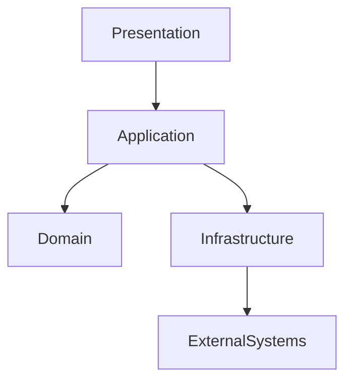
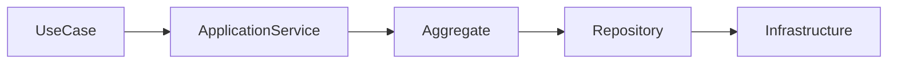
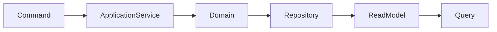
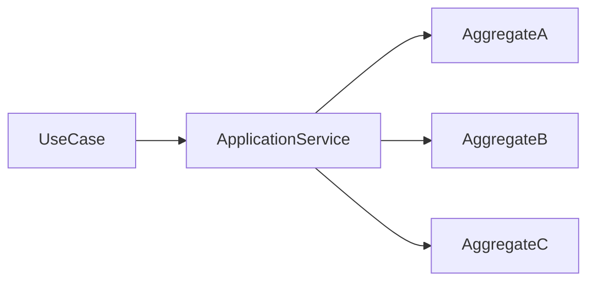
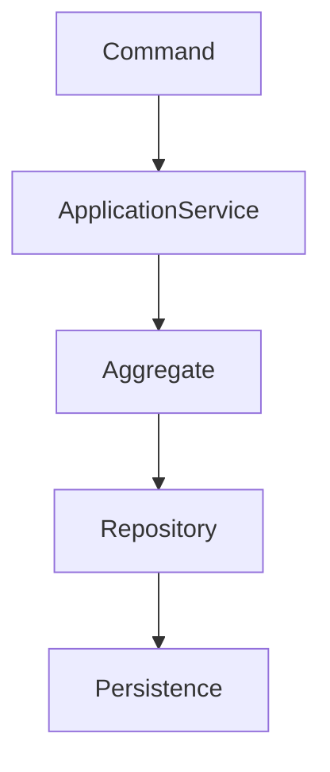
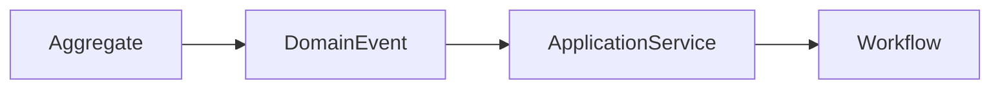
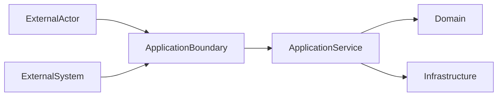
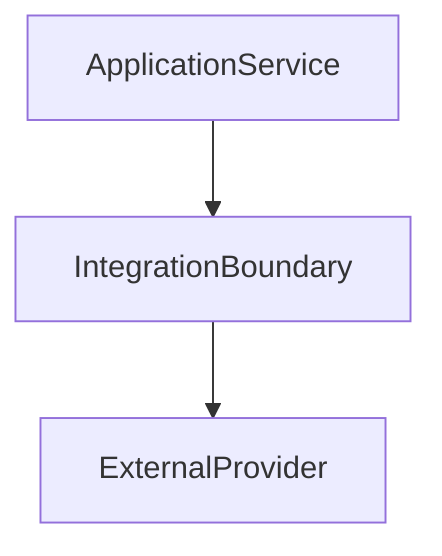

# Technical Design Specification

# TDS-0004 — Application Model

**Status:** Approved

**Version:** 1.0.0

**Authoritative Level:** Technical Design Specification

---

# Purpose

This document defines the authoritative Application Model for ForgeOS.

The Application Model specifies how application services coordinate execution across the approved domain model while preserving domain ownership, organizational authority, and architectural boundaries.

Its primary responsibility is orchestration.

Business decisions remain within the Domain Model.

Organizational authority remains within the Organization Model.

Implementation technology remains outside the scope of this specification.

---

# Scope

This specification defines:

- application services;
- use case execution;
- command responsibilities;
- query responsibilities;
- workflow orchestration;
- transaction coordination;
- application event handling;
- external interface boundaries;
- application-layer invariants.

This specification does **not** define:

- business rules;
- organizational policy;
- persistence implementation;
- infrastructure implementation;
- user interface behavior;
- transport protocols;
- programming language.

Those concerns remain governed by other authoritative specifications.

---

# Architectural Authority

This document is the authoritative specification for the ForgeOS Application Model.

Derived architectural views may visualize this model but shall not redefine:

- application responsibilities;
- orchestration boundaries;
- transaction coordination;
- command/query responsibilities;
- application-layer invariants.

---

# Ubiquitous Language

The following terms are normative within this specification.

| Term | Canonical Meaning |
|------|-------------------|
| Application Service | An orchestration component that coordinates one or more domain operations without containing business rules. |
| Use Case | A complete application interaction that achieves a single business objective. |
| Command | A request that changes business state through the Domain Model. |
| Query | A request that retrieves information without changing business state. |
| Workflow | The ordered coordination of application activities required to complete a use case. |
| Orchestration | Coordination of multiple domain operations while preserving aggregate boundaries and ownership. |
| Transaction | The application-controlled execution boundary required to preserve domain consistency. |
| Integration Boundary | The point at which the application interacts with external systems while preserving domain isolation. |

These definitions supplement the repository-wide Ubiquitous Language and apply specifically to the Application Model.

---

# Application Principles

The ForgeOS Application Model is governed by the following principles.

## Domain-Centric Execution

Application Services coordinate domain behavior.

They shall not implement business rules.

---

## Explicit Orchestration

Application workflows shall be explicitly defined.

Execution flow shall never be inferred from implementation.

---

## Single Responsibility

Every Application Service implements one primary use case or closely related use case family.

Responsibilities shall remain cohesive.

---

## Command–Query Separation

Commands modify business state.

Queries retrieve business information.

Their responsibilities remain distinct.

---

## Transaction Ownership

Application Services define transactional boundaries.

Aggregates preserve business consistency within those boundaries.

---

## Domain Isolation

Application Services interact with domains through approved contracts.

They shall not bypass aggregate boundaries.

---

## External Independence

External systems communicate through application interfaces.

Business domains remain isolated from external concerns.

---

# Application Topology

The conceptual Application Model is illustrated below.

The topology illustrates architectural responsibility.

It does not prescribe deployment topology or implementation technology.

---

# Application Layer Responsibilities

| Responsibility | Description |
|---------------|-------------|
| Use Case Coordination | Execute complete business use cases |
| Workflow Orchestration | Coordinate domain operations |
| Transaction Coordination | Define application transaction boundaries |
| Command Processing | Coordinate state-changing requests |
| Query Processing | Coordinate information retrieval |
| Integration Coordination | Interact with external systems through approved interfaces |

Business rules remain within the Domain Layer.

---

# Application Invariants

The following invariants are normative.

1. Application Services contain no business rules.
2. Every use case has one coordinating Application Service.
3. Commands modify business state only through aggregates.
4. Queries shall not modify business state.
5. Transaction boundaries are explicitly defined.
6. Application Services preserve aggregate isolation.
7. External systems never access aggregates directly.
8. Application orchestration remains independent of implementation technology.

These invariants define the permanent Application Architecture of ForgeOS.

---

# Cross References

| Concern | Authoritative Document |
|----------|------------------------|
| System Architecture | TDS-0001 |
| Domain Model | TDS-0002 |
| Organization Model | TDS-0003 |
| Application Model | **TDS-0004 (this document)** |
| Technology Decisions | TDR Series |
| Component Ownership | ARCH-0002 |
| Architecture Enforcement | ARCH-0003 |
| Workspace Specification | ARCH-0004 |

*End of Part 1.*

# Application Services

Application Services are the primary orchestration units of the ForgeOS Application Layer.

Their purpose is to coordinate domain behavior required to complete a business use case.

Application Services shall never contain business rules.

Business decisions remain exclusively within the Domain Layer.

---

# Application Service Model

Every Application Service shall define:

- one primary responsibility;
- one or more supported use cases;
- required domain dependencies;
- transaction boundaries;
- published application events (where applicable);
- consumed domain events (where applicable).

Application Services are orchestration components.

They are not domain entities.

---

# Service Responsibilities

Application Services are responsible for:

- coordinating aggregate interactions;
- invoking domain services;
- managing transaction boundaries;
- validating application-level preconditions;
- coordinating external integrations;
- publishing application events after successful execution.

Application Services are not responsible for:

- business rule evaluation;
- aggregate invariant enforcement;
- persistence implementation;
- infrastructure management.

---

# Application Service Topology

The conceptual relationship between the Application Layer and the Domain Layer is shown below.

Application Services coordinate.

Aggregates decide.

Repositories persist.

Infrastructure implements.

---

# Use Case Model

A Use Case represents one complete business objective.

Every Use Case shall have:

- one coordinating Application Service;
- one initiating actor;
- one expected business outcome;
- one completion condition.

A Use Case may coordinate multiple aggregates while preserving aggregate ownership.

---

# Use Case Principles

ForgeOS adopts the following use case principles.

## Single Business Objective

Each Use Case shall accomplish one primary business objective.

---

## Explicit Coordination

All cross-aggregate coordination shall occur through the Application Layer.

---

## Business Independence

Use Cases shall not depend on infrastructure implementation.

---

## Organizational Alignment

Every Use Case shall support an approved organizational mission.

---

## Architectural Traceability

Every Use Case shall be traceable to one or more approved business capabilities.

---

# Command Responsibilities

Commands initiate business state changes.

Commands shall:

- invoke Application Services;
- coordinate aggregate execution;
- preserve transaction boundaries;
- publish resulting events where appropriate.

Commands shall not:

- modify persistence directly;
- bypass aggregates;
- execute business rules outside the Domain Layer.

---

# Query Responsibilities

Queries retrieve business information.

Queries shall:

- remain free of side effects;
- preserve domain consistency;
- retrieve information through approved contracts;
- avoid modifying aggregate state.

Queries may utilize optimized read models where approved by the architecture.

---

# Command–Query Separation

The relationship between commands and queries is illustrated below.

Commands and queries remain architecturally independent.

Shared implementation shall not compromise separation of responsibilities.

---

# Application Service Categories

The Application Layer recognizes the following conceptual service categories.

| Category | Primary Responsibility |
|----------|------------------------|
| Mission Services | Coordinate mission execution |
| Organization Services | Coordinate organizational operations |
| Governance Services | Coordinate governance workflows |
| Knowledge Services | Coordinate knowledge promotion |
| Workforce Services | Coordinate capability management |
| Memory Services | Coordinate institutional preservation |

These categories organize orchestration responsibilities.

They do not define implementation modules.

---

# Cross References

The concepts defined in this section derive from:

- TDS-0001 — System Architecture
- TDS-0002 — Domain Model
- TDS-0003 — Organization Model

No additional business or organizational authority is introduced.

*End of Part 2.*

# Workflow Orchestration

Workflow orchestration defines how Application Services coordinate execution across multiple domain operations while preserving aggregate boundaries and organizational ownership.

Application orchestration coordinates business execution.

It does not define business behavior.

Business decisions remain exclusively within the Domain Model.

---

# Workflow Model

Every workflow shall define:

- one initiating use case;
- one coordinating Application Service;
- one or more participating aggregates;
- explicit completion conditions;
- explicit failure conditions.

Workflow execution shall remain deterministic from the perspective of the Application Layer.

---

# Workflow Responsibilities

Application workflows are responsible for:

- coordinating aggregate execution;
- sequencing application activities;
- coordinating organizational responsibilities;
- handling execution outcomes;
- publishing application events after successful completion.

Application workflows shall not:

- evaluate business rules;
- modify aggregate ownership;
- bypass aggregate consistency boundaries.

---

# Workflow Topology

The conceptual workflow topology is illustrated below.

The Application Service coordinates workflow execution.

Each aggregate remains independently responsible for its own business consistency.

---

# Transaction Coordination

Application Services coordinate transaction boundaries.

Aggregates preserve business invariants within those boundaries.

---

## Transaction Principles

Every application transaction shall satisfy the following principles.

- transaction boundaries are explicit;
- aggregate consistency is preserved;
- ownership remains unchanged;
- application coordination remains deterministic.

Cross-aggregate consistency is coordinated rather than achieved through shared aggregate ownership.

---

# Transaction Coordination Model

The Application Layer defines transaction scope.

The Domain Layer defines business consistency.

---

# Domain Event Handling

Application Services coordinate the handling of domain events.

Domain events remain owned by their publishing bounded context.

Application Services coordinate organizational responses.

---

## Domain Event Responsibilities

Application Services may:

- subscribe to approved domain events;
- coordinate follow-up workflows;
- invoke additional use cases;
- notify external integrations.

Application Services shall not:

- modify published domain events;
- reinterpret business ownership;
- violate aggregate boundaries.

---

# Event Coordination Model

Domain events communicate completed business facts.

Application Services coordinate resulting activities.

---

# Workflow Failure Handling

Workflow execution shall define explicit failure behavior.

Application Services are responsible for:

- detecting execution failure;
- coordinating recovery activities;
- preserving architectural consistency;
- reporting execution outcomes.

Business recovery rules remain within the Domain Layer.

---

# Workflow Invariants

The following invariants are normative.

1. Every workflow has one coordinating Application Service.
2. Aggregate boundaries remain intact throughout workflow execution.
3. Transactions remain explicitly coordinated.
4. Domain events remain immutable.
5. Application Services coordinate rather than decide.
6. Workflow execution preserves organizational ownership.
7. Workflow orchestration remains technology-independent.

These invariants define the permanent execution model of the ForgeOS Application Layer.

---

# Cross References

The workflow concepts defined in this section derive from:

- TDS-0001 — System Architecture
- TDS-0002 — Domain Model
- TDS-0003 — Organization Model

This section introduces no new business rules, organizational authority, or technology decisions.

*End of Part 3.*

# External Interface Boundaries

The Application Layer is the exclusive architectural boundary through which external actors and systems interact with ForgeOS.

The Domain Layer remains isolated from external concerns.

External systems shall never invoke domain behavior directly.

---

# Integration Boundary Model

Every external interaction shall cross a controlled Application Boundary.

The boundary is responsible for:

- validating application requests;
- coordinating application workflows;
- translating external protocols into application use cases;
- protecting domain isolation;
- returning application outcomes.

Business decisions remain within the Domain Layer.

---

# External Interaction Topology

The conceptual interaction model is illustrated below.

This topology illustrates architectural responsibility.

It does not prescribe implementation technology or communication protocols.

---

# Application Contracts

Every Application Boundary exposes explicit Application Contracts.

An Application Contract defines:

- one supported use case;
- expected request semantics;
- expected response semantics;
- observable execution outcomes;
- error reporting behavior.

Application Contracts coordinate execution.

They do not expose domain internals.

---

# Contract Principles

Application Contracts shall satisfy the following principles.

## Explicit Responsibility

Each contract supports one primary application responsibility.

---

## Domain Isolation

Contracts expose application behavior rather than domain implementation.

---

## Stable Interfaces

Contracts evolve independently of implementation details.

---

## Technology Independence

Contract semantics remain independent of transport protocols and implementation technologies.

---

## Traceability

Every Application Contract shall be traceable to one or more approved use cases.

---

# External System Coordination

Application Services coordinate all interactions with external systems.

External integrations may include:

- AI providers;
- repositories;
- identity providers;
- storage providers;
- messaging systems;
- operating system services.

External technologies remain implementation concerns.

The Application Model defines only the architectural interaction boundary.

---

# Integration Coordination Model

Integration Boundaries isolate external dependencies from application orchestration.

---

# Interface Categories

The Application Layer recognizes the following conceptual interface categories.

| Interface Category | Primary Responsibility |
|--------------------|------------------------|
| User Interfaces | Initiate application use cases |
| System Interfaces | Coordinate external system interaction |
| Integration Interfaces | Translate external protocols |
| Event Interfaces | Publish and consume approved events |
| Administrative Interfaces | Support governance and operational administration |

These categories organize interaction responsibilities.

They do not prescribe implementation mechanisms.

---

# Boundary Responsibilities

The Application Boundary is responsible for:

- validating requests;
- invoking Application Services;
- translating external formats;
- coordinating responses;
- preserving architectural isolation.

The Application Boundary is not responsible for:

- business rule evaluation;
- aggregate ownership;
- organizational authority;
- persistence implementation.

---

# External Boundary Invariants

The following invariants are normative.

1. All external interaction passes through the Application Layer.
2. External systems never access aggregates directly.
3. Application Contracts remain implementation-independent.
4. Domain isolation is preserved.
5. External protocols remain outside the Domain Layer.
6. Application Boundaries coordinate rather than decide.
7. Integration mechanisms remain replaceable without affecting the Domain Model.

These invariants define the permanent external interaction architecture of ForgeOS.

---

# Cross References

The external interaction concepts defined in this section derive from:

- TDS-0001 — System Architecture
- TDS-0002 — Domain Model
- TDS-0003 — Organization Model

This section introduces no new business rules, organizational authority, or technology decisions.

*End of Part 4.*

# Application Architecture

The Application Model establishes the permanent orchestration architecture of ForgeOS.

This architecture coordinates business execution while preserving the separation of responsibilities established by the System, Domain, and Organization Models.

Application orchestration shall remain stable throughout the ForgeOS MVP.

Implementation evolves within this application architecture rather than redefining it.

---

# Application Consistency Model

Application consistency is maintained through explicit orchestration, controlled transactions, and domain isolation.

## Workflow Consistency

Every workflow shall have exactly one coordinating Application Service.

Workflow coordination shall never be distributed across multiple orchestration components.

---

## Transaction Consistency

Application Services define transaction boundaries.

Domain aggregates preserve business consistency within those boundaries.

Application coordination shall never weaken aggregate consistency.

---

## Integration Consistency

External interaction shall always occur through approved Application Boundaries.

The Domain Layer remains isolated from external technologies.

---

## Event Consistency

Application Services coordinate reactions to completed business facts.

Ownership of business events remains with the publishing bounded context.

---

# Application Invariants

The following invariants are normative for the ForgeOS Application Model.

## Orchestration

1. Every use case has exactly one coordinating Application Service.
2. Application Services coordinate rather than decide.
3. Application Services contain no business rules.
4. Workflow execution is explicitly defined.

---

## Commands and Queries

5. Commands modify business state only through approved domain contracts.
6. Queries never modify business state.
7. Command and Query responsibilities remain architecturally separated.

---

## Transactions

8. Transaction boundaries are explicit.
9. Aggregate consistency boundaries remain intact.
10. Cross-aggregate coordination occurs through orchestration rather than shared ownership.

---

## Domain Isolation

11. Domain behavior is never bypassed.
12. Application orchestration remains independent of persistence technology.
13. External concerns never enter the Domain Layer.

---

## Integration

14. External systems interact only through Application Boundaries.
15. Application Contracts remain implementation-independent.
16. External integrations remain replaceable without affecting domain behavior.

---

## Organizational Alignment

17. Every use case supports an approved organizational mission.
18. Application workflows preserve organizational ownership.
19. Organizational authority remains external to the Application Layer.

---

## Architectural Integrity

20. Application responsibilities remain cohesive.
21. Application orchestration remains deterministic.
22. Application architecture remains implementation-independent.
23. Architectural ownership is preserved across every application component.

These invariants define the permanent Application Architecture of ForgeOS.

---

# Architectural Traceability

Every application concept defined in this specification is traceable to higher-level architectural authority.

| Concern | Authoritative Source |
|----------|----------------------|
| System Architecture | TDS-0001 |
| Domain Architecture | TDS-0002 |
| Organization Model | TDS-0003 |
| Application Model | **TDS-0004** |
| Component Ownership | ARCH-0002 |
| Architecture Enforcement | ARCH-0003 |
| Workspace Specification | ARCH-0004 |

This document is the sole authoritative specification for the ForgeOS Application Model.

---

# Relationship to Other Technical Design Specifications

The ForgeOS architectural specifications form a layered design.

| Specification | Primary Responsibility |
|---------------|------------------------|
| TDS-0001 | Defines the system architecture |
| TDS-0002 | Defines business structure and domain ownership |
| TDS-0003 | Defines organizational structure and governance |
| TDS-0004 | Defines application orchestration and execution |

Together they provide a complete implementation-ready architectural foundation.

Each specification owns a distinct architectural concern.

No specification supersedes or duplicates another.

---

# Relationship to Derived Architecture Views

The following documents shall be derived from this specification.

| Derived View | Purpose |
|--------------|---------|
| application-model.md | Application topology |
| application-services.md | Application service decomposition |
| workflow-orchestration.md | Workflow coordination |
| command-query-model.md | Command and query separation |
| integration-boundaries.md | External interaction architecture |

These documents visualize this specification without introducing new architectural authority.

---

# Codex Readiness

## Implementation Status

**Ready for implementation of the ForgeOS Application Layer.**

Using this specification together with the previously approved Technical Design Specifications, a Senior Software Engineer can implement:

- application services;
- use case orchestration;
- command and query handling;
- transaction coordination;
- workflow execution;
- domain event coordination;
- external integration boundaries;
- application contracts;

without inventing application architecture.

No additional architectural decisions are required before implementing the Application Layer.

---

# Architectural Authority

This document is the authoritative specification for the ForgeOS Application Model.

Derived architectural views shall not redefine:

- application responsibilities;
- orchestration boundaries;
- workflow coordination;
- command and query responsibilities;
- transaction semantics;
- integration boundaries;
- application-layer invariants.

Changes to these concepts require formal architectural review.

---

# Document Completion

This document is complete.

It establishes the authoritative Application Architecture for ForgeOS and completes **TDS-0004 — Application Model**, providing the implementation-ready orchestration foundation between the approved Domain Model and the future implementation of ForgeOS.